# Connector Header 1.27 mm pitch surface-mount 10 pin Socket

`electronic_connector_header_1_27_mm_pitch_surface_mount_10_pin_socket_header_female_5x2_1_27_mm_smd`

Connector Header 1.27 mm pitch surface-mount 10 pin Socket is an OOMP electronic connector definition. It uses the header package or form factor. Its nominal drawing size is 7.0 &#x00D7; 5.5 mm. The definition includes 10 documented pins.

## At a glance

| Detail | Value |
| --- | --- |
| OOMP ID | `electronic_connector_header_1_27_mm_pitch_surface_mount_10_pin_socket_header_female_5x2_1_27_mm_smd` |
| Type | Connector |
| Package / style | header |
| Nominal size | 7.0 &#x00D7; 5.5 mm |
| Documented pins | 10 |

## Classification

| Level | Value |
| --- | --- |
| 1 | `electronic` |
| 2 | `connector` |
| 3 | `header` |
| 4 | `1_27_mm_pitch` |
| 5 | `surface_mount` |
| 6 | `10_pin` |
| 7 | `socket` |
| 15 | `header_female_5x2_1_27_mm_smd` |

## Nominal dimensions

| Measurement | Value |
| --- | ---: |
| Length | 7.0 mm |
| Width | 5.5 mm |

## Pins

| Pin | Name | Type |
| ---: | --- | --- |
| 1 | 1 | signal |
| 2 | 2 | signal |
| 3 | 3 | signal |
| 4 | 4 | signal |
| 5 | 5 | signal |
| 6 | 6 | signal |
| 7 | 7 | signal |
| 8 | 8 | signal |
| 9 | 9 | signal |
| 10 | 10 | signal |

## Files

[KiCad symbol, machine-solder and hand-solder footprints](data/kicad/README.md) · [Availability and source masters](data/kicad/manifest.yaml)

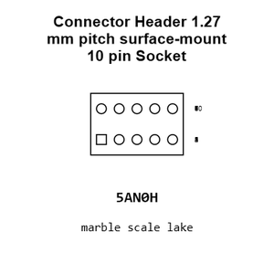

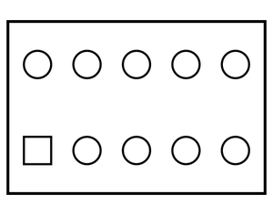

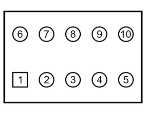

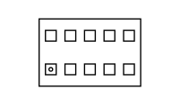

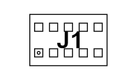

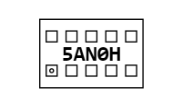

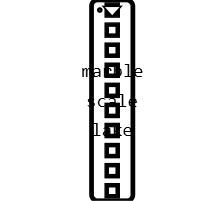

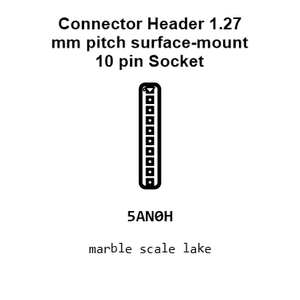

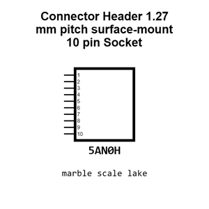

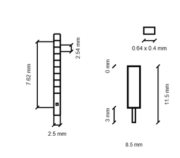

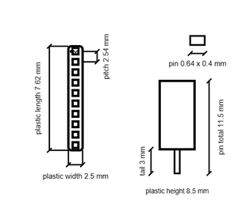

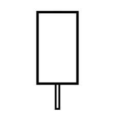

[View this part on GitHub](https://github.com/oomlout/oomp_electronic_version_5/tree/main/parts/electronic_connector_header_1_27_mm_pitch_surface_mount_10_pin_socket_header_female_5x2_1_27_mm_smd)

[Browse this category](../../navigation/electronic/connector/header/1_27_mm_pitch/surface_mount/10_pin/socket/README.md)

---

This page is generated from the OOMP part definition by a Roboclick Jinja template. Edit the source taxonomy or template rather than this generated file.