# Connector Header 2.54-1*10P&#x9488;

`electronic_connector_header_2_54_mm_pitch_through_hole_10_pin`

Connector Header 2.54-1*10P&#x9488; is an OOMP electronic connector definition. It uses the header package or form factor. Its nominal drawing size is 25.4 &#x00D7; 2.48 mm.

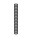

## At a glance

| Detail | Value |
| --- | --- |
| OOMP ID | `electronic_connector_header_2_54_mm_pitch_through_hole_10_pin` |
| Type | Connector |
| Package / style | header |
| Nominal size | 25.4 &#x00D7; 2.48 mm |

## Classification

| Level | Value |
| --- | --- |
| 1 | `electronic` |
| 2 | `connector` |
| 3 | `header` |
| 4 | `2_54_mm_pitch` |
| 5 | `through_hole` |
| 6 | `10_pin` |

## Nominal dimensions

| Measurement | Value |
| --- | ---: |
| Length | 25.4 mm |
| Width | 2.48 mm |

## Identifiers

| Identifier | Value |
| --- | --- |
| Manufacturer part number | `2.54-1*10P&#x9488;` |
| LCSC | [`C57369`](https://www.lcsc.com/product-detail/C57369.html) |
| LCSC | [`C3294463`](https://www.lcsc.com/product-detail/C3294463.html) |
| LCSC | [`C7501596`](https://www.lcsc.com/product-detail/C7501596.html) |

## Datasheet

[View the datasheet](data/datasheet.pdf)

## Used in projects

| Project | Quantity | References | Explore |
| --- | ---: | --- | --- |
| [Project adafruit/Adafruit-128x64-Monochrome-OLED-PCB 128x64 Mono OLED PCB current](https://github.com/adafruit/Adafruit-128x64-Monochrome-OLED-PCB/blob/master/Adafruit%20128x64%20Mono%20OLED%20PCB.brd) | 2 | B1, P0\0 | [Board explorer](https://oomlout.github.io/oomp_electronic_version_5/parts/oomp_project_github_adafruit_adafruit_128x64_monochrome_oled_pcb_128x64_mono_oled_current/board_explorer.html) · [OOMP project](https://github.com/oomlout/oomp_electronic_version_5/tree/main/parts/oomp_project_github_adafruit_adafruit_128x64_monochrome_oled_pcb_128x64_mono_oled_current) |
| [Project adafruit/Adafruit-16-channel-PWM-Servo-Shield Adafruit PWM Servo Shield current](https://github.com/adafruit/Adafruit-16-channel-PWM-Servo-Shield/blob/master/Adafruit%20PWM%20Servo%20Shield.brd) | 1 | JP7 | [Board explorer](https://oomlout.github.io/oomp_electronic_version_5/parts/oomp_project_github_adafruit_adafruit_16_channel_pwm_servo_shield_adafruit_pwm_servo_shield_current/board_explorer.html) · [OOMP project](https://github.com/oomlout/oomp_electronic_version_5/tree/main/parts/oomp_project_github_adafruit_adafruit_16_channel_pwm_servo_shield_adafruit_pwm_servo_shield_current) |
| [Project adafruit/Adafruit-96x64-RGB-OLED-Breakout-PCB Adafruit 96x64 RGB OLED Breakout current](https://github.com/adafruit/Adafruit-96x64-RGB-OLED-Breakout-PCB/blob/master/Adafruit%2096x64%20RGB%20OLED%20Breakout%20v2.0.brd) | 1 | JP2 | [Board explorer](https://oomlout.github.io/oomp_electronic_version_5/parts/oomp_project_github_adafruit_adafruit_96x64_rgb_oled_breakout_pcb_adafruit_96x64_rgb_oled_breakout_current/board_explorer.html) · [OOMP project](https://github.com/oomlout/oomp_electronic_version_5/tree/main/parts/oomp_project_github_adafruit_adafruit_96x64_rgb_oled_breakout_pcb_adafruit_96x64_rgb_oled_breakout_current) |
| [Project adafruit/Adafruit-9-DOF-and-10-DOF-PCBs Adafuit 10 DOF current](https://github.com/adafruit/Adafruit-9-DOF-and-10-DOF-PCBs/blob/master/Adafuit_10DOF.brd) | 1 | JP1 | [Board explorer](https://oomlout.github.io/oomp_electronic_version_5/parts/oomp_project_github_adafruit_adafruit_9_dof_and_10_dof_pcbs_adafuit_10_dof_current/board_explorer.html) · [OOMP project](https://github.com/oomlout/oomp_electronic_version_5/tree/main/parts/oomp_project_github_adafruit_adafruit_9_dof_and_10_dof_pcbs_adafuit_10_dof_current) |
| [Project adafruit/Adafruit-9-DOF-and-10-DOF-PCBs Adafuit 9 DOF current](https://github.com/adafruit/Adafruit-9-DOF-and-10-DOF-PCBs/blob/master/Adafuit_9DOF.brd) | 1 | JP1 | [Board explorer](https://oomlout.github.io/oomp_electronic_version_5/parts/oomp_project_github_adafruit_adafruit_9_dof_and_10_dof_pcbs_adafuit_9_dof_current/board_explorer.html) · [OOMP project](https://github.com/oomlout/oomp_electronic_version_5/tree/main/parts/oomp_project_github_adafruit_adafruit_9_dof_and_10_dof_pcbs_adafuit_9_dof_current) |
| [Project adafruit/Adafruit-A4988-Breakout-PCB Adafruit A4988 Breakout current](https://github.com/adafruit/Adafruit-A4988-Breakout-PCB/blob/main/Adafruit%20A4988%20Breakout.brd) | 1 | JP4 | [Board explorer](https://oomlout.github.io/oomp_electronic_version_5/parts/oomp_project_github_adafruit_adafruit_a4988_breakout_pcb_adafruit_a4988_breakout_current/board_explorer.html) · [OOMP project](https://github.com/oomlout/oomp_electronic_version_5/tree/main/parts/oomp_project_github_adafruit_adafruit_a4988_breakout_pcb_adafruit_a4988_breakout_current) |
| [Project adafruit/Adafruit-E-Paper-Display-Breakout-PCBs Adafruit e Ink Feather Friend current](https://github.com/adafruit/Adafruit-E-Paper-Display-Breakout-PCBs/blob/master/Adafruit%20eInk%20Feather%20Friend.brd) | 1 | JP2 | [Board explorer](https://oomlout.github.io/oomp_electronic_version_5/parts/oomp_project_github_adafruit_adafruit_e_paper_display_breakout_pcbs_adafruit_e_ink_feather_friend_current/board_explorer.html) · [OOMP project](https://github.com/oomlout/oomp_electronic_version_5/tree/main/parts/oomp_project_github_adafruit_adafruit_e_paper_display_breakout_pcbs_adafruit_e_ink_feather_friend_current) |
| [Project adafruit/Adafruit-Grand-Central-PCB Adafruit Grand Central M4 Express current](https://github.com/adafruit/Adafruit-Grand-Central-PCB/blob/master/Adafruit%20Grand%20Central%20M4%20Express%20rev%20B.brd) | 1 | IOH0 | [Board explorer](https://oomlout.github.io/oomp_electronic_version_5/parts/oomp_project_github_adafruit_adafruit_grand_central_pcb_adafruit_grand_central_m4_express_current/board_explorer.html) · [OOMP project](https://github.com/oomlout/oomp_electronic_version_5/tree/main/parts/oomp_project_github_adafruit_adafruit_grand_central_pcb_adafruit_grand_central_m4_express_current) |
| [Project adafruit/Adafruit_Learning_System_Guides TMC2209 Camera Slider PCB current](https://github.com/adafruit/Adafruit_Learning_System_Guides/blob/main/TMC2209_Camera_Slider/PCB_Files/TMC2209_Camera_Slider_PCB_revB.brd) | 2 | MOTOR1, MOTOR2 | [Board explorer](https://oomlout.github.io/oomp_electronic_version_5/parts/oomp_project_github_adafruit_adafruit_learning_system_guides_tmc2209_camera_slider_pcb_current/board_explorer.html) · [OOMP project](https://github.com/oomlout/oomp_electronic_version_5/tree/main/parts/oomp_project_github_adafruit_adafruit_learning_system_guides_tmc2209_camera_slider_pcb_current) |
| [Project adafruit/Adafruit-METRO-328-PCB Metro THM+LDO CP2104 current](https://github.com/adafruit/Adafruit-METRO-328-PCB/blob/master/Metro%20THM%2BLDO%20Rev%20C%20-%20CP2104.brd) | 1 | IOH0 | [Board explorer](https://oomlout.github.io/oomp_electronic_version_5/parts/oomp_project_github_adafruit_adafruit_metro_328_pcb_metro_thm_ldo_cp2104_current/board_explorer.html) · [OOMP project](https://github.com/oomlout/oomp_electronic_version_5/tree/main/parts/oomp_project_github_adafruit_adafruit_metro_328_pcb_metro_thm_ldo_cp2104_current) |
| [Project adafruit/Adafruit-METRO-328-PCB Metro THM+LDO current](https://github.com/adafruit/Adafruit-METRO-328-PCB/blob/master/Metro%20THM%2BLDO%20Rev%20B.brd) | 1 | IOH0 | [Board explorer](https://oomlout.github.io/oomp_electronic_version_5/parts/oomp_project_github_adafruit_adafruit_metro_328_pcb_metro_thm_ldo_current/board_explorer.html) · [OOMP project](https://github.com/oomlout/oomp_electronic_version_5/tree/main/parts/oomp_project_github_adafruit_adafruit_metro_328_pcb_metro_thm_ldo_current) |
| [Project adafruit/Adafruit-Metro-ESP32-S2-PCB Adafruit Metro ESP32 S2 current](https://github.com/adafruit/Adafruit-Metro-ESP32-S2-PCB/blob/master/Adafruit%20Metro%20ESP32-S2.brd) | 1 | IOH0 | [Board explorer](https://oomlout.github.io/oomp_electronic_version_5/parts/oomp_project_github_adafruit_adafruit_metro_esp32_s2_pcb_adafruit_metro_esp32_s2_current/board_explorer.html) · [OOMP project](https://github.com/oomlout/oomp_electronic_version_5/tree/main/parts/oomp_project_github_adafruit_adafruit_metro_esp32_s2_pcb_adafruit_metro_esp32_s2_current) |
| [Project adafruit/Adafruit-Metro-ESP32-S3-PCB Adafruit Metro ESP32 S3 current](https://github.com/adafruit/Adafruit-Metro-ESP32-S3-PCB/blob/main/Adafruit%20Metro%20ESP32-S3%20Rev%20B.brd) | 1 | IOH0 | [Board explorer](https://oomlout.github.io/oomp_electronic_version_5/parts/oomp_project_github_adafruit_adafruit_metro_esp32_s3_pcb_adafruit_metro_esp32_s3_current/board_explorer.html) · [OOMP project](https://github.com/oomlout/oomp_electronic_version_5/tree/main/parts/oomp_project_github_adafruit_adafruit_metro_esp32_s3_pcb_adafruit_metro_esp32_s3_current) |
| [Project adafruit/Adafruit-Metro-M7-with-AirLift-PCB Adafruit Metro M7 i MX RT1011 with Air Lift current](https://github.com/adafruit/Adafruit-Metro-M7-with-AirLift-PCB/blob/main/Adafruit%20Metro%20M7%20iMX%20RT1011%20with%20AirLift.brd) | 1 | IOH0 | [Board explorer](https://oomlout.github.io/oomp_electronic_version_5/parts/oomp_project_github_adafruit_adafruit_metro_m7_with_air_lift_pcb_adafruit_metro_m7_i_mx_rt1011_with_air_lift_current/board_explorer.html) · [OOMP project](https://github.com/oomlout/oomp_electronic_version_5/tree/main/parts/oomp_project_github_adafruit_adafruit_metro_m7_with_air_lift_pcb_adafruit_metro_m7_i_mx_rt1011_with_air_lift_current) |
| [Project adafruit/Adafruit-Metro-M7-with-microSD-PCB Adafruit Metro M7 with micro SD current](https://github.com/adafruit/Adafruit-Metro-M7-with-microSD-PCB/blob/main/Adafruit%20Metro%20M7%20with%20microSD.brd) | 1 | IOH0 | [Board explorer](https://oomlout.github.io/oomp_electronic_version_5/parts/oomp_project_github_adafruit_adafruit_metro_m7_with_micro_sd_pcb_adafruit_metro_m7_with_micro_sd_current/board_explorer.html) · [OOMP project](https://github.com/oomlout/oomp_electronic_version_5/tree/main/parts/oomp_project_github_adafruit_adafruit_metro_m7_with_micro_sd_pcb_adafruit_metro_m7_with_micro_sd_current) |
| [Project adafruit/Adafruit-Metro-RP2040-PCB Adafruit Metro RP2040 current](https://github.com/adafruit/Adafruit-Metro-RP2040-PCB/blob/main/Adafruit%20Metro%20RP2040.brd) | 1 | IOH0 | [Board explorer](https://oomlout.github.io/oomp_electronic_version_5/parts/oomp_project_github_adafruit_adafruit_metro_rp2040_pcb_adafruit_metro_rp2040_current/board_explorer.html) · [OOMP project](https://github.com/oomlout/oomp_electronic_version_5/tree/main/parts/oomp_project_github_adafruit_adafruit_metro_rp2040_pcb_adafruit_metro_rp2040_current) |
| [Project adafruit/Adafruit-Metro-RP2350-PCB Adafruit Metro RP2350 current](https://github.com/adafruit/Adafruit-Metro-RP2350-PCB/blob/main/Adafruit%20Metro%20RP2350.brd) | 1 | IOH0 | [Board explorer](https://oomlout.github.io/oomp_electronic_version_5/parts/oomp_project_github_adafruit_adafruit_metro_rp2350_pcb_adafruit_metro_rp2350_current/board_explorer.html) · [OOMP project](https://github.com/oomlout/oomp_electronic_version_5/tree/main/parts/oomp_project_github_adafruit_adafruit_metro_rp2350_pcb_adafruit_metro_rp2350_current) |
| [Project adafruit/Adafruit-Motor-Shield-V2-PCB Adafruit Motor Shield current](https://github.com/adafruit/Adafruit-Motor-Shield-V2-PCB/blob/master/Adafruit%20Motor%20Shield%20v2.3.brd) | 1 | JP3 | [Board explorer](https://oomlout.github.io/oomp_electronic_version_5/parts/oomp_project_github_adafruit_adafruit_motor_shield_v2_pcb_adafruit_motor_shield_current/board_explorer.html) · [OOMP project](https://github.com/oomlout/oomp_electronic_version_5/tree/main/parts/oomp_project_github_adafruit_adafruit_motor_shield_v2_pcb_adafruit_motor_shield_current) |
| [Project adafruit/Adafruit-RGB-Matrix-Shield-PCB Adafruit RGB Matrix Shield current](https://github.com/adafruit/Adafruit-RGB-Matrix-Shield-PCB/blob/master/Adafruit%20RGB%20Matrix%20Shield.brd) | 1 | JP6 | [Board explorer](https://oomlout.github.io/oomp_electronic_version_5/parts/oomp_project_github_adafruit_adafruit_rgb_matrix_shield_pcb_adafruit_rgb_matrix_shield_current/board_explorer.html) · [OOMP project](https://github.com/oomlout/oomp_electronic_version_5/tree/main/parts/oomp_project_github_adafruit_adafruit_rgb_matrix_shield_pcb_adafruit_rgb_matrix_shield_current) |
| [Project adafruit/Adafruit-TLV320DAC3100-I2S-DAC-PCB Adafruit TLV320 DAC3100 I2 S DAC current](https://github.com/adafruit/Adafruit-TLV320DAC3100-I2S-DAC-PCB/blob/main/Adafruit%20TLV320DAC3100%20I2S%20DAC.brd) | 1 | JP3 | [Board explorer](https://oomlout.github.io/oomp_electronic_version_5/parts/oomp_project_github_adafruit_adafruit_tlv320_dac3100_i2_s_dac_pcb_adafruit_tlv320_dac3100_i2_s_dac_current/board_explorer.html) · [OOMP project](https://github.com/oomlout/oomp_electronic_version_5/tree/main/parts/oomp_project_github_adafruit_adafruit_tlv320_dac3100_i2_s_dac_pcb_adafruit_tlv320_dac3100_i2_s_dac_current) |
| [Project adafruit/Adafruit-TMC2209-Breakout-PCB Adafruit TMC2209 Stepper Motor Driver current](https://github.com/adafruit/Adafruit-TMC2209-Breakout-PCB/blob/main/Adafruit%20TMC2209%20Stepper%20Motor%20Driver.brd) | 1 | JP4 | [Board explorer](https://oomlout.github.io/oomp_electronic_version_5/parts/oomp_project_github_adafruit_adafruit_tmc2209_breakout_pcb_adafruit_tmc2209_stepper_motor_driver_current/board_explorer.html) · [OOMP project](https://github.com/oomlout/oomp_electronic_version_5/tree/main/parts/oomp_project_github_adafruit_adafruit_tmc2209_breakout_pcb_adafruit_tmc2209_stepper_motor_driver_current) |
| [Project adafruit/Adafruit-TXB0108-PCB Adafruit TXB0108 current](https://github.com/adafruit/Adafruit-TXB0108-PCB/blob/master/Adafruit%20TXB0108.brd) | 2 | JP1, JP2 | [Board explorer](https://oomlout.github.io/oomp_electronic_version_5/parts/oomp_project_github_adafruit_adafruit_txb0108_pcb_adafruit_txb0108_current/board_explorer.html) · [OOMP project](https://github.com/oomlout/oomp_electronic_version_5/tree/main/parts/oomp_project_github_adafruit_adafruit_txb0108_pcb_adafruit_txb0108_current) |
| [Project adafruit/Adafruit-Ultimate-GPS Adafruit Ultimate GPS Featherwing current](https://github.com/adafruit/Adafruit-Ultimate-GPS/blob/master/Adafruit%20Ultimate%20GPS%20Featherwing.brd) | 1 | JP4 | [Board explorer](https://oomlout.github.io/oomp_electronic_version_5/parts/oomp_project_github_adafruit_adafruit_ultimate_gps_adafruit_ultimate_gps_featherwing_current/board_explorer.html) · [OOMP project](https://github.com/oomlout/oomp_electronic_version_5/tree/main/parts/oomp_project_github_adafruit_adafruit_ultimate_gps_adafruit_ultimate_gps_featherwing_current) |
| [Project adafruit/ADS1X15-Breakout-Board-PCBs Adafruit ADS1015 12 Bit I2 C ADC current](https://github.com/adafruit/ADS1X15-Breakout-Board-PCBs/blob/master/Adafruit_ADS1015_12Bit_I2C_ADC.brd) | 1 | JP1 | [Board explorer](https://oomlout.github.io/oomp_electronic_version_5/parts/oomp_project_github_adafruit_ads1_x15_breakout_board_pcbs_adafruit_ads1015_12_bit_i2_c_adc_current/board_explorer.html) · [OOMP project](https://github.com/oomlout/oomp_electronic_version_5/tree/main/parts/oomp_project_github_adafruit_ads1_x15_breakout_board_pcbs_adafruit_ads1015_12_bit_i2_c_adc_current) |
| [Project adafruit/ADS1X15-Breakout-Board-PCBs Adafruit ADS1115 16 Bit I2 C ADC current](https://github.com/adafruit/ADS1X15-Breakout-Board-PCBs/blob/master/Adafruit_ADS1115_16Bit_I2C_ADC.brd) | 1 | JP1 | [Board explorer](https://oomlout.github.io/oomp_electronic_version_5/parts/oomp_project_github_adafruit_ads1_x15_breakout_board_pcbs_adafruit_ads1115_16_bit_i2_c_adc_current/board_explorer.html) · [OOMP project](https://github.com/oomlout/oomp_electronic_version_5/tree/main/parts/oomp_project_github_adafruit_ads1_x15_breakout_board_pcbs_adafruit_ads1115_16_bit_i2_c_adc_current) |
| [Project adafruit/Data-Logger-shield SMT Datalogger Shield Rev B current](https://github.com/adafruit/Data-Logger-shield/blob/master/Adafruit%20SMT%20Datalogger%20Shield%20rev%20B.brd) | 1 | JP1 | [Board explorer](https://oomlout.github.io/oomp_electronic_version_5/parts/oomp_project_github_adafruit_data_logger_shield_smt_datalogger_shield_rev_b_current/board_explorer.html) · [OOMP project](https://github.com/oomlout/oomp_electronic_version_5/tree/main/parts/oomp_project_github_adafruit_data_logger_shield_smt_datalogger_shield_rev_b_current) |
| [Project adafruit/Data-Logger-shield SMT Datalogger Shield Rev C current](https://github.com/adafruit/Data-Logger-shield/blob/master/Adafruit%20SMT%20Datalogger%20Shield%20rev%20C.brd) | 1 | JP1 | [Board explorer](https://oomlout.github.io/oomp_electronic_version_5/parts/oomp_project_github_adafruit_data_logger_shield_smt_datalogger_shield_rev_c_current/board_explorer.html) · [OOMP project](https://github.com/oomlout/oomp_electronic_version_5/tree/main/parts/oomp_project_github_adafruit_data_logger_shield_smt_datalogger_shield_rev_c_current) |
| [Project dangerousprototypes/buspirate5_hardware 5_rev10a](https://github.com/DangerousPrototypes/BusPirate5-hardware) | 1 | J301 | [Board explorer](https://oomlout.github.io/oomp_electronic_version_5/parts/oomp_project_github_dangerousprototypes_buspirate5_hardware_5_rev10a/board_explorer.html) · [OOMP project](https://github.com/oomlout/oomp_electronic_version_5/tree/main/parts/oomp_project_github_dangerousprototypes_buspirate5_hardware_5_rev10a) |
| [Project dangerousprototypes/buspirate5_hardware current](https://github.com/DangerousPrototypes/BusPirate5-hardware) | 1 | J301 | [Board explorer](https://oomlout.github.io/oomp_electronic_version_5/parts/oomp_project_github_dangerousprototypes_buspirate5_hardware_current/board_explorer.html) · [OOMP project](https://github.com/oomlout/oomp_electronic_version_5/tree/main/parts/oomp_project_github_dangerousprototypes_buspirate5_hardware_current) |
| [Project sparkfun/Electric_Imp_Shield electric imp shield current](https://github.com/sparkfun/Electric_Imp_Shield/blob/master/Hardware/electric-imp-shield.brd) | 1 | JP6 | [Board explorer](https://oomlout.github.io/oomp_electronic_version_5/parts/oomp_project_github_sparkfun_electric_imp_shield_electric_imp_shield_current/board_explorer.html) · [OOMP project](https://github.com/oomlout/oomp_electronic_version_5/tree/main/parts/oomp_project_github_sparkfun_electric_imp_shield_electric_imp_shield_current) |
| [Project sparkfun/ESP8266_Thing_Dev ESP8266 Thing Dev current](https://github.com/sparkfun/ESP8266_Thing_Dev/blob/master/Hardware/ESP8266-Thing-Dev.brd) | 2 | JP2, JP3 | [Board explorer](https://oomlout.github.io/oomp_electronic_version_5/parts/oomp_project_github_sparkfun_esp8266_thing_dev_esp8266_thing_dev_current/board_explorer.html) · [OOMP project](https://github.com/oomlout/oomp_electronic_version_5/tree/main/parts/oomp_project_github_sparkfun_esp8266_thing_dev_esp8266_thing_dev_current) |
| [Project sparkfun/ESP8266_Thing Spark Fun ESP8266 Thinga current](https://github.com/sparkfun/ESP8266_Thing/blob/master/Hardware/SparkFun_ESP8266_Thing_V10a.brd) | 1 | JP3 | [Board explorer](https://oomlout.github.io/oomp_electronic_version_5/parts/oomp_project_github_sparkfun_esp8266_thing_spark_fun_esp8266_thinga_current/board_explorer.html) · [OOMP project](https://github.com/oomlout/oomp_electronic_version_5/tree/main/parts/oomp_project_github_sparkfun_esp8266_thing_spark_fun_esp8266_thinga_current) |
| [Project sparkfun/FM_Tuner_Basic_Breakout-Si4703 Spark Fun FM Tuner Basic Breakout current](https://github.com/sparkfun/FM_Tuner_Basic_Breakout-Si4703/blob/master/Hardware/SparkFun_FM_Tuner_Basic_Breakout.brd) | 1 | JP1 | [Board explorer](https://oomlout.github.io/oomp_electronic_version_5/parts/oomp_project_github_sparkfun_fm_tuner_basic_breakout_si4703_spark_fun_fm_tuner_basic_breakout_current/board_explorer.html) · [OOMP project](https://github.com/oomlout/oomp_electronic_version_5/tree/main/parts/oomp_project_github_sparkfun_fm_tuner_basic_breakout_si4703_spark_fun_fm_tuner_basic_breakout_current) |
| [Project sparkfun/LCD_TFT_Breakout_1in8_128x160 LCD TFT Breakout 1in8 128x160 current](https://github.com/sparkfun/LCD_TFT_Breakout_1in8_128x160/blob/master/Hardware/LCD_TFT_Breakout_1in8_128x160.brd) | 1 | J2 | [Board explorer](https://oomlout.github.io/oomp_electronic_version_5/parts/oomp_project_github_sparkfun_lcd_tft_breakout_1in8_128x160_lcd_tft_breakout_1in8_128x160_current/board_explorer.html) · [OOMP project](https://github.com/oomlout/oomp_electronic_version_5/tree/main/parts/oomp_project_github_sparkfun_lcd_tft_breakout_1in8_128x160_lcd_tft_breakout_1in8_128x160_current) |
| [Project sparkfun/Logomatic Logomatic current](https://github.com/sparkfun/Logomatic/blob/master/Hardware/Logomatic.brd) | 1 | JP6 | [Board explorer](https://oomlout.github.io/oomp_electronic_version_5/parts/oomp_project_github_sparkfun_logomatic_logomatic_current/board_explorer.html) · [OOMP project](https://github.com/oomlout/oomp_electronic_version_5/tree/main/parts/oomp_project_github_sparkfun_logomatic_logomatic_current) |
| [Project sparkfun/MAX3232_Breakout Spark Fun MAX3232 Breakout current](https://github.com/sparkfun/MAX3232_Breakout/blob/master/Hardware/SparkFun_MAX3232_Breakout.brd) | 1 | JP2 | [Board explorer](https://oomlout.github.io/oomp_electronic_version_5/parts/oomp_project_github_sparkfun_max3232_breakout_spark_fun_max3232_breakout_current/board_explorer.html) · [OOMP project](https://github.com/oomlout/oomp_electronic_version_5/tree/main/parts/oomp_project_github_sparkfun_max3232_breakout_spark_fun_max3232_breakout_current) |
| [Project sparkfun/MP3_Breakout-VS1063 Spark Fun MP3 Breakout VS1063 current](https://github.com/sparkfun/MP3_Breakout-VS1063/blob/master/Hardware/SparkFun_MP3_Breakout-VS1063.brd) | 2 | JP1, JP2 | [Board explorer](https://oomlout.github.io/oomp_electronic_version_5/parts/oomp_project_github_sparkfun_mp3_breakout_vs1063_spark_fun_mp3_breakout_vs1063_current/board_explorer.html) · [OOMP project](https://github.com/oomlout/oomp_electronic_version_5/tree/main/parts/oomp_project_github_sparkfun_mp3_breakout_vs1063_spark_fun_mp3_breakout_vs1063_current) |
| [Project sparkfun/MPU-6050_Breakout Triple Axis Accelerometer Gyro Breakout MPU 6050 current](https://github.com/sparkfun/MPU-6050_Breakout/blob/master/Hardware/Triple_Axis_Accelerometer_-_Gyro_Breakout_-_MPU-6050.brd) | 1 | JP6 | [Board explorer](https://oomlout.github.io/oomp_electronic_version_5/parts/oomp_project_github_sparkfun_mpu_6050_breakout_triple_axis_accelerometer_gyro_breakout_mpu_6050_current/board_explorer.html) · [OOMP project](https://github.com/oomlout/oomp_electronic_version_5/tree/main/parts/oomp_project_github_sparkfun_mpu_6050_breakout_triple_axis_accelerometer_gyro_breakout_mpu_6050_current) |
| [Project sparkfun/RedBoard Red Board current](https://github.com/sparkfun/RedBoard/blob/master/Hardware/RedBoard.brd) | 1 | JP2 | [Board explorer](https://oomlout.github.io/oomp_electronic_version_5/parts/oomp_project_github_sparkfun_red_board_red_board_current/board_explorer.html) · [OOMP project](https://github.com/oomlout/oomp_electronic_version_5/tree/main/parts/oomp_project_github_sparkfun_red_board_red_board_current) |
| [Project sparkfun/Red_V Red Five current](https://github.com/sparkfun/Red_V/blob/master/Hardware/RedFive.brd) | 1 | JP2 | [Board explorer](https://oomlout.github.io/oomp_electronic_version_5/parts/oomp_project_github_sparkfun_red_v_red_five_current/board_explorer.html) · [OOMP project](https://github.com/oomlout/oomp_electronic_version_5/tree/main/parts/oomp_project_github_sparkfun_red_v_red_five_current) |
| [Project sparkfun/SD-MMC_Breakout SD MMC Breakout current](https://github.com/sparkfun/SD-MMC_Breakout/blob/master/Hardware/SD_MMC%20Breakout-v20.brd) | 1 | JP5 | [Board explorer](https://oomlout.github.io/oomp_electronic_version_5/parts/oomp_project_github_sparkfun_sd_mmc_breakout_sd_mmc_breakout_current/board_explorer.html) · [OOMP project](https://github.com/oomlout/oomp_electronic_version_5/tree/main/parts/oomp_project_github_sparkfun_sd_mmc_breakout_sd_mmc_breakout_current) |
| [Project sparkfun/Serial7SegmentDisplay Serial 7 Segment Display current](https://github.com/sparkfun/Serial7SegmentDisplay/blob/master/hardware/Serial-7-Segment-Display.brd) | 1 | JP12 | [Board explorer](https://oomlout.github.io/oomp_electronic_version_5/parts/oomp_project_github_sparkfun_serial7_segment_display_serial_7_segment_display_current/board_explorer.html) · [OOMP project](https://github.com/oomlout/oomp_electronic_version_5/tree/main/parts/oomp_project_github_sparkfun_serial7_segment_display_serial_7_segment_display_current) |
| [Project sparkfun/SOIC20-DIP_Adapter Spark Fun SOIC20 Adapter current](https://github.com/sparkfun/SOIC20-DIP_Adapter/blob/master/Hardware/SparkFun_SOIC20_Adapter_v10.brd) | 2 | JP1, JP2 | [Board explorer](https://oomlout.github.io/oomp_electronic_version_5/parts/oomp_project_github_sparkfun_soic20_dip_adapter_spark_fun_soic20_adapter_current/board_explorer.html) · [OOMP project](https://github.com/oomlout/oomp_electronic_version_5/tree/main/parts/oomp_project_github_sparkfun_soic20_dip_adapter_spark_fun_soic20_adapter_current) |
| [Project sparkfun/SparkFun_Digi_XBee_Arduino_Shield-USB-C Spark Fun Digi XBee Arduino Shield Qwiic current](https://github.com/sparkfun/SparkFun_Digi_XBee_Arduino_Shield-USB-C/blob/main/Hardware/SparkFun_Digi_XBee_Arduino_Shield_Qwiic.brd) | 2 | J5, J6 | [Board explorer](https://oomlout.github.io/oomp_electronic_version_5/parts/oomp_project_github_sparkfun_spark_fun_digi_xbee_arduino_shield_usb_c_spark_fun_digi_xbee_arduino_shield_qwiic_current/board_explorer.html) · [OOMP project](https://github.com/oomlout/oomp_electronic_version_5/tree/main/parts/oomp_project_github_sparkfun_spark_fun_digi_xbee_arduino_shield_usb_c_spark_fun_digi_xbee_arduino_shield_qwiic_current) |
| [Project sparkfun/SparkFun_Digi_XBee_Development_Board Spark Fun Digi XBee Development Board current](https://github.com/sparkfun/SparkFun_Digi_XBee_Development_Board/blob/main/Hardware/SparkFun_Digi_XBee_Development_Board.brd) | 2 | J5, J6 | [Board explorer](https://oomlout.github.io/oomp_electronic_version_5/parts/oomp_project_github_sparkfun_spark_fun_digi_xbee_development_board_spark_fun_digi_xbee_development_board_current/board_explorer.html) · [OOMP project](https://github.com/oomlout/oomp_electronic_version_5/tree/main/parts/oomp_project_github_sparkfun_spark_fun_digi_xbee_development_board_spark_fun_digi_xbee_development_board_current) |
| [Project sparkfun/SparkFun_Digi_XBee_Explorer_USB-C Spark Fun Digi XBee Explorer USB C current](https://github.com/sparkfun/SparkFun_Digi_XBee_Explorer_USB-C/blob/main/Hardware/SparkFun_Digi_XBee_Explorer_USB-C.brd) | 2 | J5, J6 | [Board explorer](https://oomlout.github.io/oomp_electronic_version_5/parts/oomp_project_github_sparkfun_spark_fun_digi_xbee_explorer_usb_c_spark_fun_digi_xbee_explorer_usb_c_current/board_explorer.html) · [OOMP project](https://github.com/oomlout/oomp_electronic_version_5/tree/main/parts/oomp_project_github_sparkfun_spark_fun_digi_xbee_explorer_usb_c_spark_fun_digi_xbee_explorer_usb_c_current) |
| [Project sparkfun/SparkFun_Digi_XBee_Regulated_Qwiic Spark Fun Digi XBee Regulated Qwiic current](https://github.com/sparkfun/SparkFun_Digi_XBee_Regulated_Qwiic/blob/main/Hardware/SparkFun_Digi_XBee_Regulated_Qwiic.brd) | 2 | J5, J6 | [Board explorer](https://oomlout.github.io/oomp_electronic_version_5/parts/oomp_project_github_sparkfun_spark_fun_digi_xbee_regulated_qwiic_spark_fun_digi_xbee_regulated_qwiic_current/board_explorer.html) · [OOMP project](https://github.com/oomlout/oomp_electronic_version_5/tree/main/parts/oomp_project_github_sparkfun_spark_fun_digi_xbee_regulated_qwiic_spark_fun_digi_xbee_regulated_qwiic_current) |
| [Project sparkfun/SparkFun_LTE_GNSS_Breakout_SARA-R510M8S Spark Fun LTE GNSS Breakout SARA R510 M8 S current](https://github.com/sparkfun/SparkFun_LTE_GNSS_Breakout_SARA-R510M8S/blob/main/Hardware/SparkFun_LTE_GNSS_Breakout_SARA-R510M8S.brd) | 1 | SERIAL0 | [Board explorer](https://oomlout.github.io/oomp_electronic_version_5/parts/oomp_project_github_sparkfun_spark_fun_lte_gnss_breakout_sara_r510_m8_s_spark_fun_lte_gnss_breakout_sara_r510_m8_s_current/board_explorer.html) · [OOMP project](https://github.com/oomlout/oomp_electronic_version_5/tree/main/parts/oomp_project_github_sparkfun_spark_fun_lte_gnss_breakout_sara_r510_m8_s_spark_fun_lte_gnss_breakout_sara_r510_m8_s_current) |
| [Project sparkfun/SparkFun_RTK_EVK Spark Fun RTK EVK current](https://github.com/sparkfun/SparkFun_RTK_EVK/blob/main/Hardware/SparkFun_RTK_EVK.brd) | 1 | J13 | [Board explorer](https://oomlout.github.io/oomp_electronic_version_5/parts/oomp_project_github_sparkfun_spark_fun_rtk_evk_spark_fun_rtk_evk_current/board_explorer.html) · [OOMP project](https://github.com/oomlout/oomp_electronic_version_5/tree/main/parts/oomp_project_github_sparkfun_spark_fun_rtk_evk_spark_fun_rtk_evk_current) |
| [Project sparkfun/SparkFun_RTK_Reference_Station Reference Station current](https://github.com/sparkfun/SparkFun_RTK_Reference_Station/blob/main/Hardware/Reference_Station.brd) | 1 | J13 | [Board explorer](https://oomlout.github.io/oomp_electronic_version_5/parts/oomp_project_github_sparkfun_spark_fun_rtk_reference_station_reference_station_current/board_explorer.html) · [OOMP project](https://github.com/oomlout/oomp_electronic_version_5/tree/main/parts/oomp_project_github_sparkfun_spark_fun_rtk_reference_station_reference_station_current) |
| [Project sparkfun/USB_Serial_GPIO_Breakout-CP2103 Spark Fun CP2103 Breakout current](https://github.com/sparkfun/USB_Serial_GPIO_Breakout-CP2103/blob/master/Hardware/SparkFun_CP2103_Breakout.brd) | 1 | JP4 | [Board explorer](https://oomlout.github.io/oomp_electronic_version_5/parts/oomp_project_github_sparkfun_usb_serial_gpio_breakout_cp2103_spark_fun_cp2103_breakout_current/board_explorer.html) · [OOMP project](https://github.com/oomlout/oomp_electronic_version_5/tree/main/parts/oomp_project_github_sparkfun_usb_serial_gpio_breakout_cp2103_spark_fun_cp2103_breakout_current) |

## Files

[KiCad symbol, machine-solder and hand-solder footprints](data/kicad/README.md) · [Availability and source masters](data/kicad/manifest.yaml)

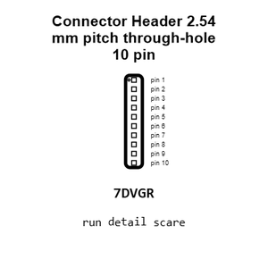

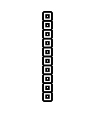

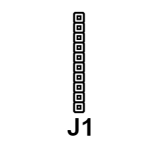

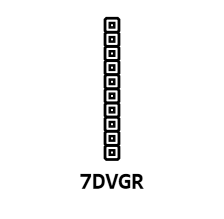

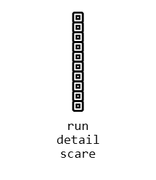

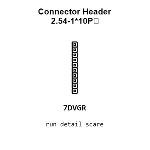

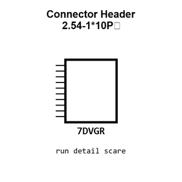

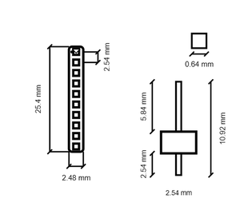

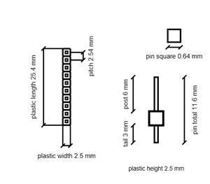

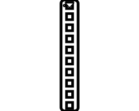

[View this part on GitHub](https://github.com/oomlout/oomp_electronic_version_5/tree/main/parts/electronic_connector_header_2_54_mm_pitch_through_hole_10_pin)

[Browse this category](../../navigation/electronic/connector/header/2_54_mm_pitch/through_hole/README.md)

---

This page is generated from the OOMP part definition by a Roboclick Jinja template. Edit the source taxonomy or template rather than this generated file.