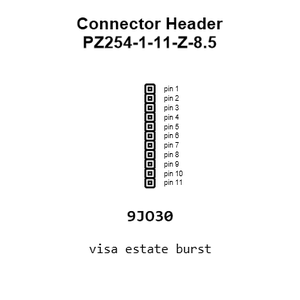
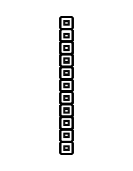
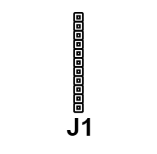
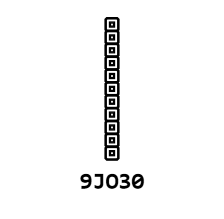
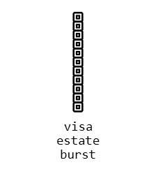
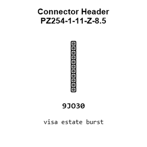
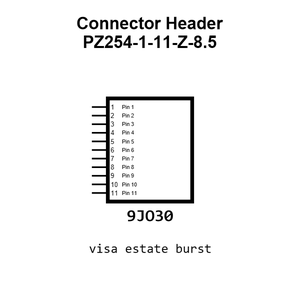
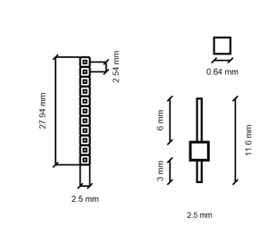
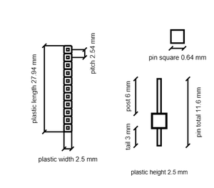
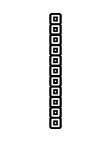

# Connector Header PZ254-1-11-Z-8.5

`electronic_connector_header_2_54_mm_pitch_through_hole_11_pin`

Connector Header PZ254-1-11-Z-8.5 is an OOMP electronic connector definition. It uses the header package or form factor. Its nominal drawing size is 27.94 &#x00D7; 2.48 mm.

## At a glance

| Detail | Value |
| --- | --- |
| OOMP ID | `electronic_connector_header_2_54_mm_pitch_through_hole_11_pin` |
| Type | Connector |
| Package / style | header |
| Nominal size | 27.94 &#x00D7; 2.48 mm |

## Classification

| Level | Value |
| --- | --- |
| 1 | `electronic` |
| 2 | `connector` |
| 3 | `header` |
| 4 | `2_54_mm_pitch` |
| 5 | `through_hole` |
| 6 | `11_pin` |

## Nominal dimensions

| Measurement | Value |
| --- | ---: |
| Length | 27.94 mm |
| Width | 2.48 mm |

## Identifiers

| Identifier | Value |
| --- | --- |
| Manufacturer part number | `PZ254-1-11-Z-8.5` |
| LCSC | [`C2894934`](https://www.lcsc.com/product-detail/C2894934.html) |
| LCSC | [`C18197918`](https://www.lcsc.com/product-detail/C18197918.html) |
| LCSC | [`C2894953`](https://www.lcsc.com/product-detail/C2894953.html) |

## Datasheet

[View the datasheet](data/datasheet.pdf)

## Used in projects

| Project | Quantity | References | Explore |
| --- | ---: | --- | --- |
| [Project adafruit/Adafruit-0.96-160x80-TFT-Display-Breakout-PCB Adafruit 0.96in 160x80 TFT Display current](https://github.com/adafruit/Adafruit-0.96-160x80-TFT-Display-Breakout-PCB/blob/master/Adafruit%200.96in%20160x80%20TFT%20Display.brd) | 1 | JP1 | [Board explorer](https://oomlout.github.io/oomp_electronic_version_5/parts/oomp_project_github_adafruit_adafruit_0_96_160x80_tft_display_breakout_pcb_adafruit_0_96in_160x80_tft_display_current/board_explorer.html) · [OOMP project](https://github.com/oomlout/oomp_electronic_version_5/tree/main/parts/oomp_project_github_adafruit_adafruit_0_96_160x80_tft_display_breakout_pcb_adafruit_0_96in_160x80_tft_display_current) |
| [Project adafruit/Adafruit-1.14-inch-240x135-TFT-PCB Adafruit 1.14 inch 240x135 Color TFT current](https://github.com/adafruit/Adafruit-1.14-inch-240x135-TFT-PCB/blob/master/Adafruit%201.14-inch%20240x135%20Color%20TFT.brd) | 1 | JP1 | [Board explorer](https://oomlout.github.io/oomp_electronic_version_5/parts/oomp_project_github_adafruit_adafruit_1_14_inch_240x135_tft_pcb_adafruit_1_14_inch_240x135_color_tft_current/board_explorer.html) · [OOMP project](https://github.com/oomlout/oomp_electronic_version_5/tree/main/parts/oomp_project_github_adafruit_adafruit_1_14_inch_240x135_tft_pcb_adafruit_1_14_inch_240x135_color_tft_current) |
| [Project adafruit/Adafruit-1.28-240x240-Round-Display-PCB Adafruit 1.28 240x240 Round Display current](https://github.com/adafruit/Adafruit-1.28-240x240-Round-Display-PCB/blob/main/Adafruit%201.28%20240x240%20Round%20Display.brd) | 1 | JP1 | [Board explorer](https://oomlout.github.io/oomp_electronic_version_5/parts/oomp_project_github_adafruit_adafruit_1_28_240x240_round_display_pcb_adafruit_1_28_240x240_round_display_current/board_explorer.html) · [OOMP project](https://github.com/oomlout/oomp_electronic_version_5/tree/main/parts/oomp_project_github_adafruit_adafruit_1_28_240x240_round_display_pcb_adafruit_1_28_240x240_round_display_current) |
| [Project adafruit/Adafruit-1.3-inch-240x240-TFT-PCB Adafruit 1.3in 240x240 IPS TFT current](https://github.com/adafruit/Adafruit-1.3-inch-240x240-TFT-PCB/blob/master/Adafruit%201.3in%20240x240%20IPS%20TFT.brd) | 1 | JP1 | [Board explorer](https://oomlout.github.io/oomp_electronic_version_5/parts/oomp_project_github_adafruit_adafruit_1_3_inch_240x240_tft_pcb_adafruit_1_3in_240x240_ips_tft_current/board_explorer.html) · [OOMP project](https://github.com/oomlout/oomp_electronic_version_5/tree/main/parts/oomp_project_github_adafruit_adafruit_1_3_inch_240x240_tft_pcb_adafruit_1_3in_240x240_ips_tft_current) |
| [Project adafruit/Adafruit-1.3-inch-240x240-TFT-PCB Adafruit 1.3in 240x240 IPS TFT EYESPI current](https://github.com/adafruit/Adafruit-1.3-inch-240x240-TFT-PCB/blob/master/Adafruit%201.3in%20240x240%20IPS%20TFT%20EYESPI.brd) | 1 | JP1 | [Board explorer](https://oomlout.github.io/oomp_electronic_version_5/parts/oomp_project_github_adafruit_adafruit_1_3_inch_240x240_tft_pcb_adafruit_1_3in_240x240_ips_tft_eyespi_current/board_explorer.html) · [OOMP project](https://github.com/oomlout/oomp_electronic_version_5/tree/main/parts/oomp_project_github_adafruit_adafruit_1_3_inch_240x240_tft_pcb_adafruit_1_3in_240x240_ips_tft_eyespi_current) |
| [Project adafruit/Adafruit-1.69in-280x240-Round-Rectangle-TFT-PCB Adafruit 1.69in 280x240 Round Rectangle TFT current](https://github.com/adafruit/Adafruit-1.69in-280x240-Round-Rectangle-TFT-PCB/blob/main/Adafruit%201.69in%20280x240%20Round%20Rectangle%20TFT.brd) | 1 | JP1 | [Board explorer](https://oomlout.github.io/oomp_electronic_version_5/parts/oomp_project_github_adafruit_adafruit_1_69in_280x240_round_rectangle_tft_pcb_adafruit_1_69in_280x240_round_rectangle_tft_current/board_explorer.html) · [OOMP project](https://github.com/oomlout/oomp_electronic_version_5/tree/main/parts/oomp_project_github_adafruit_adafruit_1_69in_280x240_round_rectangle_tft_pcb_adafruit_1_69in_280x240_round_rectangle_tft_current) |
| [Project adafruit/Adafruit-2.0-inch-240x320-TFT-PCB Adafruit 2.0 inch 240x320 IPS TFT current](https://github.com/adafruit/Adafruit-2.0-inch-240x320-TFT-PCB/blob/master/Adafruit%202.0%20inch%20240x320%20IPS%20TFT.brd) | 1 | JP1 | [Board explorer](https://oomlout.github.io/oomp_electronic_version_5/parts/oomp_project_github_adafruit_adafruit_2_0_inch_240x320_tft_pcb_adafruit_2_0_inch_240x320_ips_tft_current/board_explorer.html) · [OOMP project](https://github.com/oomlout/oomp_electronic_version_5/tree/main/parts/oomp_project_github_adafruit_adafruit_2_0_inch_240x320_tft_pcb_adafruit_2_0_inch_240x320_ips_tft_current) |
| [Project adafruit/Adafruit-2.0-inch-240x320-TFT-PCB Adafruit EYESPI 2.0 Inch 240x320 IPS TFT current](https://github.com/adafruit/Adafruit-2.0-inch-240x320-TFT-PCB/blob/master/Adafruit%20EYESPI%202.0%20Inch%20240x320%20IPS%20TFT.brd) | 1 | JP1 | [Board explorer](https://oomlout.github.io/oomp_electronic_version_5/parts/oomp_project_github_adafruit_adafruit_2_0_inch_240x320_tft_pcb_adafruit_eyespi_2_0_inch_240x320_ips_tft_current/board_explorer.html) · [OOMP project](https://github.com/oomlout/oomp_electronic_version_5/tree/main/parts/oomp_project_github_adafruit_adafruit_2_0_inch_240x320_tft_pcb_adafruit_eyespi_2_0_inch_240x320_ips_tft_current) |

## Files

[KiCad symbol, machine-solder and hand-solder footprints](data/kicad/README.md) · [Availability and source masters](data/kicad/manifest.yaml)

[View this part on GitHub](https://github.com/oomlout/oomp_electronic_version_5/tree/main/parts/electronic_connector_header_2_54_mm_pitch_through_hole_11_pin)

[Browse this category](../../navigation/electronic/connector/header/2_54_mm_pitch/through_hole/README.md)

---

This page is generated from the OOMP part definition by a Roboclick Jinja template. Edit the source taxonomy or template rather than this generated file.