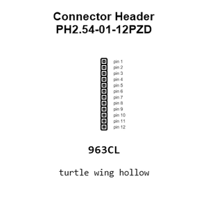
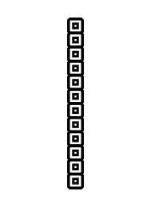
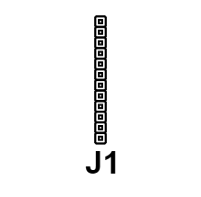
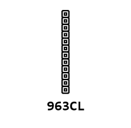
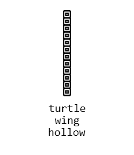
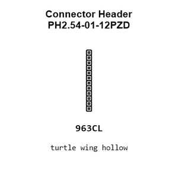
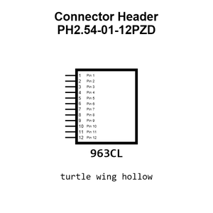
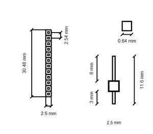
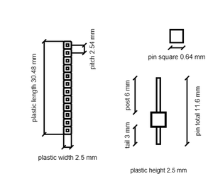
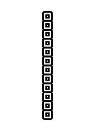

# Connector Header PH2.54-01-12PZD

`electronic_connector_header_2_54_mm_pitch_through_hole_12_pin`

Connector Header PH2.54-01-12PZD is an OOMP electronic connector definition. It uses the header package or form factor. Its nominal drawing size is 30.48 &#x00D7; 2.48 mm.

## At a glance

| Detail | Value |
| --- | --- |
| OOMP ID | `electronic_connector_header_2_54_mm_pitch_through_hole_12_pin` |
| Type | Connector |
| Package / style | header |
| Nominal size | 30.48 &#x00D7; 2.48 mm |

## Classification

| Level | Value |
| --- | --- |
| 1 | `electronic` |
| 2 | `connector` |
| 3 | `header` |
| 4 | `2_54_mm_pitch` |
| 5 | `through_hole` |
| 6 | `12_pin` |

## Nominal dimensions

| Measurement | Value |
| --- | ---: |
| Length | 30.48 mm |
| Width | 2.48 mm |

## Identifiers

| Identifier | Value |
| --- | --- |
| Manufacturer part number | `PH2.54-01-12PZD` |
| LCSC | [`C7501588`](https://www.lcsc.com/product-detail/C7501588.html) |
| LCSC | [`C725243`](https://www.lcsc.com/product-detail/C725243.html) |
| LCSC | [`C7501597`](https://www.lcsc.com/product-detail/C7501597.html) |

## Datasheet

[View the datasheet](data/datasheet.pdf)

## Used in projects

| Project | Quantity | References | Explore |
| --- | ---: | --- | --- |
| [Project adafruit/Adafruit-1.54-inch-240x240-TFT-PCB Adafruit 1.54in 240x240 TFT EYESPI current](https://github.com/adafruit/Adafruit-1.54-inch-240x240-TFT-PCB/blob/master/Adafruit%201.54in%20240x240%20TFT%20EYESPI.brd) | 1 | JP2 | [Board explorer](https://oomlout.github.io/oomp_electronic_version_5/parts/oomp_project_github_adafruit_adafruit_1_54_inch_240x240_tft_pcb_adafruit_1_54in_240x240_tft_eyespi_current/board_explorer.html) · [OOMP project](https://github.com/oomlout/oomp_electronic_version_5/tree/main/parts/oomp_project_github_adafruit_adafruit_1_54_inch_240x240_tft_pcb_adafruit_1_54in_240x240_tft_eyespi_current) |
| [Project adafruit/Adafruit-1.54-inch-240x240-TFT-PCB Adafruit 1.54inch 240x240 current](https://github.com/adafruit/Adafruit-1.54-inch-240x240-TFT-PCB/blob/master/Adafruit%201.54inch%20240x240.brd) | 1 | JP2 | [Board explorer](https://oomlout.github.io/oomp_electronic_version_5/parts/oomp_project_github_adafruit_adafruit_1_54_inch_240x240_tft_pcb_adafruit_1_54inch_240x240_current/board_explorer.html) · [OOMP project](https://github.com/oomlout/oomp_electronic_version_5/tree/main/parts/oomp_project_github_adafruit_adafruit_1_54_inch_240x240_tft_pcb_adafruit_1_54inch_240x240_current) |

## Files

[KiCad symbol, machine-solder and hand-solder footprints](data/kicad/README.md) · [Availability and source masters](data/kicad/manifest.yaml)

[View this part on GitHub](https://github.com/oomlout/oomp_electronic_version_5/tree/main/parts/electronic_connector_header_2_54_mm_pitch_through_hole_12_pin)

[Browse this category](../../navigation/electronic/connector/header/2_54_mm_pitch/through_hole/README.md)

---

This page is generated from the OOMP part definition by a Roboclick Jinja template. Edit the source taxonomy or template rather than this generated file.