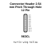
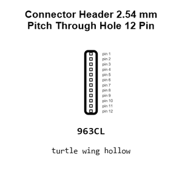
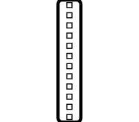
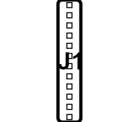
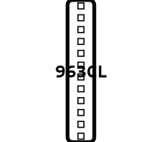
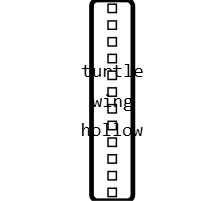
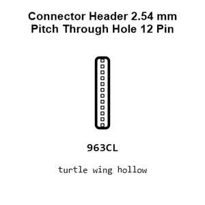
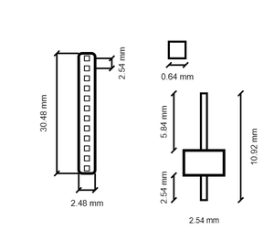
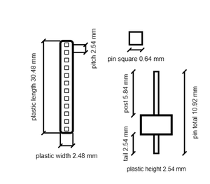

# Connector Header 2.54 mm Pitch Through Hole 12 Pin

`electronic_connector_header_2_54_mm_pitch_through_hole_12_pin`

Connector Header 2.54 mm Pitch Through Hole 12 Pin is an OOMP electronic connector definition. It uses the header package or form factor. Its nominal drawing size is 30.48 × 2.48 mm.

## At a glance

| Detail | Value |
| --- | --- |
| OOMP ID | `electronic_connector_header_2_54_mm_pitch_through_hole_12_pin` |
| Type | Connector |
| Package / style | header |
| Nominal size | 30.48 × 2.48 mm |

## Classification

| Level | Value |
| --- | --- |
| 1 | `electronic` |
| 2 | `connector` |
| 3 | `header` |
| 4 | `2_54_mm_pitch` |
| 5 | `through_hole` |
| 6 | `12_pin` |

## Nominal dimensions

| Measurement | Value |
| --- | ---: |
| Length | 30.48 mm |
| Width | 2.48 mm |

## Files

[View this part on GitHub](https://github.com/oomlout/oomp_electronic_version_5/tree/main/parts/electronic_connector_header_2_54_mm_pitch_through_hole_12_pin)

---

This page is generated from the OOMP part definition by a Roboclick Jinja template. Edit the source taxonomy or template rather than this generated file.
