# Connector Header PZ254-1-13-Z-8.5

`electronic_connector_header_2_54_mm_pitch_through_hole_13_pin`

Connector Header PZ254-1-13-Z-8.5 is an OOMP electronic connector definition. It uses the header package or form factor. Its nominal drawing size is 33.02 &#x00D7; 2.48 mm.

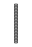

## At a glance

| Detail | Value |
| --- | --- |
| OOMP ID | `electronic_connector_header_2_54_mm_pitch_through_hole_13_pin` |
| Type | Connector |
| Package / style | header |
| Nominal size | 33.02 &#x00D7; 2.48 mm |

## Classification

| Level | Value |
| --- | --- |
| 1 | `electronic` |
| 2 | `connector` |
| 3 | `header` |
| 4 | `2_54_mm_pitch` |
| 5 | `through_hole` |
| 6 | `13_pin` |

## Nominal dimensions

| Measurement | Value |
| --- | ---: |
| Length | 33.02 mm |
| Width | 2.48 mm |

## Identifiers

| Identifier | Value |
| --- | --- |
| Manufacturer part number | `PZ254-1-13-Z-8.5` |
| LCSC | [`C2894936`](https://www.lcsc.com/product-detail/C2894936.html) |
| LCSC | [`C2894955`](https://www.lcsc.com/product-detail/C2894955.html) |
| LCSC | [`C52928`](https://www.lcsc.com/product-detail/C52928.html) |

## Datasheet

[View the datasheet](data/datasheet.pdf)

## Used in projects

| Project | Quantity | References | Explore |
| --- | ---: | --- | --- |
| [Project adafruit/Adafruit-E-Paper-Display-Breakout-PCBs Adafruit 1.54in e Ink Breakout current](https://github.com/adafruit/Adafruit-E-Paper-Display-Breakout-PCBs/blob/master/Adafruit%201.54in%20eInk%20Breakout.brd) | 1 | JP2 | [Board explorer](https://oomlout.github.io/oomp_electronic_version_5/parts/oomp_project_github_adafruit_adafruit_e_paper_display_breakout_pcbs_adafruit_1_54in_e_ink_breakout_current/board_explorer.html) · [OOMP project](https://github.com/oomlout/oomp_electronic_version_5/tree/main/parts/oomp_project_github_adafruit_adafruit_e_paper_display_breakout_pcbs_adafruit_1_54in_e_ink_breakout_current) |
| [Project adafruit/Adafruit-E-Paper-Display-Breakout-PCBs Adafruit 1.54in e Ink Breakout with EYESPI current](https://github.com/adafruit/Adafruit-E-Paper-Display-Breakout-PCBs/blob/master/Adafruit%201.54in%20eInk%20Breakout%20with%20EYESPI.brd) | 1 | JP2 | [Board explorer](https://oomlout.github.io/oomp_electronic_version_5/parts/oomp_project_github_adafruit_adafruit_e_paper_display_breakout_pcbs_adafruit_1_54in_e_ink_breakout_with_eyespi_current/board_explorer.html) · [OOMP project](https://github.com/oomlout/oomp_electronic_version_5/tree/main/parts/oomp_project_github_adafruit_adafruit_e_paper_display_breakout_pcbs_adafruit_1_54in_e_ink_breakout_with_eyespi_current) |
| [Project adafruit/Adafruit-E-Paper-Display-Breakout-PCBs Adafruit 2.13in Tri Color e Ink Display current](https://github.com/adafruit/Adafruit-E-Paper-Display-Breakout-PCBs/blob/master/Adafruit%202.13in%20Tri-Color%20eInk%20Display.brd) | 1 | JP2 | [Board explorer](https://oomlout.github.io/oomp_electronic_version_5/parts/oomp_project_github_adafruit_adafruit_e_paper_display_breakout_pcbs_adafruit_2_13in_tri_color_e_ink_display_current/board_explorer.html) · [OOMP project](https://github.com/oomlout/oomp_electronic_version_5/tree/main/parts/oomp_project_github_adafruit_adafruit_e_paper_display_breakout_pcbs_adafruit_2_13in_tri_color_e_ink_display_current) |
| [Project adafruit/Adafruit-E-Paper-Display-Breakout-PCBs Adafruit 2.13in Tri Color e Ink with EYESPI current](https://github.com/adafruit/Adafruit-E-Paper-Display-Breakout-PCBs/blob/master/Adafruit%202.13in%20Tri-Color%20eInk%20with%20EYESPI.brd) | 1 | JP2 | [Board explorer](https://oomlout.github.io/oomp_electronic_version_5/parts/oomp_project_github_adafruit_adafruit_e_paper_display_breakout_pcbs_adafruit_2_13in_tri_color_e_ink_with_eyespi_current/board_explorer.html) · [OOMP project](https://github.com/oomlout/oomp_electronic_version_5/tree/main/parts/oomp_project_github_adafruit_adafruit_e_paper_display_breakout_pcbs_adafruit_2_13in_tri_color_e_ink_with_eyespi_current) |
| [Project adafruit/Adafruit-E-Paper-Display-Breakout-PCBs Adafruit 2.7in Tri Color e Ink Display current](https://github.com/adafruit/Adafruit-E-Paper-Display-Breakout-PCBs/blob/master/Adafruit%202.7in%20Tri-Color%20eInk%20Display.brd) | 1 | JP2 | [Board explorer](https://oomlout.github.io/oomp_electronic_version_5/parts/oomp_project_github_adafruit_adafruit_e_paper_display_breakout_pcbs_adafruit_2_7in_tri_color_e_ink_display_current/board_explorer.html) · [OOMP project](https://github.com/oomlout/oomp_electronic_version_5/tree/main/parts/oomp_project_github_adafruit_adafruit_e_paper_display_breakout_pcbs_adafruit_2_7in_tri_color_e_ink_display_current) |
| [Project adafruit/Adafruit-E-Paper-Display-Breakout-PCBs Adafruit 2.7in Tri Color e Ink Display with EYESPI current](https://github.com/adafruit/Adafruit-E-Paper-Display-Breakout-PCBs/blob/master/Adafruit%202.7in%20Tri-Color%20eInk%20Display%20with%20EYESPI.brd) | 1 | JP2 | [Board explorer](https://oomlout.github.io/oomp_electronic_version_5/parts/oomp_project_github_adafruit_adafruit_e_paper_display_breakout_pcbs_adafruit_2_7in_tri_color_e_ink_display_with_eyespi_current/board_explorer.html) · [OOMP project](https://github.com/oomlout/oomp_electronic_version_5/tree/main/parts/oomp_project_github_adafruit_adafruit_e_paper_display_breakout_pcbs_adafruit_2_7in_tri_color_e_ink_display_with_eyespi_current) |
| [Project adafruit/Adafruit-E-Paper-Display-Breakout-PCBs Adafruit 2.9in e Ink Display current](https://github.com/adafruit/Adafruit-E-Paper-Display-Breakout-PCBs/blob/master/Adafruit%202.9in%20eInk%20Display.brd) | 1 | JP2 | [Board explorer](https://oomlout.github.io/oomp_electronic_version_5/parts/oomp_project_github_adafruit_adafruit_e_paper_display_breakout_pcbs_adafruit_2_9in_e_ink_display_current/board_explorer.html) · [OOMP project](https://github.com/oomlout/oomp_electronic_version_5/tree/main/parts/oomp_project_github_adafruit_adafruit_e_paper_display_breakout_pcbs_adafruit_2_9in_e_ink_display_current) |
| [Project adafruit/Adafruit-IS31FL3731-CharliePlex-LED-Breakout-PCB Adafruit IS31 FL3731 Breakout current](https://github.com/adafruit/Adafruit-IS31FL3731-CharliePlex-LED-Breakout-PCB/blob/master/Adafruit%20IS31FL3731%20Breakout.brd) | 2 | JP2, JP4 | [Board explorer](https://oomlout.github.io/oomp_electronic_version_5/parts/oomp_project_github_adafruit_adafruit_is31_fl3731_charlie_plex_led_breakout_pcb_adafruit_is31_fl3731_breakout_current/board_explorer.html) · [OOMP project](https://github.com/oomlout/oomp_electronic_version_5/tree/main/parts/oomp_project_github_adafruit_adafruit_is31_fl3731_charlie_plex_led_breakout_pcb_adafruit_is31_fl3731_breakout_current) |
| [Project adafruit/Adafruit-IS31FL3731-CharliePlex-LED-Breakout-PCB Adafruit IS31 FL3731 Charlie Plex Grid current](https://github.com/adafruit/Adafruit-IS31FL3731-CharliePlex-LED-Breakout-PCB/blob/master/Adafruit%20IS31FL3731%20CharliePlex%20Grid.brd) | 2 | JP1, JP4 | [Board explorer](https://oomlout.github.io/oomp_electronic_version_5/parts/oomp_project_github_adafruit_adafruit_is31_fl3731_charlie_plex_led_breakout_pcb_adafruit_is31_fl3731_charlie_plex_grid_current/board_explorer.html) · [OOMP project](https://github.com/oomlout/oomp_electronic_version_5/tree/main/parts/oomp_project_github_adafruit_adafruit_is31_fl3731_charlie_plex_led_breakout_pcb_adafruit_is31_fl3731_charlie_plex_grid_current) |
| [Project adafruit/Adafruit-IS31FL3731-CharliePlex-LED-Breakout-PCB Adafruit IS31 FL3731 STEMMA QT current](https://github.com/adafruit/Adafruit-IS31FL3731-CharliePlex-LED-Breakout-PCB/blob/master/Adafruit%20IS31FL3731%20STEMMA%20QT.brd) | 2 | JP2, JP4 | [Board explorer](https://oomlout.github.io/oomp_electronic_version_5/parts/oomp_project_github_adafruit_adafruit_is31_fl3731_charlie_plex_led_breakout_pcb_adafruit_is31_fl3731_stemma_qt_current/board_explorer.html) · [OOMP project](https://github.com/oomlout/oomp_electronic_version_5/tree/main/parts/oomp_project_github_adafruit_adafruit_is31_fl3731_charlie_plex_led_breakout_pcb_adafruit_is31_fl3731_stemma_qt_current) |
| [Project adafruit/Adafruit-KB2040-PCB Adafruit KB2040 current](https://github.com/adafruit/Adafruit-KB2040-PCB/blob/main/Adafruit%20KB2040.brd) | 2 | JP1, JP2 | [Board explorer](https://oomlout.github.io/oomp_electronic_version_5/parts/oomp_project_github_adafruit_adafruit_kb2040_pcb_adafruit_kb2040_current/board_explorer.html) · [OOMP project](https://github.com/oomlout/oomp_electronic_version_5/tree/main/parts/oomp_project_github_adafruit_adafruit_kb2040_pcb_adafruit_kb2040_current) |
| [Project adafruit/Adafruit_Learning_System_Guides TMC2209 Camera Slider PCB current](https://github.com/adafruit/Adafruit_Learning_System_Guides/blob/main/TMC2209_Camera_Slider/PCB_Files/TMC2209_Camera_Slider_PCB_revB.brd) | 2 | KB2040-1, KB2040-2 | [Board explorer](https://oomlout.github.io/oomp_electronic_version_5/parts/oomp_project_github_adafruit_adafruit_learning_system_guides_tmc2209_camera_slider_pcb_current/board_explorer.html) · [OOMP project](https://github.com/oomlout/oomp_electronic_version_5/tree/main/parts/oomp_project_github_adafruit_adafruit_learning_system_guides_tmc2209_camera_slider_pcb_current) |
| [Project adafruit/Adafruit-MPR121-PCB Adafruit MPR121 Breakout current](https://github.com/adafruit/Adafruit-MPR121-PCB/blob/master/Adafruit%20MPR121%20Breakout.brd) | 1 | JP1 | [Board explorer](https://oomlout.github.io/oomp_electronic_version_5/parts/oomp_project_github_adafruit_adafruit_mpr121_pcb_adafruit_mpr121_breakout_current/board_explorer.html) · [OOMP project](https://github.com/oomlout/oomp_electronic_version_5/tree/main/parts/oomp_project_github_adafruit_adafruit_mpr121_pcb_adafruit_mpr121_breakout_current) |
| [Project adafruit/Adafruit-MPR121-PCB Adafruit MPR121 Q QT current](https://github.com/adafruit/Adafruit-MPR121-PCB/blob/master/Adafruit%20MPR121Q%20QT.brd) | 1 | JP1 | [Board explorer](https://oomlout.github.io/oomp_electronic_version_5/parts/oomp_project_github_adafruit_adafruit_mpr121_pcb_adafruit_mpr121_q_qt_current/board_explorer.html) · [OOMP project](https://github.com/oomlout/oomp_electronic_version_5/tree/main/parts/oomp_project_github_adafruit_adafruit_mpr121_pcb_adafruit_mpr121_q_qt_current) |

## Files

[KiCad symbol, machine-solder and hand-solder footprints](data/kicad/README.md) · [Availability and source masters](data/kicad/manifest.yaml)

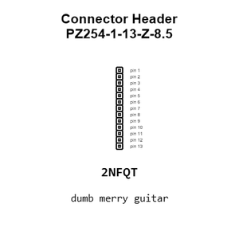

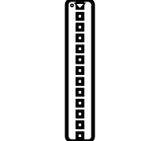

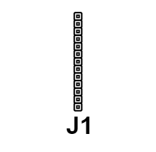

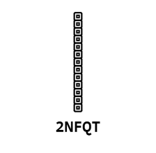

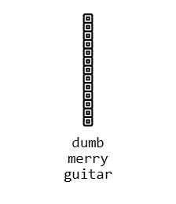

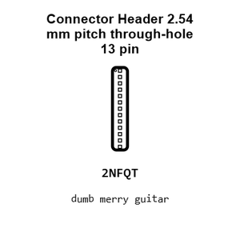

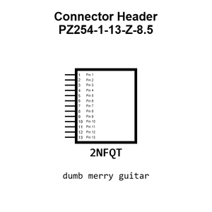

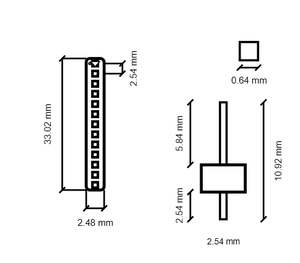

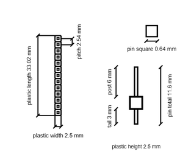

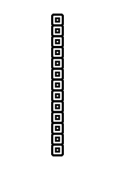

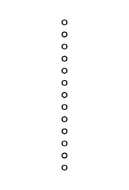

[View this part on GitHub](https://github.com/oomlout/oomp_electronic_version_5/tree/main/parts/electronic_connector_header_2_54_mm_pitch_through_hole_13_pin)

[Browse this category](../../navigation/electronic/connector/header/2_54_mm_pitch/through_hole/README.md)

---

This page is generated from the OOMP part definition by a Roboclick Jinja template. Edit the source taxonomy or template rather than this generated file.