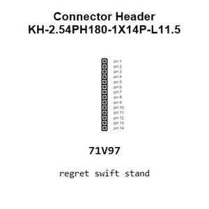
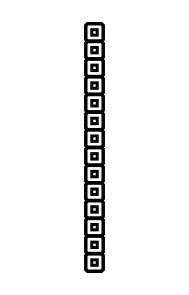
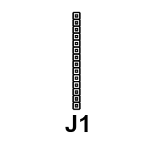
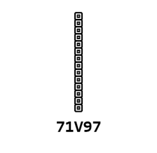
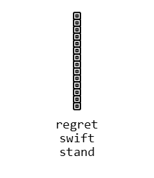
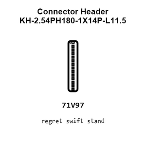
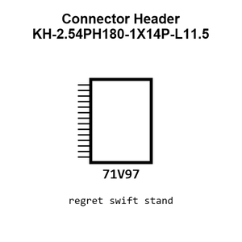
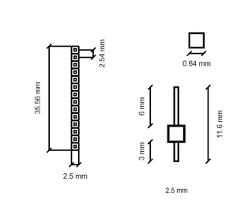
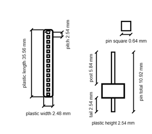
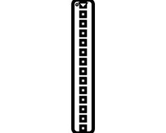

# Connector Header KH-2.54PH180-1X14P-L11.5

`electronic_connector_header_2_54_mm_pitch_through_hole_14_pin`

Connector Header KH-2.54PH180-1X14P-L11.5 is an OOMP electronic connector definition. It uses the header package or form factor. Its nominal drawing size is 35.56 &#x00D7; 2.48 mm.

## At a glance

| Detail | Value |
| --- | --- |
| OOMP ID | `electronic_connector_header_2_54_mm_pitch_through_hole_14_pin` |
| Type | Connector |
| Package / style | header |
| Nominal size | 35.56 &#x00D7; 2.48 mm |

## Classification

| Level | Value |
| --- | --- |
| 1 | `electronic` |
| 2 | `connector` |
| 3 | `header` |
| 4 | `2_54_mm_pitch` |
| 5 | `through_hole` |
| 6 | `14_pin` |

## Nominal dimensions

| Measurement | Value |
| --- | ---: |
| Length | 35.56 mm |
| Width | 2.48 mm |

## Identifiers

| Identifier | Value |
| --- | --- |
| Manufacturer part number | `KH-2.54PH180-1X14P-L11.5` |
| LCSC | [`C2905490`](https://www.lcsc.com/product-detail/C2905490.html) |
| LCSC | [`C3294465`](https://www.lcsc.com/product-detail/C3294465.html) |
| LCSC | [`C54803357`](https://www.lcsc.com/product-detail/C54803357.html) |

## Datasheet

[View the datasheet](data/datasheet.pdf)

## Used in projects

| Project | Quantity | References | Explore |
| --- | ---: | --- | --- |
| [Project adafruit/Adafruit-ItsyBitsy-32u4-PCB Itsy Bitsy 32u4 3 V current](https://github.com/adafruit/Adafruit-ItsyBitsy-32u4-PCB/blob/master/Itsy%20Bitsy%2032u4%203V.brd) | 2 | JP2, JP4 | [Board explorer](https://oomlout.github.io/oomp_electronic_version_5/parts/oomp_project_github_adafruit_adafruit_itsy_bitsy_32u4_pcb_itsy_bitsy_32u4_3_v_current/board_explorer.html) · [OOMP project](https://github.com/oomlout/oomp_electronic_version_5/tree/main/parts/oomp_project_github_adafruit_adafruit_itsy_bitsy_32u4_pcb_itsy_bitsy_32u4_3_v_current) |
| [Project adafruit/Adafruit-ItsyBitsy-32u4-PCB Itsy Bitsy 32u4 5 V current](https://github.com/adafruit/Adafruit-ItsyBitsy-32u4-PCB/blob/master/Itsy%20Bitsy%2032u4%205V.brd) | 2 | JP2, JP4 | [Board explorer](https://oomlout.github.io/oomp_electronic_version_5/parts/oomp_project_github_adafruit_adafruit_itsy_bitsy_32u4_pcb_itsy_bitsy_32u4_5_v_current/board_explorer.html) · [OOMP project](https://github.com/oomlout/oomp_electronic_version_5/tree/main/parts/oomp_project_github_adafruit_adafruit_itsy_bitsy_32u4_pcb_itsy_bitsy_32u4_5_v_current) |
| [Project adafruit/Adafruit-ItsyBitsy-ESP32-PCB Adafruit Itsy Bitsy ESP32 current](https://github.com/adafruit/Adafruit-ItsyBitsy-ESP32-PCB/blob/main/Adafruit%20ItsyBitsy%20ESP32.brd) | 2 | JP2, JP4 | [Board explorer](https://oomlout.github.io/oomp_electronic_version_5/parts/oomp_project_github_adafruit_adafruit_itsy_bitsy_esp32_pcb_adafruit_itsy_bitsy_esp32_current/board_explorer.html) · [OOMP project](https://github.com/oomlout/oomp_electronic_version_5/tree/main/parts/oomp_project_github_adafruit_adafruit_itsy_bitsy_esp32_pcb_adafruit_itsy_bitsy_esp32_current) |
| [Project adafruit/Adafruit-ItsyBitsy-M4-Express-PCB Adafruit Itsy Bitsy M4 current](https://github.com/adafruit/Adafruit-ItsyBitsy-M4-Express-PCB/blob/master/Adafruit%20ItsyBitsy%20M4.brd) | 2 | JP2, JP4 | [Board explorer](https://oomlout.github.io/oomp_electronic_version_5/parts/oomp_project_github_adafruit_adafruit_itsy_bitsy_m4_express_pcb_adafruit_itsy_bitsy_m4_current/board_explorer.html) · [OOMP project](https://github.com/oomlout/oomp_electronic_version_5/tree/main/parts/oomp_project_github_adafruit_adafruit_itsy_bitsy_m4_express_pcb_adafruit_itsy_bitsy_m4_current) |
| [Project adafruit/Adafruit-ItsyBitsy-nRF52840-Express-PCB Adafruit Itsy Bitsy n RF52840 Express current](https://github.com/adafruit/Adafruit-ItsyBitsy-nRF52840-Express-PCB/blob/master/Adafruit%20ItsyBitsy%20nRF52840%20Express.brd) | 2 | JP2, JP4 | [Board explorer](https://oomlout.github.io/oomp_electronic_version_5/parts/oomp_project_github_adafruit_adafruit_itsy_bitsy_n_rf52840_express_pcb_adafruit_itsy_bitsy_n_rf52840_express_current/board_explorer.html) · [OOMP project](https://github.com/oomlout/oomp_electronic_version_5/tree/main/parts/oomp_project_github_adafruit_adafruit_itsy_bitsy_n_rf52840_express_pcb_adafruit_itsy_bitsy_n_rf52840_express_current) |
| [Project adafruit/Adafruit-ItsyBitsy-RP2040-PCB Adafruit Itsy Bitsy RP2040 current](https://github.com/adafruit/Adafruit-ItsyBitsy-RP2040-PCB/blob/main/Adafruit%20ItsyBitsy%20RP2040.brd) | 2 | JP2, JP4 | [Board explorer](https://oomlout.github.io/oomp_electronic_version_5/parts/oomp_project_github_adafruit_adafruit_itsy_bitsy_rp2040_pcb_adafruit_itsy_bitsy_rp2040_current/board_explorer.html) · [OOMP project](https://github.com/oomlout/oomp_electronic_version_5/tree/main/parts/oomp_project_github_adafruit_adafruit_itsy_bitsy_rp2040_pcb_adafruit_itsy_bitsy_rp2040_current) |
| [Project adafruit/Adafruit-LED-Backpacks Adafruit HT16 K33 breakout current](https://github.com/adafruit/Adafruit-LED-Backpacks/blob/master/Adafruit%20HT16K33%20breakout.brd) | 2 | JP1, JP2 | [Board explorer](https://oomlout.github.io/oomp_electronic_version_5/parts/oomp_project_github_adafruit_adafruit_led_backpacks_adafruit_ht16_k33_breakout_current/board_explorer.html) · [OOMP project](https://github.com/oomlout/oomp_electronic_version_5/tree/main/parts/oomp_project_github_adafruit_adafruit_led_backpacks_adafruit_ht16_k33_breakout_current) |

## Files

[KiCad symbol, machine-solder and hand-solder footprints](data/kicad/README.md) · [Availability and source masters](data/kicad/manifest.yaml)

[View this part on GitHub](https://github.com/oomlout/oomp_electronic_version_5/tree/main/parts/electronic_connector_header_2_54_mm_pitch_through_hole_14_pin)

[Browse this category](../../navigation/electronic/connector/header/2_54_mm_pitch/through_hole/README.md)

---

This page is generated from the OOMP part definition by a Roboclick Jinja template. Edit the source taxonomy or template rather than this generated file.