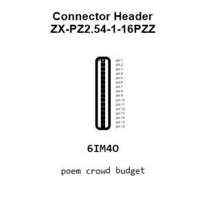
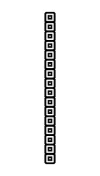
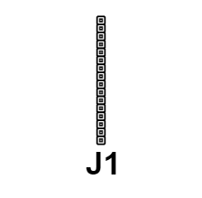
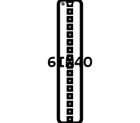
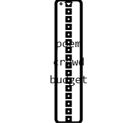
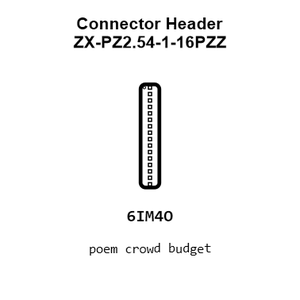
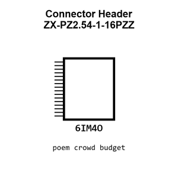
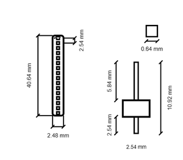
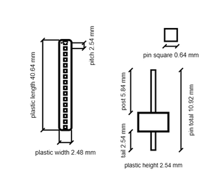
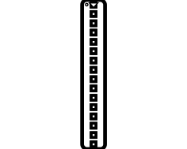

# Connector Header ZX-PZ2.54-1-16PZZ

`electronic_connector_header_2_54_mm_pitch_through_hole_16_pin`

Connector Header ZX-PZ2.54-1-16PZZ is an OOMP electronic connector definition. It uses the header package or form factor. Its nominal drawing size is 40.64 &#x00D7; 2.48 mm.

## At a glance

| Detail | Value |
| --- | --- |
| OOMP ID | `electronic_connector_header_2_54_mm_pitch_through_hole_16_pin` |
| Type | Connector |
| Package / style | header |
| Nominal size | 40.64 &#x00D7; 2.48 mm |

## Classification

| Level | Value |
| --- | --- |
| 1 | `electronic` |
| 2 | `connector` |
| 3 | `header` |
| 4 | `2_54_mm_pitch` |
| 5 | `through_hole` |
| 6 | `16_pin` |

## Nominal dimensions

| Measurement | Value |
| --- | ---: |
| Length | 40.64 mm |
| Width | 2.48 mm |

## Identifiers

| Identifier | Value |
| --- | --- |
| Manufacturer part number | `ZX-PZ2.54-1-16PZZ` |
| LCSC | [`C7501270`](https://www.lcsc.com/product-detail/C7501270.html) |
| LCSC | [`C54950622`](https://www.lcsc.com/product-detail/C54950622.html) |
| LCSC | [`C22465876`](https://www.lcsc.com/product-detail/C22465876.html) |

## Datasheet

[View the datasheet](data/datasheet.pdf)

## Used in projects

| Project | Quantity | References | Explore |
| --- | ---: | --- | --- |
| [Project adafruit/Adafruit-Adalogger-FeatherWing-PCB adalogger featherwing current](https://github.com/adafruit/Adafruit-Adalogger-FeatherWing-PCB/blob/master/adalogger%20featherwing.brd) | 1 | JP2 | [Board explorer](https://oomlout.github.io/oomp_electronic_version_5/parts/oomp_project_github_adafruit_adafruit_adalogger_feather_wing_pcb_adalogger_featherwing_current/board_explorer.html) · [OOMP project](https://github.com/oomlout/oomp_electronic_version_5/tree/main/parts/oomp_project_github_adafruit_adafruit_adalogger_feather_wing_pcb_adalogger_featherwing_current) |
| [Project adafruit/Adafruit-AirLift-FeatherWing-PCB Adafruit Air Lift Feather Wing current](https://github.com/adafruit/Adafruit-AirLift-FeatherWing-PCB/blob/master/Adafruit%20AirLift%20FeatherWing%20rev%20C.brd) | 1 | JP1 | [Board explorer](https://oomlout.github.io/oomp_electronic_version_5/parts/oomp_project_github_adafruit_adafruit_air_lift_feather_wing_pcb_adafruit_air_lift_feather_wing_current/board_explorer.html) · [OOMP project](https://github.com/oomlout/oomp_electronic_version_5/tree/main/parts/oomp_project_github_adafruit_adafruit_air_lift_feather_wing_pcb_adafruit_air_lift_feather_wing_current) |
| [Project adafruit/Adafruit-DC-Stepper-Motor-FeatherWing-PCB Adafruit DC+Stepper Wing current](https://github.com/adafruit/Adafruit-DC-Stepper-Motor-FeatherWing-PCB/blob/master/Adafruit%20DC%2BStepper%20Wing.brd) | 1 | JP2 | [Board explorer](https://oomlout.github.io/oomp_electronic_version_5/parts/oomp_project_github_adafruit_adafruit_dc_stepper_motor_feather_wing_pcb_adafruit_dc_stepper_wing_current/board_explorer.html) · [OOMP project](https://github.com/oomlout/oomp_electronic_version_5/tree/main/parts/oomp_project_github_adafruit_adafruit_dc_stepper_motor_feather_wing_pcb_adafruit_dc_stepper_wing_current) |
| [Project adafruit/Adafruit-E-Paper-Display-Breakout-PCBs Adafruit e Ink Feather Friend current](https://github.com/adafruit/Adafruit-E-Paper-Display-Breakout-PCBs/blob/master/Adafruit%20eInk%20Feather%20Friend.brd) | 1 | JP1 | [Board explorer](https://oomlout.github.io/oomp_electronic_version_5/parts/oomp_project_github_adafruit_adafruit_e_paper_display_breakout_pcbs_adafruit_e_ink_feather_friend_current/board_explorer.html) · [OOMP project](https://github.com/oomlout/oomp_electronic_version_5/tree/main/parts/oomp_project_github_adafruit_adafruit_e_paper_display_breakout_pcbs_adafruit_e_ink_feather_friend_current) |
| [Project adafruit/Adafruit-ESP32-C6-Feather-PCB Adafruit Feather ESP32 C6 current](https://github.com/adafruit/Adafruit-ESP32-C6-Feather-PCB/blob/main/Adafruit%20Feather%20ESP32-C6.brd) | 1 | JP1 | [Board explorer](https://oomlout.github.io/oomp_electronic_version_5/parts/oomp_project_github_adafruit_adafruit_esp32_c6_feather_pcb_adafruit_feather_esp32_c6_current/board_explorer.html) · [OOMP project](https://github.com/oomlout/oomp_electronic_version_5/tree/main/parts/oomp_project_github_adafruit_adafruit_esp32_c6_feather_pcb_adafruit_feather_esp32_c6_current) |
| [Project adafruit/Adafruit-ESP32-Feather-V2-PCB Adafruit ESP32 Feather current](https://github.com/adafruit/Adafruit-ESP32-Feather-V2-PCB/blob/main/Adafruit%20ESP32%20Feather%20V2.brd) | 1 | JP1 | [Board explorer](https://oomlout.github.io/oomp_electronic_version_5/parts/oomp_project_github_adafruit_adafruit_esp32_feather_v2_pcb_adafruit_esp32_feather_current/board_explorer.html) · [OOMP project](https://github.com/oomlout/oomp_electronic_version_5/tree/main/parts/oomp_project_github_adafruit_adafruit_esp32_feather_v2_pcb_adafruit_esp32_feather_current) |
| [Project adafruit/Adafruit-ESP32-S2-Reverse-TFT-Feather-PCB Adafruit Feather ESP32 S2rse TFT current](https://github.com/adafruit/Adafruit-ESP32-S2-Reverse-TFT-Feather-PCB/blob/main/Adafruit%20Feather%20ESP32-S2%20Reverse%20TFT.brd) | 1 | JP1 | [Board explorer](https://oomlout.github.io/oomp_electronic_version_5/parts/oomp_project_github_adafruit_adafruit_esp32_s2_reverse_tft_feather_pcb_adafruit_feather_esp32_s2rse_tft_current/board_explorer.html) · [OOMP project](https://github.com/oomlout/oomp_electronic_version_5/tree/main/parts/oomp_project_github_adafruit_adafruit_esp32_s2_reverse_tft_feather_pcb_adafruit_feather_esp32_s2rse_tft_current) |
| [Project adafruit/Adafruit-ESP32-S2-TFT-Feather-PCB Adafruit ESP32 S2 TFT Feather current](https://github.com/adafruit/Adafruit-ESP32-S2-TFT-Feather-PCB/blob/main/Adafruit%20ESP32-S2%20TFT%20Feather.brd) | 1 | JP1 | [Board explorer](https://oomlout.github.io/oomp_electronic_version_5/parts/oomp_project_github_adafruit_adafruit_esp32_s2_tft_feather_pcb_adafruit_esp32_s2_tft_feather_current/board_explorer.html) · [OOMP project](https://github.com/oomlout/oomp_electronic_version_5/tree/main/parts/oomp_project_github_adafruit_adafruit_esp32_s2_tft_feather_pcb_adafruit_esp32_s2_tft_feather_current) |
| [Project adafruit/Adafruit-ESP32-S3-Reverse-TFT-Feather-PCB Adafruit ESP32 S3rse TFT Feather current](https://github.com/adafruit/Adafruit-ESP32-S3-Reverse-TFT-Feather-PCB/blob/main/Adafruit%20ESP32-S3%20Reverse%20TFT%20Feather.brd) | 1 | JP1 | [Board explorer](https://oomlout.github.io/oomp_electronic_version_5/parts/oomp_project_github_adafruit_adafruit_esp32_s3_reverse_tft_feather_pcb_adafruit_esp32_s3rse_tft_feather_current/board_explorer.html) · [OOMP project](https://github.com/oomlout/oomp_electronic_version_5/tree/main/parts/oomp_project_github_adafruit_adafruit_esp32_s3_reverse_tft_feather_pcb_adafruit_esp32_s3rse_tft_feather_current) |
| [Project adafruit/Adafruit-ESP32-S3-TFT-Feather-PCB Adafruit ESP32 S3 TFT Feather current](https://github.com/adafruit/Adafruit-ESP32-S3-TFT-Feather-PCB/blob/main/Adafruit%20ESP32-S3%20TFT%20Feather.brd) | 1 | JP1 | [Board explorer](https://oomlout.github.io/oomp_electronic_version_5/parts/oomp_project_github_adafruit_adafruit_esp32_s3_tft_feather_pcb_adafruit_esp32_s3_tft_feather_current/board_explorer.html) · [OOMP project](https://github.com/oomlout/oomp_electronic_version_5/tree/main/parts/oomp_project_github_adafruit_adafruit_esp32_s3_tft_feather_pcb_adafruit_esp32_s3_tft_feather_current) |
| [Project adafruit/Adafruit-Feather-32u4-Basic-Proto-PCB Adafruit Feather 32u4 Basic current](https://github.com/adafruit/Adafruit-Feather-32u4-Basic-Proto-PCB/blob/master/Adafruit%20Feather%2032u4%20Basic%20rev%20B.brd) | 1 | JP1 | [Board explorer](https://oomlout.github.io/oomp_electronic_version_5/parts/oomp_project_github_adafruit_adafruit_feather_32u4_basic_proto_pcb_adafruit_feather_32u4_basic_current/board_explorer.html) · [OOMP project](https://github.com/oomlout/oomp_electronic_version_5/tree/main/parts/oomp_project_github_adafruit_adafruit_feather_32u4_basic_proto_pcb_adafruit_feather_32u4_basic_current) |
| [Project adafruit/Adafruit-Feather-32u4-RFM-LoRa-PCB Adafruit Feather 32u4 RFMxx current](https://github.com/adafruit/Adafruit-Feather-32u4-RFM-LoRa-PCB/blob/master/Adafruit%20Feather%2032u4%20RFMxx.brd) | 1 | JP1 | [Board explorer](https://oomlout.github.io/oomp_electronic_version_5/parts/oomp_project_github_adafruit_adafruit_feather_32u4_rfm_lo_ra_pcb_adafruit_feather_32u4_rfmxx_current/board_explorer.html) · [OOMP project](https://github.com/oomlout/oomp_electronic_version_5/tree/main/parts/oomp_project_github_adafruit_adafruit_feather_32u4_rfm_lo_ra_pcb_adafruit_feather_32u4_rfmxx_current) |
| [Project adafruit/Adafruit-Feather-ESP32-S2-PCB Adafruit Feather ESP32 S2 current](https://github.com/adafruit/Adafruit-Feather-ESP32-S2-PCB/blob/main/Adafruit%20Feather%20ESP32-S2.brd) | 1 | JP1 | [Board explorer](https://oomlout.github.io/oomp_electronic_version_5/parts/oomp_project_github_adafruit_adafruit_feather_esp32_s2_pcb_adafruit_feather_esp32_s2_current/board_explorer.html) · [OOMP project](https://github.com/oomlout/oomp_electronic_version_5/tree/main/parts/oomp_project_github_adafruit_adafruit_feather_esp32_s2_pcb_adafruit_feather_esp32_s2_current) |
| [Project adafruit/Adafruit-Feather-ESP32-S3-PCB Adafruit ESP32 S3 8 MB No PSRAM current](https://github.com/adafruit/Adafruit-Feather-ESP32-S3-PCB/blob/main/Adafruit%20ESP32-S3%208MB%20No%20PSRAM.brd) | 1 | JP1 | [Board explorer](https://oomlout.github.io/oomp_electronic_version_5/parts/oomp_project_github_adafruit_adafruit_feather_esp32_s3_pcb_adafruit_esp32_s3_8_mb_no_psram_current/board_explorer.html) · [OOMP project](https://github.com/oomlout/oomp_electronic_version_5/tree/main/parts/oomp_project_github_adafruit_adafruit_feather_esp32_s3_pcb_adafruit_esp32_s3_8_mb_no_psram_current) |
| [Project adafruit/Adafruit-Feather-ESP8266-HUZZAH-PCB Adafruit ESP8266 Feather current](https://github.com/adafruit/Adafruit-Feather-ESP8266-HUZZAH-PCB/blob/master/Adafruit%20ESP8266%20Feather.brd) | 1 | JP1 | [Board explorer](https://oomlout.github.io/oomp_electronic_version_5/parts/oomp_project_github_adafruit_adafruit_feather_esp8266_huzzah_pcb_adafruit_esp8266_feather_current/board_explorer.html) · [OOMP project](https://github.com/oomlout/oomp_electronic_version_5/tree/main/parts/oomp_project_github_adafruit_adafruit_feather_esp8266_huzzah_pcb_adafruit_esp8266_feather_current) |
| [Project adafruit/Adafruit-Feather-M0-Express-PCB Adafruit Feather M0 Express current](https://github.com/adafruit/Adafruit-Feather-M0-Express-PCB/blob/master/Adafruit%20Feather%20M0%20Express.brd) | 1 | JP1 | [Board explorer](https://oomlout.github.io/oomp_electronic_version_5/parts/oomp_project_github_adafruit_adafruit_feather_m0_express_pcb_adafruit_feather_m0_express_current/board_explorer.html) · [OOMP project](https://github.com/oomlout/oomp_electronic_version_5/tree/main/parts/oomp_project_github_adafruit_adafruit_feather_m0_express_pcb_adafruit_feather_m0_express_current) |
| [Project adafruit/Adafruit-Feather-M0-RFM-LoRa-PCB Adafruit Feather M0 RFMxx current](https://github.com/adafruit/Adafruit-Feather-M0-RFM-LoRa-PCB/blob/master/Adafruit%20Feather%20M0%20RFMxx.brd) | 1 | JP1 | [Board explorer](https://oomlout.github.io/oomp_electronic_version_5/parts/oomp_project_github_adafruit_adafruit_feather_m0_rfm_lo_ra_pcb_adafruit_feather_m0_rfmxx_current/board_explorer.html) · [OOMP project](https://github.com/oomlout/oomp_electronic_version_5/tree/main/parts/oomp_project_github_adafruit_adafruit_feather_m0_rfm_lo_ra_pcb_adafruit_feather_m0_rfmxx_current) |
| [Project adafruit/Adafruit-Feather-M4-CAN-PCB Adafruit Feather M4 Express CAN current](https://github.com/adafruit/Adafruit-Feather-M4-CAN-PCB/blob/main/Adafruit%20Feather%20M4%20Express%20CAN.brd) | 1 | JP1 | [Board explorer](https://oomlout.github.io/oomp_electronic_version_5/parts/oomp_project_github_adafruit_adafruit_feather_m4_can_pcb_adafruit_feather_m4_express_can_current/board_explorer.html) · [OOMP project](https://github.com/oomlout/oomp_electronic_version_5/tree/main/parts/oomp_project_github_adafruit_adafruit_feather_m4_can_pcb_adafruit_feather_m4_express_can_current) |
| [Project adafruit/Adafruit-Feather-M4-Express-PCB Adafruit Feather M4 Express current](https://github.com/adafruit/Adafruit-Feather-M4-Express-PCB/blob/master/Adafruit%20Feather%20M4%20Express.brd) | 1 | JP1 | [Board explorer](https://oomlout.github.io/oomp_electronic_version_5/parts/oomp_project_github_adafruit_adafruit_feather_m4_express_pcb_adafruit_feather_m4_express_current/board_explorer.html) · [OOMP project](https://github.com/oomlout/oomp_electronic_version_5/tree/main/parts/oomp_project_github_adafruit_adafruit_feather_m4_express_pcb_adafruit_feather_m4_express_current) |
| [Project adafruit/Adafruit-Feather-RP2040-Adalogger-PCB Adafruit Feather RP2040 Adalogger current](https://github.com/adafruit/Adafruit-Feather-RP2040-Adalogger-PCB/blob/main/Adafruit%20Feather%20RP2040%20Adalogger.brd) | 1 | JP1 | [Board explorer](https://oomlout.github.io/oomp_electronic_version_5/parts/oomp_project_github_adafruit_adafruit_feather_rp2040_adalogger_pcb_adafruit_feather_rp2040_adalogger_current/board_explorer.html) · [OOMP project](https://github.com/oomlout/oomp_electronic_version_5/tree/main/parts/oomp_project_github_adafruit_adafruit_feather_rp2040_adalogger_pcb_adafruit_feather_rp2040_adalogger_current) |
| [Project adafruit/Adafruit-Feather-RP2040-DVI-PCB Adafruit Feather RP2040 DVI current](https://github.com/adafruit/Adafruit-Feather-RP2040-DVI-PCB/blob/main/Adafruit%20Feather%20RP2040%20DVI.brd) | 1 | JP1 | [Board explorer](https://oomlout.github.io/oomp_electronic_version_5/parts/oomp_project_github_adafruit_adafruit_feather_rp2040_dvi_pcb_adafruit_feather_rp2040_dvi_current/board_explorer.html) · [OOMP project](https://github.com/oomlout/oomp_electronic_version_5/tree/main/parts/oomp_project_github_adafruit_adafruit_feather_rp2040_dvi_pcb_adafruit_feather_rp2040_dvi_current) |
| [Project adafruit/Adafruit-Feather-RP2040-PCB Adafruit Feather RP2040 current](https://github.com/adafruit/Adafruit-Feather-RP2040-PCB/blob/main/Adafruit%20Feather%20RP2040.brd) | 1 | JP1 | [Board explorer](https://oomlout.github.io/oomp_electronic_version_5/parts/oomp_project_github_adafruit_adafruit_feather_rp2040_pcb_adafruit_feather_rp2040_current/board_explorer.html) · [OOMP project](https://github.com/oomlout/oomp_electronic_version_5/tree/main/parts/oomp_project_github_adafruit_adafruit_feather_rp2040_pcb_adafruit_feather_rp2040_current) |
| [Project adafruit/Adafruit-Feather-RP2040-PCB Adafruit Feather RP2040 Original current](https://github.com/adafruit/Adafruit-Feather-RP2040-PCB/blob/main/Adafruit%20Feather%20RP2040%20Original.brd) | 1 | JP1 | [Board explorer](https://oomlout.github.io/oomp_electronic_version_5/parts/oomp_project_github_adafruit_adafruit_feather_rp2040_pcb_adafruit_feather_rp2040_original_current/board_explorer.html) · [OOMP project](https://github.com/oomlout/oomp_electronic_version_5/tree/main/parts/oomp_project_github_adafruit_adafruit_feather_rp2040_pcb_adafruit_feather_rp2040_original_current) |
| [Project adafruit/Adafruit-Feather-RP2040-RFM-PCB Adafruit Feather RP2040 RFM current](https://github.com/adafruit/Adafruit-Feather-RP2040-RFM-PCB/blob/main/Adafruit%20Feather%20RP2040%20RFM.brd) | 1 | JP1 | [Board explorer](https://oomlout.github.io/oomp_electronic_version_5/parts/oomp_project_github_adafruit_adafruit_feather_rp2040_rfm_pcb_adafruit_feather_rp2040_rfm_current/board_explorer.html) · [OOMP project](https://github.com/oomlout/oomp_electronic_version_5/tree/main/parts/oomp_project_github_adafruit_adafruit_feather_rp2040_rfm_pcb_adafruit_feather_rp2040_rfm_current) |
| [Project adafruit/Adafruit-Feather-RP2040-ThinkInk Adafruit Feather RP2040 Think Ink current](https://github.com/adafruit/Adafruit-Feather-RP2040-ThinkInk/blob/main/Adafruit%20Feather%20RP2040%20ThinkInk.brd) | 1 | JP1 | [Board explorer](https://oomlout.github.io/oomp_electronic_version_5/parts/oomp_project_github_adafruit_adafruit_feather_rp2040_think_ink_adafruit_feather_rp2040_think_ink_current/board_explorer.html) · [OOMP project](https://github.com/oomlout/oomp_electronic_version_5/tree/main/parts/oomp_project_github_adafruit_adafruit_feather_rp2040_think_ink_adafruit_feather_rp2040_think_ink_current) |
| [Project adafruit/Adafruit-Feather-RP2040-USB-Host-PCB Adafruit Feather RP2040 USB Host current](https://github.com/adafruit/Adafruit-Feather-RP2040-USB-Host-PCB/blob/main/Adafruit%20Feather%20RP2040%20USB%20Host.brd) | 1 | JP1 | [Board explorer](https://oomlout.github.io/oomp_electronic_version_5/parts/oomp_project_github_adafruit_adafruit_feather_rp2040_usb_host_pcb_adafruit_feather_rp2040_usb_host_current/board_explorer.html) · [OOMP project](https://github.com/oomlout/oomp_electronic_version_5/tree/main/parts/oomp_project_github_adafruit_adafruit_feather_rp2040_usb_host_pcb_adafruit_feather_rp2040_usb_host_current) |
| [Project adafruit/Adafruit-Feather-RP2350-PCB Adafruit Feather RP2350 current](https://github.com/adafruit/Adafruit-Feather-RP2350-PCB/blob/main/Adafruit%20Feather%20RP2350.brd) | 1 | JP1 | [Board explorer](https://oomlout.github.io/oomp_electronic_version_5/parts/oomp_project_github_adafruit_adafruit_feather_rp2350_pcb_adafruit_feather_rp2350_current/board_explorer.html) · [OOMP project](https://github.com/oomlout/oomp_electronic_version_5/tree/main/parts/oomp_project_github_adafruit_adafruit_feather_rp2350_pcb_adafruit_feather_rp2350_current) |
| [Project adafruit/Adafruit-Feather-STM32F405-Express-PCB Adafruit Feather STM32 F405 Express current](https://github.com/adafruit/Adafruit-Feather-STM32F405-Express-PCB/blob/master/Adafruit%20Feather%20STM32F405%20Express.brd) | 1 | JP1 | [Board explorer](https://oomlout.github.io/oomp_electronic_version_5/parts/oomp_project_github_adafruit_adafruit_feather_stm32_f405_express_pcb_adafruit_feather_stm32_f405_express_current/board_explorer.html) · [OOMP project](https://github.com/oomlout/oomp_electronic_version_5/tree/main/parts/oomp_project_github_adafruit_adafruit_feather_stm32_f405_express_pcb_adafruit_feather_stm32_f405_express_current) |
| [Project adafruit/Adafruit_Floppy_FeatherWing_PCB Adafruit Floppy Feather Wing current](https://github.com/adafruit/Adafruit_Floppy_FeatherWing_PCB/blob/main/Adafruit%20Floppy%20FeatherWing.brd) | 1 | JP3 | [Board explorer](https://oomlout.github.io/oomp_electronic_version_5/parts/oomp_project_github_adafruit_adafruit_floppy_feather_wing_pcb_adafruit_floppy_feather_wing_current/board_explorer.html) · [OOMP project](https://github.com/oomlout/oomp_electronic_version_5/tree/main/parts/oomp_project_github_adafruit_adafruit_floppy_feather_wing_pcb_adafruit_floppy_feather_wing_current) |
| [Project adafruit/Adafruit-HUZZAH32-ESP32-Feather-PCB Adafruit HUZZAH32 ESP32 Feather current](https://github.com/adafruit/Adafruit-HUZZAH32-ESP32-Feather-PCB/blob/master/Adafruit%20HUZZAH32%20ESP32%20Feather.brd) | 1 | JP1 | [Board explorer](https://oomlout.github.io/oomp_electronic_version_5/parts/oomp_project_github_adafruit_adafruit_huzzah32_esp32_feather_pcb_adafruit_huzzah32_esp32_feather_current/board_explorer.html) · [OOMP project](https://github.com/oomlout/oomp_electronic_version_5/tree/main/parts/oomp_project_github_adafruit_adafruit_huzzah32_esp32_feather_pcb_adafruit_huzzah32_esp32_feather_current) |
| [Project adafruit/Adafruit-I2C-SPI-LCD-Backpack-PCB I2C SPI LCD Backpack current](https://github.com/adafruit/Adafruit-I2C-SPI-LCD-Backpack-PCB/blob/master/i2cspilcdbackpack.brd) | 1 | JP1 | [Board explorer](https://oomlout.github.io/oomp_electronic_version_5/parts/oomp_project_github_adafruit_adafruit_i2_c_spi_lcd_backpack_pcb_i2c_spi_lcd_backpack_current/board_explorer.html) · [OOMP project](https://github.com/oomlout/oomp_electronic_version_5/tree/main/parts/oomp_project_github_adafruit_adafruit_i2_c_spi_lcd_backpack_pcb_i2c_spi_lcd_backpack_current) |
| [Project adafruit/Adafruit-I2C-SPI-LCD-Backpack-PCB I2C SPI LCD STEMMA Backpack current](https://github.com/adafruit/Adafruit-I2C-SPI-LCD-Backpack-PCB/blob/master/Adafruit%20I2C%20SPI%20LCD%20STEMMA%20backpack.brd) | 1 | JP1 | [Board explorer](https://oomlout.github.io/oomp_electronic_version_5/parts/oomp_project_github_adafruit_adafruit_i2_c_spi_lcd_backpack_pcb_i2c_spi_lcd_stemma_backpack_current/board_explorer.html) · [OOMP project](https://github.com/oomlout/oomp_electronic_version_5/tree/main/parts/oomp_project_github_adafruit_adafruit_i2_c_spi_lcd_backpack_pcb_i2c_spi_lcd_stemma_backpack_current) |
| [Project adafruit/Adafruit-INA219-Current-Sensor-PCB INA219 Feather Wing current](https://github.com/adafruit/Adafruit-INA219-Current-Sensor-PCB/blob/master/INA219%20FeatherWing.brd) | 1 | JP3 | [Board explorer](https://oomlout.github.io/oomp_electronic_version_5/parts/oomp_project_github_adafruit_adafruit_ina219_current_sensor_pcb_ina219_feather_wing_current/board_explorer.html) · [OOMP project](https://github.com/oomlout/oomp_electronic_version_5/tree/main/parts/oomp_project_github_adafruit_adafruit_ina219_current_sensor_pcb_ina219_feather_wing_current) |
| [Project adafruit/Adafruit-ISM330DHCX-LIS3MDL-FeatherWing-PCB Adafruit ISM330 DHCX + LIS3 MDL Feather Wing current](https://github.com/adafruit/Adafruit-ISM330DHCX-LIS3MDL-FeatherWing-PCB/blob/master/Adafruit%20ISM330DHCX%20%2B%20LIS3MDL%20FeatherWing.brd) | 1 | JP3 | [Board explorer](https://oomlout.github.io/oomp_electronic_version_5/parts/oomp_project_github_adafruit_adafruit_ism330_dhcx_lis3_mdl_feather_wing_pcb_adafruit_ism330_dhcx_lis3_mdl_feather_wing_current/board_explorer.html) · [OOMP project](https://github.com/oomlout/oomp_electronic_version_5/tree/main/parts/oomp_project_github_adafruit_adafruit_ism330_dhcx_lis3_mdl_feather_wing_pcb_adafruit_ism330_dhcx_lis3_mdl_feather_wing_current) |

## Files

[KiCad symbol, machine-solder and hand-solder footprints](data/kicad/README.md) · [Availability and source masters](data/kicad/manifest.yaml)

[View this part on GitHub](https://github.com/oomlout/oomp_electronic_version_5/tree/main/parts/electronic_connector_header_2_54_mm_pitch_through_hole_16_pin)

[Browse this category](../../navigation/electronic/connector/header/2_54_mm_pitch/through_hole/README.md)

---

This page is generated from the OOMP part definition by a Roboclick Jinja template. Edit the source taxonomy or template rather than this generated file.