# Connector Header PZ254R-11-18P

`electronic_connector_header_2_54_mm_pitch_through_hole_18_pin`

Connector Header PZ254R-11-18P is an OOMP electronic connector definition. It uses the header package or form factor. Its nominal drawing size is 45.72 &#x00D7; 2.48 mm.

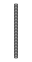

## At a glance

| Detail | Value |
| --- | --- |
| OOMP ID | `electronic_connector_header_2_54_mm_pitch_through_hole_18_pin` |
| Type | Connector |
| Package / style | header |
| Nominal size | 45.72 &#x00D7; 2.48 mm |

## Classification

| Level | Value |
| --- | --- |
| 1 | `electronic` |
| 2 | `connector` |
| 3 | `header` |
| 4 | `2_54_mm_pitch` |
| 5 | `through_hole` |
| 6 | `18_pin` |

## Nominal dimensions

| Measurement | Value |
| --- | ---: |
| Length | 45.72 mm |
| Width | 2.48 mm |

## Identifiers

| Identifier | Value |
| --- | --- |
| Manufacturer part number | `PZ254R-11-18P` |
| LCSC | [`C41413627`](https://www.lcsc.com/product-detail/C41413627.html) |
| LCSC | [`C3294467`](https://www.lcsc.com/product-detail/C3294467.html) |
| LCSC | [`C22465878`](https://www.lcsc.com/product-detail/C22465878.html) |

## Datasheet

[View the datasheet](data/datasheet.pdf)

## Used in projects

| Project | Quantity | References | Explore |
| --- | ---: | --- | --- |
| [Project adafruit/Adafruit-USB-Serial-RGB-Character-Backpack-PCB Adafruit USB Serial Char LCD current](https://github.com/adafruit/Adafruit-USB-Serial-RGB-Character-Backpack-PCB/blob/master/Adafruit%20USB%20Serial%20Char%20LCD.brd) | 1 | JP1 | [Board explorer](https://oomlout.github.io/oomp_electronic_version_5/parts/oomp_project_github_adafruit_adafruit_usb_serial_rgb_character_backpack_pcb_adafruit_usb_serial_char_lcd_current/board_explorer.html) · [OOMP project](https://github.com/oomlout/oomp_electronic_version_5/tree/main/parts/oomp_project_github_adafruit_adafruit_usb_serial_rgb_character_backpack_pcb_adafruit_usb_serial_char_lcd_current) |

## Files

[KiCad symbol, machine-solder and hand-solder footprints](data/kicad/README.md) · [Availability and source masters](data/kicad/manifest.yaml)

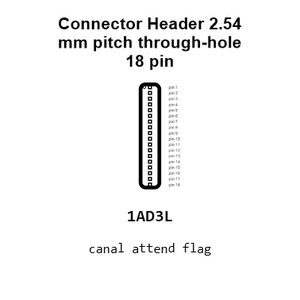

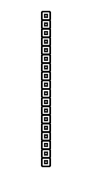

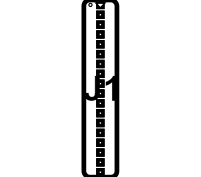

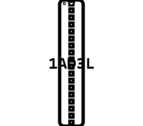

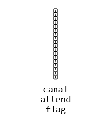

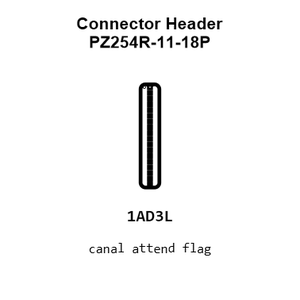

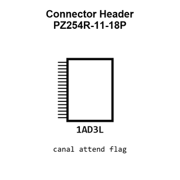

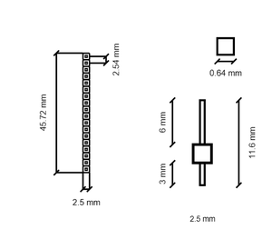

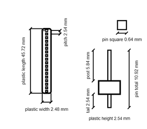

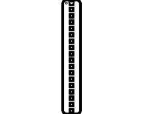

[View this part on GitHub](https://github.com/oomlout/oomp_electronic_version_5/tree/main/parts/electronic_connector_header_2_54_mm_pitch_through_hole_18_pin)

[Browse this category](../../navigation/electronic/connector/header/2_54_mm_pitch/through_hole/README.md)

---

This page is generated from the OOMP part definition by a Roboclick Jinja template. Edit the source taxonomy or template rather than this generated file.