# Connector Header ZX-PZ2.54-1-1PZZ

`electronic_connector_header_2_54_mm_pitch_through_hole_1_pin`

Connector Header ZX-PZ2.54-1-1PZZ is an OOMP electronic connector definition. It uses the header package or form factor. Its nominal drawing size is 2.54 &#x00D7; 2.48 mm.

## At a glance

| Detail | Value |
| --- | --- |
| OOMP ID | `electronic_connector_header_2_54_mm_pitch_through_hole_1_pin` |
| Type | Connector |
| Package / style | header |
| Nominal size | 2.54 &#x00D7; 2.48 mm |

## Classification

| Level | Value |
| --- | --- |
| 1 | `electronic` |
| 2 | `connector` |
| 3 | `header` |
| 4 | `2_54_mm_pitch` |
| 5 | `through_hole` |
| 6 | `1_pin` |

## Nominal dimensions

| Measurement | Value |
| --- | ---: |
| Length | 2.54 mm |
| Width | 2.48 mm |

## Identifiers

| Identifier | Value |
| --- | --- |
| Manufacturer part number | `ZX-PZ2.54-1-1PZZ` |
| LCSC | [`C7501259`](https://www.lcsc.com/product-detail/C7501259.html) |
| LCSC | [`C54950614`](https://www.lcsc.com/product-detail/C54950614.html) |
| LCSC | [`C27985186`](https://www.lcsc.com/product-detail/C27985186.html) |

## Datasheet

[View the datasheet](data/datasheet.pdf)

## Used in projects

| Project | Quantity | References | Explore |
| --- | ---: | --- | --- |
| [Project adafruit/Adafruit-1.8-TFT-Shield-PCB Adafruit 1.8 TFTshield current](https://github.com/adafruit/Adafruit-1.8-TFT-Shield-PCB/blob/master/Adafruit%201.8%20TFTshield.brd) | 2 | BACKLITE0, NAV0 | [Board explorer](https://oomlout.github.io/oomp_electronic_version_5/parts/oomp_project_github_adafruit_adafruit_1_8_tft_shield_pcb_adafruit_1_8_tftshield_current/board_explorer.html) · [OOMP project](https://github.com/oomlout/oomp_electronic_version_5/tree/main/parts/oomp_project_github_adafruit_adafruit_1_8_tft_shield_pcb_adafruit_1_8_tftshield_current) |
| [Project adafruit/Adafruit-5-HDMI-Backpack-PCB Adafruit 5in HDMI Backpack current](https://github.com/adafruit/Adafruit-5-HDMI-Backpack-PCB/blob/master/Adafruit%205in%20HDMI%20Backpack.brd) | 7 | BACKLITEPWM0, GND0, JP3, JP4, JP5, JP6, JP7 | [Board explorer](https://oomlout.github.io/oomp_electronic_version_5/parts/oomp_project_github_adafruit_adafruit_5_hdmi_backpack_pcb_adafruit_5in_hdmi_backpack_current/board_explorer.html) · [OOMP project](https://github.com/oomlout/oomp_electronic_version_5/tree/main/parts/oomp_project_github_adafruit_adafruit_5_hdmi_backpack_pcb_adafruit_5in_hdmi_backpack_current) |
| [Project soldered_electronics/Pressure---temperature-sensor-BMP388-breakout-hardware-design BMP388 Breakout current](https://github.com/SolderedElectronics/Pressure---temperature-sensor-BMP388-breakout-hardware-design) | 1 | K3 | [Board explorer](https://oomlout.github.io/oomp_electronic_version_5/parts/oomp_project_github_soldered_electronics_pressure_temperature_sensor_bmp388_breakout_hardware_design_sensor_pressure_temp_bmp388_current/board_explorer.html) · [OOMP project](https://github.com/oomlout/oomp_electronic_version_5/tree/main/parts/oomp_project_github_soldered_electronics_pressure_temperature_sensor_bmp388_breakout_hardware_design_sensor_pressure_temp_bmp388_current) |
| [Project sparkfun/SparkFun_Triple_Axis_Acclerometer-LIS3DH LIS3DH Qwiic Micro current](https://github.com/sparkfun/SparkFun_Triple_Axis_Acclerometer-LIS3DH/tree/main/Hardware/Micro) | 2 | J1, J5 | [Board explorer](https://oomlout.github.io/oomp_electronic_version_5/parts/oomp_project_github_sparkfun_spark_fun_triple_axis_acclerometer_lis3_dh_lis3dh_qwiic_micro_current/board_explorer.html) · [OOMP project](https://github.com/oomlout/oomp_electronic_version_5/tree/main/parts/oomp_project_github_sparkfun_spark_fun_triple_axis_acclerometer_lis3_dh_lis3dh_qwiic_micro_current) |

## Files

[KiCad symbol, machine-solder and hand-solder footprints](data/kicad/README.md) · [Availability and source masters](data/kicad/manifest.yaml)

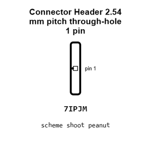

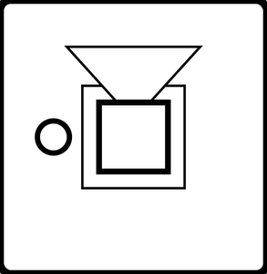

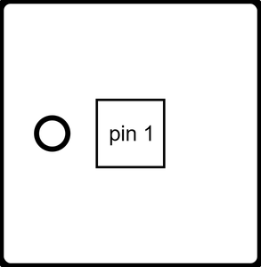

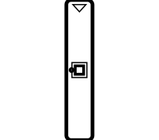

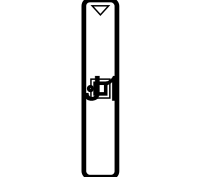

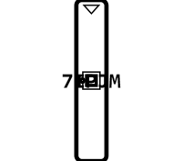

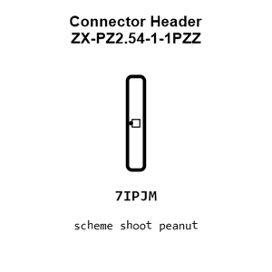

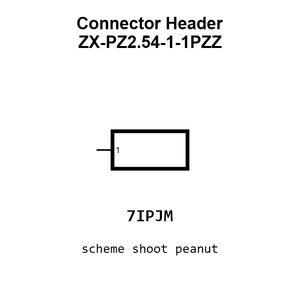

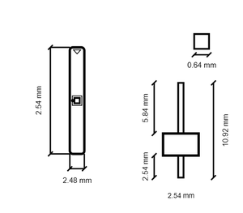

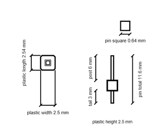

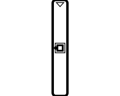

[View this part on GitHub](https://github.com/oomlout/oomp_electronic_version_5/tree/main/parts/electronic_connector_header_2_54_mm_pitch_through_hole_1_pin)

[Browse this category](../../navigation/electronic/connector/header/2_54_mm_pitch/through_hole/README.md)

---

This page is generated from the OOMP part definition by a Roboclick Jinja template. Edit the source taxonomy or template rather than this generated file.