# Connector Header 2.54-1*20P&#x76F4;&#x9488;

`electronic_connector_header_2_54_mm_pitch_through_hole_20_pin`

Connector Header 2.54-1*20P&#x76F4;&#x9488; is an OOMP electronic connector definition. It uses the header package or form factor. Its nominal drawing size is 50.8 &#x00D7; 2.48 mm.

## At a glance

| Detail | Value |
| --- | --- |
| OOMP ID | `electronic_connector_header_2_54_mm_pitch_through_hole_20_pin` |
| Type | Connector |
| Package / style | header |
| Nominal size | 50.8 &#x00D7; 2.48 mm |

## Classification

| Level | Value |
| --- | --- |
| 1 | `electronic` |
| 2 | `connector` |
| 3 | `header` |
| 4 | `2_54_mm_pitch` |
| 5 | `through_hole` |
| 6 | `20_pin` |

## Nominal dimensions

| Measurement | Value |
| --- | ---: |
| Length | 50.8 mm |
| Width | 2.48 mm |

## Identifiers

| Identifier | Value |
| --- | --- |
| Manufacturer part number | `2.54-1*20P&#x76F4;&#x9488;` |
| LCSC | [`C50981`](https://www.lcsc.com/product-detail/C50981.html) |
| LCSC | [`C3294468`](https://www.lcsc.com/product-detail/C3294468.html) |
| LCSC | [`C7501591`](https://www.lcsc.com/product-detail/C7501591.html) |

## Datasheet

[View the datasheet](data/datasheet.pdf)

## Used in projects

| Project | Quantity | References | Explore |
| --- | ---: | --- | --- |
| [Project adafruit/2.8-TFT-Breakout-PCB Adafruit 2.8 TFT Breakout current](https://github.com/adafruit/2.8-TFT-Breakout-PCB/blob/master/Adafruit%202.8%20TFT%20Breakout%20v2.brd) | 2 | JP1, JP2 | [Board explorer](https://oomlout.github.io/oomp_electronic_version_5/parts/oomp_project_github_adafruit_2_8_tft_breakout_pcb_adafruit_2_8_tft_breakout_current/board_explorer.html) · [OOMP project](https://github.com/oomlout/oomp_electronic_version_5/tree/main/parts/oomp_project_github_adafruit_2_8_tft_breakout_pcb_adafruit_2_8_tft_breakout_current) |
| [Project adafruit/Adafruit-2.8-TFT-with-Capacitive-Touch-PCB Adafruit 2.8 inch TFT w Capacitive Touch current](https://github.com/adafruit/Adafruit-2.8-TFT-with-Capacitive-Touch-PCB/blob/master/Adafruit%202.8%20inch%20TFT%20w%20Capacitive%20Touch.brd) | 2 | JP1, JP2 | [Board explorer](https://oomlout.github.io/oomp_electronic_version_5/parts/oomp_project_github_adafruit_adafruit_2_8_tft_with_capacitive_touch_pcb_adafruit_2_8_inch_tft_w_capacitive_touch_current/board_explorer.html) · [OOMP project](https://github.com/oomlout/oomp_electronic_version_5/tree/main/parts/oomp_project_github_adafruit_adafruit_2_8_tft_with_capacitive_touch_pcb_adafruit_2_8_inch_tft_w_capacitive_touch_current) |
| [Project hanqaqa/easyduino Raspberry Pi Pico 2040 current](https://github.com/Hanqaqa/Easyduino/tree/master/Raspberry%20Pi%20Pico%202040) | 2 | J3, J4 | [Board explorer](https://oomlout.github.io/oomp_electronic_version_5/parts/oomp_project_github_hanqaqa_easyduino_raspberry_pi_pico_2040_current/board_explorer.html) · [OOMP project](https://github.com/oomlout/oomp_electronic_version_5/tree/main/parts/oomp_project_github_hanqaqa_easyduino_raspberry_pi_pico_2040_current) |
| [Project hanqaqa/easyduino STM32F103 Bluepill current](https://github.com/Hanqaqa/Easyduino/tree/master/STM32F103%20Bluepill) | 2 | J2, J3 | [Board explorer](https://oomlout.github.io/oomp_electronic_version_5/parts/oomp_project_github_hanqaqa_easyduino_stm32f103_bluepill_current/board_explorer.html) · [OOMP project](https://github.com/oomlout/oomp_electronic_version_5/tree/main/parts/oomp_project_github_hanqaqa_easyduino_stm32f103_bluepill_current) |

## Files

[KiCad symbol, machine-solder and hand-solder footprints](data/kicad/README.md) · [Availability and source masters](data/kicad/manifest.yaml)

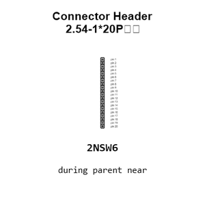

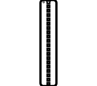

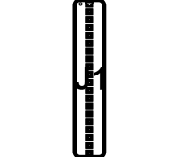

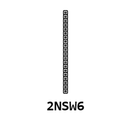

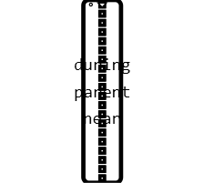

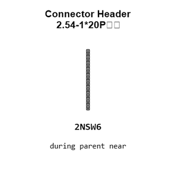

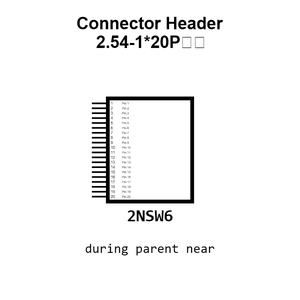

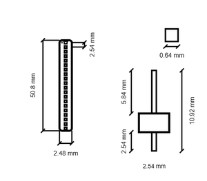

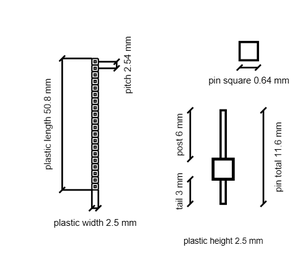

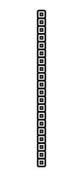

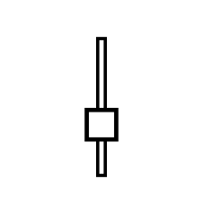

[View this part on GitHub](https://github.com/oomlout/oomp_electronic_version_5/tree/main/parts/electronic_connector_header_2_54_mm_pitch_through_hole_20_pin)

[Browse this category](../../navigation/electronic/connector/header/2_54_mm_pitch/through_hole/README.md)

---

This page is generated from the OOMP part definition by a Roboclick Jinja template. Edit the source taxonomy or template rather than this generated file.