# Connector Header X6511WR-23H-C60D30R2

`electronic_connector_header_2_54_mm_pitch_through_hole_23_pin`

Connector Header X6511WR-23H-C60D30R2 is an OOMP electronic connector definition. It uses the header package or form factor. Its nominal drawing size is 58.42 &#x00D7; 2.48 mm.

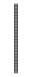

## At a glance

| Detail | Value |
| --- | --- |
| OOMP ID | `electronic_connector_header_2_54_mm_pitch_through_hole_23_pin` |
| Type | Connector |
| Package / style | header |
| Nominal size | 58.42 &#x00D7; 2.48 mm |

## Classification

| Level | Value |
| --- | --- |
| 1 | `electronic` |
| 2 | `connector` |
| 3 | `header` |
| 4 | `2_54_mm_pitch` |
| 5 | `through_hole` |
| 6 | `23_pin` |

## Nominal dimensions

| Measurement | Value |
| --- | ---: |
| Length | 58.42 mm |
| Width | 2.48 mm |

## Identifiers

| Identifier | Value |
| --- | --- |
| Manufacturer part number | `X6511WR-23H-C60D30R2` |
| LCSC | [`C725915`](https://www.lcsc.com/product-detail/C725915.html) |
| LCSC | [`C49423295`](https://www.lcsc.com/product-detail/C49423295.html) |
| LCSC | [`C19154736`](https://www.lcsc.com/product-detail/C19154736.html) |

## Datasheet

[View the datasheet](data/datasheet.pdf)

## Used in projects

| Project | Quantity | References | Explore |
| --- | ---: | --- | --- |
| [Project adafruit/Adafruit-BeagleBone-ProtoBoard-PCB Adafruit Beagle Bone Proto Board current](https://github.com/adafruit/Adafruit-BeagleBone-ProtoBoard-PCB/blob/master/Adafruit-BeagleBone-ProtoBoard-v0.1.brd) | 4 | JP1, JP2, JP3, JP4 | [Board explorer](https://oomlout.github.io/oomp_electronic_version_5/parts/oomp_project_github_adafruit_adafruit_beagle_bone_proto_board_pcb_adafruit_beagle_bone_proto_board_current/board_explorer.html) · [OOMP project](https://github.com/oomlout/oomp_electronic_version_5/tree/main/parts/oomp_project_github_adafruit_adafruit_beagle_bone_proto_board_pcb_adafruit_beagle_bone_proto_board_current) |
| [Project adafruit/Adafruit-I2S-Audio-Bonnet-for-Raspberry-Pi-PCB Adafruit I2 S Audio UDA1334 Bonnet current](https://github.com/adafruit/Adafruit-I2S-Audio-Bonnet-for-Raspberry-Pi-PCB/blob/master/Adafruit%20I2S%20Audio%20UDA1334%20Bonnet.brd) | 1 | JP4 | [Board explorer](https://oomlout.github.io/oomp_electronic_version_5/parts/oomp_project_github_adafruit_adafruit_i2_s_audio_bonnet_for_raspberry_pi_pcb_adafruit_i2_s_audio_uda1334_bonnet_current/board_explorer.html) · [OOMP project](https://github.com/oomlout/oomp_electronic_version_5/tree/main/parts/oomp_project_github_adafruit_adafruit_i2_s_audio_bonnet_for_raspberry_pi_pcb_adafruit_i2_s_audio_uda1334_bonnet_current) |

## Files

[KiCad symbol, machine-solder and hand-solder footprints](data/kicad/README.md) · [Availability and source masters](data/kicad/manifest.yaml)

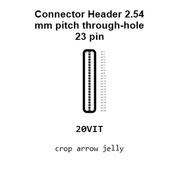

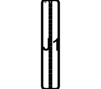

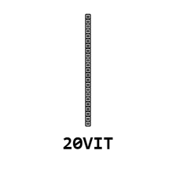

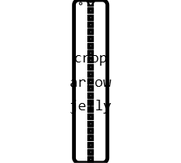

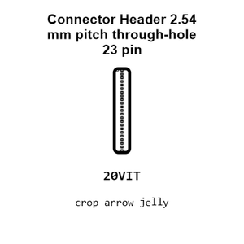

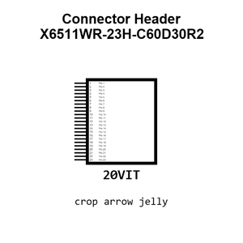

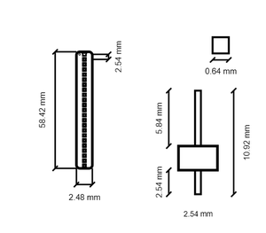

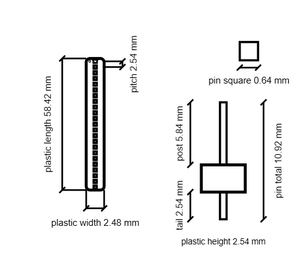

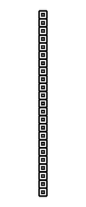

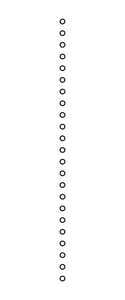

[View this part on GitHub](https://github.com/oomlout/oomp_electronic_version_5/tree/main/parts/electronic_connector_header_2_54_mm_pitch_through_hole_23_pin)

[Browse this category](../../navigation/electronic/connector/header/2_54_mm_pitch/through_hole/README.md)

---

This page is generated from the OOMP part definition by a Roboclick Jinja template. Edit the source taxonomy or template rather than this generated file.