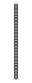
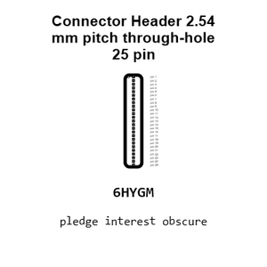
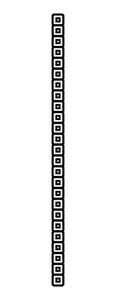
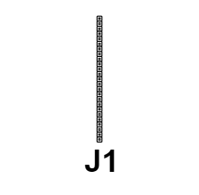
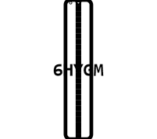
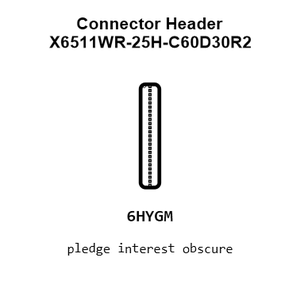
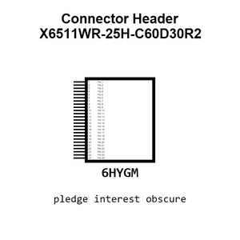
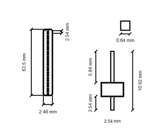
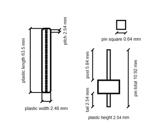
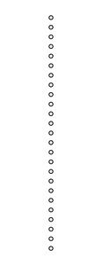

# Connector Header X6511WR-25H-C60D30R2

`electronic_connector_header_2_54_mm_pitch_through_hole_25_pin`

Connector Header X6511WR-25H-C60D30R2 is an OOMP electronic connector definition. It uses the header package or form factor. Its nominal drawing size is 63.5 &#x00D7; 2.48 mm.

## At a glance

| Detail | Value |
| --- | --- |
| OOMP ID | `electronic_connector_header_2_54_mm_pitch_through_hole_25_pin` |
| Type | Connector |
| Package / style | header |
| Nominal size | 63.5 &#x00D7; 2.48 mm |

## Classification

| Level | Value |
| --- | --- |
| 1 | `electronic` |
| 2 | `connector` |
| 3 | `header` |
| 4 | `2_54_mm_pitch` |
| 5 | `through_hole` |
| 6 | `25_pin` |

## Nominal dimensions

| Measurement | Value |
| --- | ---: |
| Length | 63.5 mm |
| Width | 2.48 mm |

## Identifiers

| Identifier | Value |
| --- | --- |
| Manufacturer part number | `X6511WR-25H-C60D30R2` |
| LCSC | [`C2883713`](https://www.lcsc.com/product-detail/C2883713.html) |
| LCSC | [`C725957`](https://www.lcsc.com/product-detail/C725957.html) |
| LCSC | [`C22465883`](https://www.lcsc.com/product-detail/C22465883.html) |

## Datasheet

[View the datasheet](data/datasheet.pdf)

## Used in projects

| Project | Quantity | References | Explore |
| --- | ---: | --- | --- |
| [Project adafruit/Adafruit-Animated-Eyes-Bonnet-PCB Adafruit Eyes Bonnet current](https://github.com/adafruit/Adafruit-Animated-Eyes-Bonnet-PCB/blob/master/Adafruit%20Eyes%20Bonnet.brd) | 1 | CONN1 | [Board explorer](https://oomlout.github.io/oomp_electronic_version_5/parts/oomp_project_github_adafruit_adafruit_animated_eyes_bonnet_pcb_adafruit_eyes_bonnet_current/board_explorer.html) · [OOMP project](https://github.com/oomlout/oomp_electronic_version_5/tree/main/parts/oomp_project_github_adafruit_adafruit_animated_eyes_bonnet_pcb_adafruit_eyes_bonnet_current) |
| [Project adafruit/Adafruit-BrainCraft-HAT-PCB Adafruit Brain Craft HAT current](https://github.com/adafruit/Adafruit-BrainCraft-HAT-PCB/blob/main/Adafruit%20BrainCraft%20HAT.brd) | 1 | CONN1 | [Board explorer](https://oomlout.github.io/oomp_electronic_version_5/parts/oomp_project_github_adafruit_adafruit_brain_craft_hat_pcb_adafruit_brain_craft_hat_current/board_explorer.html) · [OOMP project](https://github.com/oomlout/oomp_electronic_version_5/tree/main/parts/oomp_project_github_adafruit_adafruit_brain_craft_hat_pcb_adafruit_brain_craft_hat_current) |
| [Project adafruit/Adafruit-DC-Stepper-Motor-HAT-PCB Adafruit Motor Bonnet current](https://github.com/adafruit/Adafruit-DC-Stepper-Motor-HAT-PCB/blob/master/Adafruit%20Motor%20Bonnet%20Rev%20B.brd) | 1 | CONN1 | [Board explorer](https://oomlout.github.io/oomp_electronic_version_5/parts/oomp_project_github_adafruit_adafruit_dc_stepper_motor_hat_pcb_adafruit_motor_bonnet_current/board_explorer.html) · [OOMP project](https://github.com/oomlout/oomp_electronic_version_5/tree/main/parts/oomp_project_github_adafruit_adafruit_dc_stepper_motor_hat_pcb_adafruit_motor_bonnet_current) |
| [Project adafruit/Adafruit-DC-Stepper-Motor-HAT-PCB Adafruit Motor HAT current](https://github.com/adafruit/Adafruit-DC-Stepper-Motor-HAT-PCB/blob/master/Adafruit%20Motor%20HAT%20rev%20A.brd) | 1 | CONN1 | [Board explorer](https://oomlout.github.io/oomp_electronic_version_5/parts/oomp_project_github_adafruit_adafruit_dc_stepper_motor_hat_pcb_adafruit_motor_hat_current/board_explorer.html) · [OOMP project](https://github.com/oomlout/oomp_electronic_version_5/tree/main/parts/oomp_project_github_adafruit_adafruit_dc_stepper_motor_hat_pcb_adafruit_motor_hat_current) |
| [Project adafruit/Adafruit-FPC-SMT-Adapter-PCBs 50 pin 0.5mm FPC current](https://github.com/adafruit/Adafruit-FPC-SMT-Adapter-PCBs/blob/master/50%20pin%200.5mm%20FPC.brd) | 1 | CONN3 | [Board explorer](https://oomlout.github.io/oomp_electronic_version_5/parts/oomp_project_github_adafruit_adafruit_fpc_smt_adapter_pcbs_50_pin_0_5mm_fpc_current/board_explorer.html) · [OOMP project](https://github.com/oomlout/oomp_electronic_version_5/tree/main/parts/oomp_project_github_adafruit_adafruit_fpc_smt_adapter_pcbs_50_pin_0_5mm_fpc_current) |
| [Project adafruit/Adafruit-Perma-Proto-HAT-PCB Adafruit Ha D Proto HAT current](https://github.com/adafruit/Adafruit-Perma-Proto-HAT-PCB/blob/master/Adafruit%20HaD%20Proto%20HAT%20rev%20A.brd) | 1 | CONN1 | [Board explorer](https://oomlout.github.io/oomp_electronic_version_5/parts/oomp_project_github_adafruit_adafruit_perma_proto_hat_pcb_adafruit_ha_d_proto_hat_current/board_explorer.html) · [OOMP project](https://github.com/oomlout/oomp_electronic_version_5/tree/main/parts/oomp_project_github_adafruit_adafruit_perma_proto_hat_pcb_adafruit_ha_d_proto_hat_current) |
| [Project adafruit/Adafruit-PiTFT-2.2-Inch-HAT-PCB Adafruit 2.2in TFT HAT current](https://github.com/adafruit/Adafruit-PiTFT-2.2-Inch-HAT-PCB/blob/master/Adafruit%202.2in%20TFT%20HAT%20rev%20B.brd) | 1 | CONN1 | [Board explorer](https://oomlout.github.io/oomp_electronic_version_5/parts/oomp_project_github_adafruit_adafruit_pi_tft_2_2_inch_hat_pcb_adafruit_2_2in_tft_hat_current/board_explorer.html) · [OOMP project](https://github.com/oomlout/oomp_electronic_version_5/tree/main/parts/oomp_project_github_adafruit_adafruit_pi_tft_2_2_inch_hat_pcb_adafruit_2_2in_tft_hat_current) |
| [Project adafruit/Adafruit-RGB-Matrix-HAT-PCB Adafruit RGB Matrix HAT current](https://github.com/adafruit/Adafruit-RGB-Matrix-HAT-PCB/blob/master/Adafruit%20RGB%20Matrix%20HAT.brd) | 1 | CONN1 | [Board explorer](https://oomlout.github.io/oomp_electronic_version_5/parts/oomp_project_github_adafruit_adafruit_rgb_matrix_hat_pcb_adafruit_rgb_matrix_hat_current/board_explorer.html) · [OOMP project](https://github.com/oomlout/oomp_electronic_version_5/tree/main/parts/oomp_project_github_adafruit_adafruit_rgb_matrix_hat_pcb_adafruit_rgb_matrix_hat_current) |
| [Project adafruit/Adafruit-Servo-HAT-Bonnet-PCB Adafruit Servo HAT current](https://github.com/adafruit/Adafruit-Servo-HAT-Bonnet-PCB/blob/master/Adafruit%20Servo%20HAT%20rev%20A.brd) | 1 | CONN1 | [Board explorer](https://oomlout.github.io/oomp_electronic_version_5/parts/oomp_project_github_adafruit_adafruit_servo_hat_bonnet_pcb_adafruit_servo_hat_current/board_explorer.html) · [OOMP project](https://github.com/oomlout/oomp_electronic_version_5/tree/main/parts/oomp_project_github_adafruit_adafruit_servo_hat_bonnet_pcb_adafruit_servo_hat_current) |
| [Project adafruit/Adafruit-Servo-HAT-Bonnet-PCB Servo Bonnet current](https://github.com/adafruit/Adafruit-Servo-HAT-Bonnet-PCB/blob/master/Servo%20Bonnet%20rev%20B.brd) | 1 | CONN1 | [Board explorer](https://oomlout.github.io/oomp_electronic_version_5/parts/oomp_project_github_adafruit_adafruit_servo_hat_bonnet_pcb_servo_bonnet_current/board_explorer.html) · [OOMP project](https://github.com/oomlout/oomp_electronic_version_5/tree/main/parts/oomp_project_github_adafruit_adafruit_servo_hat_bonnet_pcb_servo_bonnet_current) |
| [Project adafruit/Adafruit-Ultimate-GPS-HAT-PCB Adafruit Ultimate GPS HAT current](https://github.com/adafruit/Adafruit-Ultimate-GPS-HAT-PCB/blob/master/Adafruit%20Ultimate%20GPS%20HAT.brd) | 1 | CONN1 | [Board explorer](https://oomlout.github.io/oomp_electronic_version_5/parts/oomp_project_github_adafruit_adafruit_ultimate_gps_hat_pcb_adafruit_ultimate_gps_hat_current/board_explorer.html) · [OOMP project](https://github.com/oomlout/oomp_electronic_version_5/tree/main/parts/oomp_project_github_adafruit_adafruit_ultimate_gps_hat_pcb_adafruit_ultimate_gps_hat_current) |

## Files

[KiCad symbol, machine-solder and hand-solder footprints](data/kicad/README.md) · [Availability and source masters](data/kicad/manifest.yaml)

[View this part on GitHub](https://github.com/oomlout/oomp_electronic_version_5/tree/main/parts/electronic_connector_header_2_54_mm_pitch_through_hole_25_pin)

[Browse this category](../../navigation/electronic/connector/header/2_54_mm_pitch/through_hole/README.md)

---

This page is generated from the OOMP part definition by a Roboclick Jinja template. Edit the source taxonomy or template rather than this generated file.