# Connector Header PZ254V-11-02P

`electronic_connector_header_2_54_mm_pitch_through_hole_2_pin`

Connector Header PZ254V-11-02P is an OOMP electronic connector definition. It uses the header package or form factor. Its nominal drawing size is 5.08 &#x00D7; 2.48 mm.

## At a glance

| Detail | Value |
| --- | --- |
| OOMP ID | `electronic_connector_header_2_54_mm_pitch_through_hole_2_pin` |
| Type | Connector |
| Package / style | header |
| Nominal size | 5.08 &#x00D7; 2.48 mm |

## Classification

| Level | Value |
| --- | --- |
| 1 | `electronic` |
| 2 | `connector` |
| 3 | `header` |
| 4 | `2_54_mm_pitch` |
| 5 | `through_hole` |
| 6 | `2_pin` |

## Nominal dimensions

| Measurement | Value |
| --- | ---: |
| Length | 5.08 mm |
| Width | 2.48 mm |

## Identifiers

| Identifier | Value |
| --- | --- |
| Manufacturer part number | `PZ254V-11-02P` |
| LCSC | [`C492401`](https://www.lcsc.com/product-detail/C492401.html) |
| LCSC | [`C7429632`](https://www.lcsc.com/product-detail/C7429632.html) |
| LCSC | [`C7501273`](https://www.lcsc.com/product-detail/C7501273.html) |

## Used in projects

| Project | Quantity | References | Explore |
| --- | ---: | --- | --- |
| [Project hanqaqa/easyduino ATmega328P Arduino Uno current](https://github.com/Hanqaqa/Easyduino/tree/master/Atmega328p%20Arduino%20Uno) | 1 | J2 | [Board explorer](https://oomlout.github.io/oomp_electronic_version_5/parts/oomp_project_github_hanqaqa_easyduino_atmega328p_arduino_uno_current/board_explorer.html) · [OOMP project](https://github.com/oomlout/oomp_electronic_version_5/tree/main/parts/oomp_project_github_hanqaqa_easyduino_atmega328p_arduino_uno_current) |
| [Project sparkfun/SparkFun_Qwiic_ADC_ADS1219 Qwiic ADC ADS1219 current](https://github.com/sparkfun/SparkFun_Qwiic_ADC_ADS1219) | 1 | J5 | [Board explorer](https://oomlout.github.io/oomp_electronic_version_5/parts/oomp_project_github_sparkfun_spark_fun_qwiic_adc_ads1219_qwiic_adc_ads1219_current/board_explorer.html) · [OOMP project](https://github.com/oomlout/oomp_electronic_version_5/tree/main/parts/oomp_project_github_sparkfun_spark_fun_qwiic_adc_ads1219_qwiic_adc_ads1219_current) |

## Files

[KiCad symbol, machine-solder and hand-solder footprints](data/kicad/README.md) · [Availability and source masters](data/kicad/manifest.yaml)

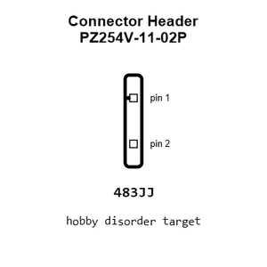

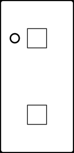

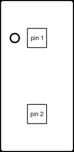

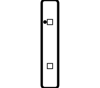

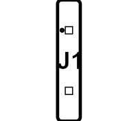

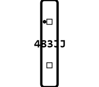

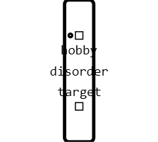

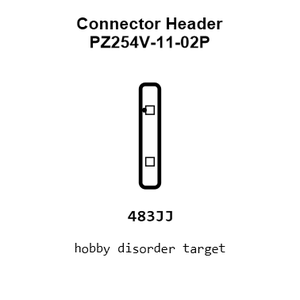

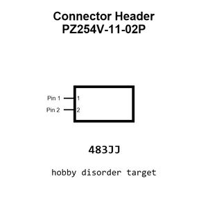

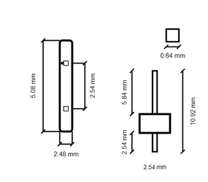

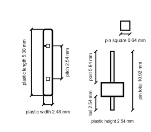

[View this part on GitHub](https://github.com/oomlout/oomp_electronic_version_5/tree/main/parts/electronic_connector_header_2_54_mm_pitch_through_hole_2_pin)

[Browse this category](../../navigation/electronic/connector/header/2_54_mm_pitch/through_hole/README.md)

---

This page is generated from the OOMP part definition by a Roboclick Jinja template. Edit the source taxonomy or template rather than this generated file.