# Connector Header 2.54-1*3P&#x9488;

`electronic_connector_header_2_54_mm_pitch_through_hole_3_pin`

Connector Header 2.54-1*3P&#x9488; is an OOMP electronic connector definition. It uses the header package or form factor. Its nominal drawing size is 7.62 &#x00D7; 2.48 mm.

## At a glance

| Detail | Value |
| --- | --- |
| OOMP ID | `electronic_connector_header_2_54_mm_pitch_through_hole_3_pin` |
| Type | Connector |
| Package / style | header |
| Nominal size | 7.62 &#x00D7; 2.48 mm |

## Classification

| Level | Value |
| --- | --- |
| 1 | `electronic` |
| 2 | `connector` |
| 3 | `header` |
| 4 | `2_54_mm_pitch` |
| 5 | `through_hole` |
| 6 | `3_pin` |

## Nominal dimensions

| Measurement | Value |
| --- | ---: |
| Length | 7.62 mm |
| Width | 2.48 mm |

## Identifiers

| Identifier | Value |
| --- | --- |
| Manufacturer part number | `2.54-1*3P&#x9488;` |
| LCSC | [`C49257`](https://www.lcsc.com/product-detail/C49257.html) |
| LCSC | [`C7429633`](https://www.lcsc.com/product-detail/C7429633.html) |
| LCSC | [`C7429672`](https://www.lcsc.com/product-detail/C7429672.html) |

## Datasheet

[View the datasheet](data/datasheet.pdf)

## Used in projects

| Project | Quantity | References | Explore |
| --- | ---: | --- | --- |
| [Project adafruit/Adafruit-Animated-Eyes-Bonnet-PCB Adafruit Eyes Bonnet current](https://github.com/adafruit/Adafruit-Animated-Eyes-Bonnet-PCB/blob/master/Adafruit%20Eyes%20Bonnet.brd) | 3 | JP5, JP6, JP7 | [Board explorer](https://oomlout.github.io/oomp_electronic_version_5/parts/oomp_project_github_adafruit_adafruit_animated_eyes_bonnet_pcb_adafruit_eyes_bonnet_current/board_explorer.html) · [OOMP project](https://github.com/oomlout/oomp_electronic_version_5/tree/main/parts/oomp_project_github_adafruit_adafruit_animated_eyes_bonnet_pcb_adafruit_eyes_bonnet_current) |
| [Project adafruit/Adafruit-BeagleBone-ProtoBoard-PCB Adafruit Beagle Bone Proto Board current](https://github.com/adafruit/Adafruit-BeagleBone-ProtoBoard-PCB/blob/master/Adafruit-BeagleBone-ProtoBoard-v0.1.brd) | 2 | JP34, JP35 | [Board explorer](https://oomlout.github.io/oomp_electronic_version_5/parts/oomp_project_github_adafruit_adafruit_beagle_bone_proto_board_pcb_adafruit_beagle_bone_proto_board_current/board_explorer.html) · [OOMP project](https://github.com/oomlout/oomp_electronic_version_5/tree/main/parts/oomp_project_github_adafruit_adafruit_beagle_bone_proto_board_pcb_adafruit_beagle_bone_proto_board_current) |
| [Project adafruit/Adafruit-bq25185-with-3.3V-Buck-PCB Adafruit bq25185 with 3.3 V Output current](https://github.com/adafruit/Adafruit-bq25185-with-3.3V-Buck-PCB/blob/main/Adafruit%20bq25185%20with%203.3V%20Output.brd) | 1 | JP2 | [Board explorer](https://oomlout.github.io/oomp_electronic_version_5/parts/oomp_project_github_adafruit_adafruit_bq25185_with_3_3_v_buck_pcb_adafruit_bq25185_with_3_3_v_output_current/board_explorer.html) · [OOMP project](https://github.com/oomlout/oomp_electronic_version_5/tree/main/parts/oomp_project_github_adafruit_adafruit_bq25185_with_3_3_v_buck_pcb_adafruit_bq25185_with_3_3_v_output_current) |
| [Project adafruit/Adafruit-BrainCraft-HAT-PCB Adafruit Brain Craft HAT current](https://github.com/adafruit/Adafruit-BrainCraft-HAT-PCB/blob/main/Adafruit%20BrainCraft%20HAT.brd) | 2 | JP4, JP5 | [Board explorer](https://oomlout.github.io/oomp_electronic_version_5/parts/oomp_project_github_adafruit_adafruit_brain_craft_hat_pcb_adafruit_brain_craft_hat_current/board_explorer.html) · [OOMP project](https://github.com/oomlout/oomp_electronic_version_5/tree/main/parts/oomp_project_github_adafruit_adafruit_brain_craft_hat_pcb_adafruit_brain_craft_hat_current) |
| [Project adafruit/Adafruit_Breadboard_NeoPixel_PCB Adafruit Breadboard Neo Pixel current](https://github.com/adafruit/Adafruit_Breadboard_NeoPixel_PCB/blob/master/Adafruit_Breadboard_NeoPixel.brd) | 2 | JP1, JP2 | [Board explorer](https://oomlout.github.io/oomp_electronic_version_5/parts/oomp_project_github_adafruit_adafruit_breadboard_neo_pixel_pcb_adafruit_breadboard_neo_pixel_current/board_explorer.html) · [OOMP project](https://github.com/oomlout/oomp_electronic_version_5/tree/main/parts/oomp_project_github_adafruit_adafruit_breadboard_neo_pixel_pcb_adafruit_breadboard_neo_pixel_current) |
| [Project adafruit/Adafruit-Feather-M0-RFM-LoRa-PCB Adafruit Feather M0 RFMxx current](https://github.com/adafruit/Adafruit-Feather-M0-RFM-LoRa-PCB/blob/master/Adafruit%20Feather%20M0%20RFMxx.brd) | 1 | JP5 | [Board explorer](https://oomlout.github.io/oomp_electronic_version_5/parts/oomp_project_github_adafruit_adafruit_feather_m0_rfm_lo_ra_pcb_adafruit_feather_m0_rfmxx_current/board_explorer.html) · [OOMP project](https://github.com/oomlout/oomp_electronic_version_5/tree/main/parts/oomp_project_github_adafruit_adafruit_feather_m0_rfm_lo_ra_pcb_adafruit_feather_m0_rfmxx_current) |
| [Project adafruit/Adafruit-GUVA-Analog-UV-Sensor-Breakout-PCB Adafruit GUVA UV Sensor Breakout current](https://github.com/adafruit/Adafruit-GUVA-Analog-UV-Sensor-Breakout-PCB/blob/master/Adafruit%20GUVA%20UV%20Sensor%20Breakout.brd) | 1 | JP2 | [Board explorer](https://oomlout.github.io/oomp_electronic_version_5/parts/oomp_project_github_adafruit_adafruit_guva_analog_uv_sensor_breakout_pcb_adafruit_guva_uv_sensor_breakout_current/board_explorer.html) · [OOMP project](https://github.com/oomlout/oomp_electronic_version_5/tree/main/parts/oomp_project_github_adafruit_adafruit_guva_analog_uv_sensor_breakout_pcb_adafruit_guva_uv_sensor_breakout_current) |
| [Project adafruit/Adafruit-High-Power-Infrared-LED-Emitter-PCB IR STEMMA LED Emitter current](https://github.com/adafruit/Adafruit-High-Power-Infrared-LED-Emitter-PCB/blob/main/IR%20STEMMA%20LED%20Emitter.brd) | 2 | JP1, JP2 | [Board explorer](https://oomlout.github.io/oomp_electronic_version_5/parts/oomp_project_github_adafruit_adafruit_high_power_infrared_led_emitter_pcb_ir_stemma_led_emitter_current/board_explorer.html) · [OOMP project](https://github.com/oomlout/oomp_electronic_version_5/tree/main/parts/oomp_project_github_adafruit_adafruit_high_power_infrared_led_emitter_pcb_ir_stemma_led_emitter_current) |
| [Project adafruit/Adafruit-High-Voltage-UPDI-Friend-PCB Adafruit High Voltage UPDI Friend current](https://github.com/adafruit/Adafruit-High-Voltage-UPDI-Friend-PCB/blob/main/Adafruit%20High%20Voltage%20UPDI%20Friend.brd) | 1 | JP1 | [Board explorer](https://oomlout.github.io/oomp_electronic_version_5/parts/oomp_project_github_adafruit_adafruit_high_voltage_updi_friend_pcb_adafruit_high_voltage_updi_friend_current/board_explorer.html) · [OOMP project](https://github.com/oomlout/oomp_electronic_version_5/tree/main/parts/oomp_project_github_adafruit_adafruit_high_voltage_updi_friend_pcb_adafruit_high_voltage_updi_friend_current) |
| [Project adafruit/Adafruit-Menta-PCB Menta current](https://github.com/adafruit/Adafruit-Menta-PCB/blob/master/menta.brd) | 1 | PWR_SEL0 | [Board explorer](https://oomlout.github.io/oomp_electronic_version_5/parts/oomp_project_github_adafruit_adafruit_menta_pcb_menta_current/board_explorer.html) · [OOMP project](https://github.com/oomlout/oomp_electronic_version_5/tree/main/parts/oomp_project_github_adafruit_adafruit_menta_pcb_menta_current) |
| [Project adafruit/Adafruit-MicroLipo-PCB Adafruit protrinket backpack current](https://github.com/adafruit/Adafruit-MicroLipo-PCB/blob/master/Adafruit%20protrinket%20backpack.brd) | 1 | JP1 | [Board explorer](https://oomlout.github.io/oomp_electronic_version_5/parts/oomp_project_github_adafruit_adafruit_micro_lipo_pcb_adafruit_protrinket_backpack_current/board_explorer.html) · [OOMP project](https://github.com/oomlout/oomp_electronic_version_5/tree/main/parts/oomp_project_github_adafruit_adafruit_micro_lipo_pcb_adafruit_protrinket_backpack_current) |
| [Project adafruit/Adafruit-MOSFET-Driver-STEMMA-PCB Adafruit MOSFET Driver STEMMA Breakout current](https://github.com/adafruit/Adafruit-MOSFET-Driver-STEMMA-PCB/blob/main/Adafruit%20MOSFET%20Driver%20STEMMA%20Breakout.brd) | 1 | JP1 | [Board explorer](https://oomlout.github.io/oomp_electronic_version_5/parts/oomp_project_github_adafruit_adafruit_mosfet_driver_stemma_pcb_adafruit_mosfet_driver_stemma_breakout_current/board_explorer.html) · [OOMP project](https://github.com/oomlout/oomp_electronic_version_5/tree/main/parts/oomp_project_github_adafruit_adafruit_mosfet_driver_stemma_pcb_adafruit_mosfet_driver_stemma_breakout_current) |
| [Project adafruit/Adafruit-Motor-Shield-V2-PCB Adafruit Motor Shield current](https://github.com/adafruit/Adafruit-Motor-Shield-V2-PCB/blob/master/Adafruit%20Motor%20Shield%20v2.3.brd) | 2 | SERVO1, SERVO2 | [Board explorer](https://oomlout.github.io/oomp_electronic_version_5/parts/oomp_project_github_adafruit_adafruit_motor_shield_v2_pcb_adafruit_motor_shield_current/board_explorer.html) · [OOMP project](https://github.com/oomlout/oomp_electronic_version_5/tree/main/parts/oomp_project_github_adafruit_adafruit_motor_shield_v2_pcb_adafruit_motor_shield_current) |
| [Project adafruit/Adafruit-NeoPixel-8x8-Matrix Adafruit Neo Matrix 8x8 current](https://github.com/adafruit/Adafruit-NeoPixel-8x8-Matrix/blob/master/Adafruit_NeoMatrix_8x8%20v2.brd) | 2 | JP1, JP2 | [Board explorer](https://oomlout.github.io/oomp_electronic_version_5/parts/oomp_project_github_adafruit_adafruit_neo_pixel_8x8_matrix_adafruit_neo_matrix_8x8_current/board_explorer.html) · [OOMP project](https://github.com/oomlout/oomp_electronic_version_5/tree/main/parts/oomp_project_github_adafruit_adafruit_neo_pixel_8x8_matrix_adafruit_neo_matrix_8x8_current) |
| [Project adafruit/Adafruit-NeoPixel-8x8-Matrix Adafruit Neo Matrix 8x8 SK6812 current](https://github.com/adafruit/Adafruit-NeoPixel-8x8-Matrix/blob/master/Adafruit_NeoMatrix_8x8%20SK6812.brd) | 2 | JP1, JP2 | [Board explorer](https://oomlout.github.io/oomp_electronic_version_5/parts/oomp_project_github_adafruit_adafruit_neo_pixel_8x8_matrix_adafruit_neo_matrix_8x8_sk6812_current/board_explorer.html) · [OOMP project](https://github.com/oomlout/oomp_electronic_version_5/tree/main/parts/oomp_project_github_adafruit_adafruit_neo_pixel_8x8_matrix_adafruit_neo_matrix_8x8_sk6812_current) |
| [Project hanqaqa/easyduino Raspberry Pi Pico 2040 current](https://github.com/Hanqaqa/Easyduino/tree/master/Raspberry%20Pi%20Pico%202040) | 1 | J5 | [Board explorer](https://oomlout.github.io/oomp_electronic_version_5/parts/oomp_project_github_hanqaqa_easyduino_raspberry_pi_pico_2040_current/board_explorer.html) · [OOMP project](https://github.com/oomlout/oomp_electronic_version_5/tree/main/parts/oomp_project_github_hanqaqa_easyduino_raspberry_pi_pico_2040_current) |
| [Project soldered_electronics/Air-quality-sensor-MQ135-breakout-qwiic-hardware-design MQ135 Breakout qwiic current](https://github.com/SolderedElectronics/Air-quality-sensor-MQ135-breakout-qwiic-hardware-design) | 1 | K2 | [Board explorer](https://oomlout.github.io/oomp_electronic_version_5/parts/oomp_project_github_soldered_electronics_air_quality_sensor_mq135_breakout_qwiic_hardware_design_sensor_gas_mq135_qwiic_current/board_explorer.html) · [OOMP project](https://github.com/oomlout/oomp_electronic_version_5/tree/main/parts/oomp_project_github_soldered_electronics_air_quality_sensor_mq135_breakout_qwiic_hardware_design_sensor_gas_mq135_qwiic_current) |
| [Project soldered_electronics/Air-quality-sensor-MQ135-breakout-with-easyC-hardware-design MQ135 Breakout easyC current](https://github.com/SolderedElectronics/Air-quality-sensor-MQ135-breakout-with-easyC-hardware-design) | 1 | K2 | [Board explorer](https://oomlout.github.io/oomp_electronic_version_5/parts/oomp_project_github_soldered_electronics_air_quality_sensor_mq135_breakout_with_easy_c_hardware_design_sensor_gas_mq135_easyc_current/board_explorer.html) · [OOMP project](https://github.com/oomlout/oomp_electronic_version_5/tree/main/parts/oomp_project_github_soldered_electronics_air_quality_sensor_mq135_breakout_with_easy_c_hardware_design_sensor_gas_mq135_easyc_current) |
| [Project soldered_electronics/Alcohol--Ethanol-sensor-MQ3-breakout-qwiic-hardware-design MQ3 Breakout qwiic current](https://github.com/SolderedElectronics/Alcohol--Ethanol-sensor-MQ3-breakout-qwiic-hardware-design) | 1 | K2 | [Board explorer](https://oomlout.github.io/oomp_electronic_version_5/parts/oomp_project_github_soldered_electronics_alcohol_ethanol_sensor_mq3_breakout_qwiic_hardware_design_sensor_gas_mq3_qwiic_current/board_explorer.html) · [OOMP project](https://github.com/oomlout/oomp_electronic_version_5/tree/main/parts/oomp_project_github_soldered_electronics_alcohol_ethanol_sensor_mq3_breakout_qwiic_hardware_design_sensor_gas_mq3_qwiic_current) |
| [Project soldered_electronics/Alcohol--Ethanol-sensor-MQ3-breakout-with-easyC-hardware-design MQ3 Breakout easyC current](https://github.com/SolderedElectronics/Alcohol--Ethanol-sensor-MQ3-breakout-with-easyC-hardware-design) | 1 | K2 | [Board explorer](https://oomlout.github.io/oomp_electronic_version_5/parts/oomp_project_github_soldered_electronics_alcohol_ethanol_sensor_mq3_breakout_with_easy_c_hardware_design_sensor_gas_mq3_easyc_current/board_explorer.html) · [OOMP project](https://github.com/oomlout/oomp_electronic_version_5/tree/main/parts/oomp_project_github_soldered_electronics_alcohol_ethanol_sensor_mq3_breakout_with_easy_c_hardware_design_sensor_gas_mq3_easyc_current) |
| [Project soldered_electronics/Ammonia-sensor-MQ137-breakout-qwiic-hardware-design MQ137 Breakout qwiic current](https://github.com/SolderedElectronics/Ammonia-sensor-MQ137-breakout-qwiic-hardware-design) | 1 | K2 | [Board explorer](https://oomlout.github.io/oomp_electronic_version_5/parts/oomp_project_github_soldered_electronics_ammonia_sensor_mq137_breakout_qwiic_hardware_design_sensor_gas_mq137_qwiic_current/board_explorer.html) · [OOMP project](https://github.com/oomlout/oomp_electronic_version_5/tree/main/parts/oomp_project_github_soldered_electronics_ammonia_sensor_mq137_breakout_qwiic_hardware_design_sensor_gas_mq137_qwiic_current) |
| [Project soldered_electronics/Ammonia-sensor-MQ137-breakout-with-easyC-hardware-design MQ137 Breakout easyC current](https://github.com/SolderedElectronics/Ammonia-sensor-MQ137-breakout-with-easyC-hardware-design) | 1 | K2 | [Board explorer](https://oomlout.github.io/oomp_electronic_version_5/parts/oomp_project_github_soldered_electronics_ammonia_sensor_mq137_breakout_with_easy_c_hardware_design_sensor_gas_mq137_easyc_current/board_explorer.html) · [OOMP project](https://github.com/oomlout/oomp_electronic_version_5/tree/main/parts/oomp_project_github_soldered_electronics_ammonia_sensor_mq137_breakout_with_easy_c_hardware_design_sensor_gas_mq137_easyc_current) |
| [Project soldered_electronics/Benzene--Toluene--Acetone--Formaldehyde-sensor-MQ138-breakout-with-easyC-hardware-design MQ138 Breakout easyC current](https://github.com/SolderedElectronics/Benzene--Toluene--Acetone--Formaldehyde-sensor-MQ138-breakout-with-easyC-hardware-design) | 1 | K2 | [Board explorer](https://oomlout.github.io/oomp_electronic_version_5/parts/oomp_project_github_soldered_electronics_benzene_toluene_acetone_formaldehyde_sensor_mq138_breakout_with_easy_c_hardware_design_sensor_gas_mq138_easyc_current/board_explorer.html) · [OOMP project](https://github.com/oomlout/oomp_electronic_version_5/tree/main/parts/oomp_project_github_soldered_electronics_benzene_toluene_acetone_formaldehyde_sensor_mq138_breakout_with_easy_c_hardware_design_sensor_gas_mq138_easyc_current) |
| [Project soldered_electronics/Butane--LPG---Smoke-sensor-MQ2-breakout-qwiic-hardware-design MQ2 Breakout qwiic current](https://github.com/SolderedElectronics/Butane--LPG---Smoke-sensor-MQ2-breakout-qwiic-hardware-design) | 1 | K2 | [Board explorer](https://oomlout.github.io/oomp_electronic_version_5/parts/oomp_project_github_soldered_electronics_butane_lpg_smoke_sensor_mq2_breakout_qwiic_hardware_design_sensor_gas_mq2_qwiic_current/board_explorer.html) · [OOMP project](https://github.com/oomlout/oomp_electronic_version_5/tree/main/parts/oomp_project_github_soldered_electronics_butane_lpg_smoke_sensor_mq2_breakout_qwiic_hardware_design_sensor_gas_mq2_qwiic_current) |
| [Project soldered_electronics/Butane--LPG---Smoke-sensor-MQ2-breakout-with-easyC-hardware-design MQ2 Breakout easyC current](https://github.com/SolderedElectronics/Butane--LPG---Smoke-sensor-MQ2-breakout-qwiic-hardware-design) | 1 | K2 | [Board explorer](https://oomlout.github.io/oomp_electronic_version_5/parts/oomp_project_github_soldered_electronics_butane_lpg_smoke_sensor_mq2_breakout_with_easy_c_hardware_design_sensor_gas_mq2_easyc_current/board_explorer.html) · [OOMP project](https://github.com/oomlout/oomp_electronic_version_5/tree/main/parts/oomp_project_github_soldered_electronics_butane_lpg_smoke_sensor_mq2_breakout_with_easy_c_hardware_design_sensor_gas_mq2_easyc_current) |
| [Project soldered_electronics/Capacitive-soil-sensor-hardware-design Capacitive Soil Sensor current](https://github.com/SolderedElectronics/Capacitive-soil-sensor-hardware-design) | 1 | K1 | [Board explorer](https://oomlout.github.io/oomp_electronic_version_5/parts/oomp_project_github_soldered_electronics_capacitive_soil_sensor_hardware_design_sensor_capacitive_soil_current/board_explorer.html) · [OOMP project](https://github.com/oomlout/oomp_electronic_version_5/tree/main/parts/oomp_project_github_soldered_electronics_capacitive_soil_sensor_hardware_design_sensor_capacitive_soil_current) |
| [Project soldered_electronics/CO--flammable-gasses-sensor-MQ9-breakout-qwiic-hardware-design MQ9 Breakout qwiic current](https://github.com/SolderedElectronics/CO--flammable-gasses-sensor-MQ9-breakout-qwiic-hardware-design) | 1 | K2 | [Board explorer](https://oomlout.github.io/oomp_electronic_version_5/parts/oomp_project_github_soldered_electronics_co_flammable_gasses_sensor_mq9_breakout_qwiic_hardware_design_sensor_gas_mq9_qwiic_current/board_explorer.html) · [OOMP project](https://github.com/oomlout/oomp_electronic_version_5/tree/main/parts/oomp_project_github_soldered_electronics_co_flammable_gasses_sensor_mq9_breakout_qwiic_hardware_design_sensor_gas_mq9_qwiic_current) |
| [Project soldered_electronics/CO--flammable-gasses-sensor-MQ9-breakout-with-easyC-hardware-design MQ9 Breakout easyC current](https://github.com/SolderedElectronics/CO--flammable-gasses-sensor-MQ9-breakout-with-easyC-hardware-design) | 1 | K2 | [Board explorer](https://oomlout.github.io/oomp_electronic_version_5/parts/oomp_project_github_soldered_electronics_co_flammable_gasses_sensor_mq9_breakout_with_easy_c_hardware_design_sensor_gas_mq9_easyc_current/board_explorer.html) · [OOMP project](https://github.com/oomlout/oomp_electronic_version_5/tree/main/parts/oomp_project_github_soldered_electronics_co_flammable_gasses_sensor_mq9_breakout_with_easy_c_hardware_design_sensor_gas_mq9_easyc_current) |
| [Project soldered_electronics/CO-sensor-MQ7-breakout-qwiic-hardware-design MQ7 Breakout qwiic current](https://github.com/SolderedElectronics/CO-sensor-MQ7-breakout-qwiic-hardware-design) | 1 | K2 | [Board explorer](https://oomlout.github.io/oomp_electronic_version_5/parts/oomp_project_github_soldered_electronics_co_sensor_mq7_breakout_qwiic_hardware_design_sensor_gas_mq7_qwiic_current/board_explorer.html) · [OOMP project](https://github.com/oomlout/oomp_electronic_version_5/tree/main/parts/oomp_project_github_soldered_electronics_co_sensor_mq7_breakout_qwiic_hardware_design_sensor_gas_mq7_qwiic_current) |
| [Project soldered_electronics/CO-sensor-MQ7-breakout-with-easyC-hardware-design MQ7 Breakout easyC current](https://github.com/SolderedElectronics/CO-sensor-MQ7-breakout-with-easyC-hardware-design) | 1 | K2 | [Board explorer](https://oomlout.github.io/oomp_electronic_version_5/parts/oomp_project_github_soldered_electronics_co_sensor_mq7_breakout_with_easy_c_hardware_design_sensor_gas_mq7_easyc_current/board_explorer.html) · [OOMP project](https://github.com/oomlout/oomp_electronic_version_5/tree/main/parts/oomp_project_github_soldered_electronics_co_sensor_mq7_breakout_with_easy_c_hardware_design_sensor_gas_mq7_easyc_current) |
| [Project soldered_electronics/Color-and-gesture-sensor-APDS-9960-breakout-hardware-design APDS-9960 Breakout current](https://github.com/SolderedElectronics/Color-and-gesture-sensor-APDS-9960-breakout-hardware-design) | 1 | K4 | [Board explorer](https://oomlout.github.io/oomp_electronic_version_5/parts/oomp_project_github_soldered_electronics_color_and_gesture_sensor_apds_9960_breakout_hardware_design_sensor_color_gesture_apds9960_current/board_explorer.html) · [OOMP project](https://github.com/oomlout/oomp_electronic_version_5/tree/main/parts/oomp_project_github_soldered_electronics_color_and_gesture_sensor_apds_9960_breakout_hardware_design_sensor_color_gesture_apds9960_current) |
| [Project soldered_electronics/Color---gesture-sensor-APDS-9960-breakout-hardware-design APDS-9960 Breakout current](https://github.com/SolderedElectronics/Color---gesture-sensor-APDS-9960-breakout-hardware-design) | 1 | K4 | [Board explorer](https://oomlout.github.io/oomp_electronic_version_5/parts/oomp_project_github_soldered_electronics_color_gesture_sensor_apds_9960_breakout_hardware_design_sensor_color_gesture_apds9960_current/board_explorer.html) · [OOMP project](https://github.com/oomlout/oomp_electronic_version_5/tree/main/parts/oomp_project_github_soldered_electronics_color_gesture_sensor_apds_9960_breakout_hardware_design_sensor_color_gesture_apds9960_current) |
| [Project soldered_electronics/Digital-light---proximity-sensor-LTR-507ALS-breakout-hardware-design LTR-507ALS Breakout current](https://github.com/SolderedElectronics/Digital-light---proximity-sensor-LTR-507ALS-breakout-hardware-design) | 1 | K1 | [Board explorer](https://oomlout.github.io/oomp_electronic_version_5/parts/oomp_project_github_soldered_electronics_digital_light_proximity_sensor_ltr_507_als_breakout_hardware_design_sensor_light_ltr507als_current/board_explorer.html) · [OOMP project](https://github.com/oomlout/oomp_electronic_version_5/tree/main/parts/oomp_project_github_soldered_electronics_digital_light_proximity_sensor_ltr_507_als_breakout_hardware_design_sensor_light_ltr507als_current) |
| [Project soldered_electronics/GNSS-GPS-L86-M33-breakout-with-easyC-hardware-design L86-M33 GNSS easyC current](https://github.com/SolderedElectronics/GNSS-GPS-L86-M33-breakout-with-easyC-hardware-design) | 1 | K6 | [Board explorer](https://oomlout.github.io/oomp_electronic_version_5/parts/oomp_project_github_soldered_electronics_gnss_gps_l86_m33_breakout_with_easy_c_hardware_design_sensor_gnss_l86m33_easyc_current/board_explorer.html) · [OOMP project](https://github.com/oomlout/oomp_electronic_version_5/tree/main/parts/oomp_project_github_soldered_electronics_gnss_gps_l86_m33_breakout_with_easy_c_hardware_design_sensor_gnss_l86m33_easyc_current) |
| [Project soldered_electronics/Hall-effect-sensor-breakout-with-analog-output---easyC-hardware-design Hall Effect Analog Output easyC current](https://github.com/SolderedElectronics/Hall-effect-sensor-breakout-with-analog-output---easyC-hardware-design) | 1 | K2 | [Board explorer](https://oomlout.github.io/oomp_electronic_version_5/parts/oomp_project_github_soldered_electronics_hall_effect_sensor_breakout_with_analog_output_easy_c_hardware_design_sensor_hall_analog_easyc_current/board_explorer.html) · [OOMP project](https://github.com/oomlout/oomp_electronic_version_5/tree/main/parts/oomp_project_github_soldered_electronics_hall_effect_sensor_breakout_with_analog_output_easy_c_hardware_design_sensor_hall_analog_easyc_current) |
| [Project soldered_electronics/Hall-effect-sensor-breakout-with-analog-output-hardware-design Hall Effect Analog Output current](https://github.com/SolderedElectronics/Hall-effect-sensor-breakout-with-analog-output-hardware-design) | 1 | K1 | [Board explorer](https://oomlout.github.io/oomp_electronic_version_5/parts/oomp_project_github_soldered_electronics_hall_effect_sensor_breakout_with_analog_output_hardware_design_sensor_hall_analog_current/board_explorer.html) · [OOMP project](https://github.com/oomlout/oomp_electronic_version_5/tree/main/parts/oomp_project_github_soldered_electronics_hall_effect_sensor_breakout_with_analog_output_hardware_design_sensor_hall_analog_current) |
| [Project soldered_electronics/Hall-effect-sensor-breakout-with-analog-output---qwiic-hardware-design Hall Effect Analog Output qwiic current](https://github.com/SolderedElectronics/Hall-effect-sensor-breakout-with-analog-output---qwiic-hardware-design) | 1 | K2 | [Board explorer](https://oomlout.github.io/oomp_electronic_version_5/parts/oomp_project_github_soldered_electronics_hall_effect_sensor_breakout_with_analog_output_qwiic_hardware_design_sensor_hall_analog_qwiic_current/board_explorer.html) · [OOMP project](https://github.com/oomlout/oomp_electronic_version_5/tree/main/parts/oomp_project_github_soldered_electronics_hall_effect_sensor_breakout_with_analog_output_qwiic_hardware_design_sensor_hall_analog_qwiic_current) |
| [Project soldered_electronics/Hall-effect-sensor-breakout-with-digital-output---easyC-hardware-design Hall Effect Digital Output easyC current](https://github.com/SolderedElectronics/Hall-effect-sensor-breakout-with-digital-output---easyC-hardware-design) | 1 | K2 | [Board explorer](https://oomlout.github.io/oomp_electronic_version_5/parts/oomp_project_github_soldered_electronics_hall_effect_sensor_breakout_with_digital_output_easy_c_hardware_design_sensor_hall_digital_easyc_current/board_explorer.html) · [OOMP project](https://github.com/oomlout/oomp_electronic_version_5/tree/main/parts/oomp_project_github_soldered_electronics_hall_effect_sensor_breakout_with_digital_output_easy_c_hardware_design_sensor_hall_digital_easyc_current) |
| [Project soldered_electronics/Hall-effect-sensor-breakout-with-digital-output-hardware-design Hall Effect Digital Output current](https://github.com/SolderedElectronics/Hall-effect-sensor-breakout-with-digital-output-hardware-design) | 1 | K1 | [Board explorer](https://oomlout.github.io/oomp_electronic_version_5/parts/oomp_project_github_soldered_electronics_hall_effect_sensor_breakout_with_digital_output_hardware_design_sensor_hall_digital_current/board_explorer.html) · [OOMP project](https://github.com/oomlout/oomp_electronic_version_5/tree/main/parts/oomp_project_github_soldered_electronics_hall_effect_sensor_breakout_with_digital_output_hardware_design_sensor_hall_digital_current) |
| [Project soldered_electronics/Hall-effect-sensor-breakout-with-digital-output---qwiic-hardware-design Hall Effect Digital Output qwiic current](https://github.com/SolderedElectronics/Hall-effect-sensor-breakout-with-digital-output---qwiic-hardware-design) | 1 | K2 | [Board explorer](https://oomlout.github.io/oomp_electronic_version_5/parts/oomp_project_github_soldered_electronics_hall_effect_sensor_breakout_with_digital_output_qwiic_hardware_design_sensor_hall_digital_qwiic_current/board_explorer.html) · [OOMP project](https://github.com/oomlout/oomp_electronic_version_5/tree/main/parts/oomp_project_github_soldered_electronics_hall_effect_sensor_breakout_with_digital_output_qwiic_hardware_design_sensor_hall_digital_qwiic_current) |
| [Project soldered_electronics/Hydrogen-sensor-MQ8-breakout-qwiic-hardware-design MQ8 Breakout qwiic current](https://github.com/SolderedElectronics/Hydrogen-sensor-MQ8-breakout-qwiic-hardware-design) | 1 | K2 | [Board explorer](https://oomlout.github.io/oomp_electronic_version_5/parts/oomp_project_github_soldered_electronics_hydrogen_sensor_mq8_breakout_qwiic_hardware_design_sensor_gas_mq8_qwiic_current/board_explorer.html) · [OOMP project](https://github.com/oomlout/oomp_electronic_version_5/tree/main/parts/oomp_project_github_soldered_electronics_hydrogen_sensor_mq8_breakout_qwiic_hardware_design_sensor_gas_mq8_qwiic_current) |
| [Project soldered_electronics/Hydrogen-sensor-MQ8-breakout-with-easyC-hardware-design MQ8 Breakout easyC current](https://github.com/SolderedElectronics/Hydrogen-sensor-MQ8-breakout-with-easyC-hardware-design) | 1 | K2 | [Board explorer](https://oomlout.github.io/oomp_electronic_version_5/parts/oomp_project_github_soldered_electronics_hydrogen_sensor_mq8_breakout_with_easy_c_hardware_design_sensor_gas_mq8_easyc_current/board_explorer.html) · [OOMP project](https://github.com/oomlout/oomp_electronic_version_5/tree/main/parts/oomp_project_github_soldered_electronics_hydrogen_sensor_mq8_breakout_with_easy_c_hardware_design_sensor_gas_mq8_easyc_current) |
| [Project soldered_electronics/Hydrogen-Sulfide-sensor-MQ136-breakout-with-easyC-hardware-design MQ136 Breakout easyC current](https://github.com/SolderedElectronics/Hydrogen-Sulfide-sensor-MQ136-breakout-with-easyC-hardware-design) | 1 | K2 | [Board explorer](https://oomlout.github.io/oomp_electronic_version_5/parts/oomp_project_github_soldered_electronics_hydrogen_sulfide_sensor_mq136_breakout_with_easy_c_hardware_design_sensor_gas_mq136_easyc_current/board_explorer.html) · [OOMP project](https://github.com/oomlout/oomp_electronic_version_5/tree/main/parts/oomp_project_github_soldered_electronics_hydrogen_sulfide_sensor_mq136_breakout_with_easy_c_hardware_design_sensor_gas_mq136_easyc_current) |
| [Project soldered_electronics/Load-cell-ampfilier-HX711-board-qwiic-hardware-design HX711 Load Cell qwiic current](https://github.com/SolderedElectronics/Load-cell-amplifier-HX711-board-qwiic-hardware-design) | 1 | K4 | [Board explorer](https://oomlout.github.io/oomp_electronic_version_5/parts/oomp_project_github_soldered_electronics_load_cell_ampfilier_hx711_board_qwiic_hardware_design_sensor_load_cell_hx711_qwiic_current/board_explorer.html) · [OOMP project](https://github.com/oomlout/oomp_electronic_version_5/tree/main/parts/oomp_project_github_soldered_electronics_load_cell_ampfilier_hx711_board_qwiic_hardware_design_sensor_load_cell_hx711_qwiic_current) |
| [Project soldered_electronics/Load-cell-ampfilier-HX711-board-with-easy-C-hardware-design HX711 Load Cell easyC current](https://github.com/SolderedElectronics/Load-cell-ampfilier-HX711-board-with-easy-C-hardware-design) | 1 | K4 | [Board explorer](https://oomlout.github.io/oomp_electronic_version_5/parts/oomp_project_github_soldered_electronics_load_cell_ampfilier_hx711_board_with_easy_c_hardware_design_sensor_load_cell_hx711_easyc_current/board_explorer.html) · [OOMP project](https://github.com/oomlout/oomp_electronic_version_5/tree/main/parts/oomp_project_github_soldered_electronics_load_cell_ampfilier_hx711_board_with_easy_c_hardware_design_sensor_load_cell_hx711_easyc_current) |
| [Project soldered_electronics/LPG--Butane-sensor-MQ6-breakout-qwiic-hardware-design MQ6 Breakout qwiic current](https://github.com/SolderedElectronics/LPG--Butane-sensor-MQ6-breakout-qwiic-hardware-design) | 1 | K2 | [Board explorer](https://oomlout.github.io/oomp_electronic_version_5/parts/oomp_project_github_soldered_electronics_lpg_butane_sensor_mq6_breakout_qwiic_hardware_design_sensor_gas_mq6_qwiic_current/board_explorer.html) · [OOMP project](https://github.com/oomlout/oomp_electronic_version_5/tree/main/parts/oomp_project_github_soldered_electronics_lpg_butane_sensor_mq6_breakout_qwiic_hardware_design_sensor_gas_mq6_qwiic_current) |
| [Project soldered_electronics/LPG--Butane-sensor-MQ6-breakout-with-easyC-hardware-design MQ6 Breakout easyC current](https://github.com/SolderedElectronics/LPG--Butane-sensor-MQ6-breakout-with-easyC-hardware-design) | 1 | K2 | [Board explorer](https://oomlout.github.io/oomp_electronic_version_5/parts/oomp_project_github_soldered_electronics_lpg_butane_sensor_mq6_breakout_with_easy_c_hardware_design_sensor_gas_mq6_easyc_current/board_explorer.html) · [OOMP project](https://github.com/oomlout/oomp_electronic_version_5/tree/main/parts/oomp_project_github_soldered_electronics_lpg_butane_sensor_mq6_breakout_with_easy_c_hardware_design_sensor_gas_mq6_easyc_current) |
| [Project soldered_electronics/Methane--CNG-sensor-MQ4-breakout-qwiic-hardware-design MQ4 Breakout qwiic current](https://github.com/SolderedElectronics/Methane--CNG-sensor-MQ4-breakout-qwiic-hardware-design) | 1 | K2 | [Board explorer](https://oomlout.github.io/oomp_electronic_version_5/parts/oomp_project_github_soldered_electronics_methane_cng_sensor_mq4_breakout_qwiic_hardware_design_sensor_gas_mq4_qwiic_current/board_explorer.html) · [OOMP project](https://github.com/oomlout/oomp_electronic_version_5/tree/main/parts/oomp_project_github_soldered_electronics_methane_cng_sensor_mq4_breakout_qwiic_hardware_design_sensor_gas_mq4_qwiic_current) |
| [Project soldered_electronics/Methane--CNG-sensor-MQ4-breakout-with-easyC-hardware-design MQ4 Breakout easyC current](https://github.com/SolderedElectronics/Methane--CNG-sensor-MQ4-breakout-with-easyC-hardware-design) | 1 | K2 | [Board explorer](https://oomlout.github.io/oomp_electronic_version_5/parts/oomp_project_github_soldered_electronics_methane_cng_sensor_mq4_breakout_with_easy_c_hardware_design_sensor_gas_mq4_easyc_current/board_explorer.html) · [OOMP project](https://github.com/oomlout/oomp_electronic_version_5/tree/main/parts/oomp_project_github_soldered_electronics_methane_cng_sensor_mq4_breakout_with_easy_c_hardware_design_sensor_gas_mq4_easyc_current) |
| [Project soldered_electronics/Methane--Natural-gas-sensor-MQ214-breakout-with-easyC-hardware-design MQ214 Breakout easyC current](https://github.com/SolderedElectronics/Methane--Natural-gas-sensor-MQ214-breakout-with-easyC-hardware-design) | 1 | K2 | [Board explorer](https://oomlout.github.io/oomp_electronic_version_5/parts/oomp_project_github_soldered_electronics_methane_natural_gas_sensor_mq214_breakout_with_easy_c_hardware_design_sensor_gas_mq214_easyc_current/board_explorer.html) · [OOMP project](https://github.com/oomlout/oomp_electronic_version_5/tree/main/parts/oomp_project_github_soldered_electronics_methane_natural_gas_sensor_mq214_breakout_with_easy_c_hardware_design_sensor_gas_mq214_easyc_current) |
| [Project soldered_electronics/Natural-gas--LPG-sensor-MQ5-breakout-qwiic-hardware-design MQ5 Breakout qwiic current](https://github.com/SolderedElectronics/Natural-gas--LPG-sensor-MQ5-breakout-qwiic-hardware-design) | 1 | K2 | [Board explorer](https://oomlout.github.io/oomp_electronic_version_5/parts/oomp_project_github_soldered_electronics_natural_gas_lpg_sensor_mq5_breakout_qwiic_hardware_design_sensor_gas_mq5_qwiic_current/board_explorer.html) · [OOMP project](https://github.com/oomlout/oomp_electronic_version_5/tree/main/parts/oomp_project_github_soldered_electronics_natural_gas_lpg_sensor_mq5_breakout_qwiic_hardware_design_sensor_gas_mq5_qwiic_current) |
| [Project soldered_electronics/Natural-gas--LPG-sensor-MQ5-breakout-with-easyC-hardware-design MQ5 Breakout easyC current](https://github.com/SolderedElectronics/Natural-gas--LPG-sensor-MQ5-breakout-with-easyC-hardware-design) | 1 | K2 | [Board explorer](https://oomlout.github.io/oomp_electronic_version_5/parts/oomp_project_github_soldered_electronics_natural_gas_lpg_sensor_mq5_breakout_with_easy_c_hardware_design_sensor_gas_mq5_easyc_current/board_explorer.html) · [OOMP project](https://github.com/oomlout/oomp_electronic_version_5/tree/main/parts/oomp_project_github_soldered_electronics_natural_gas_lpg_sensor_mq5_breakout_with_easy_c_hardware_design_sensor_gas_mq5_easyc_current) |
| [Project soldered_electronics/Obstacle-sensor-qwiic-hardware-design Obstacle Sensor qwiic current](https://github.com/SolderedElectronics/Obstacle-sensor-qwiic-hardware-design) | 1 | K2 | [Board explorer](https://oomlout.github.io/oomp_electronic_version_5/parts/oomp_project_github_soldered_electronics_obstacle_sensor_qwiic_hardware_design_sensor_obstacle_qwiic_current/board_explorer.html) · [OOMP project](https://github.com/oomlout/oomp_electronic_version_5/tree/main/parts/oomp_project_github_soldered_electronics_obstacle_sensor_qwiic_hardware_design_sensor_obstacle_qwiic_current) |
| [Project soldered_electronics/Obstacle-sensor-with-easyC-hardware-design Obstacle Sensor easyC current](https://github.com/SolderedElectronics/Obstacle-sensor-with-easyC-hardware-design) | 1 | K2 | [Board explorer](https://oomlout.github.io/oomp_electronic_version_5/parts/oomp_project_github_soldered_electronics_obstacle_sensor_with_easy_c_hardware_design_sensor_obstacle_easyc_current/board_explorer.html) · [OOMP project](https://github.com/oomlout/oomp_electronic_version_5/tree/main/parts/oomp_project_github_soldered_electronics_obstacle_sensor_with_easy_c_hardware_design_sensor_obstacle_easyc_current) |
| [Project soldered_electronics/Ozone-sensor-MQ131-breakout-qwiic-hardware-design MQ131 Breakout qwiic current](https://github.com/SolderedElectronics/Ozone-sensor-MQ131-breakout-qwiic-hardware-design) | 1 | K2 | [Board explorer](https://oomlout.github.io/oomp_electronic_version_5/parts/oomp_project_github_soldered_electronics_ozone_sensor_mq131_breakout_qwiic_hardware_design_sensor_gas_mq131_qwiic_current/board_explorer.html) · [OOMP project](https://github.com/oomlout/oomp_electronic_version_5/tree/main/parts/oomp_project_github_soldered_electronics_ozone_sensor_mq131_breakout_qwiic_hardware_design_sensor_gas_mq131_qwiic_current) |
| [Project soldered_electronics/Ozone-sensor-MQ131-breakout-with-easyC-hardware-design MQ131 Breakout easyC current](https://github.com/SolderedElectronics/Ozone-sensor-MQ131-breakout-with-easyC-hardware-design) | 1 | K2 | [Board explorer](https://oomlout.github.io/oomp_electronic_version_5/parts/oomp_project_github_soldered_electronics_ozone_sensor_mq131_breakout_with_easy_c_hardware_design_sensor_gas_mq131_easyc_current/board_explorer.html) · [OOMP project](https://github.com/oomlout/oomp_electronic_version_5/tree/main/parts/oomp_project_github_soldered_electronics_ozone_sensor_mq131_breakout_with_easy_c_hardware_design_sensor_gas_mq131_easyc_current) |
| [Project soldered_electronics/PIR-Movement-sensor-board-qwiic-hardware-design PIR Movement Sensor qwiic current](https://github.com/SolderedElectronics/PIR-Movement-sensor-board-qwiic-hardware-design) | 1 | K2 | [Board explorer](https://oomlout.github.io/oomp_electronic_version_5/parts/oomp_project_github_soldered_electronics_pir_movement_sensor_board_qwiic_hardware_design_sensor_pir_movement_qwiic_current/board_explorer.html) · [OOMP project](https://github.com/oomlout/oomp_electronic_version_5/tree/main/parts/oomp_project_github_soldered_electronics_pir_movement_sensor_board_qwiic_hardware_design_sensor_pir_movement_qwiic_current) |
| [Project soldered_electronics/PIR-Movement-sensor-board-with-easyC-hardware-design PIR Movement Sensor easyC current](https://github.com/SolderedElectronics/PIR-Movement-sensor-board-with-easyC-hardware-design) | 1 | K2 | [Board explorer](https://oomlout.github.io/oomp_electronic_version_5/parts/oomp_project_github_soldered_electronics_pir_movement_sensor_board_with_easy_c_hardware_design_sensor_pir_movement_easyc_current/board_explorer.html) · [OOMP project](https://github.com/oomlout/oomp_electronic_version_5/tree/main/parts/oomp_project_github_soldered_electronics_pir_movement_sensor_board_with_easy_c_hardware_design_sensor_pir_movement_easyc_current) |
| [Project soldered_electronics/Rotary-encoder-board-with-easyC-hardware-design Rotary Encoder easyC current](https://github.com/SolderedElectronics/Rotary-encoder-board-with-easyC-hardware-design) | 1 | K2 | [Board explorer](https://oomlout.github.io/oomp_electronic_version_5/parts/oomp_project_github_soldered_electronics_rotary_encoder_board_with_easy_c_hardware_design_input_rotary_encoder_easyc_current/board_explorer.html) · [OOMP project](https://github.com/oomlout/oomp_electronic_version_5/tree/main/parts/oomp_project_github_soldered_electronics_rotary_encoder_board_with_easy_c_hardware_design_input_rotary_encoder_easyc_current) |
| [Project soldered_electronics/Simple-fire-sensor-board-qwiic-hardware-design Simple Fire Sensor qwiic current](https://github.com/SolderedElectronics/Simple-fire-sensor-board-qwiic-hardware-design) | 1 | K4 | [Board explorer](https://oomlout.github.io/oomp_electronic_version_5/parts/oomp_project_github_soldered_electronics_simple_fire_sensor_board_qwiic_hardware_design_sensor_fire_simple_qwiic_current/board_explorer.html) · [OOMP project](https://github.com/oomlout/oomp_electronic_version_5/tree/main/parts/oomp_project_github_soldered_electronics_simple_fire_sensor_board_qwiic_hardware_design_sensor_fire_simple_qwiic_current) |
| [Project soldered_electronics/Simple-fire-sensor-board-with-easyC-hardware-design Simple Fire Sensor easyC current](https://github.com/SolderedElectronics/Simple-fire-sensor-board-with-easyC-hardware-design) | 1 | K4 | [Board explorer](https://oomlout.github.io/oomp_electronic_version_5/parts/oomp_project_github_soldered_electronics_simple_fire_sensor_board_with_easy_c_hardware_design_sensor_fire_simple_easyc_current/board_explorer.html) · [OOMP project](https://github.com/oomlout/oomp_electronic_version_5/tree/main/parts/oomp_project_github_soldered_electronics_simple_fire_sensor_board_with_easy_c_hardware_design_sensor_fire_simple_easyc_current) |
| [Project soldered_electronics/Simple-light-sensor-board-qwiic-hardware-design Simple Light Sensor qwiic current](https://github.com/SolderedElectronics/Simple-light-sensor-board-qwiic-hardware-design) | 1 | K4 | [Board explorer](https://oomlout.github.io/oomp_electronic_version_5/parts/oomp_project_github_soldered_electronics_simple_light_sensor_board_qwiic_hardware_design_sensor_light_simple_qwiic_current/board_explorer.html) · [OOMP project](https://github.com/oomlout/oomp_electronic_version_5/tree/main/parts/oomp_project_github_soldered_electronics_simple_light_sensor_board_qwiic_hardware_design_sensor_light_simple_qwiic_current) |
| [Project soldered_electronics/Simple-light-sensor-board-with-easyC-hardware-design Simple Light Sensor easyC current](https://github.com/SolderedElectronics/Simple-light-sensor-board-with-easyC-hardware-design) | 1 | K4 | [Board explorer](https://oomlout.github.io/oomp_electronic_version_5/parts/oomp_project_github_soldered_electronics_simple_light_sensor_board_with_easy_c_hardware_design_sensor_light_simple_easyc_current/board_explorer.html) · [OOMP project](https://github.com/oomlout/oomp_electronic_version_5/tree/main/parts/oomp_project_github_soldered_electronics_simple_light_sensor_board_with_easy_c_hardware_design_sensor_light_simple_easyc_current) |
| [Project soldered_electronics/Slider-potentiometer-breakout-hardware-design Slider Potentiometer current](https://github.com/SolderedElectronics/Slider-potentiometer-breakout-hardware-design) | 2 | K1, K2 | [Board explorer](https://oomlout.github.io/oomp_electronic_version_5/parts/oomp_project_github_soldered_electronics_slider_potentiometer_breakout_hardware_design_input_slider_potentiometer_current/board_explorer.html) · [OOMP project](https://github.com/oomlout/oomp_electronic_version_5/tree/main/parts/oomp_project_github_soldered_electronics_slider_potentiometer_breakout_hardware_design_input_slider_potentiometer_current) |
| [Project soldered_electronics/Slider-potentiometer-breakout-with-easyC-hardware-design Slider Potentiometer easyC current](https://github.com/SolderedElectronics/Slider-potentiometer-breakout-with-easyC-hardware-design) | 1 | K2 | [Board explorer](https://oomlout.github.io/oomp_electronic_version_5/parts/oomp_project_github_soldered_electronics_slider_potentiometer_breakout_with_easy_c_hardware_design_input_slider_potentiometer_easyc_current/board_explorer.html) · [OOMP project](https://github.com/oomlout/oomp_electronic_version_5/tree/main/parts/oomp_project_github_soldered_electronics_slider_potentiometer_breakout_with_easy_c_hardware_design_input_slider_potentiometer_easyc_current) |
| [Project soldered_electronics/Thermocouple-sensor-AD8495-breakout-hardware-design AD8495 Breakout current](https://github.com/SolderedElectronics/Thermocouple-sensor-AD8495-breakout-hardware-design) | 1 | K2 | [Board explorer](https://oomlout.github.io/oomp_electronic_version_5/parts/oomp_project_github_soldered_electronics_thermocouple_sensor_ad8495_breakout_hardware_design_sensor_thermocouple_ad8495_current/board_explorer.html) · [OOMP project](https://github.com/oomlout/oomp_electronic_version_5/tree/main/parts/oomp_project_github_soldered_electronics_thermocouple_sensor_ad8495_breakout_hardware_design_sensor_thermocouple_ad8495_current) |
| [Project soldered_electronics/Ultrasonic-sensor-qwiic-hardware-design Ultrasonic Sensor qwiic current](https://github.com/SolderedElectronics/Ultrasonic-sensor-qwiic-hardware-design) | 1 | K3 | [Board explorer](https://oomlout.github.io/oomp_electronic_version_5/parts/oomp_project_github_soldered_electronics_ultrasonic_sensor_qwiic_hardware_design_sensor_ultrasonic_qwiic_current/board_explorer.html) · [OOMP project](https://github.com/oomlout/oomp_electronic_version_5/tree/main/parts/oomp_project_github_soldered_electronics_ultrasonic_sensor_qwiic_hardware_design_sensor_ultrasonic_qwiic_current) |
| [Project soldered_electronics/Ultrasonic-sensor-with-easyC-hardware-design Ultrasonic Sensor easyC current](https://github.com/SolderedElectronics/Ultrasonic-sensor-with-easyC-hardware-design) | 1 | K3 | [Board explorer](https://oomlout.github.io/oomp_electronic_version_5/parts/oomp_project_github_soldered_electronics_ultrasonic_sensor_with_easy_c_hardware_design_sensor_ultrasonic_easyc_current/board_explorer.html) · [OOMP project](https://github.com/oomlout/oomp_electronic_version_5/tree/main/parts/oomp_project_github_soldered_electronics_ultrasonic_sensor_with_easy_c_hardware_design_sensor_ultrasonic_easyc_current) |
| [Project sparkfun/SparkFun_Audio_Player_Breakout_MY1690X-16S Audio Player Breakout MY1690X-16S current](https://github.com/sparkfun/SparkFun_Audio_Player_Breakout_MY1690X-16S) | 1 | J2 | [Board explorer](https://oomlout.github.io/oomp_electronic_version_5/parts/oomp_project_github_sparkfun_spark_fun_audio_player_breakout_my1690_x_16_s_audio_player_breakout_my1690x_16s_current/board_explorer.html) · [OOMP project](https://github.com/oomlout/oomp_electronic_version_5/tree/main/parts/oomp_project_github_sparkfun_spark_fun_audio_player_breakout_my1690_x_16_s_audio_player_breakout_my1690x_16s_current) |

## Files

[KiCad symbol, machine-solder and hand-solder footprints](data/kicad/README.md) · [Availability and source masters](data/kicad/manifest.yaml)

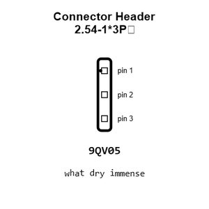

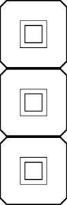

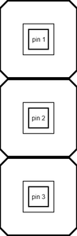

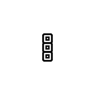

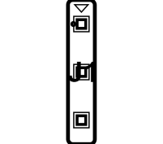

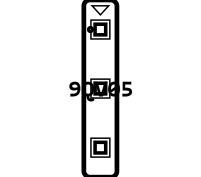

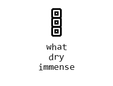

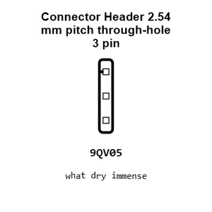

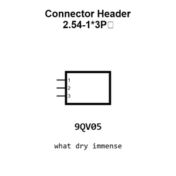

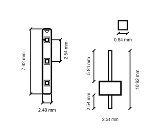

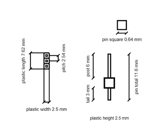

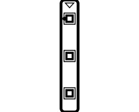

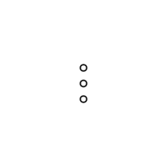

[View this part on GitHub](https://github.com/oomlout/oomp_electronic_version_5/tree/main/parts/electronic_connector_header_2_54_mm_pitch_through_hole_3_pin)

[Browse this category](../../navigation/electronic/connector/header/2_54_mm_pitch/through_hole/README.md)

---

This page is generated from the OOMP part definition by a Roboclick Jinja template. Edit the source taxonomy or template rather than this generated file.