# Connector Header PZ2.54-S04P-A60

`electronic_connector_header_2_54_mm_pitch_through_hole_4_pin`

Connector Header PZ2.54-S04P-A60 is an OOMP electronic connector definition. It uses the header package or form factor. Its nominal drawing size is 10.16 &#x00D7; 2.48 mm.

## At a glance

| Detail | Value |
| --- | --- |
| OOMP ID | `electronic_connector_header_2_54_mm_pitch_through_hole_4_pin` |
| Type | Connector |
| Package / style | header |
| Nominal size | 10.16 &#x00D7; 2.48 mm |

## Classification

| Level | Value |
| --- | --- |
| 1 | `electronic` |
| 2 | `connector` |
| 3 | `header` |
| 4 | `2_54_mm_pitch` |
| 5 | `through_hole` |
| 6 | `4_pin` |

## Nominal dimensions

| Measurement | Value |
| --- | ---: |
| Length | 10.16 mm |
| Width | 2.48 mm |

## Identifiers

| Identifier | Value |
| --- | --- |
| Manufacturer part number | `PZ2.54-S04P-A60` |
| LCSC | [`C42431795`](https://www.lcsc.com/product-detail/C42431795.html) |
| LCSC | [`C7429634`](https://www.lcsc.com/product-detail/C7429634.html) |
| LCSC | [`C7429682`](https://www.lcsc.com/product-detail/C7429682.html) |

## Datasheet

[View the datasheet](data/datasheet.pdf)

## Used in projects

| Project | Quantity | References | Explore |
| --- | ---: | --- | --- |
| [Project adafruit/Adafruit_ADXL345_PCB ADXL345 STEMMA QT current](https://github.com/adafruit/Adafruit_ADXL345_PCB/blob/master/ADXL345%20STEMMA%20QT.brd) | 1 | JP2 | [Board explorer](https://oomlout.github.io/oomp_electronic_version_5/parts/oomp_project_github_adafruit_adafruit_adxl345_pcb_adxl345_stemma_qt_current/board_explorer.html) · [OOMP project](https://github.com/oomlout/oomp_electronic_version_5/tree/main/parts/oomp_project_github_adafruit_adafruit_adxl345_pcb_adxl345_stemma_qt_current) |
| [Project electrolama/TinyReflowController Tiny Reflow Controller current](https://github.com/electrolama/TinyReflowController/tree/master/hardware/Revision%20A1) | 1 | J10 | [Board explorer](https://oomlout.github.io/oomp_electronic_version_5/parts/oomp_project_github_electrolama_tiny_reflow_controller_tiny_reflow_controller_current/board_explorer.html) · [OOMP project](https://github.com/oomlout/oomp_electronic_version_5/tree/main/parts/oomp_project_github_electrolama_tiny_reflow_controller_tiny_reflow_controller_current) |
| [Project hanqaqa/easyduino STM32F103 Bluepill current](https://github.com/Hanqaqa/Easyduino/tree/master/STM32F103%20Bluepill) | 1 | J4 | [Board explorer](https://oomlout.github.io/oomp_electronic_version_5/parts/oomp_project_github_hanqaqa_easyduino_stm32f103_bluepill_current/board_explorer.html) · [OOMP project](https://github.com/oomlout/oomp_electronic_version_5/tree/main/parts/oomp_project_github_hanqaqa_easyduino_stm32f103_bluepill_current) |
| [Project soldered_electronics/Accelerometer---Gyroscope---Magnetometer-LSM9DS1TR-breakout-hardware-design LSM9DS1TR IMU current](https://github.com/SolderedElectronics/Accelerometer---Gyroscope---Magnetometer-LSM9DS1TR-breakout-hardware-design) | 1 | K3 | [Board explorer](https://oomlout.github.io/oomp_electronic_version_5/parts/oomp_project_github_soldered_electronics_accelerometer_gyroscope_magnetometer_lsm9_ds1_tr_breakout_hardware_design_sensor_imu_lsm9ds1tr_current/board_explorer.html) · [OOMP project](https://github.com/oomlout/oomp_electronic_version_5/tree/main/parts/oomp_project_github_soldered_electronics_accelerometer_gyroscope_magnetometer_lsm9_ds1_tr_breakout_hardware_design_sensor_imu_lsm9ds1tr_current) |
| [Project soldered_electronics/Air-quality-sensor-CCS811-breakout-hardware-design CCS811 Breakout current](https://github.com/SolderedElectronics/Air-quality-sensor-CCS811-breakout-hardware-design) | 1 | K2 | [Board explorer](https://oomlout.github.io/oomp_electronic_version_5/parts/oomp_project_github_soldered_electronics_air_quality_sensor_ccs811_breakout_hardware_design_sensor_air_quality_ccs811_current/board_explorer.html) · [OOMP project](https://github.com/oomlout/oomp_electronic_version_5/tree/main/parts/oomp_project_github_soldered_electronics_air_quality_sensor_ccs811_breakout_hardware_design_sensor_air_quality_ccs811_current) |
| [Project soldered_electronics/Air-quality-sensor-MQ135-breakout-hardware-design MQ135 Breakout current](https://github.com/SolderedElectronics/Air-quality-sensor-MQ135-breakout-hardware-design) | 1 | K1 | [Board explorer](https://oomlout.github.io/oomp_electronic_version_5/parts/oomp_project_github_soldered_electronics_air_quality_sensor_mq135_breakout_hardware_design_sensor_gas_mq135_breakout_current/board_explorer.html) · [OOMP project](https://github.com/oomlout/oomp_electronic_version_5/tree/main/parts/oomp_project_github_soldered_electronics_air_quality_sensor_mq135_breakout_hardware_design_sensor_gas_mq135_breakout_current) |
| [Project soldered_electronics/Alcohol--Ethanol-sensor-MQ3-breakout-hardware-design MQ3 Breakout current](https://github.com/SolderedElectronics/Alcohol--Ethanol-sensor-MQ3-breakout-hardware-design) | 1 | K1 | [Board explorer](https://oomlout.github.io/oomp_electronic_version_5/parts/oomp_project_github_soldered_electronics_alcohol_ethanol_sensor_mq3_breakout_hardware_design_sensor_gas_mq3_breakout_current/board_explorer.html) · [OOMP project](https://github.com/oomlout/oomp_electronic_version_5/tree/main/parts/oomp_project_github_soldered_electronics_alcohol_ethanol_sensor_mq3_breakout_hardware_design_sensor_gas_mq3_breakout_current) |
| [Project soldered_electronics/Ammonia-sensor-MQ137-breakout-hardware-design MQ137 Breakout current](https://github.com/SolderedElectronics/Ammonia-sensor-MQ137-breakout-hardware-design) | 1 | K1 | [Board explorer](https://oomlout.github.io/oomp_electronic_version_5/parts/oomp_project_github_soldered_electronics_ammonia_sensor_mq137_breakout_hardware_design_sensor_gas_mq137_breakout_current/board_explorer.html) · [OOMP project](https://github.com/oomlout/oomp_electronic_version_5/tree/main/parts/oomp_project_github_soldered_electronics_ammonia_sensor_mq137_breakout_hardware_design_sensor_gas_mq137_breakout_current) |
| [Project soldered_electronics/Benzene--Toluene--Acetone--Formaldehyde-sensor-MQ138-breakout-hardware-design MQ138 Breakout current](https://github.com/SolderedElectronics/Benzene--Toluene--Acetone--Formaldehyde-sensor-MQ138-breakout-hardware-design) | 1 | K1 | [Board explorer](https://oomlout.github.io/oomp_electronic_version_5/parts/oomp_project_github_soldered_electronics_benzene_toluene_acetone_formaldehyde_sensor_mq138_breakout_hardware_design_sensor_gas_mq138_breakout_current/board_explorer.html) · [OOMP project](https://github.com/oomlout/oomp_electronic_version_5/tree/main/parts/oomp_project_github_soldered_electronics_benzene_toluene_acetone_formaldehyde_sensor_mq138_breakout_hardware_design_sensor_gas_mq138_breakout_current) |
| [Project soldered_electronics/Butane--LPG---Smoke-sensor-MQ2-breakout-hardware-design MQ2 Breakout current](https://github.com/SolderedElectronics/Butane--LPG---Smoke-sensor-MQ2-breakout-hardware-design) | 1 | K1 | [Board explorer](https://oomlout.github.io/oomp_electronic_version_5/parts/oomp_project_github_soldered_electronics_butane_lpg_smoke_sensor_mq2_breakout_hardware_design_sensor_gas_mq2_breakout_current/board_explorer.html) · [OOMP project](https://github.com/oomlout/oomp_electronic_version_5/tree/main/parts/oomp_project_github_soldered_electronics_butane_lpg_smoke_sensor_mq2_breakout_hardware_design_sensor_gas_mq2_breakout_current) |
| [Project soldered_electronics/CO--flammable-gasses-sensor-MQ9-breakout-hardware-design MQ9 Breakout current](https://github.com/SolderedElectronics/CO--flammable-gasses-sensor-MQ9-breakout-hardware-design) | 1 | K1 | [Board explorer](https://oomlout.github.io/oomp_electronic_version_5/parts/oomp_project_github_soldered_electronics_co_flammable_gasses_sensor_mq9_breakout_hardware_design_sensor_gas_mq9_breakout_current/board_explorer.html) · [OOMP project](https://github.com/oomlout/oomp_electronic_version_5/tree/main/parts/oomp_project_github_soldered_electronics_co_flammable_gasses_sensor_mq9_breakout_hardware_design_sensor_gas_mq9_breakout_current) |
| [Project soldered_electronics/CO-sensor-MQ7-breakout-hardware-design MQ7 Breakout current](https://github.com/SolderedElectronics/CO-sensor-MQ7-breakout-hardware-design) | 1 | K1 | [Board explorer](https://oomlout.github.io/oomp_electronic_version_5/parts/oomp_project_github_soldered_electronics_co_sensor_mq7_breakout_hardware_design_sensor_gas_mq7_breakout_current/board_explorer.html) · [OOMP project](https://github.com/oomlout/oomp_electronic_version_5/tree/main/parts/oomp_project_github_soldered_electronics_co_sensor_mq7_breakout_hardware_design_sensor_gas_mq7_breakout_current) |
| [Project soldered_electronics/Color-and-gesture-sensor-APDS-9960-breakout-hardware-design APDS-9960 Breakout current](https://github.com/SolderedElectronics/Color-and-gesture-sensor-APDS-9960-breakout-hardware-design) | 1 | K2 | [Board explorer](https://oomlout.github.io/oomp_electronic_version_5/parts/oomp_project_github_soldered_electronics_color_and_gesture_sensor_apds_9960_breakout_hardware_design_sensor_color_gesture_apds9960_current/board_explorer.html) · [OOMP project](https://github.com/oomlout/oomp_electronic_version_5/tree/main/parts/oomp_project_github_soldered_electronics_color_and_gesture_sensor_apds_9960_breakout_hardware_design_sensor_color_gesture_apds9960_current) |
| [Project soldered_electronics/Color---gesture-sensor-APDS-9960-breakout-hardware-design APDS-9960 Breakout current](https://github.com/SolderedElectronics/Color---gesture-sensor-APDS-9960-breakout-hardware-design) | 1 | K2 | [Board explorer](https://oomlout.github.io/oomp_electronic_version_5/parts/oomp_project_github_soldered_electronics_color_gesture_sensor_apds_9960_breakout_hardware_design_sensor_color_gesture_apds9960_current/board_explorer.html) · [OOMP project](https://github.com/oomlout/oomp_electronic_version_5/tree/main/parts/oomp_project_github_soldered_electronics_color_gesture_sensor_apds_9960_breakout_hardware_design_sensor_color_gesture_apds9960_current) |
| [Project soldered_electronics/Current-sensor-30A-ACS712-breakout-hardware-design ACS712 30A current](https://github.com/SolderedElectronics/Current-sensor-30A-ACS712-breakout-hardware-design) | 1 | K2 | [Board explorer](https://oomlout.github.io/oomp_electronic_version_5/parts/oomp_project_github_soldered_electronics_current_sensor_30_a_acs712_breakout_hardware_design_sensor_current_acs712_30a_current/board_explorer.html) · [OOMP project](https://github.com/oomlout/oomp_electronic_version_5/tree/main/parts/oomp_project_github_soldered_electronics_current_sensor_30_a_acs712_breakout_hardware_design_sensor_current_acs712_30a_current) |
| [Project soldered_electronics/Digital-light---proximity-sensor-LTR-507ALS-breakout-hardware-design LTR-507ALS Breakout current](https://github.com/SolderedElectronics/Digital-light---proximity-sensor-LTR-507ALS-breakout-hardware-design) | 1 | K3 | [Board explorer](https://oomlout.github.io/oomp_electronic_version_5/parts/oomp_project_github_soldered_electronics_digital_light_proximity_sensor_ltr_507_als_breakout_hardware_design_sensor_light_ltr507als_current/board_explorer.html) · [OOMP project](https://github.com/oomlout/oomp_electronic_version_5/tree/main/parts/oomp_project_github_soldered_electronics_digital_light_proximity_sensor_ltr_507_als_breakout_hardware_design_sensor_light_ltr507als_current) |
| [Project soldered_electronics/Hydrogen-sensor-MQ8-breakout-hardware-design MQ8 Breakout current](https://github.com/SolderedElectronics/Hydrogen-sensor-MQ8-breakout-hardware-design) | 1 | K1 | [Board explorer](https://oomlout.github.io/oomp_electronic_version_5/parts/oomp_project_github_soldered_electronics_hydrogen_sensor_mq8_breakout_hardware_design_sensor_gas_mq8_breakout_current/board_explorer.html) · [OOMP project](https://github.com/oomlout/oomp_electronic_version_5/tree/main/parts/oomp_project_github_soldered_electronics_hydrogen_sensor_mq8_breakout_hardware_design_sensor_gas_mq8_breakout_current) |
| [Project soldered_electronics/Hydrogen-Sulfide-sensor-MQ136-breakout-hardware-design MQ136 Breakout current](https://github.com/SolderedElectronics/Hydrogen-Sulfide-sensor-MQ136-breakout-hardware-design) | 1 | K1 | [Board explorer](https://oomlout.github.io/oomp_electronic_version_5/parts/oomp_project_github_soldered_electronics_hydrogen_sulfide_sensor_mq136_breakout_hardware_design_sensor_gas_mq136_breakout_current/board_explorer.html) · [OOMP project](https://github.com/oomlout/oomp_electronic_version_5/tree/main/parts/oomp_project_github_soldered_electronics_hydrogen_sulfide_sensor_mq136_breakout_hardware_design_sensor_gas_mq136_breakout_current) |
| [Project soldered_electronics/Load-cell-ampfilier-HX711-board-hardware-design HX711 Load Cell current](https://github.com/SolderedElectronics/Load-cell-ampfilier-HX711-board-hardware-design) | 1 | K3 | [Board explorer](https://oomlout.github.io/oomp_electronic_version_5/parts/oomp_project_github_soldered_electronics_load_cell_ampfilier_hx711_board_hardware_design_sensor_load_cell_hx711_current/board_explorer.html) · [OOMP project](https://github.com/oomlout/oomp_electronic_version_5/tree/main/parts/oomp_project_github_soldered_electronics_load_cell_ampfilier_hx711_board_hardware_design_sensor_load_cell_hx711_current) |
| [Project soldered_electronics/LPG--Butane-sensor-MQ6-breakout-hardware-design MQ6 Breakout current](https://github.com/SolderedElectronics/LPG--Butane-sensor-MQ6-breakout-hardware-design) | 1 | K1 | [Board explorer](https://oomlout.github.io/oomp_electronic_version_5/parts/oomp_project_github_soldered_electronics_lpg_butane_sensor_mq6_breakout_hardware_design_sensor_gas_mq6_breakout_current/board_explorer.html) · [OOMP project](https://github.com/oomlout/oomp_electronic_version_5/tree/main/parts/oomp_project_github_soldered_electronics_lpg_butane_sensor_mq6_breakout_hardware_design_sensor_gas_mq6_breakout_current) |
| [Project soldered_electronics/Methane.-CNG-sensor-MQ4-breakout-hardware-design MQ4 Breakout current](https://github.com/SolderedElectronics/Methane.-CNG-sensor-MQ4-breakout-hardware-design) | 1 | K1 | [Board explorer](https://oomlout.github.io/oomp_electronic_version_5/parts/oomp_project_github_soldered_electronics_methane_cng_sensor_mq4_breakout_hardware_design_sensor_gas_mq4_breakout_current/board_explorer.html) · [OOMP project](https://github.com/oomlout/oomp_electronic_version_5/tree/main/parts/oomp_project_github_soldered_electronics_methane_cng_sensor_mq4_breakout_hardware_design_sensor_gas_mq4_breakout_current) |
| [Project soldered_electronics/Methane--Natural-gas-sensor-MQ214-breakout-hardware-design MQ214 Breakout current](https://github.com/SolderedElectronics/Methane--Natural-gas-sensor-MQ214-breakout-hardware-design) | 1 | K1 | [Board explorer](https://oomlout.github.io/oomp_electronic_version_5/parts/oomp_project_github_soldered_electronics_methane_natural_gas_sensor_mq214_breakout_hardware_design_sensor_gas_mq214_breakout_current/board_explorer.html) · [OOMP project](https://github.com/oomlout/oomp_electronic_version_5/tree/main/parts/oomp_project_github_soldered_electronics_methane_natural_gas_sensor_mq214_breakout_hardware_design_sensor_gas_mq214_breakout_current) |
| [Project soldered_electronics/Natural-gas--LPG-sensor-MQ5-breakout-hardware-design MQ5 Breakout current](https://github.com/SolderedElectronics/Natural-gas--LPG-sensor-MQ5-breakout-hardware-design) | 1 | K1 | [Board explorer](https://oomlout.github.io/oomp_electronic_version_5/parts/oomp_project_github_soldered_electronics_natural_gas_lpg_sensor_mq5_breakout_hardware_design_sensor_gas_mq5_breakout_current/board_explorer.html) · [OOMP project](https://github.com/oomlout/oomp_electronic_version_5/tree/main/parts/oomp_project_github_soldered_electronics_natural_gas_lpg_sensor_mq5_breakout_hardware_design_sensor_gas_mq5_breakout_current) |
| [Project soldered_electronics/Obstacle-sensor-TCRT5000-breakout-hardware-design Obstacle Sensor TCRT5000 current](https://github.com/SolderedElectronics/Obstacle-sensor-TCRT5000-breakout-hardware-design) | 1 | K1 | [Board explorer](https://oomlout.github.io/oomp_electronic_version_5/parts/oomp_project_github_soldered_electronics_obstacle_sensor_tcrt5000_breakout_hardware_design_sensor_obstacle_tcrt5000_current/board_explorer.html) · [OOMP project](https://github.com/oomlout/oomp_electronic_version_5/tree/main/parts/oomp_project_github_soldered_electronics_obstacle_sensor_tcrt5000_breakout_hardware_design_sensor_obstacle_tcrt5000_current) |
| [Project soldered_electronics/Ozone-sensor-MQ131-breakout-hardware-design MQ131 Breakout current](https://github.com/SolderedElectronics/Ozone-sensor-MQ131-breakout-hardware-design) | 1 | K1 | [Board explorer](https://oomlout.github.io/oomp_electronic_version_5/parts/oomp_project_github_soldered_electronics_ozone_sensor_mq131_breakout_hardware_design_sensor_gas_mq131_breakout_current/board_explorer.html) · [OOMP project](https://github.com/oomlout/oomp_electronic_version_5/tree/main/parts/oomp_project_github_soldered_electronics_ozone_sensor_mq131_breakout_hardware_design_sensor_gas_mq131_breakout_current) |
| [Project soldered_electronics/PIR-Movement-sensor-board-hardware-design PIR Movement Sensor current](https://github.com/SolderedElectronics/PIR-Movement-sensor-board-hardware-design) | 1 | K1 | [Board explorer](https://oomlout.github.io/oomp_electronic_version_5/parts/oomp_project_github_soldered_electronics_pir_movement_sensor_board_hardware_design_sensor_pir_movement_current/board_explorer.html) · [OOMP project](https://github.com/oomlout/oomp_electronic_version_5/tree/main/parts/oomp_project_github_soldered_electronics_pir_movement_sensor_board_hardware_design_sensor_pir_movement_current) |
| [Project soldered_electronics/Pressure---temperature-sensor-BMP388-breakout-hardware-design BMP388 Breakout current](https://github.com/SolderedElectronics/Pressure---temperature-sensor-BMP388-breakout-hardware-design) | 1 | K2 | [Board explorer](https://oomlout.github.io/oomp_electronic_version_5/parts/oomp_project_github_soldered_electronics_pressure_temperature_sensor_bmp388_breakout_hardware_design_sensor_pressure_temp_bmp388_current/board_explorer.html) · [OOMP project](https://github.com/oomlout/oomp_electronic_version_5/tree/main/parts/oomp_project_github_soldered_electronics_pressure_temperature_sensor_bmp388_breakout_hardware_design_sensor_pressure_temp_bmp388_current) |
| [Project soldered_electronics/Simple-fire-sensor-board-hardware-design Simple Fire Sensor current](https://github.com/SolderedElectronics/Simple-fire-sensor-board-hardware-design) | 1 | K2 | [Board explorer](https://oomlout.github.io/oomp_electronic_version_5/parts/oomp_project_github_soldered_electronics_simple_fire_sensor_board_hardware_design_sensor_fire_simple_current/board_explorer.html) · [OOMP project](https://github.com/oomlout/oomp_electronic_version_5/tree/main/parts/oomp_project_github_soldered_electronics_simple_fire_sensor_board_hardware_design_sensor_fire_simple_current) |
| [Project soldered_electronics/Simple-light-sensor-board-hardware-design Simple Light Sensor current](https://github.com/SolderedElectronics/Simple-light-sensor-board-hardware-design) | 1 | K2 | [Board explorer](https://oomlout.github.io/oomp_electronic_version_5/parts/oomp_project_github_soldered_electronics_simple_light_sensor_board_hardware_design_sensor_light_simple_current/board_explorer.html) · [OOMP project](https://github.com/oomlout/oomp_electronic_version_5/tree/main/parts/oomp_project_github_soldered_electronics_simple_light_sensor_board_hardware_design_sensor_light_simple_current) |
| [Project soldered_electronics/Ultrasonic-sensor-qwiic-hardware-design Ultrasonic Sensor qwiic current](https://github.com/SolderedElectronics/Ultrasonic-sensor-qwiic-hardware-design) | 1 | K1 | [Board explorer](https://oomlout.github.io/oomp_electronic_version_5/parts/oomp_project_github_soldered_electronics_ultrasonic_sensor_qwiic_hardware_design_sensor_ultrasonic_qwiic_current/board_explorer.html) · [OOMP project](https://github.com/oomlout/oomp_electronic_version_5/tree/main/parts/oomp_project_github_soldered_electronics_ultrasonic_sensor_qwiic_hardware_design_sensor_ultrasonic_qwiic_current) |
| [Project soldered_electronics/Ultrasonic-sensor-with-easyC-hardware-design Ultrasonic Sensor easyC current](https://github.com/SolderedElectronics/Ultrasonic-sensor-with-easyC-hardware-design) | 1 | K1 | [Board explorer](https://oomlout.github.io/oomp_electronic_version_5/parts/oomp_project_github_soldered_electronics_ultrasonic_sensor_with_easy_c_hardware_design_sensor_ultrasonic_easyc_current/board_explorer.html) · [OOMP project](https://github.com/oomlout/oomp_electronic_version_5/tree/main/parts/oomp_project_github_soldered_electronics_ultrasonic_sensor_with_easy_c_hardware_design_sensor_ultrasonic_easyc_current) |
| [Project soldered_electronics/VOC-sensor-MQ138-breakout-hardware-design MQ138 Breakout current](https://github.com/SolderedElectronics/VOC-sensor-MQ138-breakout-hardware-design) | 1 | K1 | [Board explorer](https://oomlout.github.io/oomp_electronic_version_5/parts/oomp_project_github_soldered_electronics_voc_sensor_mq138_breakout_hardware_design_sensor_gas_mq138_breakout_current/board_explorer.html) · [OOMP project](https://github.com/oomlout/oomp_electronic_version_5/tree/main/parts/oomp_project_github_soldered_electronics_voc_sensor_mq138_breakout_hardware_design_sensor_gas_mq138_breakout_current) |
| [Project soldered_electronics/Voltage---current-sensor-INA219-breakout-hardware-design INA219 Breakout current](https://github.com/SolderedElectronics/Voltage---current-sensor-INA219-breakout-hardware-design) | 1 | K3 | [Board explorer](https://oomlout.github.io/oomp_electronic_version_5/parts/oomp_project_github_soldered_electronics_voltage_current_sensor_ina219_breakout_hardware_design_sensor_power_ina219_current/board_explorer.html) · [OOMP project](https://github.com/oomlout/oomp_electronic_version_5/tree/main/parts/oomp_project_github_soldered_electronics_voltage_current_sensor_ina219_breakout_hardware_design_sensor_power_ina219_current) |
| [Project sparkfun/SparkFun_Qwiic_ADC_ADS1219 Qwiic ADC ADS1219 current](https://github.com/sparkfun/SparkFun_Qwiic_ADC_ADS1219) | 1 | J6 | [Board explorer](https://oomlout.github.io/oomp_electronic_version_5/parts/oomp_project_github_sparkfun_spark_fun_qwiic_adc_ads1219_qwiic_adc_ads1219_current/board_explorer.html) · [OOMP project](https://github.com/oomlout/oomp_electronic_version_5/tree/main/parts/oomp_project_github_sparkfun_spark_fun_qwiic_adc_ads1219_qwiic_adc_ads1219_current) |
| [Project sparkfun/SparkFun_Qwiic_Directional_Pad Qwiic Directional Pad current](https://github.com/sparkfun/SparkFun_Qwiic_Directional_Pad) | 2 | J2, J5 | [Board explorer](https://oomlout.github.io/oomp_electronic_version_5/parts/oomp_project_github_sparkfun_spark_fun_qwiic_directional_pad_qwiic_directional_pad_current/board_explorer.html) · [OOMP project](https://github.com/oomlout/oomp_electronic_version_5/tree/main/parts/oomp_project_github_sparkfun_spark_fun_qwiic_directional_pad_qwiic_directional_pad_current) |
| [Project sparkfun/SparkFun_Qwiic_Navigation_Switch Qwiic Navigation Switch current](https://github.com/sparkfun/SparkFun_Qwiic_Navigation_Switch) | 2 | J2, J5 | [Board explorer](https://oomlout.github.io/oomp_electronic_version_5/parts/oomp_project_github_sparkfun_spark_fun_qwiic_navigation_switch_qwiic_navigation_switch_current/board_explorer.html) · [OOMP project](https://github.com/oomlout/oomp_electronic_version_5/tree/main/parts/oomp_project_github_sparkfun_spark_fun_qwiic_navigation_switch_qwiic_navigation_switch_current) |
| [Project sparkfun/SparkFun_Roller_Encoder_Breakout Roller Encoder Breakout current](https://github.com/sparkfun/SparkFun_Roller_Encoder_Breakout) | 1 | J1 | [Board explorer](https://oomlout.github.io/oomp_electronic_version_5/parts/oomp_project_github_sparkfun_spark_fun_roller_encoder_breakout_roller_encoder_breakout_current/board_explorer.html) · [OOMP project](https://github.com/oomlout/oomp_electronic_version_5/tree/main/parts/oomp_project_github_sparkfun_spark_fun_roller_encoder_breakout_roller_encoder_breakout_current) |
| [Project sparkfun/SparkFun_Triple_Axis_Acclerometer-LIS3DH LIS3DH Qwiic 1x1 current](https://github.com/sparkfun/SparkFun_Triple_Axis_Acclerometer-LIS3DH/tree/main/Hardware/Qwiic%201x1) | 1 | J4 | [Board explorer](https://oomlout.github.io/oomp_electronic_version_5/parts/oomp_project_github_sparkfun_spark_fun_triple_axis_acclerometer_lis3_dh_lis3dh_qwiic_1x1_current/board_explorer.html) · [OOMP project](https://github.com/oomlout/oomp_electronic_version_5/tree/main/parts/oomp_project_github_sparkfun_spark_fun_triple_axis_acclerometer_lis3_dh_lis3dh_qwiic_1x1_current) |

## Files

[KiCad symbol, machine-solder and hand-solder footprints](data/kicad/README.md) · [Availability and source masters](data/kicad/manifest.yaml)

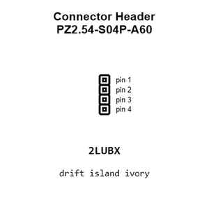

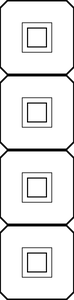

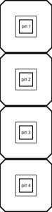

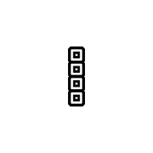

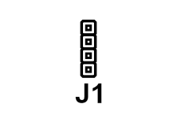

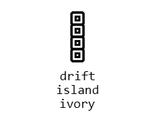

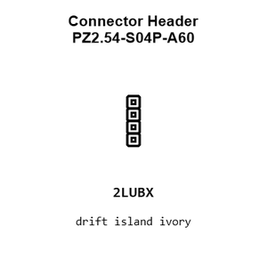

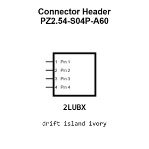

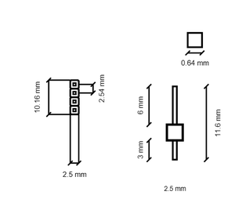

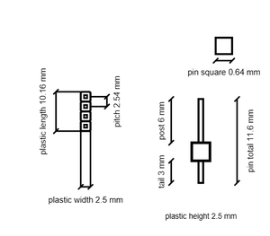

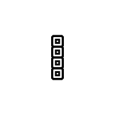

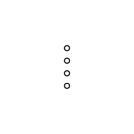

[View this part on GitHub](https://github.com/oomlout/oomp_electronic_version_5/tree/main/parts/electronic_connector_header_2_54_mm_pitch_through_hole_4_pin)

[Browse this category](../../navigation/electronic/connector/header/2_54_mm_pitch/through_hole/README.md)

---

This page is generated from the OOMP part definition by a Roboclick Jinja template. Edit the source taxonomy or template rather than this generated file.