# Connector Header PH2.54-1X5P-H25

`electronic_connector_header_2_54_mm_pitch_through_hole_5_pin`

Connector Header PH2.54-1X5P-H25 is an OOMP electronic connector definition. It uses the header package or form factor. Its nominal drawing size is 12.7 &#x00D7; 2.48 mm.

## At a glance

| Detail | Value |
| --- | --- |
| OOMP ID | `electronic_connector_header_2_54_mm_pitch_through_hole_5_pin` |
| Type | Connector |
| Package / style | header |
| Nominal size | 12.7 &#x00D7; 2.48 mm |

## Classification

| Level | Value |
| --- | --- |
| 1 | `electronic` |
| 2 | `connector` |
| 3 | `header` |
| 4 | `2_54_mm_pitch` |
| 5 | `through_hole` |
| 6 | `5_pin` |

## Nominal dimensions

| Measurement | Value |
| --- | ---: |
| Length | 12.7 mm |
| Width | 2.48 mm |

## Identifiers

| Identifier | Value |
| --- | --- |
| Manufacturer part number | `PH2.54-1X5P-H25` |
| LCSC | [`C42431835`](https://www.lcsc.com/product-detail/C42431835.html) |
| LCSC | [`C7429635`](https://www.lcsc.com/product-detail/C7429635.html) |
| LCSC | [`C42391663`](https://www.lcsc.com/product-detail/C42391663.html) |

## Used in projects

| Project | Quantity | References | Explore |
| --- | ---: | --- | --- |
| [Project soldered_electronics/Load-cell-ampfilier-HX711-board-hardware-design HX711 Load Cell current](https://github.com/SolderedElectronics/Load-cell-ampfilier-HX711-board-hardware-design) | 1 | K1 | [Board explorer](https://oomlout.github.io/oomp_electronic_version_5/parts/oomp_project_github_soldered_electronics_load_cell_ampfilier_hx711_board_hardware_design_sensor_load_cell_hx711_current/board_explorer.html) · [OOMP project](https://github.com/oomlout/oomp_electronic_version_5/tree/main/parts/oomp_project_github_soldered_electronics_load_cell_ampfilier_hx711_board_hardware_design_sensor_load_cell_hx711_current) |
| [Project soldered_electronics/Load-cell-ampfilier-HX711-board-qwiic-hardware-design HX711 Load Cell qwiic current](https://github.com/SolderedElectronics/Load-cell-amplifier-HX711-board-qwiic-hardware-design) | 1 | K1 | [Board explorer](https://oomlout.github.io/oomp_electronic_version_5/parts/oomp_project_github_soldered_electronics_load_cell_ampfilier_hx711_board_qwiic_hardware_design_sensor_load_cell_hx711_qwiic_current/board_explorer.html) · [OOMP project](https://github.com/oomlout/oomp_electronic_version_5/tree/main/parts/oomp_project_github_soldered_electronics_load_cell_ampfilier_hx711_board_qwiic_hardware_design_sensor_load_cell_hx711_qwiic_current) |
| [Project soldered_electronics/Load-cell-ampfilier-HX711-board-with-easy-C-hardware-design HX711 Load Cell easyC current](https://github.com/SolderedElectronics/Load-cell-ampfilier-HX711-board-with-easy-C-hardware-design) | 1 | K1 | [Board explorer](https://oomlout.github.io/oomp_electronic_version_5/parts/oomp_project_github_soldered_electronics_load_cell_ampfilier_hx711_board_with_easy_c_hardware_design_sensor_load_cell_hx711_easyc_current/board_explorer.html) · [OOMP project](https://github.com/oomlout/oomp_electronic_version_5/tree/main/parts/oomp_project_github_soldered_electronics_load_cell_ampfilier_hx711_board_with_easy_c_hardware_design_sensor_load_cell_hx711_easyc_current) |

## Files

[KiCad symbol, machine-solder and hand-solder footprints](data/kicad/README.md) · [Availability and source masters](data/kicad/manifest.yaml)

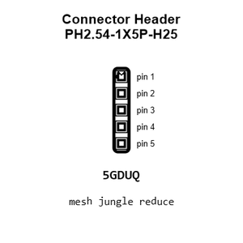

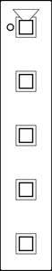

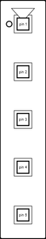

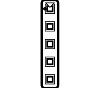

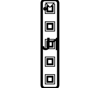

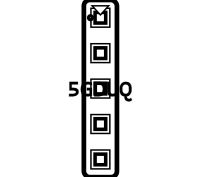

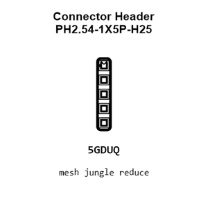

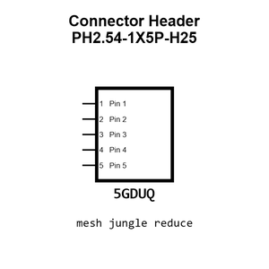

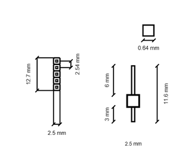

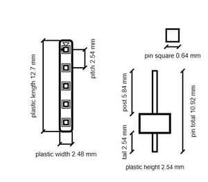

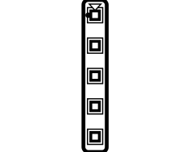

[View this part on GitHub](https://github.com/oomlout/oomp_electronic_version_5/tree/main/parts/electronic_connector_header_2_54_mm_pitch_through_hole_5_pin)

[Browse this category](../../navigation/electronic/connector/header/2_54_mm_pitch/through_hole/README.md)

---

This page is generated from the OOMP part definition by a Roboclick Jinja template. Edit the source taxonomy or template rather than this generated file.