# Connector Header 2.54-1x6P&#x76F4;&#x9488;

`electronic_connector_header_2_54_mm_pitch_through_hole_6_pin`

Connector Header 2.54-1x6P&#x76F4;&#x9488; is an OOMP electronic connector definition. It uses the header package or form factor. Its nominal drawing size is 15.24 &#x00D7; 2.48 mm.

## At a glance

| Detail | Value |
| --- | --- |
| OOMP ID | `electronic_connector_header_2_54_mm_pitch_through_hole_6_pin` |
| Type | Connector |
| Package / style | header |
| Nominal size | 15.24 &#x00D7; 2.48 mm |

## Classification

| Level | Value |
| --- | --- |
| 1 | `electronic` |
| 2 | `connector` |
| 3 | `header` |
| 4 | `2_54_mm_pitch` |
| 5 | `through_hole` |
| 6 | `6_pin` |

## Nominal dimensions

| Measurement | Value |
| --- | ---: |
| Length | 15.24 mm |
| Width | 2.48 mm |

## Identifiers

| Identifier | Value |
| --- | --- |
| Manufacturer part number | `2.54-1x6P&#x76F4;&#x9488;` |
| LCSC | [`C37208`](https://www.lcsc.com/product-detail/C37208.html) |
| LCSC | [`C7429636`](https://www.lcsc.com/product-detail/C7429636.html) |
| LCSC | [`C3294461`](https://www.lcsc.com/product-detail/C3294461.html) |

## Used in projects

| Project | Quantity | References | Explore |
| --- | ---: | --- | --- |
| [Project adafruit/Adafruit-LIS3DH-Breakout-PCB LIS3DH Breakout current](https://github.com/adafruit/Adafruit-LIS3DH-Breakout-PCB/blob/master/Adafruit%20LIS3DH.brd) | 2 | JP2, JP3 | [Board explorer](https://oomlout.github.io/oomp_electronic_version_5/parts/oomp_project_github_adafruit_adafruit_lis3_dh_breakout_pcb_lis3dh_breakout_current/board_explorer.html) · [OOMP project](https://github.com/oomlout/oomp_electronic_version_5/tree/main/parts/oomp_project_github_adafruit_adafruit_lis3_dh_breakout_pcb_lis3dh_breakout_current) |
| [Project electrolama/pt1 current](https://github.com/electrolama/pt1) | 1 | J1 | [Board explorer](https://oomlout.github.io/oomp_electronic_version_5/parts/oomp_project_github_electrolama_pt1_current/board_explorer.html) · [OOMP project](https://github.com/oomlout/oomp_electronic_version_5/tree/main/parts/oomp_project_github_electrolama_pt1_current) |
| [Project jedp/LIS3DH-breakout LIS3DH Breakout current](https://github.com/jedp/LIS3DH-breakout) | 2 | J1, J2 | [Board explorer](https://oomlout.github.io/oomp_electronic_version_5/parts/oomp_project_github_jedp_lis3_dh_breakout_lis3dh_breakout_current/board_explorer.html) · [OOMP project](https://github.com/oomlout/oomp_electronic_version_5/tree/main/parts/oomp_project_github_jedp_lis3_dh_breakout_lis3dh_breakout_current) |
| [Project soldered_electronics/PMS7003-sensor-adapter-hardware-design PMS7003 Adapter current](https://github.com/SolderedElectronics/PMS7003-sensor-adapter-hardware-design) | 1 | K1 | [Board explorer](https://oomlout.github.io/oomp_electronic_version_5/parts/oomp_project_github_soldered_electronics_pms7003_sensor_adapter_hardware_design_sensor_pms7003_adapter_current/board_explorer.html) · [OOMP project](https://github.com/oomlout/oomp_electronic_version_5/tree/main/parts/oomp_project_github_soldered_electronics_pms7003_sensor_adapter_hardware_design_sensor_pms7003_adapter_current) |
| [Project sparkfun/SparkFun_Audio_Player_Breakout_MY1690X-16S Audio Player Breakout MY1690X-16S current](https://github.com/sparkfun/SparkFun_Audio_Player_Breakout_MY1690X-16S) | 1 | J5 | [Board explorer](https://oomlout.github.io/oomp_electronic_version_5/parts/oomp_project_github_sparkfun_spark_fun_audio_player_breakout_my1690_x_16_s_audio_player_breakout_my1690x_16s_current/board_explorer.html) · [OOMP project](https://github.com/oomlout/oomp_electronic_version_5/tree/main/parts/oomp_project_github_sparkfun_spark_fun_audio_player_breakout_my1690_x_16_s_audio_player_breakout_my1690x_16s_current) |
| [Project sparkfun/SparkFun_GNSS_DAN-F10N GNSS DAN-F10N current](https://github.com/sparkfun/SparkFun_GNSS_DAN-F10N) | 1 | J2 | [Board explorer](https://oomlout.github.io/oomp_electronic_version_5/parts/oomp_project_github_sparkfun_spark_fun_gnss_dan_f10_n_gnss_dan_f10n_current/board_explorer.html) · [OOMP project](https://github.com/oomlout/oomp_electronic_version_5/tree/main/parts/oomp_project_github_sparkfun_spark_fun_gnss_dan_f10_n_gnss_dan_f10n_current) |
| [Project sparkfun/SparkFun_Qwiic_ADC_ADS1219 Qwiic ADC ADS1219 current](https://github.com/sparkfun/SparkFun_Qwiic_ADC_ADS1219) | 2 | J3, J4 | [Board explorer](https://oomlout.github.io/oomp_electronic_version_5/parts/oomp_project_github_sparkfun_spark_fun_qwiic_adc_ads1219_qwiic_adc_ads1219_current/board_explorer.html) · [OOMP project](https://github.com/oomlout/oomp_electronic_version_5/tree/main/parts/oomp_project_github_sparkfun_spark_fun_qwiic_adc_ads1219_qwiic_adc_ads1219_current) |
| [Project sparkfun/SparkFun_Qwiic_Current_Sensor_ADE7953 Qwiic Current Sensor ADE7953 current](https://github.com/sparkfun/SparkFun_Qwiic_Current_Sensor_ADE7953) | 1 | J3 | [Board explorer](https://oomlout.github.io/oomp_electronic_version_5/parts/oomp_project_github_sparkfun_spark_fun_qwiic_current_sensor_ade7953_qwiic_current_sensor_ade7953_current/board_explorer.html) · [OOMP project](https://github.com/oomlout/oomp_electronic_version_5/tree/main/parts/oomp_project_github_sparkfun_spark_fun_qwiic_current_sensor_ade7953_qwiic_current_sensor_ade7953_current) |
| [Project sparkfun/SparkFun_Qwiic_Current_Sensor_INA2XX Qwiic Current Sensor INA2XX current](https://github.com/sparkfun/SparkFun_Qwiic_Current_Sensor_INA2XX) | 1 | J3 | [Board explorer](https://oomlout.github.io/oomp_electronic_version_5/parts/oomp_project_github_sparkfun_spark_fun_qwiic_current_sensor_ina2_xx_qwiic_current_sensor_ina2xx_current/board_explorer.html) · [OOMP project](https://github.com/oomlout/oomp_electronic_version_5/tree/main/parts/oomp_project_github_sparkfun_spark_fun_qwiic_current_sensor_ina2_xx_qwiic_current_sensor_ina2xx_current) |
| [Project sparkfun/SparkFun_Qwiic_GNSS_SAM-M8Q Qwiic GNSS SAM-M8Q current](https://github.com/sparkfun/SparkFun_Qwiic_GNSS_SAM-M8Q) | 2 | J6, J7 | [Board explorer](https://oomlout.github.io/oomp_electronic_version_5/parts/oomp_project_github_sparkfun_spark_fun_qwiic_gnss_sam_m8_q_qwiic_gnss_sam_m8q_current/board_explorer.html) · [OOMP project](https://github.com/oomlout/oomp_electronic_version_5/tree/main/parts/oomp_project_github_sparkfun_spark_fun_qwiic_gnss_sam_m8_q_qwiic_gnss_sam_m8q_current) |
| [Project sparkfun/SparkFun_Qwiic_GNSS_SAM-M8Q Qwiic GNSS SAM-M8Q v0.1](https://github.com/sparkfun/SparkFun_Qwiic_GNSS_SAM-M8Q) | 2 | J6, J7 | [Board explorer](https://oomlout.github.io/oomp_electronic_version_5/parts/oomp_project_github_sparkfun_spark_fun_qwiic_gnss_sam_m8_q_qwiic_gnss_sam_m8q_v0_1/board_explorer.html) · [OOMP project](https://github.com/oomlout/oomp_electronic_version_5/tree/main/parts/oomp_project_github_sparkfun_spark_fun_qwiic_gnss_sam_m8_q_qwiic_gnss_sam_m8q_v0_1) |
| [Project sparkfun/SparkFun_u-blox_NEO-F10N u-blox NEO-F10N current](https://github.com/sparkfun/SparkFun_u-blox_NEO-F10N) | 1 | J4 | [Board explorer](https://oomlout.github.io/oomp_electronic_version_5/parts/oomp_project_github_sparkfun_spark_fun_u_blox_neo_f10_n_ublox_neo_f10n_current/board_explorer.html) · [OOMP project](https://github.com/oomlout/oomp_electronic_version_5/tree/main/parts/oomp_project_github_sparkfun_spark_fun_u_blox_neo_f10_n_ublox_neo_f10n_current) |

## Files

[KiCad symbol, machine-solder and hand-solder footprints](data/kicad/README.md) · [Availability and source masters](data/kicad/manifest.yaml)

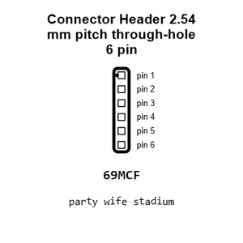

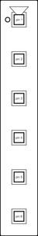

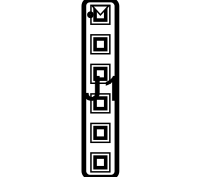

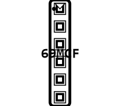

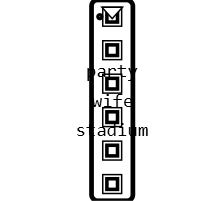

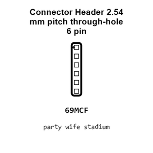

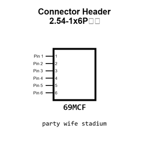

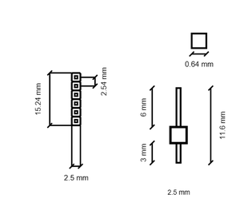

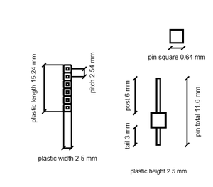

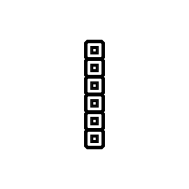

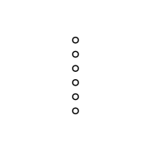

[View this part on GitHub](https://github.com/oomlout/oomp_electronic_version_5/tree/main/parts/electronic_connector_header_2_54_mm_pitch_through_hole_6_pin)

[Browse this category](../../navigation/electronic/connector/header/2_54_mm_pitch/through_hole/README.md)

---

This page is generated from the OOMP part definition by a Roboclick Jinja template. Edit the source taxonomy or template rather than this generated file.