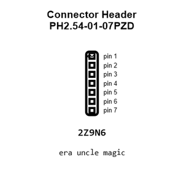
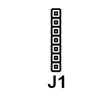
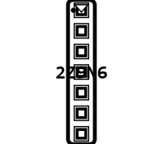
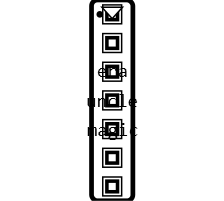
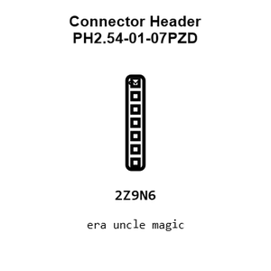
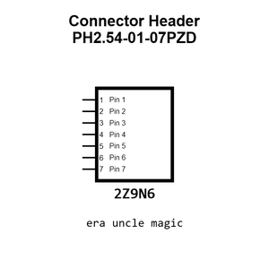
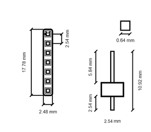
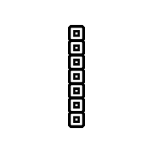
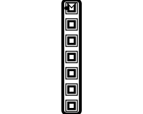

# Connector Header PH2.54-01-07PZD

`electronic_connector_header_2_54_mm_pitch_through_hole_7_pin`

Connector Header PH2.54-01-07PZD is an OOMP electronic connector definition. It uses the header package or form factor. Its nominal drawing size is 17.78 &#x00D7; 2.48 mm.

## At a glance

| Detail | Value |
| --- | --- |
| OOMP ID | `electronic_connector_header_2_54_mm_pitch_through_hole_7_pin` |
| Type | Connector |
| Package / style | header |
| Nominal size | 17.78 &#x00D7; 2.48 mm |

## Classification

| Level | Value |
| --- | --- |
| 1 | `electronic` |
| 2 | `connector` |
| 3 | `header` |
| 4 | `2_54_mm_pitch` |
| 5 | `through_hole` |
| 6 | `7_pin` |

## Nominal dimensions

| Measurement | Value |
| --- | ---: |
| Length | 17.78 mm |
| Width | 2.48 mm |

## Identifiers

| Identifier | Value |
| --- | --- |
| Manufacturer part number | `PH2.54-01-07PZD` |
| LCSC | [`C7501585`](https://www.lcsc.com/product-detail/C7501585.html) |
| LCSC | [`C7429676`](https://www.lcsc.com/product-detail/C7429676.html) |
| LCSC | [`C7429637`](https://www.lcsc.com/product-detail/C7429637.html) |

## Datasheet

[View the datasheet](data/datasheet.pdf)

## Used in projects

| Project | Quantity | References | Explore |
| --- | ---: | --- | --- |
| [Project adafruit/Adafruit-Analog-Accelerometers-PCBs Adafruit ADXL326 current](https://github.com/adafruit/Adafruit-Analog-Accelerometers-PCBs/blob/master/Adafruit%20ADXL326.brd) | 1 | JP2 | [Board explorer](https://oomlout.github.io/oomp_electronic_version_5/parts/oomp_project_github_adafruit_adafruit_analog_accelerometers_pcbs_adafruit_adxl326_current/board_explorer.html) · [OOMP project](https://github.com/oomlout/oomp_electronic_version_5/tree/main/parts/oomp_project_github_adafruit_adafruit_analog_accelerometers_pcbs_adafruit_adxl326_current) |
| [Project adafruit/Adafruit-Analog-Accelerometers-PCBs Adafruit ADXL335 current](https://github.com/adafruit/Adafruit-Analog-Accelerometers-PCBs/blob/master/Adafruit%20ADXL335.brd) | 1 | JP2 | [Board explorer](https://oomlout.github.io/oomp_electronic_version_5/parts/oomp_project_github_adafruit_adafruit_analog_accelerometers_pcbs_adafruit_adxl335_current/board_explorer.html) · [OOMP project](https://github.com/oomlout/oomp_electronic_version_5/tree/main/parts/oomp_project_github_adafruit_adafruit_analog_accelerometers_pcbs_adafruit_adxl335_current) |
| [Project adafruit/Adafruit-Analog-Accelerometers-PCBs Adafruit ADXL377 current](https://github.com/adafruit/Adafruit-Analog-Accelerometers-PCBs/blob/master/Adafruit%20ADXL377.brd) | 1 | JP2 | [Board explorer](https://oomlout.github.io/oomp_electronic_version_5/parts/oomp_project_github_adafruit_adafruit_analog_accelerometers_pcbs_adafruit_adxl377_current/board_explorer.html) · [OOMP project](https://github.com/oomlout/oomp_electronic_version_5/tree/main/parts/oomp_project_github_adafruit_adafruit_analog_accelerometers_pcbs_adafruit_adxl377_current) |
| [Project adafruit/Adafruit-BME280-Breakout-PCB Adafruit BME280 current](https://github.com/adafruit/Adafruit-BME280-Breakout-PCB/blob/master/Adafruit%20BME280.brd) | 1 | JP2 | [Board explorer](https://oomlout.github.io/oomp_electronic_version_5/parts/oomp_project_github_adafruit_adafruit_bme280_breakout_pcb_adafruit_bme280_current/board_explorer.html) · [OOMP project](https://github.com/oomlout/oomp_electronic_version_5/tree/main/parts/oomp_project_github_adafruit_adafruit_bme280_breakout_pcb_adafruit_bme280_current) |
| [Project adafruit/Adafruit-BME680-PCB Adafruit BME680 current](https://github.com/adafruit/Adafruit-BME680-PCB/blob/master/Adafruit%20BME680.brd) | 1 | JP1 | [Board explorer](https://oomlout.github.io/oomp_electronic_version_5/parts/oomp_project_github_adafruit_adafruit_bme680_pcb_adafruit_bme680_current/board_explorer.html) · [OOMP project](https://github.com/oomlout/oomp_electronic_version_5/tree/main/parts/oomp_project_github_adafruit_adafruit_bme680_pcb_adafruit_bme680_current) |
| [Project adafruit/Adafruit-BME680-PCB Adafruit BME680 Original current](https://github.com/adafruit/Adafruit-BME680-PCB/blob/master/Adafruit%20BME680%20Original.brd) | 1 | JP2 | [Board explorer](https://oomlout.github.io/oomp_electronic_version_5/parts/oomp_project_github_adafruit_adafruit_bme680_pcb_adafruit_bme680_original_current/board_explorer.html) · [OOMP project](https://github.com/oomlout/oomp_electronic_version_5/tree/main/parts/oomp_project_github_adafruit_adafruit_bme680_pcb_adafruit_bme680_original_current) |
| [Project adafruit/Adafruit-BMP085-PCB Adafruit BMP085 current](https://github.com/adafruit/Adafruit-BMP085-PCB/blob/master/Adafruit_BMP085.brd) | 1 | JP2 | [Board explorer](https://oomlout.github.io/oomp_electronic_version_5/parts/oomp_project_github_adafruit_adafruit_bmp085_pcb_adafruit_bmp085_current/board_explorer.html) · [OOMP project](https://github.com/oomlout/oomp_electronic_version_5/tree/main/parts/oomp_project_github_adafruit_adafruit_bmp085_pcb_adafruit_bmp085_current) |
| [Project adafruit/Adafruit-BMP280-Breakout-PCB Adafruit BMP280 current](https://github.com/adafruit/Adafruit-BMP280-Breakout-PCB/blob/master/Adafruit%20BMP280.brd) | 1 | JP2 | [Board explorer](https://oomlout.github.io/oomp_electronic_version_5/parts/oomp_project_github_adafruit_adafruit_bmp280_breakout_pcb_adafruit_bmp280_current/board_explorer.html) · [OOMP project](https://github.com/oomlout/oomp_electronic_version_5/tree/main/parts/oomp_project_github_adafruit_adafruit_bmp280_breakout_pcb_adafruit_bmp280_current) |
| [Project adafruit/Adafruit-CAN-Pal-PCB Adafruit CAN Pal Breakout current](https://github.com/adafruit/Adafruit-CAN-Pal-PCB/blob/main/Adafruit%20CAN%20Pal%20Breakout.brd) | 1 | JP2 | [Board explorer](https://oomlout.github.io/oomp_electronic_version_5/parts/oomp_project_github_adafruit_adafruit_can_pal_pcb_adafruit_can_pal_breakout_current/board_explorer.html) · [OOMP project](https://github.com/oomlout/oomp_electronic_version_5/tree/main/parts/oomp_project_github_adafruit_adafruit_can_pal_pcb_adafruit_can_pal_breakout_current) |
| [Project adafruit/Adafruit-CH552-QT-Py-PCB Adafruit CH552 QT Py current](https://github.com/adafruit/Adafruit-CH552-QT-Py-PCB/blob/main/Adafruit%20CH552%20QT%20Py.brd) | 2 | JP1, JP3 | [Board explorer](https://oomlout.github.io/oomp_electronic_version_5/parts/oomp_project_github_adafruit_adafruit_ch552_qt_py_pcb_adafruit_ch552_qt_py_current/board_explorer.html) · [OOMP project](https://github.com/oomlout/oomp_electronic_version_5/tree/main/parts/oomp_project_github_adafruit_adafruit_ch552_qt_py_pcb_adafruit_ch552_qt_py_current) |
| [Project adafruit/Adafruit-Charger-BFF-PCB Adafruit LIPoly Charger BFF current](https://github.com/adafruit/Adafruit-Charger-BFF-PCB/blob/main/Adafruit%20LIPoly%20Charger%20BFF.brd) | 2 | JP1, JP3 | [Board explorer](https://oomlout.github.io/oomp_electronic_version_5/parts/oomp_project_github_adafruit_adafruit_charger_bff_pcb_adafruit_lipoly_charger_bff_current/board_explorer.html) · [OOMP project](https://github.com/oomlout/oomp_electronic_version_5/tree/main/parts/oomp_project_github_adafruit_adafruit_charger_bff_pcb_adafruit_lipoly_charger_bff_current) |
| [Project adafruit/Adafruit-DPS310-PCB Adafruit DPS310 current](https://github.com/adafruit/Adafruit-DPS310-PCB/blob/master/Adafruit%20DPS310.brd) | 1 | JP1 | [Board explorer](https://oomlout.github.io/oomp_electronic_version_5/parts/oomp_project_github_adafruit_adafruit_dps310_pcb_adafruit_dps310_current/board_explorer.html) · [OOMP project](https://github.com/oomlout/oomp_electronic_version_5/tree/main/parts/oomp_project_github_adafruit_adafruit_dps310_pcb_adafruit_dps310_current) |
| [Project adafruit/Adafruit-IS31FL3731-CharliePlex-LED-Breakout-PCB Adafruit IS31 FL3731 Breakout current](https://github.com/adafruit/Adafruit-IS31FL3731-CharliePlex-LED-Breakout-PCB/blob/master/Adafruit%20IS31FL3731%20Breakout.brd) | 1 | JP5 | [Board explorer](https://oomlout.github.io/oomp_electronic_version_5/parts/oomp_project_github_adafruit_adafruit_is31_fl3731_charlie_plex_led_breakout_pcb_adafruit_is31_fl3731_breakout_current/board_explorer.html) · [OOMP project](https://github.com/oomlout/oomp_electronic_version_5/tree/main/parts/oomp_project_github_adafruit_adafruit_is31_fl3731_charlie_plex_led_breakout_pcb_adafruit_is31_fl3731_breakout_current) |
| [Project adafruit/Adafruit-IS31FL3731-CharliePlex-LED-Breakout-PCB Adafruit IS31 FL3731 STEMMA QT current](https://github.com/adafruit/Adafruit-IS31FL3731-CharliePlex-LED-Breakout-PCB/blob/master/Adafruit%20IS31FL3731%20STEMMA%20QT.brd) | 1 | JP5 | [Board explorer](https://oomlout.github.io/oomp_electronic_version_5/parts/oomp_project_github_adafruit_adafruit_is31_fl3731_charlie_plex_led_breakout_pcb_adafruit_is31_fl3731_stemma_qt_current/board_explorer.html) · [OOMP project](https://github.com/oomlout/oomp_electronic_version_5/tree/main/parts/oomp_project_github_adafruit_adafruit_is31_fl3731_charlie_plex_led_breakout_pcb_adafruit_is31_fl3731_stemma_qt_current) |
| [Project adafruit/Adafruit-IS31FL3741-PCB Adafruit IS31 FL3741 Matrix current](https://github.com/adafruit/Adafruit-IS31FL3741-PCB/blob/main/Adafruit%20IS31FL3741%20Matrix.brd) | 1 | JP5 | [Board explorer](https://oomlout.github.io/oomp_electronic_version_5/parts/oomp_project_github_adafruit_adafruit_is31_fl3741_pcb_adafruit_is31_fl3741_matrix_current/board_explorer.html) · [OOMP project](https://github.com/oomlout/oomp_electronic_version_5/tree/main/parts/oomp_project_github_adafruit_adafruit_is31_fl3741_pcb_adafruit_is31_fl3741_matrix_current) |
| [Project adafruit/Adafruit-LIS2MDL-PCB Adafruit LIS2 MDL current](https://github.com/adafruit/Adafruit-LIS2MDL-PCB/blob/master/Adafruit%20LIS2MDL.brd) | 1 | JP1 | [Board explorer](https://oomlout.github.io/oomp_electronic_version_5/parts/oomp_project_github_adafruit_adafruit_lis2_mdl_pcb_adafruit_lis2_mdl_current/board_explorer.html) · [OOMP project](https://github.com/oomlout/oomp_electronic_version_5/tree/main/parts/oomp_project_github_adafruit_adafruit_lis2_mdl_pcb_adafruit_lis2_mdl_current) |
| [Project adafruit/Adafruit-MAX98357-I2S-Amp-Breakout Adafruit MAX98357 Breakout current](https://github.com/adafruit/Adafruit-MAX98357-I2S-Amp-Breakout/blob/master/Adafruit%20MAX98357%20Breakout.brd) | 1 | JP1 | [Board explorer](https://oomlout.github.io/oomp_electronic_version_5/parts/oomp_project_github_adafruit_adafruit_max98357_i2_s_amp_breakout_adafruit_max98357_breakout_current/board_explorer.html) · [OOMP project](https://github.com/oomlout/oomp_electronic_version_5/tree/main/parts/oomp_project_github_adafruit_adafruit_max98357_i2_s_amp_breakout_adafruit_max98357_breakout_current) |
| [Project adafruit/Adafruit-microSD-Card-BFF-PCB Adafruit micro SD BFF current](https://github.com/adafruit/Adafruit-microSD-Card-BFF-PCB/blob/main/Adafruit%20microSD%20BFF.brd) | 2 | JP1, JP3 | [Board explorer](https://oomlout.github.io/oomp_electronic_version_5/parts/oomp_project_github_adafruit_adafruit_micro_sd_card_bff_pcb_adafruit_micro_sd_bff_current/board_explorer.html) · [OOMP project](https://github.com/oomlout/oomp_electronic_version_5/tree/main/parts/oomp_project_github_adafruit_adafruit_micro_sd_card_bff_pcb_adafruit_micro_sd_bff_current) |
| [Project adafruit/Adafruit-MPR121-PCB Adafruit MPR121 Breakout current](https://github.com/adafruit/Adafruit-MPR121-PCB/blob/master/Adafruit%20MPR121%20Breakout.brd) | 1 | JP2 | [Board explorer](https://oomlout.github.io/oomp_electronic_version_5/parts/oomp_project_github_adafruit_adafruit_mpr121_pcb_adafruit_mpr121_breakout_current/board_explorer.html) · [OOMP project](https://github.com/oomlout/oomp_electronic_version_5/tree/main/parts/oomp_project_github_adafruit_adafruit_mpr121_pcb_adafruit_mpr121_breakout_current) |
| [Project adafruit/Adafruit-MPR121-PCB Adafruit MPR121 Q QT current](https://github.com/adafruit/Adafruit-MPR121-PCB/blob/master/Adafruit%20MPR121Q%20QT.brd) | 1 | JP2 | [Board explorer](https://oomlout.github.io/oomp_electronic_version_5/parts/oomp_project_github_adafruit_adafruit_mpr121_pcb_adafruit_mpr121_q_qt_current/board_explorer.html) · [OOMP project](https://github.com/oomlout/oomp_electronic_version_5/tree/main/parts/oomp_project_github_adafruit_adafruit_mpr121_pcb_adafruit_mpr121_q_qt_current) |
| [Project adafruit/Adafruit-MPRLS-Pressure-Sensor-Breakout-PCB Adafruit MPR pressure sensor current](https://github.com/adafruit/Adafruit-MPRLS-Pressure-Sensor-Breakout-PCB/blob/master/Adafruit%20MPR%20pressure%20sensor.brd) | 1 | JP1 | [Board explorer](https://oomlout.github.io/oomp_electronic_version_5/parts/oomp_project_github_adafruit_adafruit_mprls_pressure_sensor_breakout_pcb_adafruit_mpr_pressure_sensor_current/board_explorer.html) · [OOMP project](https://github.com/oomlout/oomp_electronic_version_5/tree/main/parts/oomp_project_github_adafruit_adafruit_mprls_pressure_sensor_breakout_pcb_adafruit_mpr_pressure_sensor_current) |
| [Project adafruit/Adafruit-NeoPixel-Driver-BFF-PCB Adafruit Neo Pixel Driver BFF current](https://github.com/adafruit/Adafruit-NeoPixel-Driver-BFF-PCB/blob/main/Adafruit_NeoPixel_Driver_BFF.brd) | 2 | JP1, JP3 | [Board explorer](https://oomlout.github.io/oomp_electronic_version_5/parts/oomp_project_github_adafruit_adafruit_neo_pixel_driver_bff_pcb_adafruit_neo_pixel_driver_bff_current/board_explorer.html) · [OOMP project](https://github.com/oomlout/oomp_electronic_version_5/tree/main/parts/oomp_project_github_adafruit_adafruit_neo_pixel_driver_bff_pcb_adafruit_neo_pixel_driver_bff_current) |
| [Project sparkfun/SparkFun_Particulate_Matter_Sensor_Breakout_BMV080 Particulate Matter Sensor BMV080 current](https://github.com/sparkfun/SparkFun_Particulate_Matter_Sensor_Breakout_BMV080) | 1 | J2 | [Board explorer](https://oomlout.github.io/oomp_electronic_version_5/parts/oomp_project_github_sparkfun_spark_fun_particulate_matter_sensor_breakout_bmv080_particulate_matter_bmv080_current/board_explorer.html) · [OOMP project](https://github.com/oomlout/oomp_electronic_version_5/tree/main/parts/oomp_project_github_sparkfun_spark_fun_particulate_matter_sensor_breakout_bmv080_particulate_matter_bmv080_current) |

## Files

[KiCad symbol, machine-solder and hand-solder footprints](data/kicad/README.md) · [Availability and source masters](data/kicad/manifest.yaml)

[View this part on GitHub](https://github.com/oomlout/oomp_electronic_version_5/tree/main/parts/electronic_connector_header_2_54_mm_pitch_through_hole_7_pin)

[Browse this category](../../navigation/electronic/connector/header/2_54_mm_pitch/through_hole/README.md)

---

This page is generated from the OOMP part definition by a Roboclick Jinja template. Edit the source taxonomy or template rather than this generated file.