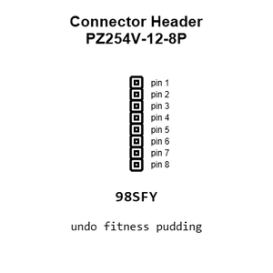
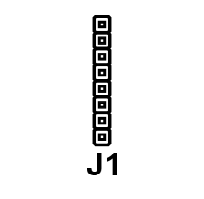
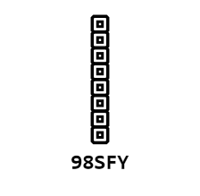
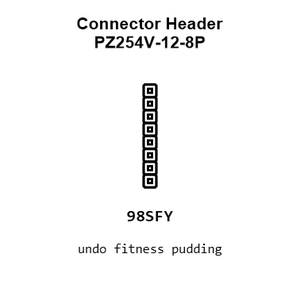
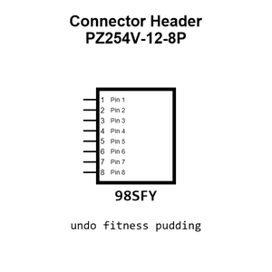
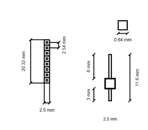
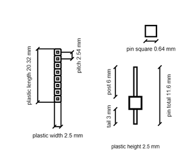
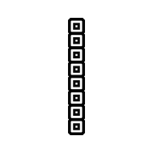
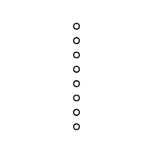

# Connector Header PZ254V-12-8P

`electronic_connector_header_2_54_mm_pitch_through_hole_8_pin`

Connector Header PZ254V-12-8P is an OOMP electronic connector definition. It uses the header package or form factor. Its nominal drawing size is 20.32 &#x00D7; 2.48 mm.

## At a glance

| Detail | Value |
| --- | --- |
| OOMP ID | `electronic_connector_header_2_54_mm_pitch_through_hole_8_pin` |
| Type | Connector |
| Package / style | header |
| Nominal size | 20.32 &#x00D7; 2.48 mm |

## Classification

| Level | Value |
| --- | --- |
| 1 | `electronic` |
| 2 | `connector` |
| 3 | `header` |
| 4 | `2_54_mm_pitch` |
| 5 | `through_hole` |
| 6 | `8_pin` |

## Nominal dimensions

| Measurement | Value |
| --- | ---: |
| Length | 20.32 mm |
| Width | 2.48 mm |

## Identifiers

| Identifier | Value |
| --- | --- |
| Manufacturer part number | `PZ254V-12-8P` |
| LCSC | [`C492421`](https://www.lcsc.com/product-detail/C492421.html) |
| LCSC | [`C7429638`](https://www.lcsc.com/product-detail/C7429638.html) |
| LCSC | [`C54950595`](https://www.lcsc.com/product-detail/C54950595.html) |

## Datasheet

[View the datasheet](data/datasheet.pdf)

## Used in projects

| Project | Quantity | References | Explore |
| --- | ---: | --- | --- |
| [Project adafruit/Adafruit-128x32-SPI-OLED-breakout-board-PCB Adafruit OLED 128x32 Mono current](https://github.com/adafruit/Adafruit-128x32-SPI-OLED-breakout-board-PCB/blob/master/Adafruit%20OLED%20128x32%20Mono.brd) | 1 | JP1 | [Board explorer](https://oomlout.github.io/oomp_electronic_version_5/parts/oomp_project_github_adafruit_adafruit_128x32_spi_oled_breakout_board_pcb_adafruit_oled_128x32_mono_current/board_explorer.html) · [OOMP project](https://github.com/oomlout/oomp_electronic_version_5/tree/main/parts/oomp_project_github_adafruit_adafruit_128x32_spi_oled_breakout_board_pcb_adafruit_oled_128x32_mono_current) |
| [Project adafruit/Adafruit-128x64-Monochrome-OLED-PCB 0.96in 128x64 OLED STEMMA QT current](https://github.com/adafruit/Adafruit-128x64-Monochrome-OLED-PCB/blob/master/Adafruit%200.96in%20128x64%20OLED%20STEMMA%20QT.brd) | 1 | JP2 | [Board explorer](https://oomlout.github.io/oomp_electronic_version_5/parts/oomp_project_github_adafruit_adafruit_128x64_monochrome_oled_pcb_0_96in_128x64_oled_stemma_qt_current/board_explorer.html) · [OOMP project](https://github.com/oomlout/oomp_electronic_version_5/tree/main/parts/oomp_project_github_adafruit_adafruit_128x64_monochrome_oled_pcb_0_96in_128x64_oled_stemma_qt_current) |
| [Project adafruit/Adafruit-128x64-Monochrome-OLED-PCB 128x64 Mono OLED PCB v2 current](https://github.com/adafruit/Adafruit-128x64-Monochrome-OLED-PCB/blob/master/Adafruit%20128x64%20Mono%20OLED%20PCB%20v2.brd) | 1 | JP1 | [Board explorer](https://oomlout.github.io/oomp_electronic_version_5/parts/oomp_project_github_adafruit_adafruit_128x64_monochrome_oled_pcb_128x64_mono_oled_v2_current/board_explorer.html) · [OOMP project](https://github.com/oomlout/oomp_electronic_version_5/tree/main/parts/oomp_project_github_adafruit_adafruit_128x64_monochrome_oled_pcb_128x64_mono_oled_v2_current) |
| [Project adafruit/Adafruit-16-channel-PWM-Servo-Shield Adafruit PWM Servo Shield current](https://github.com/adafruit/Adafruit-16-channel-PWM-Servo-Shield/blob/master/Adafruit%20PWM%20Servo%20Shield.brd) | 2 | JP3, JP4 | [Board explorer](https://oomlout.github.io/oomp_electronic_version_5/parts/oomp_project_github_adafruit_adafruit_16_channel_pwm_servo_shield_adafruit_pwm_servo_shield_current/board_explorer.html) · [OOMP project](https://github.com/oomlout/oomp_electronic_version_5/tree/main/parts/oomp_project_github_adafruit_adafruit_16_channel_pwm_servo_shield_adafruit_pwm_servo_shield_current) |
| [Project adafruit/Adafruit-40-pin-TFT-Friend Adafruit 40pin TFT friend current](https://github.com/adafruit/Adafruit-40-pin-TFT-Friend/blob/master/Adafruit%2040pin%20TFT%20friend.brd) | 2 | BLUE0, GREEN0 | [Board explorer](https://oomlout.github.io/oomp_electronic_version_5/parts/oomp_project_github_adafruit_adafruit_40_pin_tft_friend_adafruit_40pin_tft_friend_current/board_explorer.html) · [OOMP project](https://github.com/oomlout/oomp_electronic_version_5/tree/main/parts/oomp_project_github_adafruit_adafruit_40_pin_tft_friend_adafruit_40pin_tft_friend_current) |
| [Project soldered_electronics/GNSS-GPS-L86-M33-breakout-hardware-design L86-M33 GNSS current](https://github.com/SolderedElectronics/GNSS-GPS-L86-M33-breakout-hardware-design) | 1 | K3 | [Board explorer](https://oomlout.github.io/oomp_electronic_version_5/parts/oomp_project_github_soldered_electronics_gnss_gps_l86_m33_breakout_hardware_design_sensor_gnss_l86m33_current/board_explorer.html) · [OOMP project](https://github.com/oomlout/oomp_electronic_version_5/tree/main/parts/oomp_project_github_soldered_electronics_gnss_gps_l86_m33_breakout_hardware_design_sensor_gnss_l86m33_current) |
| [Project sparkfun/ADXL345_Breakout ADXL345 Breakout current](https://github.com/sparkfun/ADXL345_Breakout/tree/master/Hardware) | 1 | JP1 | [Board explorer](https://oomlout.github.io/oomp_electronic_version_5/parts/oomp_project_github_sparkfun_adxl345_breakout_adxl345_breakout_current/board_explorer.html) · [OOMP project](https://github.com/oomlout/oomp_electronic_version_5/tree/main/parts/oomp_project_github_sparkfun_adxl345_breakout_adxl345_breakout_current) |
| [Project sparkfun/SparkFun_GNSS_DAN-F10N GNSS DAN-F10N current](https://github.com/sparkfun/SparkFun_GNSS_DAN-F10N) | 1 | J5 | [Board explorer](https://oomlout.github.io/oomp_electronic_version_5/parts/oomp_project_github_sparkfun_spark_fun_gnss_dan_f10_n_gnss_dan_f10n_current/board_explorer.html) · [OOMP project](https://github.com/oomlout/oomp_electronic_version_5/tree/main/parts/oomp_project_github_sparkfun_spark_fun_gnss_dan_f10_n_gnss_dan_f10n_current) |

## Files

[KiCad symbol, machine-solder and hand-solder footprints](data/kicad/README.md) · [Availability and source masters](data/kicad/manifest.yaml)

[View this part on GitHub](https://github.com/oomlout/oomp_electronic_version_5/tree/main/parts/electronic_connector_header_2_54_mm_pitch_through_hole_8_pin)

[Browse this category](../../navigation/electronic/connector/header/2_54_mm_pitch/through_hole/README.md)

---

This page is generated from the OOMP part definition by a Roboclick Jinja template. Edit the source taxonomy or template rather than this generated file.