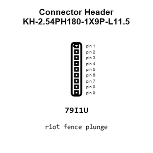
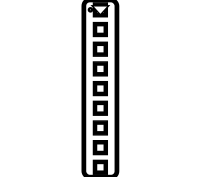
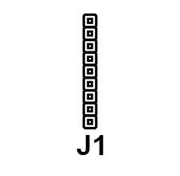
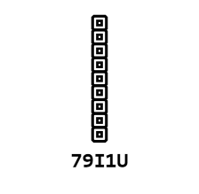
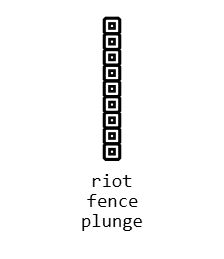
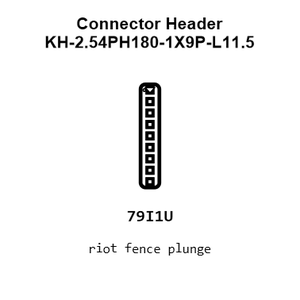
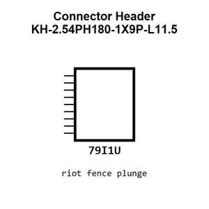
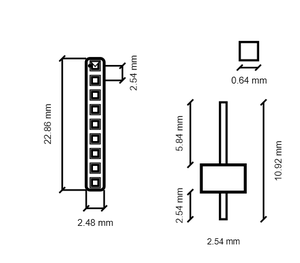
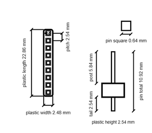
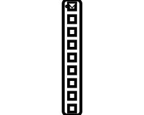

# Connector Header KH-2.54PH180-1X9P-L11.5

`electronic_connector_header_2_54_mm_pitch_through_hole_9_pin`

Connector Header KH-2.54PH180-1X9P-L11.5 is an OOMP electronic connector definition. It uses the header package or form factor. Its nominal drawing size is 22.86 &#x00D7; 2.48 mm.

## At a glance

| Detail | Value |
| --- | --- |
| OOMP ID | `electronic_connector_header_2_54_mm_pitch_through_hole_9_pin` |
| Type | Connector |
| Package / style | header |
| Nominal size | 22.86 &#x00D7; 2.48 mm |

## Classification

| Level | Value |
| --- | --- |
| 1 | `electronic` |
| 2 | `connector` |
| 3 | `header` |
| 4 | `2_54_mm_pitch` |
| 5 | `through_hole` |
| 6 | `9_pin` |

## Nominal dimensions

| Measurement | Value |
| --- | ---: |
| Length | 22.86 mm |
| Width | 2.48 mm |

## Identifiers

| Identifier | Value |
| --- | --- |
| Manufacturer part number | `KH-2.54PH180-1X9P-L11.5` |
| LCSC | [`C2932701`](https://www.lcsc.com/product-detail/C2932701.html) |
| LCSC | [`C7429639`](https://www.lcsc.com/product-detail/C7429639.html) |
| LCSC | [`C7429612`](https://www.lcsc.com/product-detail/C7429612.html) |

## Datasheet

[View the datasheet](data/datasheet.pdf)

## Used in projects

| Project | Quantity | References | Explore |
| --- | ---: | --- | --- |
| [Project adafruit/Adafruit-ANO-Rotary-Navigation-Encoder-Breakout-PCB Adafruit ANO Rotary Encoder Breakout current](https://github.com/adafruit/Adafruit-ANO-Rotary-Navigation-Encoder-Breakout-PCB/blob/main/Adafruit%20ANO%20Rotary%20Encoder%20Breakout.brd) | 1 | JP3 | [Board explorer](https://oomlout.github.io/oomp_electronic_version_5/parts/oomp_project_github_adafruit_adafruit_ano_rotary_navigation_encoder_breakout_pcb_adafruit_ano_rotary_encoder_breakout_current/board_explorer.html) · [OOMP project](https://github.com/oomlout/oomp_electronic_version_5/tree/main/parts/oomp_project_github_adafruit_adafruit_ano_rotary_navigation_encoder_breakout_pcb_adafruit_ano_rotary_encoder_breakout_current) |
| [Project adafruit/Adafruit-MCP9600-PCB Adafruit MCP9600 current](https://github.com/adafruit/Adafruit-MCP9600-PCB/blob/master/Adafruit%20MCP9600.brd) | 1 | JP3 | [Board explorer](https://oomlout.github.io/oomp_electronic_version_5/parts/oomp_project_github_adafruit_adafruit_mcp9600_pcb_adafruit_mcp9600_current/board_explorer.html) · [OOMP project](https://github.com/oomlout/oomp_electronic_version_5/tree/main/parts/oomp_project_github_adafruit_adafruit_mcp9600_pcb_adafruit_mcp9600_current) |
| [Project adafruit/Adafruit-MicroSD-SPI-or-SDIO-card-breakout-PCB Adafruit SDIO micro SD current](https://github.com/adafruit/Adafruit-MicroSD-SPI-or-SDIO-card-breakout-PCB/blob/master/Adafruit%20SDIO%20microSD.brd) | 1 | JP1 | [Board explorer](https://oomlout.github.io/oomp_electronic_version_5/parts/oomp_project_github_adafruit_adafruit_micro_sd_spi_or_sdio_card_breakout_pcb_adafruit_sdio_micro_sd_current/board_explorer.html) · [OOMP project](https://github.com/oomlout/oomp_electronic_version_5/tree/main/parts/oomp_project_github_adafruit_adafruit_micro_sd_spi_or_sdio_card_breakout_pcb_adafruit_sdio_micro_sd_current) |
| [Project adafruit/Adafruit-OV5640-Camera-Breakout-PCB Adafruit OV5640 Breakout current](https://github.com/adafruit/Adafruit-OV5640-Camera-Breakout-PCB/blob/main/Adafruit%20OV5640%20Breakout.brd) | 1 | JP1 | [Board explorer](https://oomlout.github.io/oomp_electronic_version_5/parts/oomp_project_github_adafruit_adafruit_ov5640_camera_breakout_pcb_adafruit_ov5640_breakout_current/board_explorer.html) · [OOMP project](https://github.com/oomlout/oomp_electronic_version_5/tree/main/parts/oomp_project_github_adafruit_adafruit_ov5640_camera_breakout_pcb_adafruit_ov5640_breakout_current) |
| [Project adafruit/Adafruit-Radio-FeatherWing-PCB Adafruit Radio Feather Wing current](https://github.com/adafruit/Adafruit-Radio-FeatherWing-PCB/blob/master/Adafruit%20Radio%20FeatherWing.brd) | 1 | JP1 | [Board explorer](https://oomlout.github.io/oomp_electronic_version_5/parts/oomp_project_github_adafruit_adafruit_radio_feather_wing_pcb_adafruit_radio_feather_wing_current/board_explorer.html) · [OOMP project](https://github.com/oomlout/oomp_electronic_version_5/tree/main/parts/oomp_project_github_adafruit_adafruit_radio_feather_wing_pcb_adafruit_radio_feather_wing_current) |
| [Project adafruit/Adafruit-RFM-LoRa-Radio-Breakout-PCB Adafruit RFM+Lo Ra Breakout current](https://github.com/adafruit/Adafruit-RFM-LoRa-Radio-Breakout-PCB/blob/master/Adafruit%20RFM%2BLoRa%20Breakout.brd) | 1 | JP3 | [Board explorer](https://oomlout.github.io/oomp_electronic_version_5/parts/oomp_project_github_adafruit_adafruit_rfm_lo_ra_radio_breakout_pcb_adafruit_rfm_lo_ra_breakout_current/board_explorer.html) · [OOMP project](https://github.com/oomlout/oomp_electronic_version_5/tree/main/parts/oomp_project_github_adafruit_adafruit_rfm_lo_ra_radio_breakout_pcb_adafruit_rfm_lo_ra_breakout_current) |
| [Project adafruit/Adafruit-Sharp-Memory-Display-PCBs Adafruit 2.7in Sharp Memory Display current](https://github.com/adafruit/Adafruit-Sharp-Memory-Display-PCBs/blob/master/Adafruit%202.7in%20Sharp%20Memory%20Display.brd) | 1 | JP1 | [Board explorer](https://oomlout.github.io/oomp_electronic_version_5/parts/oomp_project_github_adafruit_adafruit_sharp_memory_display_pcbs_adafruit_2_7in_sharp_memory_display_current/board_explorer.html) · [OOMP project](https://github.com/oomlout/oomp_electronic_version_5/tree/main/parts/oomp_project_github_adafruit_adafruit_sharp_memory_display_pcbs_adafruit_2_7in_sharp_memory_display_current) |
| [Project adafruit/Adafruit-Sharp-Memory-Display-PCBs Adafruit Sharp Memory Display current](https://github.com/adafruit/Adafruit-Sharp-Memory-Display-PCBs/blob/master/Adafruit_SharpMemoryDisplay.brd) | 1 | JP1 | [Board explorer](https://oomlout.github.io/oomp_electronic_version_5/parts/oomp_project_github_adafruit_adafruit_sharp_memory_display_pcbs_adafruit_sharp_memory_display_current/board_explorer.html) · [OOMP project](https://github.com/oomlout/oomp_electronic_version_5/tree/main/parts/oomp_project_github_adafruit_adafruit_sharp_memory_display_pcbs_adafruit_sharp_memory_display_current) |
| [Project adafruit/Adafruit-Sparkle-Motion-PCB Adafruit Sparkle Motion WLED Friend current](https://github.com/adafruit/Adafruit-Sparkle-Motion-PCB/blob/main/Adafruit%20Sparkle%20Motion%20WLED%20Friend_Rev%20D.brd) | 1 | JP1 | [Board explorer](https://oomlout.github.io/oomp_electronic_version_5/parts/oomp_project_github_adafruit_adafruit_sparkle_motion_pcb_adafruit_sparkle_motion_wled_friend_current/board_explorer.html) · [OOMP project](https://github.com/oomlout/oomp_electronic_version_5/tree/main/parts/oomp_project_github_adafruit_adafruit_sparkle_motion_pcb_adafruit_sparkle_motion_wled_friend_current) |
| [Project adafruit/Adafruit-UDA1334A-I2S-Stereo-DAC-PCB Adafruit UDA1334 I2 S DAC current](https://github.com/adafruit/Adafruit-UDA1334A-I2S-Stereo-DAC-PCB/blob/master/Adafruit%20UDA1334%20I2S%20DAC.brd) | 1 | JP3 | [Board explorer](https://oomlout.github.io/oomp_electronic_version_5/parts/oomp_project_github_adafruit_adafruit_uda1334_a_i2_s_stereo_dac_pcb_adafruit_uda1334_i2_s_dac_current/board_explorer.html) · [OOMP project](https://github.com/oomlout/oomp_electronic_version_5/tree/main/parts/oomp_project_github_adafruit_adafruit_uda1334_a_i2_s_stereo_dac_pcb_adafruit_uda1334_i2_s_dac_current) |
| [Project adafruit/Adafruit-Ultimate-GPS Adafruit Ultimate GPS current](https://github.com/adafruit/Adafruit-Ultimate-GPS/blob/master/Adafruit%20Ultimate%20GPS.brd) | 1 | JP1 | [Board explorer](https://oomlout.github.io/oomp_electronic_version_5/parts/oomp_project_github_adafruit_adafruit_ultimate_gps_adafruit_ultimate_gps_current/board_explorer.html) · [OOMP project](https://github.com/oomlout/oomp_electronic_version_5/tree/main/parts/oomp_project_github_adafruit_adafruit_ultimate_gps_adafruit_ultimate_gps_current) |
| [Project soldered_electronics/Accelerometer---Gyroscope---Magnetometer-LSM9DS1TR-breakout-hardware-design LSM9DS1TR IMU current](https://github.com/SolderedElectronics/Accelerometer---Gyroscope---Magnetometer-LSM9DS1TR-breakout-hardware-design) | 1 | K1 | [Board explorer](https://oomlout.github.io/oomp_electronic_version_5/parts/oomp_project_github_soldered_electronics_accelerometer_gyroscope_magnetometer_lsm9_ds1_tr_breakout_hardware_design_sensor_imu_lsm9ds1tr_current/board_explorer.html) · [OOMP project](https://github.com/oomlout/oomp_electronic_version_5/tree/main/parts/oomp_project_github_soldered_electronics_accelerometer_gyroscope_magnetometer_lsm9_ds1_tr_breakout_hardware_design_sensor_imu_lsm9ds1tr_current) |
| [Project sparkfun/Electric_Imp_Shield electric imp shield current](https://github.com/sparkfun/Electric_Imp_Shield/blob/master/Hardware/electric-imp-shield.brd) | 1 | JP7 | [Board explorer](https://oomlout.github.io/oomp_electronic_version_5/parts/oomp_project_github_sparkfun_electric_imp_shield_electric_imp_shield_current/board_explorer.html) · [OOMP project](https://github.com/oomlout/oomp_electronic_version_5/tree/main/parts/oomp_project_github_sparkfun_electric_imp_shield_electric_imp_shield_current) |
| [Project sparkfun/FT232RL_USB_Breakout FT232 R Breakout current](https://github.com/sparkfun/FT232RL_USB_Breakout/blob/master/Hardware/FT232R-Breakout.brd) | 2 | JP1, JP2 | [Board explorer](https://oomlout.github.io/oomp_electronic_version_5/parts/oomp_project_github_sparkfun_ft232_rl_usb_breakout_ft232_r_breakout_current/board_explorer.html) · [OOMP project](https://github.com/oomlout/oomp_electronic_version_5/tree/main/parts/oomp_project_github_sparkfun_ft232_rl_usb_breakout_ft232_r_breakout_current) |
| [Project sparkfun/Qwiic_GPS-RTK2 Qwiic GPS RTK2 ublox ZED-F9P current](https://github.com/sparkfun/Qwiic_GPS-RTK2/blob/master/Hardware/Qwiic%20GPS-RTK2%20-%20ublox%20ZED-F9P.brd) | 1 | J7 | [Board explorer](https://oomlout.github.io/oomp_electronic_version_5/parts/oomp_project_github_sparkfun_qwiic_gps_rtk2_qwiic_gps_rtk2_ublox_zed_f9_p_current/board_explorer.html) · [OOMP project](https://github.com/oomlout/oomp_electronic_version_5/tree/main/parts/oomp_project_github_sparkfun_qwiic_gps_rtk2_qwiic_gps_rtk2_ublox_zed_f9_p_current) |
| [Project sparkfun/SparkFun_DataLogger_IoT_9DoF Spark Fun Data Logger Io T 9 DOF current](https://github.com/sparkfun/SparkFun_DataLogger_IoT_9DoF/blob/main/Hardware/SparkFun_DataLogger_IoT_9DOF.brd) | 1 | J8 | [Board explorer](https://oomlout.github.io/oomp_electronic_version_5/parts/oomp_project_github_sparkfun_spark_fun_data_logger_io_t_9_do_f_spark_fun_data_logger_io_t_9_dof_current/board_explorer.html) · [OOMP project](https://github.com/oomlout/oomp_electronic_version_5/tree/main/parts/oomp_project_github_sparkfun_spark_fun_data_logger_io_t_9_do_f_spark_fun_data_logger_io_t_9_dof_current) |
| [Project sparkfun/SparkFun_GNSS_Dead_Reckoning_ZED-F9K Spark Fun GPS ZED F9 K current](https://github.com/sparkfun/SparkFun_GNSS_Dead_Reckoning_ZED-F9K/blob/main/Hardware/SparkFun_GPS_ZED-F9K.brd) | 1 | J6 | [Board explorer](https://oomlout.github.io/oomp_electronic_version_5/parts/oomp_project_github_sparkfun_spark_fun_gnss_dead_reckoning_zed_f9_k_spark_fun_gps_zed_f9_k_current/board_explorer.html) · [OOMP project](https://github.com/oomlout/oomp_electronic_version_5/tree/main/parts/oomp_project_github_sparkfun_spark_fun_gnss_dead_reckoning_zed_f9_k_spark_fun_gps_zed_f9_k_current) |
| [Project sparkfun/SparkFun_GNSS_Timing-ZED-F9T Spark Fun GNSS Timing ZED F9 T current](https://github.com/sparkfun/SparkFun_GNSS_Timing-ZED-F9T/blob/main/Hardware/SparkFun_GNSS_Timing-ZED-F9T.brd) | 1 | J7 | [Board explorer](https://oomlout.github.io/oomp_electronic_version_5/parts/oomp_project_github_sparkfun_spark_fun_gnss_timing_zed_f9_t_spark_fun_gnss_timing_zed_f9_t_current/board_explorer.html) · [OOMP project](https://github.com/oomlout/oomp_electronic_version_5/tree/main/parts/oomp_project_github_sparkfun_spark_fun_gnss_timing_zed_f9_t_spark_fun_gnss_timing_zed_f9_t_current) |
| [Project sparkfun/SparkFun_GPS_Dead_Reckoning_ZED-F9R Spark Fun ZED F9 R u FL current](https://github.com/sparkfun/SparkFun_GPS_Dead_Reckoning_ZED-F9R/blob/master/Hardware/UFL/SparkFun_ZED-F9R_v12_uFL.brd) | 1 | J6 | [Board explorer](https://oomlout.github.io/oomp_electronic_version_5/parts/oomp_project_github_sparkfun_spark_fun_gps_dead_reckoning_zed_f9_r_spark_fun_zed_f9_r_u_fl_current/board_explorer.html) · [OOMP project](https://github.com/oomlout/oomp_electronic_version_5/tree/main/parts/oomp_project_github_sparkfun_spark_fun_gps_dead_reckoning_zed_f9_r_spark_fun_zed_f9_r_u_fl_current) |
| [Project sparkfun/SparkFun_u-blox_NEO-F10N u-blox NEO-F10N current](https://github.com/sparkfun/SparkFun_u-blox_NEO-F10N) | 1 | J2 | [Board explorer](https://oomlout.github.io/oomp_electronic_version_5/parts/oomp_project_github_sparkfun_spark_fun_u_blox_neo_f10_n_ublox_neo_f10n_current/board_explorer.html) · [OOMP project](https://github.com/oomlout/oomp_electronic_version_5/tree/main/parts/oomp_project_github_sparkfun_spark_fun_u_blox_neo_f10_n_ublox_neo_f10n_current) |

## Files

[KiCad symbol, machine-solder and hand-solder footprints](data/kicad/README.md) · [Availability and source masters](data/kicad/manifest.yaml)

[View this part on GitHub](https://github.com/oomlout/oomp_electronic_version_5/tree/main/parts/electronic_connector_header_2_54_mm_pitch_through_hole_9_pin)

[Browse this category](../../navigation/electronic/connector/header/2_54_mm_pitch/through_hole/README.md)

---

This page is generated from the OOMP part definition by a Roboclick Jinja template. Edit the source taxonomy or template rather than this generated file.