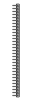
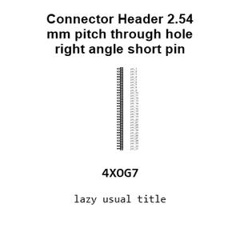
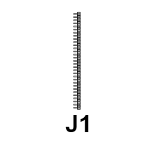
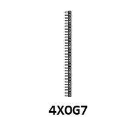
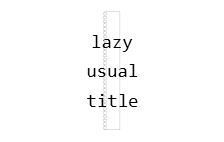
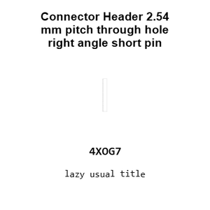
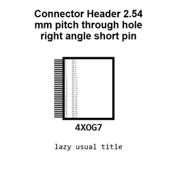
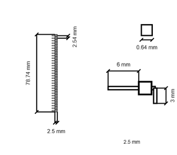
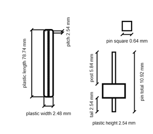
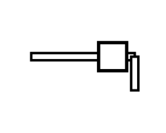

# Connector Header 2.54 mm pitch through hole right angle short pin 31 pin

`electronic_connector_header_2_54_mm_pitch_through_hole_right_angle_short_pin_31_pin`

Connector Header 2.54 mm pitch through hole right angle short pin 31 pin is an OOMP electronic connector definition. It uses the header package or form factor. Its nominal drawing size is 2.54 &#x00D7; 78.74 mm. The definition includes 31 documented pins.

## At a glance

| Detail | Value |
| --- | --- |
| OOMP ID | `electronic_connector_header_2_54_mm_pitch_through_hole_right_angle_short_pin_31_pin` |
| Type | Connector |
| Package / style | header |
| Nominal size | 2.54 &#x00D7; 78.74 mm |
| Documented pins | 31 |

## Classification

| Level | Value |
| --- | --- |
| 1 | `electronic` |
| 2 | `connector` |
| 3 | `header` |
| 4 | `2_54_mm_pitch` |
| 5 | `through_hole_right_angle_short_pin` |
| 6 | `31_pin` |

## Nominal dimensions

| Measurement | Value |
| --- | ---: |
| Length | 2.54 mm |
| Width | 78.74 mm |

## Pins

| Pin | Name | Type |
| ---: | --- | --- |
| 1 | pin_1 | signal |
| 2 | pin_2 | signal |
| 3 | pin_3 | signal |
| 4 | pin_4 | signal |
| 5 | pin_5 | signal |
| 6 | pin_6 | signal |
| 7 | pin_7 | signal |
| 8 | pin_8 | signal |
| 9 | pin_9 | signal |
| 10 | pin_10 | signal |
| 11 | pin_11 | signal |
| 12 | pin_12 | signal |
| 13 | pin_13 | signal |
| 14 | pin_14 | signal |
| 15 | pin_15 | signal |
| 16 | pin_16 | signal |
| 17 | pin_17 | signal |
| 18 | pin_18 | signal |
| 19 | pin_19 | signal |
| 20 | pin_20 | signal |
| 21 | pin_21 | signal |
| 22 | pin_22 | signal |
| 23 | pin_23 | signal |
| 24 | pin_24 | signal |
| 25 | pin_25 | signal |
| 26 | pin_26 | signal |
| 27 | pin_27 | signal |
| 28 | pin_28 | signal |
| 29 | pin_29 | signal |
| 30 | pin_30 | signal |
| 31 | pin_31 | signal |

## Datasheet

[View the datasheet](data/datasheet.pdf)

## Files

[KiCad symbol, machine-solder and hand-solder footprints](data/kicad/README.md) · [Availability and source masters](data/kicad/manifest.yaml)

[View this part on GitHub](https://github.com/oomlout/oomp_electronic_version_5/tree/main/parts/electronic_connector_header_2_54_mm_pitch_through_hole_right_angle_short_pin_31_pin)

[Browse this category](../../navigation/electronic/connector/header/2_54_mm_pitch/through_hole_right_angle_short_pin/README.md)

---

This page is generated from the OOMP part definition by a Roboclick Jinja template. Edit the source taxonomy or template rather than this generated file.