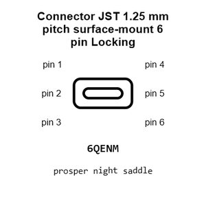
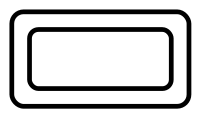
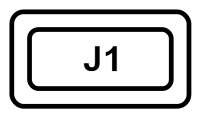
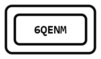
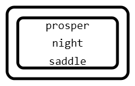
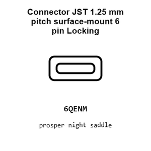
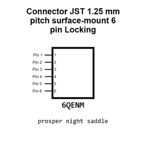
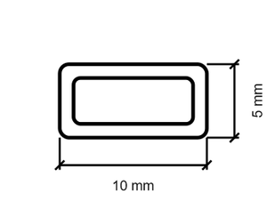
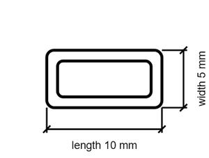
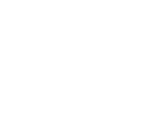

# Connector JST 1.25 mm pitch surface-mount 6 pin Locking

`electronic_connector_jst_1_25_mm_pitch_surface_mount_6_pin_locking_jst_smd_1_25_mm_6_locking`

Connector JST 1.25 mm pitch surface-mount 6 pin Locking is an OOMP electronic connector definition. It uses the jst package or form factor. Its nominal drawing size is 10.0 &#x00D7; 5.0 mm.

## At a glance

| Detail | Value |
| --- | --- |
| OOMP ID | `electronic_connector_jst_1_25_mm_pitch_surface_mount_6_pin_locking_jst_smd_1_25_mm_6_locking` |
| Type | Connector |
| Package / style | jst |
| Nominal size | 10.0 &#x00D7; 5.0 mm |

## Classification

| Level | Value |
| --- | --- |
| 1 | `electronic` |
| 2 | `connector` |
| 3 | `jst` |
| 4 | `1_25_mm_pitch` |
| 5 | `surface_mount` |
| 6 | `6_pin` |
| 7 | `locking` |
| 15 | `jst_smd_1_25_mm_6_locking` |

## Nominal dimensions

| Measurement | Value |
| --- | ---: |
| Length | 10.0 mm |
| Width | 5.0 mm |

## Files

[KiCad symbol, machine-solder and hand-solder footprints](data/kicad/README.md) · [Availability and source masters](data/kicad/manifest.yaml)

[View this part on GitHub](https://github.com/oomlout/oomp_electronic_version_5/tree/main/parts/electronic_connector_jst_1_25_mm_pitch_surface_mount_6_pin_locking_jst_smd_1_25_mm_6_locking)

[Browse this category](../../navigation/electronic/connector/jst/1_25_mm_pitch/surface_mount/6_pin/locking/README.md)

---

This page is generated from the OOMP part definition by a Roboclick Jinja template. Edit the source taxonomy or template rather than this generated file.