# Connector JST Ph B13B-PH-SM4-TB

`electronic_connector_jst_ph_2_mm_pitch_surface_mount_vertical_13_pin_jst_b13b_ph_sm4_tb`

Connector JST Ph B13B-PH-SM4-TB is an OOMP electronic connector definition. It uses the jst ph package or form factor. Its nominal drawing size is 29.95 &#x00D7; 5.0 mm. The definition includes 13 documented pins.

## At a glance

| Detail | Value |
| --- | --- |
| OOMP ID | `electronic_connector_jst_ph_2_mm_pitch_surface_mount_vertical_13_pin_jst_b13b_ph_sm4_tb` |
| Type | Connector |
| Package / style | jst ph |
| Nominal size | 29.95 &#x00D7; 5.0 mm |
| Documented pins | 13 |

## Classification

| Level | Value |
| --- | --- |
| 1 | `electronic` |
| 2 | `connector` |
| 3 | `jst_ph` |
| 4 | `2_mm_pitch` |
| 5 | `surface_mount_vertical` |
| 6 | `13_pin` |
| 14 | `jst` |
| 15 | `b13b_ph_sm4_tb` |

## Nominal dimensions

| Measurement | Value |
| --- | ---: |
| Length | 29.95 mm |
| Width | 5.0 mm |

## Identifiers

| Identifier | Value |
| --- | --- |
| Manufacturer part number | `B13B-PH-SM4-TB` |

## Pins

| Pin | Name | Type |
| ---: | --- | --- |
| 1 | pin_1 | signal |
| 2 | pin_2 | signal |
| 3 | pin_3 | signal |
| 4 | pin_4 | signal |
| 5 | pin_5 | signal |
| 6 | pin_6 | signal |
| 7 | pin_7 | signal |
| 8 | pin_8 | signal |
| 9 | pin_9 | signal |
| 10 | pin_10 | signal |
| 11 | pin_11 | signal |
| 12 | pin_12 | signal |
| 13 | pin_13 | signal |

## Datasheet

[View the datasheet](data/datasheet.pdf)

## Files

[KiCad symbol, machine-solder and hand-solder footprints](data/kicad/README.md) · [Availability and source masters](data/kicad/manifest.yaml)

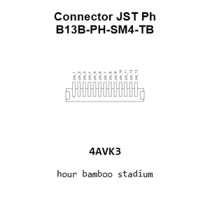

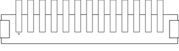

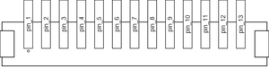

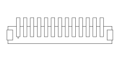

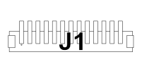

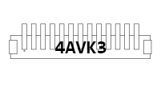

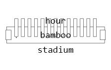

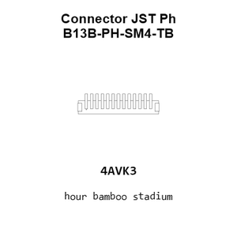

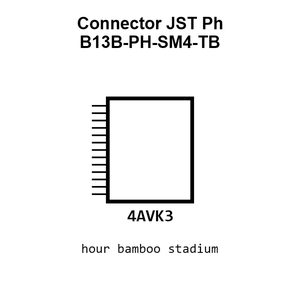

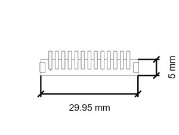

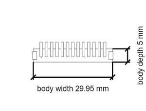

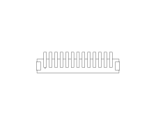

[View this part on GitHub](https://github.com/oomlout/oomp_electronic_version_5/tree/main/parts/electronic_connector_jst_ph_2_mm_pitch_surface_mount_vertical_13_pin_jst_b13b_ph_sm4_tb)

[Browse this category](../../navigation/electronic/connector/jst_ph/2_mm_pitch/surface_mount_vertical/13_pin/jst/README.md)

---

This page is generated from the OOMP part definition by a Roboclick Jinja template. Edit the source taxonomy or template rather than this generated file.