# Connector JST Sh SM02B-SRSS-TB

`electronic_connector_jst_sh_1_mm_pitch_surface_mount_right_angle_2_pin_jst_sm02b_srss_tb`

Connector JST Sh SM02B-SRSS-TB is an OOMP electronic connector definition. It uses the jst sh package or form factor. Its nominal drawing size is 4.0 &#x00D7; 4.25 mm. The definition includes 2 documented pins.

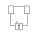

## At a glance

| Detail | Value |
| --- | --- |
| OOMP ID | `electronic_connector_jst_sh_1_mm_pitch_surface_mount_right_angle_2_pin_jst_sm02b_srss_tb` |
| Type | Connector |
| Package / style | jst sh |
| Nominal size | 4.0 &#x00D7; 4.25 mm |
| Documented pins | 2 |

## Classification

| Level | Value |
| --- | --- |
| 1 | `electronic` |
| 2 | `connector` |
| 3 | `jst_sh` |
| 4 | `1_mm_pitch` |
| 5 | `surface_mount_right_angle` |
| 6 | `2_pin` |
| 14 | `jst` |
| 15 | `sm02b_srss_tb` |

## Nominal dimensions

| Measurement | Value |
| --- | ---: |
| Length | 4.0 mm |
| Width | 4.25 mm |

## Identifiers

| Identifier | Value |
| --- | --- |
| Manufacturer part number | `SM02B-SRSS-TB` |
| LCSC | [`C160402`](https://www.lcsc.com/product-detail/C160402.html) |

## Pins

| Pin | Name | Type |
| ---: | --- | --- |
| 1 | pin_1 | signal |
| 2 | pin_2 | signal |

## Datasheet

[View the datasheet](data/datasheet.pdf)

## Used in projects

| Project | Quantity | References | Explore |
| --- | ---: | --- | --- |
| [Project soldered_electronics/Simple-fire-sensor-board-hardware-design Simple Fire Sensor current](https://github.com/SolderedElectronics/Simple-fire-sensor-board-hardware-design) | 1 | K3 | [Board explorer](https://oomlout.github.io/oomp_electronic_version_5/parts/oomp_project_github_soldered_electronics_simple_fire_sensor_board_hardware_design_sensor_fire_simple_current/board_explorer.html) · [OOMP project](https://github.com/oomlout/oomp_electronic_version_5/tree/main/parts/oomp_project_github_soldered_electronics_simple_fire_sensor_board_hardware_design_sensor_fire_simple_current) |
| [Project soldered_electronics/Simple-fire-sensor-board-qwiic-hardware-design Simple Fire Sensor qwiic current](https://github.com/SolderedElectronics/Simple-fire-sensor-board-qwiic-hardware-design) | 1 | K1 | [Board explorer](https://oomlout.github.io/oomp_electronic_version_5/parts/oomp_project_github_soldered_electronics_simple_fire_sensor_board_qwiic_hardware_design_sensor_fire_simple_qwiic_current/board_explorer.html) · [OOMP project](https://github.com/oomlout/oomp_electronic_version_5/tree/main/parts/oomp_project_github_soldered_electronics_simple_fire_sensor_board_qwiic_hardware_design_sensor_fire_simple_qwiic_current) |
| [Project soldered_electronics/Simple-fire-sensor-board-with-easyC-hardware-design Simple Fire Sensor easyC current](https://github.com/SolderedElectronics/Simple-fire-sensor-board-with-easyC-hardware-design) | 1 | K1 | [Board explorer](https://oomlout.github.io/oomp_electronic_version_5/parts/oomp_project_github_soldered_electronics_simple_fire_sensor_board_with_easy_c_hardware_design_sensor_fire_simple_easyc_current/board_explorer.html) · [OOMP project](https://github.com/oomlout/oomp_electronic_version_5/tree/main/parts/oomp_project_github_soldered_electronics_simple_fire_sensor_board_with_easy_c_hardware_design_sensor_fire_simple_easyc_current) |
| [Project soldered_electronics/Simple-light-sensor-board-hardware-design Simple Light Sensor current](https://github.com/SolderedElectronics/Simple-light-sensor-board-hardware-design) | 1 | K3 | [Board explorer](https://oomlout.github.io/oomp_electronic_version_5/parts/oomp_project_github_soldered_electronics_simple_light_sensor_board_hardware_design_sensor_light_simple_current/board_explorer.html) · [OOMP project](https://github.com/oomlout/oomp_electronic_version_5/tree/main/parts/oomp_project_github_soldered_electronics_simple_light_sensor_board_hardware_design_sensor_light_simple_current) |
| [Project soldered_electronics/Simple-light-sensor-board-qwiic-hardware-design Simple Light Sensor qwiic current](https://github.com/SolderedElectronics/Simple-light-sensor-board-qwiic-hardware-design) | 1 | K1 | [Board explorer](https://oomlout.github.io/oomp_electronic_version_5/parts/oomp_project_github_soldered_electronics_simple_light_sensor_board_qwiic_hardware_design_sensor_light_simple_qwiic_current/board_explorer.html) · [OOMP project](https://github.com/oomlout/oomp_electronic_version_5/tree/main/parts/oomp_project_github_soldered_electronics_simple_light_sensor_board_qwiic_hardware_design_sensor_light_simple_qwiic_current) |
| [Project soldered_electronics/Simple-light-sensor-board-with-easyC-hardware-design Simple Light Sensor easyC current](https://github.com/SolderedElectronics/Simple-light-sensor-board-with-easyC-hardware-design) | 1 | K1 | [Board explorer](https://oomlout.github.io/oomp_electronic_version_5/parts/oomp_project_github_soldered_electronics_simple_light_sensor_board_with_easy_c_hardware_design_sensor_light_simple_easyc_current/board_explorer.html) · [OOMP project](https://github.com/oomlout/oomp_electronic_version_5/tree/main/parts/oomp_project_github_soldered_electronics_simple_light_sensor_board_with_easy_c_hardware_design_sensor_light_simple_easyc_current) |

## Files

[KiCad symbol, machine-solder and hand-solder footprints](data/kicad/README.md) · [Availability and source masters](data/kicad/manifest.yaml)

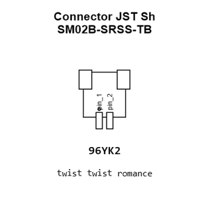

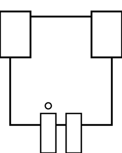

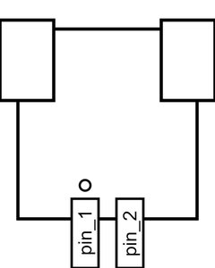

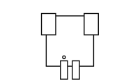

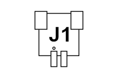

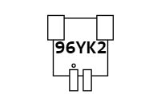

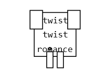

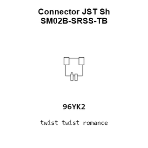

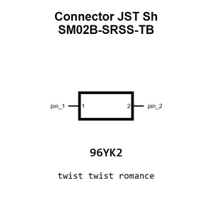

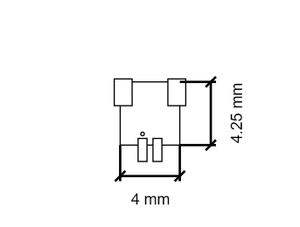

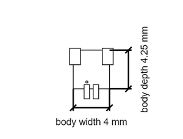

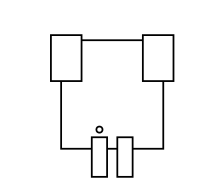

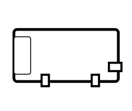

[View this part on GitHub](https://github.com/oomlout/oomp_electronic_version_5/tree/main/parts/electronic_connector_jst_sh_1_mm_pitch_surface_mount_right_angle_2_pin_jst_sm02b_srss_tb)

[Browse this category](../../navigation/electronic/connector/jst_sh/1_mm_pitch/surface_mount_right_angle/2_pin/jst/README.md)

---

This page is generated from the OOMP part definition by a Roboclick Jinja template. Edit the source taxonomy or template rather than this generated file.