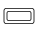
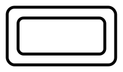
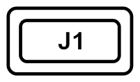
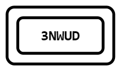
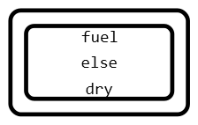
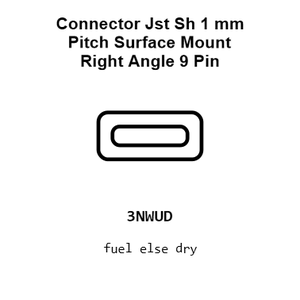
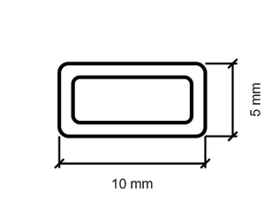
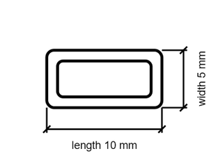
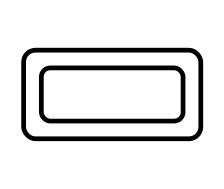
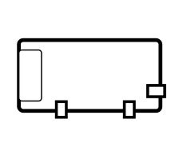

# Connector Jst Sh 1 mm Pitch Surface Mount Right Angle 9 Pin

`electronic_connector_jst_sh_1_mm_pitch_surface_mount_right_angle_9_pin_jst_sm09b_srss_tb`

Connector Jst Sh 1 mm Pitch Surface Mount Right Angle 9 Pin is an OOMP electronic connector definition. It uses the jst sh package or form factor. Its nominal drawing size is 10.0 &#x00D7; 5.0 mm. The definition includes 9 documented pins.

## At a glance

| Detail | Value |
| --- | --- |
| OOMP ID | `electronic_connector_jst_sh_1_mm_pitch_surface_mount_right_angle_9_pin_jst_sm09b_srss_tb` |
| Type | Connector |
| Package / style | jst sh |
| Nominal size | 10.0 &#x00D7; 5.0 mm |
| Documented pins | 9 |

## Classification

| Level | Value |
| --- | --- |
| 1 | `electronic` |
| 2 | `connector` |
| 3 | `jst_sh` |
| 4 | `1_mm_pitch` |
| 5 | `surface_mount_right_angle` |
| 6 | `9_pin` |
| 14 | `jst` |
| 15 | `sm09b_srss_tb` |

## Nominal dimensions

| Measurement | Value |
| --- | ---: |
| Length | 10.0 mm |
| Width | 5.0 mm |

## Identifiers

| Identifier | Value |
| --- | --- |
| Manufacturer part number | `SM09B-SRSS-TB` |
| LCSC | `C160408` |

## Pins

| Pin | Name | Type |
| ---: | --- | --- |
| 1 | pin_1 | signal |
| 2 | pin_2 | signal |
| 3 | pin_3 | signal |
| 4 | pin_4 | signal |
| 5 | pin_5 | signal |
| 6 | pin_6 | signal |
| 7 | pin_7 | signal |
| 8 | pin_8 | signal |
| 9 | gnd | signal |

## Datasheet

[View the datasheet](datasheet.pdf)

## Files

[View this part on GitHub](https://github.com/oomlout/oomp_electronic_version_5/tree/main/parts/electronic_connector_jst_sh_1_mm_pitch_surface_mount_right_angle_9_pin_jst_sm09b_srss_tb)

---

This page is generated from the OOMP part definition by a Roboclick Jinja template. Edit the source taxonomy or template rather than this generated file.