# Connector JST Xh B5B-XH-A

`electronic_connector_jst_xh_2_5_mm_pitch_through_hole_5_pin_jst_b5b_xh_a`

Connector JST Xh B5B-XH-A is an OOMP electronic connector definition. It uses the jst xh package or form factor. Its nominal drawing size is 14.9 &#x00D7; 5.75 mm. The definition includes 5 documented pins.

## At a glance

| Detail | Value |
| --- | --- |
| OOMP ID | `electronic_connector_jst_xh_2_5_mm_pitch_through_hole_5_pin_jst_b5b_xh_a` |
| Type | Connector |
| Package / style | jst xh |
| Nominal size | 14.9 &#x00D7; 5.75 mm |
| Documented pins | 5 |

## Classification

| Level | Value |
| --- | --- |
| 1 | `electronic` |
| 2 | `connector` |
| 3 | `jst_xh` |
| 4 | `2_5_mm_pitch` |
| 5 | `through_hole` |
| 6 | `5_pin` |
| 14 | `jst` |
| 15 | `b5b_xh_a` |

## Nominal dimensions

| Measurement | Value |
| --- | ---: |
| Length | 14.9 mm |
| Width | 5.75 mm |

## Identifiers

| Identifier | Value |
| --- | --- |
| Manufacturer part number | `B5B-XH-A` |

## Pins

| Pin | Name | Type |
| ---: | --- | --- |
| 1 | pin_1 | signal |
| 2 | pin_2 | signal |
| 3 | pin_3 | signal |
| 4 | pin_4 | signal |
| 5 | pin_5 | signal |

## Datasheet

[View the datasheet](data/datasheet.pdf)

## Files

[KiCad symbol, machine-solder and hand-solder footprints](data/kicad/README.md) · [Availability and source masters](data/kicad/manifest.yaml)

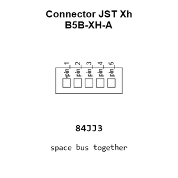

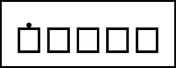

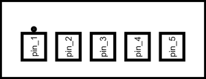

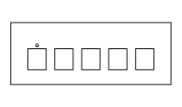

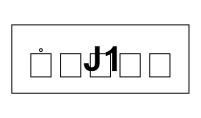

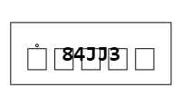

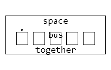

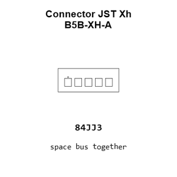

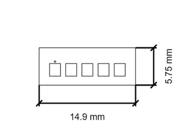

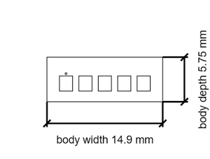

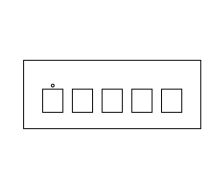

[View this part on GitHub](https://github.com/oomlout/oomp_electronic_version_5/tree/main/parts/electronic_connector_jst_xh_2_5_mm_pitch_through_hole_5_pin_jst_b5b_xh_a)

[Browse this category](../../navigation/electronic/connector/jst_xh/2_5_mm_pitch/through_hole/5_pin/jst/README.md)

---

This page is generated from the OOMP part definition by a Roboclick Jinja template. Edit the source taxonomy or template rather than this generated file.