# Connector Micro Sd Friction Fit Micro Sd Friction Fit

`electronic_connector_micro_sd_friction_fit_micro_sd_friction_fit`

Connector Micro Sd Friction Fit Micro Sd Friction Fit is an OOMP electronic connector definition. It uses the micro sd package or form factor. Its nominal drawing size is 15.0 &#x00D7; 11.0 mm. The definition includes 10 documented pins.

## At a glance

| Detail | Value |
| --- | --- |
| OOMP ID | `electronic_connector_micro_sd_friction_fit_micro_sd_friction_fit` |
| Type | Connector |
| Package / style | micro sd |
| Nominal size | 15.0 &#x00D7; 11.0 mm |
| Documented pins | 10 |

## Classification

| Level | Value |
| --- | --- |
| 1 | `electronic` |
| 2 | `connector` |
| 3 | `micro_sd` |
| 7 | `friction_fit` |
| 15 | `micro_sd_friction_fit` |

## Nominal dimensions

| Measurement | Value |
| --- | ---: |
| Length | 15.0 mm |
| Width | 11.0 mm |

## Pins

| Pin | Name | Type |
| ---: | --- | --- |
| 1 | DAT2 | signal |
| 2 | DAT3/CD | signal |
| 3 | CMD | signal |
| 4 | VDD | power |
| 5 | CLK | signal |
| 6 | VSS | gnd |
| 7 | DAT0 | signal |
| 8 | DAT1 | signal |
| 9 | CARD_DETECT | signal |
| 10 | CD_COMMON | signal |

## Used in projects

| Project | Quantity | References | Explore |
| --- | ---: | --- | --- |
| [Project sparkfun/SparkFun_GNSS_Flex_Breakout GNSS Flex Breakout current](https://github.com/sparkfun/SparkFun_GNSS_Flex_Breakout) | 1 | J1 | [Board explorer](https://oomlout.github.io/oomp_electronic_version_5/parts/oomp_project_github_sparkfun_spark_fun_gnss_flex_breakout_gnss_flex_breakout_current/board_explorer.html) · [OOMP project](https://github.com/oomlout/oomp_electronic_version_5/tree/main/parts/oomp_project_github_sparkfun_spark_fun_gnss_flex_breakout_gnss_flex_breakout_current) |

## Files

[KiCad symbol, machine-solder and hand-solder footprints](data/kicad/README.md) · [Availability and source masters](data/kicad/manifest.yaml)

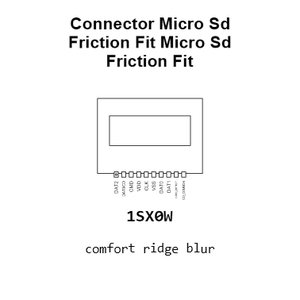

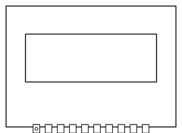

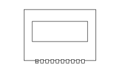

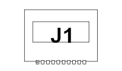

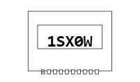

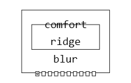

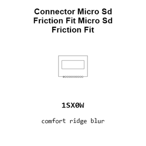

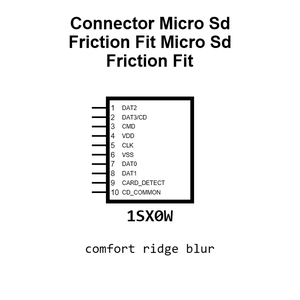

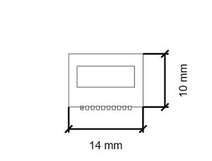

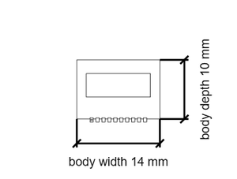

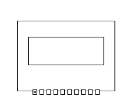

[View this part on GitHub](https://github.com/oomlout/oomp_electronic_version_5/tree/main/parts/electronic_connector_micro_sd_friction_fit_micro_sd_friction_fit)

[Browse this category](../../navigation/electronic/connector/micro_sd/friction_fit/README.md)

---

This page is generated from the OOMP part definition by a Roboclick Jinja template. Edit the source taxonomy or template rather than this generated file.