# Connector Micro Sd Friction Fit Micro Sd Friction Fit

`electronic_connector_micro_sd_friction_fit_micro_sd_friction_fit`

Connector Micro Sd Friction Fit Micro Sd Friction Fit is an OOMP electronic connector definition. It uses the micro sd package or form factor. Its nominal drawing size is 15.0 &#x00D7; 11.0 mm. The definition includes 10 documented pins.

## At a glance

| Detail | Value |
| --- | --- |
| OOMP ID | `electronic_connector_micro_sd_friction_fit_micro_sd_friction_fit` |
| Type | Connector |
| Package / style | micro sd |
| Nominal size | 15.0 &#x00D7; 11.0 mm |
| Documented pins | 10 |

## Classification

| Level | Value |
| --- | --- |
| 1 | `electronic` |
| 2 | `connector` |
| 3 | `micro_sd` |
| 7 | `friction_fit` |
| 15 | `micro_sd_friction_fit` |

## Nominal dimensions

| Measurement | Value |
| --- | ---: |
| Length | 15.0 mm |
| Width | 11.0 mm |

## Pins

| Pin | Name | Type |
| ---: | --- | --- |
| 1 | DAT2 | signal |
| 2 | DAT3/CD | signal |
| 3 | CMD | signal |
| 4 | VDD | power |
| 5 | CLK | signal |
| 6 | VSS | gnd |
| 7 | DAT0 | signal |
| 8 | DAT1 | signal |
| 9 | CARD_DETECT | signal |
| 10 | CD_COMMON | signal |

## Used in projects

[Browse confirmed project usage](https://oomlout.github.io/oomp_electronic_project_version_5/usage/index.html#electronic_connector_micro_sd_friction_fit_micro_sd_friction_fit)

## Files

<!-- oomp-part-file-table -->

| Image type | Image | Link |
| --- | :---: | --- |
| **Pinout drawing** Pin names and positions on the part. | 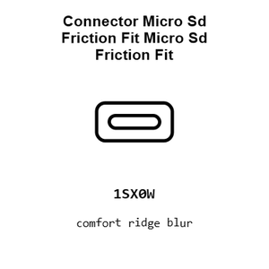 | [SVG](data/working_svg_square_pins.svg) · [PNG](data/working_svg_square_pins.png) · [Preview](data/working_svg_square_pins_300.png) |
| **Assembly** Component placement drawing. | 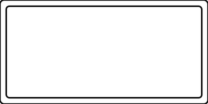 | [SVG](data/working_svg_assembly.svg) · [PNG](data/working_svg_assembly.png) · [Preview](data/working_svg_assembly_300.png) |
| **Assembly pinout** Placement drawing with the pins marked. |  | [SVG](data/working_svg_assembly_pins.svg) · [PNG](data/working_svg_assembly_pins.png) · [Preview](data/working_svg_assembly_pins_300.png) |
| **Top view** Package seen from above. | 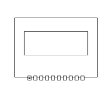 | [SVG](data/working_svg_top.svg) · [PNG](data/working_svg_top.png) · [Preview](data/working_svg_top_300.png) |
| **Bottom view** Package seen from below. |  | [SVG](data/working_svg_bottom.svg) · [PNG](data/working_svg_bottom.png) · [Preview](data/working_svg_bottom_300.png) |
| **Side view** Package profile. | 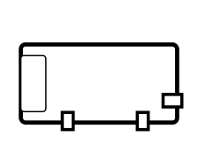 | [SVG](data/working_svg_side.svg) · [PNG](data/working_svg_side.png) · [Preview](data/working_svg_side_300.png) |
| **Outline** External shape of the part. | 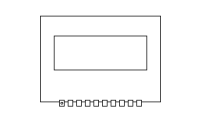 | [SVG](data/working_svg_outline.svg) · [PNG](data/working_svg_outline.png) · [Preview](data/working_svg_outline_300.png) |
| **Dimensions** Package outline with dimension arrows. | 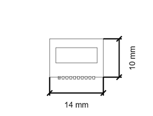 | [SVG](data/working_svg_dimensioned.svg) · [PNG](data/working_svg_dimensioned.png) · [Preview](data/working_svg_dimensioned_300.png) |
| **Dimensions with labels** Labelled package measurements. | 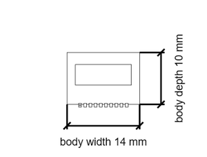 | [SVG](data/working_svg_dimensioned_titles.svg) · [PNG](data/working_svg_dimensioned_titles.png) · [Preview](data/working_svg_dimensioned_titles_300.png) |
| **Square summary** Component identification card. | 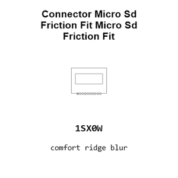 | [SVG](data/working_svg_square.svg) · [PNG](data/working_svg_square.png) · [Preview](data/working_svg_square_300.png) |
| **Square schematic** Schematic symbol on an identification card. | 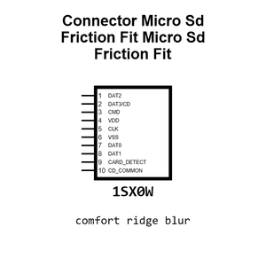 | [SVG](data/working_svg_square_schematic.svg) · [PNG](data/working_svg_square_schematic.png) · [Preview](data/working_svg_square_schematic_300.png) |
| **Part ID** Drawing labelled with the OOMP catalogue ID. | 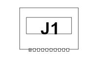 | [SVG](data/working_svg_part_id.svg) · [PNG](data/working_svg_part_id.png) · [Preview](data/working_svg_part_id_300.png) |
| **MD5 alpha** Drawing labelled with the short OOMP code. | 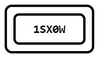 | [SVG](data/working_svg_md5_6_alpha.svg) · [PNG](data/working_svg_md5_6_alpha.png) · [Preview](data/working_svg_md5_6_alpha_300.png) |
| **BIP 39 words** Drawing labelled with the three-word identifier. | 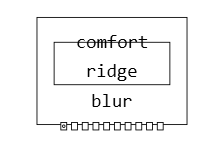 | [SVG](data/working_svg_bip_39_3_word.svg) · [PNG](data/working_svg_bip_39_3_word.png) · [Preview](data/working_svg_bip_39_3_word_300.png) |
| **Schematic** Electrical symbol for the part. | 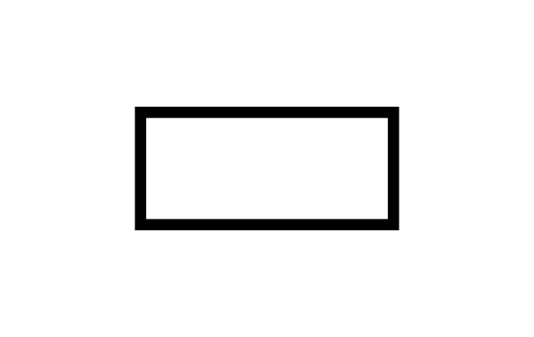 | [SVG](data/working_svg_schematic.svg) · [PNG](data/working_svg_schematic.png) |
| **Schematic pinout** Electrical symbol with pin labels. | 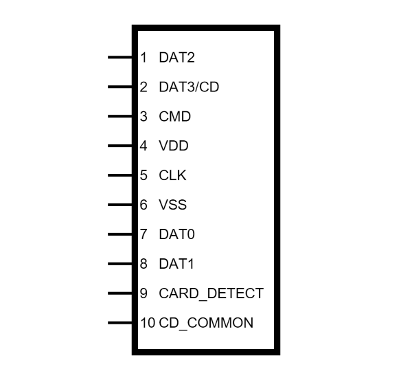 | [SVG](data/working_svg_schematic_pins.svg) · [PNG](data/working_svg_schematic_pins.png) |
| **Schematic with part ID** Symbol labelled with the OOMP catalogue ID. | 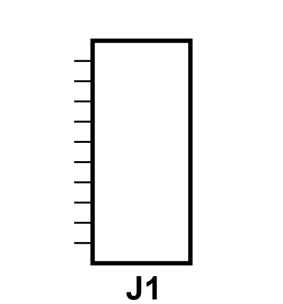 | [SVG](data/working_svg_schematic_part_id.svg) · [PNG](data/working_svg_schematic_part_id.png) |
| **Schematic with MD5 alpha** Symbol labelled with the short OOMP code. | 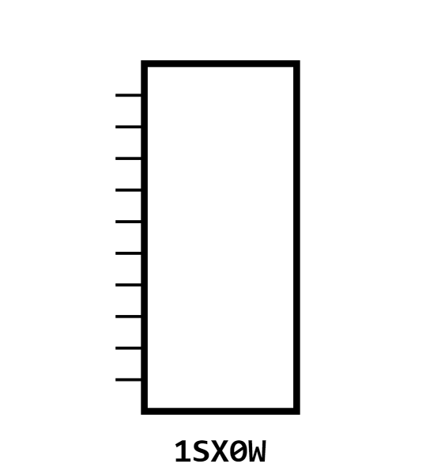 | [SVG](data/working_svg_schematic_md5_6_alpha.svg) · [PNG](data/working_svg_schematic_md5_6_alpha.png) |
| **Schematic with BIP 39 words** Symbol labelled with the three-word identifier. | 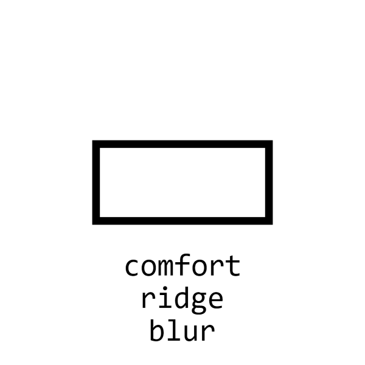 | [SVG](data/working_svg_schematic_bip_39_3_word.svg) · [PNG](data/working_svg_schematic_bip_39_3_word.png) |
| **KiCad asset licence** | — | [MD](data/kicad/LICENSE.md) |
| **KiCad library guide** | — | [MD](data/kicad/README.md) |
| **KiCad symbol and footprint overview** | 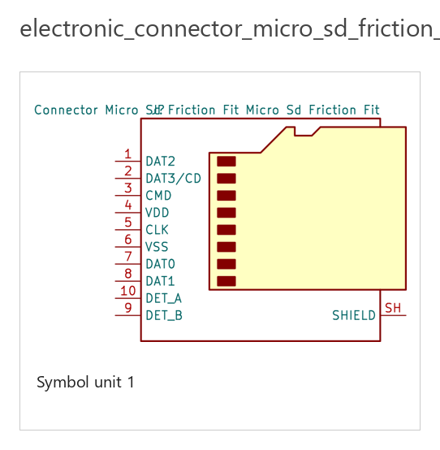 | [PNG](data/kicad/contact_sheet.png) |
| **KiCad symbol library** | — | [KICAD_SYM](data/kicad/electronic_connector_micro_sd_friction_fit_micro_sd_friction_fit.kicad_sym) |
| **Hand-solder footprint guide** | — | [MD](data/kicad/hand_solder/README.md) |
| **KiCad symbol, unit 1** | 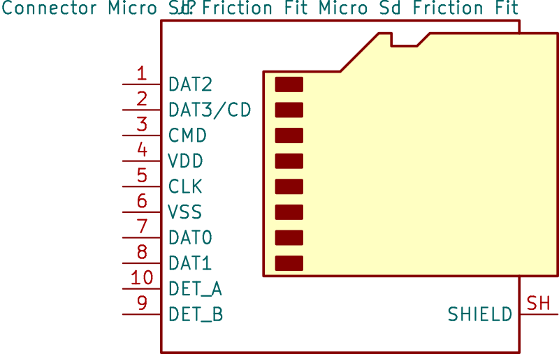 | [SVG](data/kicad/kicad_symbol_unit_1.svg) · [PNG](data/kicad/kicad_symbol_unit_1.png) |
| **KiCad symbol, unit 1 (square view)** | 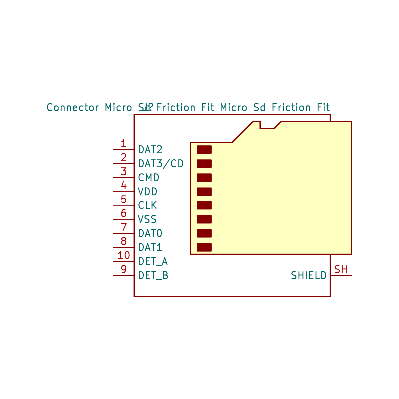 | [SVG](data/kicad/kicad_symbol_unit_1_square.svg) · [PNG](data/kicad/kicad_symbol_unit_1_square.png) |
| **Machine-solder footprint guide** | — | [MD](data/kicad/machine_solder/README.md) |
| **KiCad availability and source masters** | — | [JSON](data/kicad/manifest.json) · [YAML](data/kicad/manifest.yaml) |
| **Drawer label data** | — | [YAML](data/label_drawer.yaml) |
| **Generator label** |  | [SVG](generator_label.svg) · [JSON](generator_label.json) |
| **Small drawer label** | 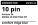 | [SVG](label_drawer_1_5x1.svg) |
| **Large drawer label** | 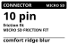 | [SVG](label_drawer_3x2.svg) |
| **Web catalogue file index** | — | [YAML](web.yaml) |
| **Part definition and build recipe** | — | [YAML](working.yaml) |

<!-- /oomp-part-file-table -->

[View this part on GitHub](https://github.com/oomlout/oomp_electronic_version_5/tree/main/parts/electronic_connector_micro_sd_friction_fit_micro_sd_friction_fit)

[Browse this category](../../navigation/electronic/connector/micro_sd/friction_fit/README.md)

---

This page is generated from the OOMP part definition by a Roboclick Jinja template. Edit the source taxonomy or template rather than this generated file.