# Connector Micro Usb MICRO-USB

`electronic_connector_micro_usb_surface_mount_9_pin_rocketscream_micro_usb`

Connector Micro Usb MICRO-USB is an OOMP electronic connector definition. It uses the micro usb package or form factor. Its nominal drawing size is 9.15 &#x00D7; 6.3 mm. The definition includes 9 documented pins.

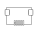

## At a glance

| Detail | Value |
| --- | --- |
| OOMP ID | `electronic_connector_micro_usb_surface_mount_9_pin_rocketscream_micro_usb` |
| Type | Connector |
| Package / style | micro usb |
| Nominal size | 9.15 &#x00D7; 6.3 mm |
| Documented pins | 9 |

## Classification

| Level | Value |
| --- | --- |
| 1 | `electronic` |
| 2 | `connector` |
| 3 | `micro_usb` |
| 4 | `surface_mount` |
| 5 | `9_pin` |
| 14 | `rocketscream` |
| 15 | `micro_usb` |

## Nominal dimensions

| Measurement | Value |
| --- | ---: |
| Length | 9.15 mm |
| Width | 6.3 mm |

## Identifiers

| Identifier | Value |
| --- | --- |
| Manufacturer part number | `MICRO-USB` |

## Pins

| Pin | Name | Type |
| ---: | --- | --- |
| 1 | 1 | signal |
| 2 | 2 | signal |
| 3 | 3 | signal |
| 4 | 4 | signal |
| 5 | 5 | signal |
| 6 | 6 | signal |
| 7 | 7 | signal |
| 8 | 8 | signal |
| 9 | 9 | signal |

## Used in projects

| Project | Quantity | References | Explore |
| --- | ---: | --- | --- |
| [Project electrolama/TinyReflowController Tiny Reflow Controller current](https://github.com/electrolama/TinyReflowController/tree/master/hardware/Revision%20A1) | 1 | J3 | [Board explorer](https://oomlout.github.io/oomp_electronic_version_5/parts/oomp_project_github_electrolama_tiny_reflow_controller_tiny_reflow_controller_current/board_explorer.html) · [OOMP project](https://github.com/oomlout/oomp_electronic_version_5/tree/main/parts/oomp_project_github_electrolama_tiny_reflow_controller_tiny_reflow_controller_current) |

## Files

[KiCad symbol, machine-solder and hand-solder footprints](data/kicad/README.md) · [Availability and source masters](data/kicad/manifest.yaml)

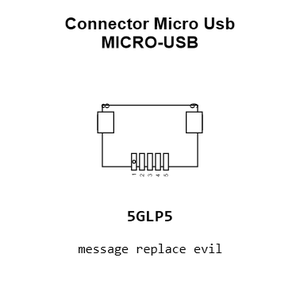

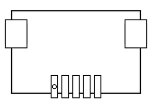

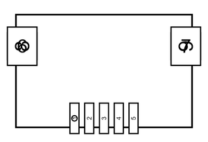

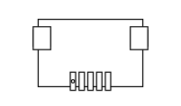

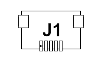

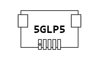

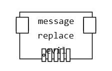

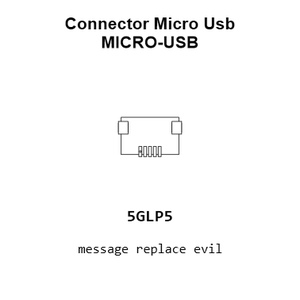

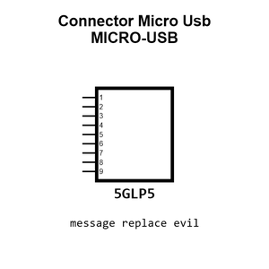

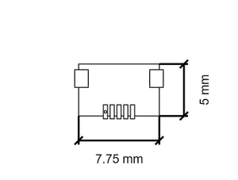

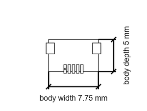

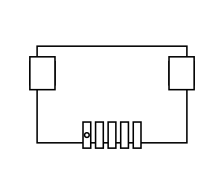

[View this part on GitHub](https://github.com/oomlout/oomp_electronic_version_5/tree/main/parts/electronic_connector_micro_usb_surface_mount_9_pin_rocketscream_micro_usb)

[Browse this category](../../navigation/electronic/connector/micro_usb/surface_mount/9_pin/rocketscream/README.md)

---

This page is generated from the OOMP part definition by a Roboclick Jinja template. Edit the source taxonomy or template rather than this generated file.