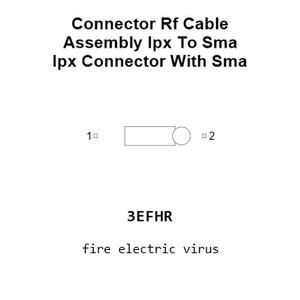
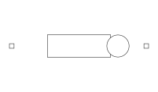
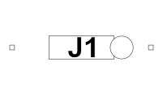
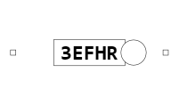
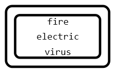
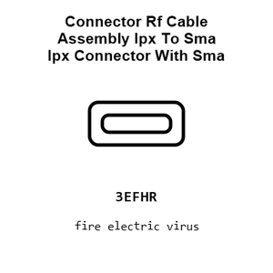
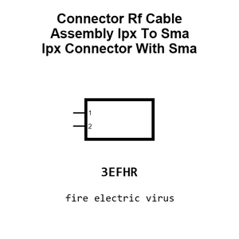
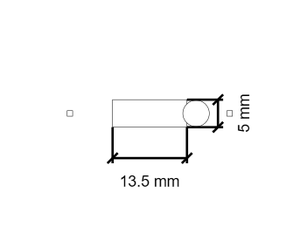
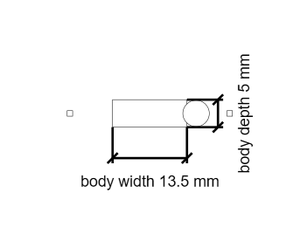
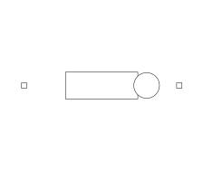

# Connector Rf Cable Assembly Ipx To Sma Ipx Connector With Sma

`electronic_connector_rf_cable_assembly_ipx_to_sma_ipx_connector_with_sma`

Connector Rf Cable Assembly Ipx To Sma Ipx Connector With Sma is an OOMP electronic connector definition. It uses the rf cable assembly package or form factor. Its nominal drawing size is 30.0 &#x00D7; 5.0 mm. The definition includes 2 documented pins.

## At a glance

| Detail | Value |
| --- | --- |
| OOMP ID | `electronic_connector_rf_cable_assembly_ipx_to_sma_ipx_connector_with_sma` |
| Type | Connector |
| Package / style | rf cable assembly |
| Nominal size | 30.0 &#x00D7; 5.0 mm |
| Documented pins | 2 |

## Classification

| Level | Value |
| --- | --- |
| 1 | `electronic` |
| 2 | `connector` |
| 3 | `rf_cable_assembly` |
| 7 | `ipx_to_sma` |
| 15 | `ipx_connector_with_sma` |

## Nominal dimensions

| Measurement | Value |
| --- | ---: |
| Length | 30.0 mm |
| Width | 5.0 mm |

## Pins

| Pin | Name | Type |
| ---: | --- | --- |
| 1 | 1 | signal |
| 2 | 2 | signal |

## Files

[KiCad symbol, machine-solder and hand-solder footprints](data/kicad/README.md) · [Availability and source masters](data/kicad/manifest.yaml)

[View this part on GitHub](https://github.com/oomlout/oomp_electronic_version_5/tree/main/parts/electronic_connector_rf_cable_assembly_ipx_to_sma_ipx_connector_with_sma)

[Browse this category](../../navigation/electronic/connector/rf_cable_assembly/ipx_to_sma/README.md)

---

This page is generated from the OOMP part definition by a Roboclick Jinja template. Edit the source taxonomy or template rather than this generated file.