# Connector Terminal Block 1776275-2

`electronic_connector_terminal_block_3_5_mm_pitch_through_hole_2_pin_te_connectivity_1776275_2`

Connector Terminal Block 1776275-2 is an OOMP electronic connector definition. It uses the terminal block package or form factor. Its nominal drawing size is 10.0 &#x00D7; 5.0 mm.

## At a glance

| Detail | Value |
| --- | --- |
| OOMP ID | `electronic_connector_terminal_block_3_5_mm_pitch_through_hole_2_pin_te_connectivity_1776275_2` |
| Type | Connector |
| Package / style | terminal block |
| Nominal size | 10.0 &#x00D7; 5.0 mm |

## Classification

| Level | Value |
| --- | --- |
| 1 | `electronic` |
| 2 | `connector` |
| 3 | `terminal_block` |
| 4 | `3_5_mm_pitch` |
| 5 | `through_hole` |
| 6 | `2_pin` |
| 14 | `te_connectivity` |
| 15 | `1776275_2` |

## Nominal dimensions

| Measurement | Value |
| --- | ---: |
| Length | 10.0 mm |
| Width | 5.0 mm |

## Identifiers

| Identifier | Value |
| --- | --- |
| Manufacturer part number | `1776275-2` |

## Used in projects

| Project | Quantity | References | Explore |
| --- | ---: | --- | --- |
| [Project electrolama/TinyReflowController Tiny Reflow Controller current](https://github.com/electrolama/TinyReflowController/tree/master/hardware/Revision%20A1) | 3 | J1, J2, J5 | [Board explorer](https://oomlout.github.io/oomp_electronic_version_5/parts/oomp_project_github_electrolama_tiny_reflow_controller_tiny_reflow_controller_current/board_explorer.html) · [OOMP project](https://github.com/oomlout/oomp_electronic_version_5/tree/main/parts/oomp_project_github_electrolama_tiny_reflow_controller_tiny_reflow_controller_current) |

## Files

[KiCad symbol, machine-solder and hand-solder footprints](data/kicad/README.md) · [Availability and source masters](data/kicad/manifest.yaml)

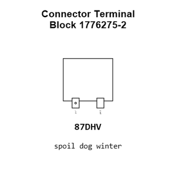

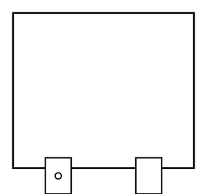

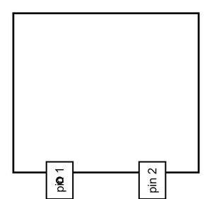

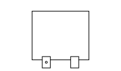

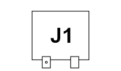

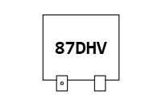

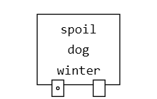

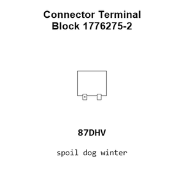

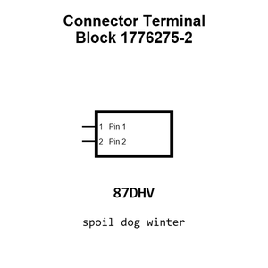

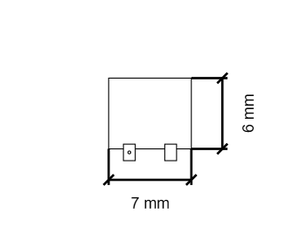

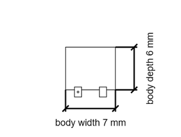

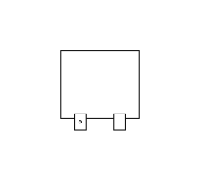

[View this part on GitHub](https://github.com/oomlout/oomp_electronic_version_5/tree/main/parts/electronic_connector_terminal_block_3_5_mm_pitch_through_hole_2_pin_te_connectivity_1776275_2)

[Browse this category](../../navigation/electronic/connector/terminal_block/3_5_mm_pitch/through_hole/2_pin/te_connectivity/README.md)

---

This page is generated from the OOMP part definition by a Roboclick Jinja template. Edit the source taxonomy or template rather than this generated file.