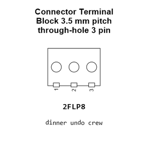
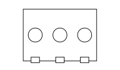
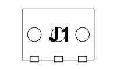
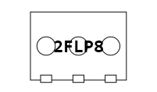
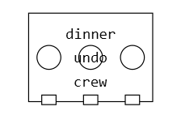
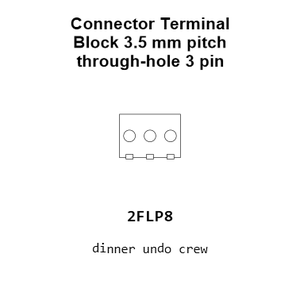
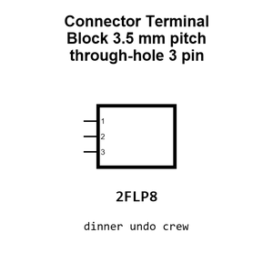
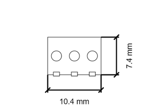
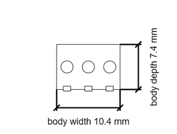
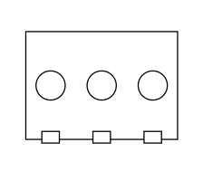

# Connector Terminal Block 3.5 mm pitch through-hole 3 pin Screw Terminal 1X03 P3 5 Mm

`electronic_connector_terminal_block_3_5_mm_pitch_through_hole_3_pin_screw_terminal_1x03_p3_5_mm`

Connector Terminal Block 3.5 mm pitch through-hole 3 pin Screw Terminal 1X03 P3 5 Mm is an OOMP electronic connector definition. It uses the terminal block package or form factor. Its nominal drawing size is 11.0 &#x00D7; 8.0 mm. The definition includes 3 documented pins.

## At a glance

| Detail | Value |
| --- | --- |
| OOMP ID | `electronic_connector_terminal_block_3_5_mm_pitch_through_hole_3_pin_screw_terminal_1x03_p3_5_mm` |
| Type | Connector |
| Package / style | terminal block |
| Nominal size | 11.0 &#x00D7; 8.0 mm |
| Documented pins | 3 |

## Classification

| Level | Value |
| --- | --- |
| 1 | `electronic` |
| 2 | `connector` |
| 3 | `terminal_block` |
| 4 | `3_5_mm_pitch` |
| 5 | `through_hole` |
| 6 | `3_pin` |
| 15 | `screw_terminal_1x03_p3_5_mm` |

## Nominal dimensions

| Measurement | Value |
| --- | ---: |
| Length | 11.0 mm |
| Width | 8.0 mm |

## Pins

| Pin | Name | Type |
| ---: | --- | --- |
| 1 | 1 | signal |
| 2 | 2 | signal |
| 3 | 3 | signal |

## Used in projects

| Project | Quantity | References | Explore |
| --- | ---: | --- | --- |
| [Project sparkfun/SparkFun_Qwiic_Current_Sensor_INA2XX Qwiic Current Sensor INA2XX current](https://github.com/sparkfun/SparkFun_Qwiic_Current_Sensor_INA2XX) | 1 | J5 | [Board explorer](https://oomlout.github.io/oomp_electronic_version_5/parts/oomp_project_github_sparkfun_spark_fun_qwiic_current_sensor_ina2_xx_qwiic_current_sensor_ina2xx_current/board_explorer.html) · [OOMP project](https://github.com/oomlout/oomp_electronic_version_5/tree/main/parts/oomp_project_github_sparkfun_spark_fun_qwiic_current_sensor_ina2_xx_qwiic_current_sensor_ina2xx_current) |

## Files

[KiCad symbol, machine-solder and hand-solder footprints](data/kicad/README.md) · [Availability and source masters](data/kicad/manifest.yaml)

[View this part on GitHub](https://github.com/oomlout/oomp_electronic_version_5/tree/main/parts/electronic_connector_terminal_block_3_5_mm_pitch_through_hole_3_pin_screw_terminal_1x03_p3_5_mm)

[Browse this category](../../navigation/electronic/connector/terminal_block/3_5_mm_pitch/through_hole/3_pin/README.md)

---

This page is generated from the OOMP part definition by a Roboclick Jinja template. Edit the source taxonomy or template rather than this generated file.