# Connector Terminal Block 17594

`electronic_connector_terminal_block_5_mm_pitch_through_hole_19_pin_blue_4ucon_technology_17594`

Connector Terminal Block 17594 is an OOMP electronic connector definition. It uses the terminal block package or form factor. Its nominal drawing size is 10.0 &#x00D7; 5.0 mm. The definition includes 19 documented pins.

## At a glance

| Detail | Value |
| --- | --- |
| OOMP ID | `electronic_connector_terminal_block_5_mm_pitch_through_hole_19_pin_blue_4ucon_technology_17594` |
| Type | Connector |
| Package / style | terminal block |
| Nominal size | 10.0 &#x00D7; 5.0 mm |
| Documented pins | 19 |

## Classification

| Level | Value |
| --- | --- |
| 1 | `electronic` |
| 2 | `connector` |
| 3 | `terminal_block` |
| 4 | `5_mm_pitch` |
| 5 | `through_hole` |
| 6 | `19_pin` |
| 7 | `blue` |
| 14 | `4ucon_technology` |
| 15 | `17594` |

## Nominal dimensions

| Measurement | Value |
| --- | ---: |
| Length | 10.0 mm |
| Width | 5.0 mm |

## Identifiers

| Identifier | Value |
| --- | --- |
| Manufacturer part number | `17594` |

## Pins

| Pin | Name | Type |
| ---: | --- | --- |
| 1 | 1 | passive |
| 2 | 2 | passive |
| 3 | 3 | passive |
| 4 | 4 | passive |
| 5 | 5 | passive |
| 6 | 6 | passive |
| 7 | 7 | passive |
| 8 | 8 | passive |
| 9 | 9 | passive |
| 10 | 10 | passive |
| 11 | 11 | passive |
| 12 | 12 | passive |
| 13 | 13 | passive |
| 14 | 14 | passive |
| 15 | 15 | passive |
| 16 | 16 | passive |
| 17 | 17 | passive |
| 18 | 18 | passive |
| 19 | 19 | passive |

## Files

[KiCad symbol, machine-solder and hand-solder footprints](data/kicad/README.md) · [Availability and source masters](data/kicad/manifest.yaml)

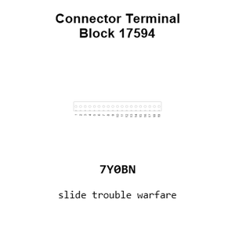

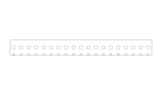

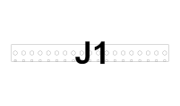

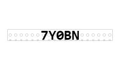

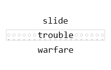

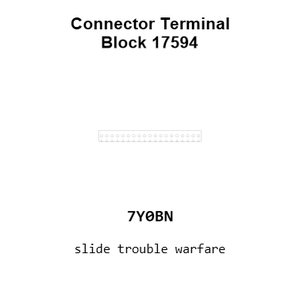

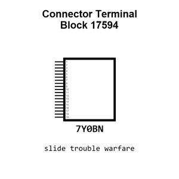

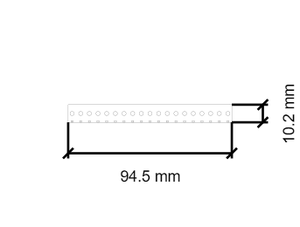

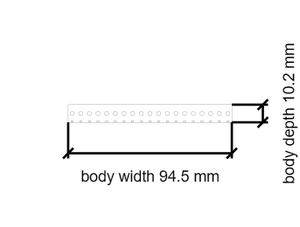

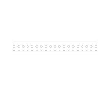

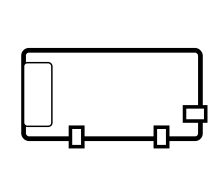

[View this part on GitHub](https://github.com/oomlout/oomp_electronic_version_5/tree/main/parts/electronic_connector_terminal_block_5_mm_pitch_through_hole_19_pin_blue_4ucon_technology_17594)

[Browse this category](../../navigation/electronic/connector/terminal_block/5_mm_pitch/through_hole/19_pin/blue/4ucon_technology/README.md)

---

This page is generated from the OOMP part definition by a Roboclick Jinja template. Edit the source taxonomy or template rather than this generated file.