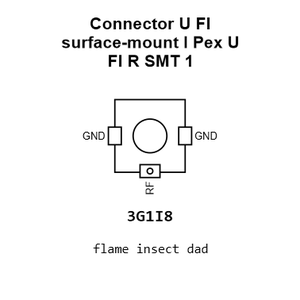
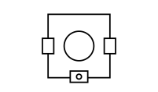
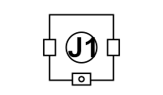
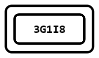
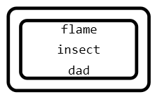
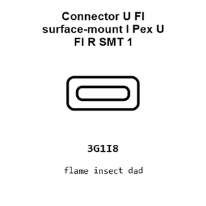
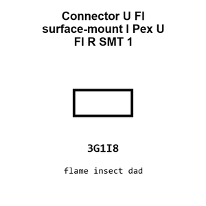
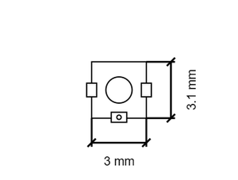
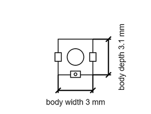
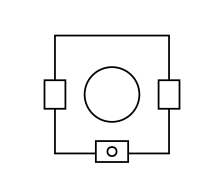

# Connector U Fl surface-mount I Pex U Fl R SMT 1

`electronic_connector_u_fl_surface_mount_i_pex_u_fl_r_smt_1`

Connector U Fl surface-mount I Pex U Fl R SMT 1 is an OOMP electronic connector definition. It uses the u fl package or form factor. Its nominal drawing size is 3.0 &#x00D7; 3.1 mm. The definition includes 3 documented pins.

## At a glance

| Detail | Value |
| --- | --- |
| OOMP ID | `electronic_connector_u_fl_surface_mount_i_pex_u_fl_r_smt_1` |
| Type | Connector |
| Package / style | u fl |
| Nominal size | 3.0 &#x00D7; 3.1 mm |
| Documented pins | 3 |

## Classification

| Level | Value |
| --- | --- |
| 1 | `electronic` |
| 2 | `connector` |
| 3 | `u_fl` |
| 4 | `surface_mount` |
| 14 | `i_pex` |
| 15 | `u_fl_r_smt_1` |

## Nominal dimensions

| Measurement | Value |
| --- | ---: |
| Length | 3.0 mm |
| Width | 3.1 mm |

## Pins

| Pin | Name | Type |
| ---: | --- | --- |
| 1 | RF | signal |
| 2 | GND | gnd |
| 3 | GND | gnd |

## Used in projects

| Project | Quantity | References | Explore |
| --- | ---: | --- | --- |
| [Project sparkfun/LTE_Cat_M1_Shield lte cat m1 shield sara r4 current](https://github.com/sparkfun/LTE_Cat_M1_Shield/blob/main/Hardware/lte_cat_m1_shield_sara-r4.brd) | 1 | J8 | [Board explorer](https://oomlout.github.io/oomp_electronic_version_5/parts/oomp_project_github_sparkfun_lte_cat_m1_shield_lte_cat_m1_shield_sara_r4_current/board_explorer.html) · [OOMP project](https://github.com/oomlout/oomp_electronic_version_5/tree/main/parts/oomp_project_github_sparkfun_lte_cat_m1_shield_lte_cat_m1_shield_sara_r4_current) |
| [Project sparkfun/MiniGen Spark Fun Mini Gen current](https://github.com/sparkfun/MiniGen/blob/master/Hardware/SparkFun_MiniGen.brd) | 1 | J1 | [Board explorer](https://oomlout.github.io/oomp_electronic_version_5/parts/oomp_project_github_sparkfun_mini_gen_spark_fun_mini_gen_current/board_explorer.html) · [OOMP project](https://github.com/oomlout/oomp_electronic_version_5/tree/main/parts/oomp_project_github_sparkfun_mini_gen_spark_fun_mini_gen_current) |
| [Project sparkfun/Simultaneous_RFID_Tag_Reader Simultaneous RFID Tag Reader current](https://github.com/sparkfun/Simultaneous_RFID_Tag_Reader/blob/master/Hardware/Simultaneous_RFID_Tag_Reader.brd) | 1 | J4 | [Board explorer](https://oomlout.github.io/oomp_electronic_version_5/parts/oomp_project_github_sparkfun_simultaneous_rfid_tag_reader_simultaneous_rfid_tag_reader_current/board_explorer.html) · [OOMP project](https://github.com/oomlout/oomp_electronic_version_5/tree/main/parts/oomp_project_github_sparkfun_simultaneous_rfid_tag_reader_simultaneous_rfid_tag_reader_current) |
| [Project sparkfun/SparkFun_Artemis_Global_Tracker Spark Fun Artemis Global Tracker current](https://github.com/sparkfun/SparkFun_Artemis_Global_Tracker/blob/main/Hardware/SparkFun_Artemis_Global_Tracker.brd) | 1 | J6 | [Board explorer](https://oomlout.github.io/oomp_electronic_version_5/parts/oomp_project_github_sparkfun_spark_fun_artemis_global_tracker_spark_fun_artemis_global_tracker_current/board_explorer.html) · [OOMP project](https://github.com/oomlout/oomp_electronic_version_5/tree/main/parts/oomp_project_github_sparkfun_spark_fun_artemis_global_tracker_spark_fun_artemis_global_tracker_current) |
| [Project sparkfun/SparkFun_GNSS_DAN-F10N GNSS DAN-F10N current](https://github.com/sparkfun/SparkFun_GNSS_DAN-F10N) | 1 | J4 | [Board explorer](https://oomlout.github.io/oomp_electronic_version_5/parts/oomp_project_github_sparkfun_spark_fun_gnss_dan_f10_n_gnss_dan_f10n_current/board_explorer.html) · [OOMP project](https://github.com/oomlout/oomp_electronic_version_5/tree/main/parts/oomp_project_github_sparkfun_spark_fun_gnss_dan_f10_n_gnss_dan_f10n_current) |
| [Project sparkfun/SparkFun_GNSS_Flex_Breakout GNSS Flex Breakout current](https://github.com/sparkfun/SparkFun_GNSS_Flex_Breakout) | 2 | J8, J9 | [Board explorer](https://oomlout.github.io/oomp_electronic_version_5/parts/oomp_project_github_sparkfun_spark_fun_gnss_flex_breakout_gnss_flex_breakout_current/board_explorer.html) · [OOMP project](https://github.com/oomlout/oomp_electronic_version_5/tree/main/parts/oomp_project_github_sparkfun_spark_fun_gnss_flex_breakout_gnss_flex_breakout_current) |
| [Project sparkfun/SparkFun_GNSS_Function_Board_NEO-M9N Spark Fun GNSS NEO M9 N current](https://github.com/sparkfun/SparkFun_GNSS_Function_Board_NEO-M9N/blob/main/Hardware/SparkFun_GNSS_NEO-M9N.brd) | 1 | E1 | [Board explorer](https://oomlout.github.io/oomp_electronic_version_5/parts/oomp_project_github_sparkfun_spark_fun_gnss_function_board_neo_m9_n_spark_fun_gnss_neo_m9_n_current/board_explorer.html) · [OOMP project](https://github.com/oomlout/oomp_electronic_version_5/tree/main/parts/oomp_project_github_sparkfun_spark_fun_gnss_function_board_neo_m9_n_spark_fun_gnss_neo_m9_n_current) |
| [Project sparkfun/SparkFun_GPS_Dead_Reckoning_PHat_ZED-F9R Spark Fun ZED F9 R Phat current](https://github.com/sparkfun/SparkFun_GPS_Dead_Reckoning_PHat_ZED-F9R/blob/master/Hardware/SparkFun_ZED-F9R_Phat_v11.brd) | 1 | J1 | [Board explorer](https://oomlout.github.io/oomp_electronic_version_5/parts/oomp_project_github_sparkfun_spark_fun_gps_dead_reckoning_phat_zed_f9_r_spark_fun_zed_f9_r_phat_current/board_explorer.html) · [OOMP project](https://github.com/oomlout/oomp_electronic_version_5/tree/main/parts/oomp_project_github_sparkfun_spark_fun_gps_dead_reckoning_phat_zed_f9_r_spark_fun_zed_f9_r_phat_current) |
| [Project sparkfun/SparkFun_GPS_Dead_Reckoning_ZED-F9R Spark Fun ZED F9 R u FL current](https://github.com/sparkfun/SparkFun_GPS_Dead_Reckoning_ZED-F9R/blob/master/Hardware/UFL/SparkFun_ZED-F9R_v12_uFL.brd) | 1 | J1 | [Board explorer](https://oomlout.github.io/oomp_electronic_version_5/parts/oomp_project_github_sparkfun_spark_fun_gps_dead_reckoning_zed_f9_r_spark_fun_zed_f9_r_u_fl_current/board_explorer.html) · [OOMP project](https://github.com/oomlout/oomp_electronic_version_5/tree/main/parts/oomp_project_github_sparkfun_spark_fun_gps_dead_reckoning_zed_f9_r_spark_fun_zed_f9_r_u_fl_current) |
| [Project sparkfun/SparkFun_MicroMod_LTE_GNSS_Function_Board_u-blox_SARA-R5 Spark Fun Micro Mod Function SARA R5 current](https://github.com/sparkfun/SparkFun_MicroMod_LTE_GNSS_Function_Board_u-blox_SARA-R5/blob/main/Hardware/SparkFun_MicroMod_Function_SARA-R5.brd) | 2 | J2, J4 | [Board explorer](https://oomlout.github.io/oomp_electronic_version_5/parts/oomp_project_github_sparkfun_spark_fun_micro_mod_lte_gnss_function_board_u_blox_sara_r5_spark_fun_micro_mod_function_sara_r5_current/board_explorer.html) · [OOMP project](https://github.com/oomlout/oomp_electronic_version_5/tree/main/parts/oomp_project_github_sparkfun_spark_fun_micro_mod_lte_gnss_function_board_u_blox_sara_r5_spark_fun_micro_mod_function_sara_r5_current) |
| [Project sparkfun/SparkFun_RTK_Facet Spark Fun RTK Facet L Band Main current](https://github.com/sparkfun/SparkFun_RTK_Facet/blob/main/Hardware/Main-LBand/SparkFun%20RTK%20Facet%20L-Band%20-%20Main.brd) | 1 | J2 | [Board explorer](https://oomlout.github.io/oomp_electronic_version_5/parts/oomp_project_github_sparkfun_spark_fun_rtk_facet_spark_fun_rtk_facet_l_band_main_current/board_explorer.html) · [OOMP project](https://github.com/oomlout/oomp_electronic_version_5/tree/main/parts/oomp_project_github_sparkfun_spark_fun_rtk_facet_spark_fun_rtk_facet_l_band_main_current) |
| [Project sparkfun/SparkFun_RTK_Facet Spark Fun RTK Facet Main current](https://github.com/sparkfun/SparkFun_RTK_Facet/blob/main/Hardware/Main/SparkFun%20RTK%20Facet%20-%20Main.brd) | 1 | J2 | [Board explorer](https://oomlout.github.io/oomp_electronic_version_5/parts/oomp_project_github_sparkfun_spark_fun_rtk_facet_spark_fun_rtk_facet_main_current/board_explorer.html) · [OOMP project](https://github.com/oomlout/oomp_electronic_version_5/tree/main/parts/oomp_project_github_sparkfun_spark_fun_rtk_facet_spark_fun_rtk_facet_main_current) |
| [Project sparkfun/SparkFun_Satellite_Transceiver-Swarm_M138 Satellite Transceiver Breakout Swarm M138 current](https://github.com/sparkfun/SparkFun_Satellite_Transceiver-Swarm_M138/blob/main/Hardware/Satellite_Transceiver_Breakout__Swarm_M138.brd) | 2 | GPS0, VHF0 | [Board explorer](https://oomlout.github.io/oomp_electronic_version_5/parts/oomp_project_github_sparkfun_spark_fun_satellite_transceiver_swarm_m138_satellite_transceiver_breakout_swarm_m138_current/board_explorer.html) · [OOMP project](https://github.com/oomlout/oomp_electronic_version_5/tree/main/parts/oomp_project_github_sparkfun_spark_fun_satellite_transceiver_swarm_m138_satellite_transceiver_breakout_swarm_m138_current) |
| [Project sparkfun/SparkFun_u-blox_NEO-M8U Spark Fun NEO M8 U current](https://github.com/sparkfun/SparkFun_u-blox_NEO-M8U/blob/master/Hardware/SparkFun%20NEO-M8U.brd) | 1 | J7 | [Board explorer](https://oomlout.github.io/oomp_electronic_version_5/parts/oomp_project_github_sparkfun_spark_fun_u_blox_neo_m8_u_spark_fun_neo_m8_u_current/board_explorer.html) · [OOMP project](https://github.com/oomlout/oomp_electronic_version_5/tree/main/parts/oomp_project_github_sparkfun_spark_fun_u_blox_neo_m8_u_spark_fun_neo_m8_u_current) |
| [Project sparkfun/SparkFun_u-Blox_NEO_M9N Spark Fun GPS NEO M9 N u FL current](https://github.com/sparkfun/SparkFun_u-Blox_NEO_M9N/blob/master/Hardware/SparkFun%20GPS%20NEO_M9N_uFL/SparkFun%20GPS%20NEO_M9N_uFL.brd) | 1 | J13 | [Board explorer](https://oomlout.github.io/oomp_electronic_version_5/parts/oomp_project_github_sparkfun_spark_fun_u_blox_neo_m9_n_spark_fun_gps_neo_m9_n_u_fl_current/board_explorer.html) · [OOMP project](https://github.com/oomlout/oomp_electronic_version_5/tree/main/parts/oomp_project_github_sparkfun_spark_fun_u_blox_neo_m9_n_spark_fun_gps_neo_m9_n_u_fl_current) |

## Files

[KiCad symbol, machine-solder and hand-solder footprints](data/kicad/README.md) · [Availability and source masters](data/kicad/manifest.yaml)

[View this part on GitHub](https://github.com/oomlout/oomp_electronic_version_5/tree/main/parts/electronic_connector_u_fl_surface_mount_i_pex_u_fl_r_smt_1)

[Browse this category](../../navigation/electronic/connector/u_fl/surface_mount/i_pex/README.md)

---

This page is generated from the OOMP part definition by a Roboclick Jinja template. Edit the source taxonomy or template rather than this generated file.