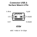

# Connector USB A Surface Mount 4 Pin

`electronic_connector_usb_a_surface_mount_4_pin_shenzhen_jing_tuo_jin_electronics_912121a2023s10100`

Connector USB A Surface Mount 4 Pin is an OOMP electronic connector definition. It uses the usb a package or form factor. Its nominal drawing size is 14.3 &#x00D7; 10.6 mm. The definition includes 6 documented pins.

  
   
  <strong>Pinout</strong> · click for the full-size SVG

## At a glance

| Detail | Value |
| --- | --- |
| OOMP ID | `electronic_connector_usb_a_surface_mount_4_pin_shenzhen_jing_tuo_jin_electronics_912121a2023s10100` |
| Type | Connector |
| Package / style | usb a |
| Nominal size | 14.3 &#x00D7; 10.6 mm |
| Documented pins | 6 |

## Diagram gallery

<table>

  <tr>
  
    <td align="center" width="33%">
       
      <strong>Assembly</strong>
    </td>
  
    <td align="center" width="33%">
       
      <strong>Outline</strong>
    </td>
  
    <td align="center" width="33%">
       
      <strong>Part ID</strong>
    </td>
  
  </tr>

  <tr>
  
    <td align="center" width="33%">
       
      <strong>MD5 alpha</strong>
    </td>
  
    <td align="center" width="33%">
       
      <strong>BIP 39 words</strong>
    </td>
  
    <td align="center" width="33%">
       
      <strong>Square summary</strong>
    </td>
  
  </tr>

  <tr>
  
    <td align="center" width="33%">
       
      <strong>Dimensions</strong>
    </td>
  
    <td align="center" width="33%">
       
      <strong>Dimensions with labels</strong>
    </td>
  
  </tr>

</table>

Each preview links to its full-size vector drawing.

## Classification

| Level | Value |
| --- | --- |
| 1 | `electronic` |
| 2 | `connector` |
| 3 | `usb_a` |
| 4 | `surface_mount` |
| 5 | `4_pin` |
| 14 | `shenzhen_jing_tuo_jin_electronics` |
| 15 | `912121a2023s10100` |

## Nominal dimensions

| Measurement | Value |
| --- | ---: |
| Length | 14.3 mm |
| Width | 10.6 mm |

## Identifiers

| Identifier | Value |
| --- | --- |
| Manufacturer part number | `912-121A2023S10100` |
| LCSC | `C42428` |

## Pins

| Pin | Name | Type |
| ---: | --- | --- |
| 1 | vbus | power |
| 2 | usb_negative | signal |
| 3 | usb_positive | signal |
| 4 | gnd | power |
| 5 | shield | shield |
| 6 | shield | shield |

## Files

- [Pinout drawing](working_svg_square_pins.svg)
- [Assembly drawing](working_svg_assembly.svg)
- [Outline drawing](working_svg_outline.svg)
- [Part ID drawing](working_svg_part_id.svg)
- [MD5 alpha drawing](working_svg_md5_6_alpha.svg)
- [BIP 39 words drawing](working_svg_bip_39_3_word.svg)
- [Square summary](working_svg_square.svg)
- [Dimensioned drawing](working_svg_dimensioned_titles.svg)

- [Datasheet](datasheet.pdf)

- [Structured definition](working.yaml)

[View this part on GitHub](https://github.com/oomlout/oomp_electronic_version_5/tree/main/parts/electronic_connector_usb_a_surface_mount_4_pin_shenzhen_jing_tuo_jin_electronics_912121a2023s10100)

---

This page is generated from the OOMP part definition by a Roboclick Jinja template. Edit the source taxonomy or template rather than this generated file.