# Connector USB-C surface-mount 12 pin Usb C 12 Pin Generic

`electronic_connector_usb_c_surface_mount_12_pin_usb_c_12_pin_generic`

Connector USB-C surface-mount 12 pin Usb C 12 Pin Generic is an OOMP electronic connector definition. It uses the usb c package or form factor. Its nominal drawing size is 8.94 &#x00D7; 7.35 mm.

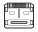

## At a glance

| Detail | Value |
| --- | --- |
| OOMP ID | `electronic_connector_usb_c_surface_mount_12_pin_usb_c_12_pin_generic` |
| Type | Connector |
| Package / style | usb c |
| Nominal size | 8.94 &#x00D7; 7.35 mm |

## Classification

| Level | Value |
| --- | --- |
| 1 | `electronic` |
| 2 | `connector` |
| 3 | `usb_c` |
| 4 | `surface_mount` |
| 5 | `12_pin` |
| 15 | `usb_c_12_pin_generic` |

## Nominal dimensions

| Measurement | Value |
| --- | ---: |
| Length | 8.94 mm |
| Width | 7.35 mm |

## Used in projects

| Project | Quantity | References | Explore |
| --- | ---: | --- | --- |
| [Project electrolama/oshcamp23-badge OSHCamp 2023 Badge current](https://github.com/electrolama/oshcamp23-badge/tree/main/oomp/version_current/working) | 1 | CON1 | [Board explorer](https://oomlout.github.io/oomp_electronic_version_5/parts/oomp_project_github_electrolama_oshcamp23_badge_oshcamp23_badge_current/board_explorer.html) · [OOMP project](https://github.com/oomlout/oomp_electronic_version_5/tree/main/parts/oomp_project_github_electrolama_oshcamp23_badge_oshcamp23_badge_current) |

## Files

[KiCad symbol, machine-solder and hand-solder footprints](data/kicad/README.md) · [Availability and source masters](data/kicad/manifest.yaml)

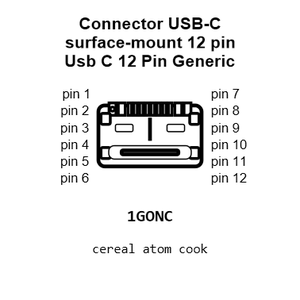

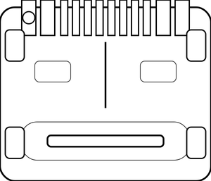

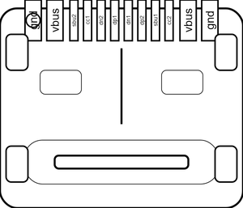

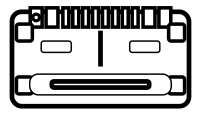

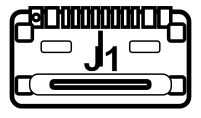

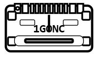

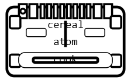

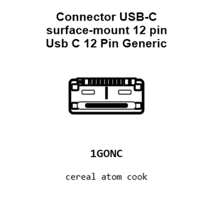

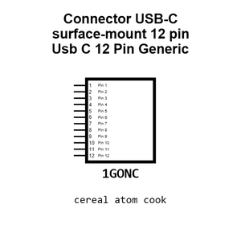

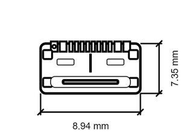

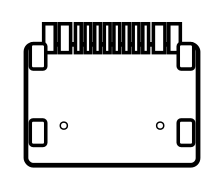

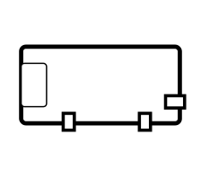

[View this part on GitHub](https://github.com/oomlout/oomp_electronic_version_5/tree/main/parts/electronic_connector_usb_c_surface_mount_12_pin_usb_c_12_pin_generic)

[Browse this category](../../navigation/electronic/connector/usb_c/surface_mount/12_pin/README.md)

---

This page is generated from the OOMP part definition by a Roboclick Jinja template. Edit the source taxonomy or template rather than this generated file.