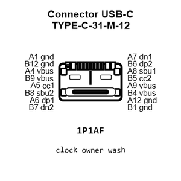
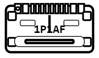
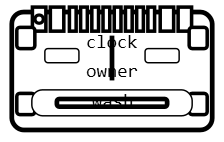
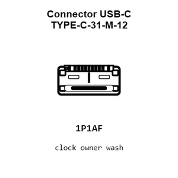
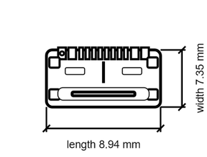

# Connector USB-C TYPE-C-31-M-12

`electronic_connector_usb_c_surface_mount_16_pin_korean_hroparts_elec_typec31m12`

Connector USB-C TYPE-C-31-M-12 is an OOMP electronic connector definition. It uses the usb c package or form factor. Its nominal drawing size is 8.94 &#x00D7; 7.35 mm. The definition includes 16 documented pins.

## At a glance

| Detail | Value |
| --- | --- |
| OOMP ID | `electronic_connector_usb_c_surface_mount_16_pin_korean_hroparts_elec_typec31m12` |
| Type | Connector |
| Package / style | usb c |
| Nominal size | 8.94 &#x00D7; 7.35 mm |
| Documented pins | 16 |

## Classification

| Level | Value |
| --- | --- |
| 1 | `electronic` |
| 2 | `connector` |
| 3 | `usb_c` |
| 4 | `surface_mount` |
| 5 | `16_pin` |
| 14 | `korean_hroparts_elec` |
| 15 | `typec31m12` |

## Nominal dimensions

| Measurement | Value |
| --- | ---: |
| Length | 8.94 mm |
| Width | 7.35 mm |

## Identifiers

| Identifier | Value |
| --- | --- |
| Manufacturer part number | `TYPE-C-31-M-12` |
| LCSC | [`C165948`](https://www.lcsc.com/product-detail/C165948.html) |

## Pins

| Pin | Name | Type |
| ---: | --- | --- |
| A1 | gnd | power |
| B12 | gnd | power |
| A4 | vbus | power |
| B9 | vbus | power |
| A5 | cc1 | signal |
| B8 | sbu2 | signal |
| A6 | dp1 | signal |
| B7 | dn2 | signal |
| A7 | dn1 | signal |
| B6 | dp2 | signal |
| A8 | sbu1 | signal |
| B5 | cc2 | signal |
| A9 | vbus | power |
| B4 | vbus | power |
| A12 | gnd | power |
| B1 | gnd | power |

## Datasheet

[View the datasheet](data/datasheet.pdf)

## Used in projects

| Project | Quantity | References | Explore |
| --- | ---: | --- | --- |
| [Project dangerousprototypes/buspirate5_hardware 5_rev10a](https://github.com/DangerousPrototypes/BusPirate5-hardware) | 1 | J202 | [Board explorer](https://oomlout.github.io/oomp_electronic_version_5/parts/oomp_project_github_dangerousprototypes_buspirate5_hardware_5_rev10a/board_explorer.html) · [OOMP project](https://github.com/oomlout/oomp_electronic_version_5/tree/main/parts/oomp_project_github_dangerousprototypes_buspirate5_hardware_5_rev10a) |
| [Project electrolama/pt1 current](https://github.com/electrolama/pt1) | 2 | CON1, CON2 | [Board explorer](https://oomlout.github.io/oomp_electronic_version_5/parts/oomp_project_github_electrolama_pt1_current/board_explorer.html) · [OOMP project](https://github.com/oomlout/oomp_electronic_version_5/tree/main/parts/oomp_project_github_electrolama_pt1_current) |

## Files

[KiCad symbol, machine-solder and hand-solder footprints](data/kicad/README.md) · [Availability and source masters](data/kicad/manifest.yaml)

[View this part on GitHub](https://github.com/oomlout/oomp_electronic_version_5/tree/main/parts/electronic_connector_usb_c_surface_mount_16_pin_korean_hroparts_elec_typec31m12)

[Browse this category](../../navigation/electronic/connector/usb_c/surface_mount/16_pin/korean_hroparts_elec/README.md)

---

This page is generated from the OOMP part definition by a Roboclick Jinja template. Edit the source taxonomy or template rather than this generated file.