# Connector USB-C TYPE-C 16PIN 2MD(073)

`electronic_connector_usb_c_surface_mount_16_pin_shou_han_type_c_16pin_2md_073`

Connector USB-C TYPE-C 16PIN 2MD(073) is an OOMP electronic connector definition. It uses the usb c package or form factor. Its nominal drawing size is 8.94 &#x00D7; 7.35 mm. The definition includes 17 documented pins.

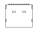

## At a glance

| Detail | Value |
| --- | --- |
| OOMP ID | `electronic_connector_usb_c_surface_mount_16_pin_shou_han_type_c_16pin_2md_073` |
| Type | Connector |
| Package / style | usb c |
| Nominal size | 8.94 &#x00D7; 7.35 mm |
| Documented pins | 17 |

## Classification

| Level | Value |
| --- | --- |
| 1 | `electronic` |
| 2 | `connector` |
| 3 | `usb_c` |
| 4 | `surface_mount` |
| 5 | `16_pin` |
| 14 | `shou_han` |
| 15 | `type_c_16pin_2md_073` |

## Nominal dimensions

| Measurement | Value |
| --- | ---: |
| Height | 3.16 mm |
| Length | 8.94 mm |
| Width | 7.35 mm |

## Identifiers

| Identifier | Value |
| --- | --- |
| Manufacturer part number | `TYPE-C 16PIN 2MD(073)` |
| LCSC | [`C2765186`](https://www.lcsc.com/product-detail/C2765186.html) |

## Pins

| Pin | Name | Type |
| ---: | --- | --- |
| A1 | gnd | power |
| A12 | gnd | power |
| A4 | vbus | power |
| A5 | cc1 | signal |
| A6 | usb_d_plus | signal |
| A7 | usb_d_minus | signal |
| A8 | sbu1 | signal |
| A9 | vbus | power |
| B1 | gnd | power |
| B12 | gnd | power |
| B4 | vbus | power |
| B5 | cc2 | signal |
| B6 | usb_d_plus | signal |
| B7 | usb_d_minus | signal |
| B8 | sbu2 | signal |
| B9 | vbus | power |
| S1 | shield | passive |

## Datasheet

[View the datasheet](data/datasheet.pdf)

## Used in projects

| Project | Quantity | References | Explore |
| --- | ---: | --- | --- |
| [Project hanqaqa/easyduino ESP32 current](https://github.com/Hanqaqa/Easyduino/tree/master/ESP32) | 1 | J1 | [Board explorer](https://oomlout.github.io/oomp_electronic_version_5/parts/oomp_project_github_hanqaqa_easyduino_esp32_current/board_explorer.html) · [OOMP project](https://github.com/oomlout/oomp_electronic_version_5/tree/main/parts/oomp_project_github_hanqaqa_easyduino_esp32_current) |

## Files

[KiCad symbol, machine-solder and hand-solder footprints](data/kicad/README.md) · [Availability and source masters](data/kicad/manifest.yaml)

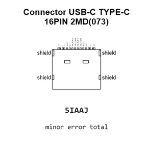

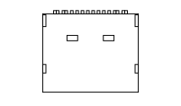

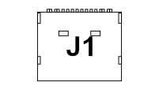

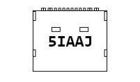

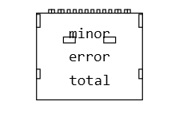

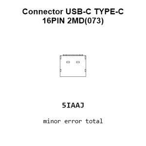

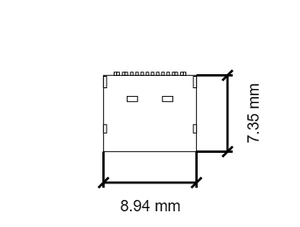

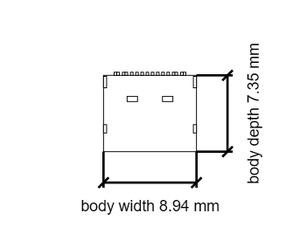

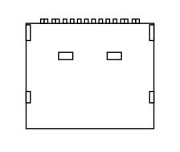

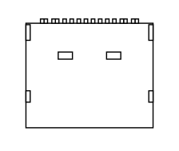

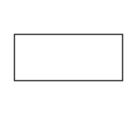

[View this part on GitHub](https://github.com/oomlout/oomp_electronic_version_5/tree/main/parts/electronic_connector_usb_c_surface_mount_16_pin_shou_han_type_c_16pin_2md_073)

[Browse this category](../../navigation/electronic/connector/usb_c/surface_mount/16_pin/shou_han/README.md)

---

This page is generated from the OOMP part definition by a Roboclick Jinja template. Edit the source taxonomy or template rather than this generated file.