# Crystal 26 MHz 20 pF 2016 4-pin

`electronic_crystal_2016_surface_mount_4_pin_26_mhz_20_pf_txc_nx3225gd`

Crystal 26 MHz 20 pF 2016 4-pin is an OOMP electronic crystal definition. It uses the 2016 package or form factor. Its nominal drawing size is 2.0 &#x00D7; 1.6 mm. The definition includes 4 documented pins.

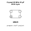

## At a glance

| Detail | Value |
| --- | --- |
| OOMP ID | `electronic_crystal_2016_surface_mount_4_pin_26_mhz_20_pf_txc_nx3225gd` |
| Type | Crystal |
| Package / style | 2016 |
| Nominal size | 2.0 &#x00D7; 1.6 mm |
| Documented pins | 4 |

## Classification

| Level | Value |
| --- | --- |
| 1 | `electronic` |
| 2 | `crystal` |
| 3 | `2016` |
| 4 | `surface_mount` |
| 5 | `4_pin` |
| 6 | `26_mhz` |
| 7 | `20_pf` |
| 14 | `txc` |
| 15 | `nx3225gd` |

## Nominal dimensions

| Measurement | Value |
| --- | ---: |
| Height | 0.8 mm |
| Length | 2.0 mm |
| Width | 1.6 mm |

## Pins

| Pin | Name | Type |
| ---: | --- | --- |
| 1 | 1 | signal |
| 2 | 2 | signal |
| 3 | 3 | signal |
| 4 | 4 | signal |

## Used in projects

| Project | Quantity | References | Explore |
| --- | ---: | --- | --- |
| [Project electrolama/oshcamp23-badge OSHCamp 2023 Badge current](https://github.com/electrolama/oshcamp23-badge/tree/main/oomp/version_current/working) | 2 | XT1, XT2 | [Board explorer](https://oomlout.github.io/oomp_electronic_version_5/parts/oomp_project_github_electrolama_oshcamp23_badge_oshcamp23_badge_current/board_explorer.html) · [OOMP project](https://github.com/oomlout/oomp_electronic_version_5/tree/main/parts/oomp_project_github_electrolama_oshcamp23_badge_oshcamp23_badge_current) |

## Files

[KiCad symbol, machine-solder and hand-solder footprints](data/kicad/README.md) · [Availability and source masters](data/kicad/manifest.yaml)

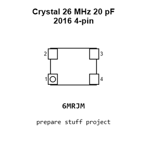

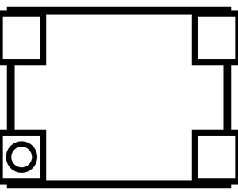

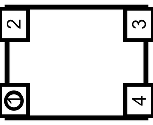

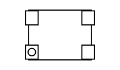

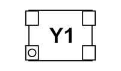

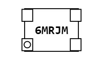

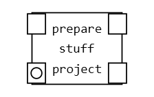

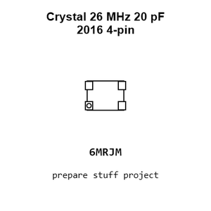

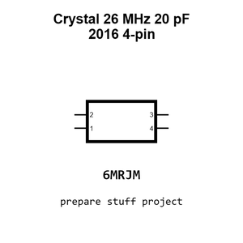

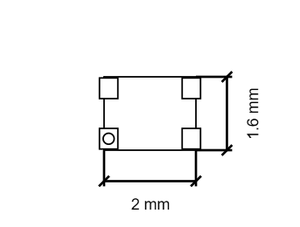

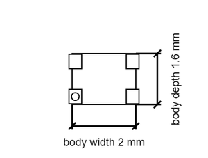

[View this part on GitHub](https://github.com/oomlout/oomp_electronic_version_5/tree/main/parts/electronic_crystal_2016_surface_mount_4_pin_26_mhz_20_pf_txc_nx3225gd)

[Browse this category](../../navigation/electronic/crystal/2016/surface_mount/4_pin/26_mhz/20_pf/txc/README.md)

---

This page is generated from the OOMP part definition by a Roboclick Jinja template. Edit the source taxonomy or template rather than this generated file.