# Crystal 32.768 kHz 12.5 pF 3215 2-pin

`electronic_crystal_3215_surface_mount_2_pin_32_768_khz_12_5_pf`

Crystal 32.768 kHz 12.5 pF 3215 2-pin is an OOMP electronic crystal definition. It uses the 3215 package or form factor. Its nominal drawing size is 3.2 &#x00D7; 1.5 mm. The definition includes 2 documented pins.

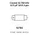

## At a glance

| Detail | Value |
| --- | --- |
| OOMP ID | `electronic_crystal_3215_surface_mount_2_pin_32_768_khz_12_5_pf` |
| Type | Crystal |
| Package / style | 3215 |
| Nominal size | 3.2 &#x00D7; 1.5 mm |
| Documented pins | 2 |

## Classification

| Level | Value |
| --- | --- |
| 1 | `electronic` |
| 2 | `crystal` |
| 3 | `3215` |
| 4 | `surface_mount` |
| 5 | `2_pin` |
| 6 | `32_768_khz` |
| 7 | `12_5_pf` |

## Nominal dimensions

| Measurement | Value |
| --- | ---: |
| Length | 3.2 mm |
| Width | 1.5 mm |

## Identifiers

| Identifier | Value |
| --- | --- |
| Manufacturer part number | `Q13FC13500004` |
| LCSC | [`C32346`](https://www.lcsc.com/product-detail/C32346.html) |

## Pins

| Pin | Name | Type |
| ---: | --- | --- |
| 1 | 1 | signal |
| 2 | 2 | signal |

## Used in projects

| Project | Quantity | References | Explore |
| --- | ---: | --- | --- |
| [Project hanqaqa/easyduino STM32F103 Bluepill current](https://github.com/Hanqaqa/Easyduino/tree/master/STM32F103%20Bluepill) | 1 | Y2 | [Board explorer](https://oomlout.github.io/oomp_electronic_version_5/parts/oomp_project_github_hanqaqa_easyduino_stm32f103_bluepill_current/board_explorer.html) · [OOMP project](https://github.com/oomlout/oomp_electronic_version_5/tree/main/parts/oomp_project_github_hanqaqa_easyduino_stm32f103_bluepill_current) |

## Files

[KiCad symbol, machine-solder and hand-solder footprints](data/kicad/README.md) · [Availability and source masters](data/kicad/manifest.yaml)

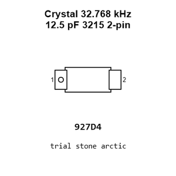

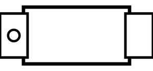

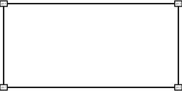

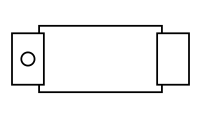

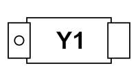

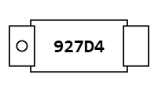

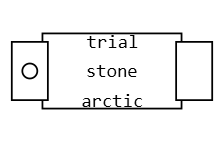

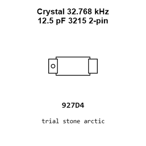

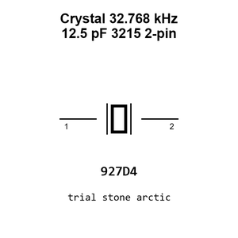

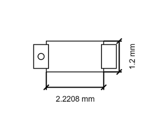

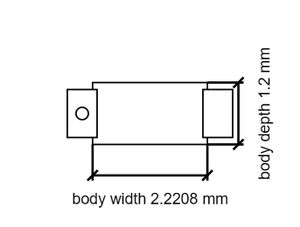

[View this part on GitHub](https://github.com/oomlout/oomp_electronic_version_5/tree/main/parts/electronic_crystal_3215_surface_mount_2_pin_32_768_khz_12_5_pf)

[Browse this category](../../navigation/electronic/crystal/3215/surface_mount/2_pin/32_768_khz/README.md)

---

This page is generated from the OOMP part definition by a Roboclick Jinja template. Edit the source taxonomy or template rather than this generated file.