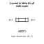
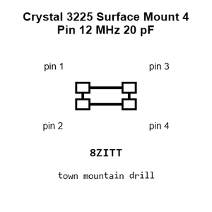
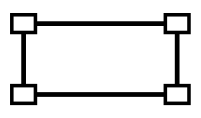
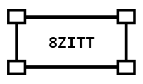
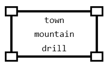
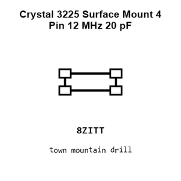
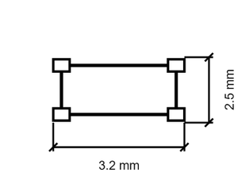

# Crystal Surface Mount 4 Pin 12 Mhz 3225

`electronic_crystal_3225_surface_mount_4_pin_12_mhz_20_pf`

Crystal Surface Mount 4 Pin 12 Mhz 3225 is an OOMP electronic crystal definition. It uses the 3225 package or form factor. Its nominal drawing size is 3.2 &#x00D7; 2.5 mm.

## At a glance

| Detail | Value |
| --- | --- |
| OOMP ID | `electronic_crystal_3225_surface_mount_4_pin_12_mhz_20_pf` |
| Type | Crystal |
| Package / style | 3225 |
| Nominal size | 3.2 &#x00D7; 2.5 mm |

## Classification

| Level | Value |
| --- | --- |
| 1 | `electronic` |
| 2 | `crystal` |
| 3 | `3225` |
| 4 | `surface_mount` |
| 5 | `4_pin` |
| 6 | `12_mhz` |
| 7 | `20_pf` |

## Nominal dimensions

| Measurement | Value |
| --- | ---: |
| Length | 3.2 mm |
| Width | 2.5 mm |

## Files

[View this part on GitHub](https://github.com/oomlout/oomp_electronic_version_5/tree/main/parts/electronic_crystal_3225_surface_mount_4_pin_12_mhz_20_pf)

[Browse this category](../../navigation/electronic/crystal/3225/surface_mount/4_pin/12_mhz/README.md)

---

This page is generated from the OOMP part definition by a Roboclick Jinja template. Edit the source taxonomy or template rather than this generated file.