# Crystal 25 MHz 12 pF 3225 4-pin

`electronic_crystal_3225_surface_mount_4_pin_25_mhz_12_pf_50_ohm_esr`

Crystal 25 MHz 12 pF 3225 4-pin is an OOMP electronic crystal definition. It uses the 3225 package or form factor. Its nominal drawing size is 3.2 &#x00D7; 2.5 mm.

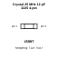

## At a glance

| Detail | Value |
| --- | --- |
| OOMP ID | `electronic_crystal_3225_surface_mount_4_pin_25_mhz_12_pf_50_ohm_esr` |
| Type | Crystal |
| Package / style | 3225 |
| Nominal size | 3.2 &#x00D7; 2.5 mm |

## Classification

| Level | Value |
| --- | --- |
| 1 | `electronic` |
| 2 | `crystal` |
| 3 | `3225` |
| 4 | `surface_mount` |
| 5 | `4_pin` |
| 6 | `25_mhz` |
| 7 | `12_pf` |
| 8 | `50_ohm_esr` |

## Nominal dimensions

| Measurement | Value |
| --- | ---: |
| Length | 3.2 mm |
| Width | 2.5 mm |

## Identifiers

| Identifier | Value |
| --- | --- |
| Manufacturer part number | `X322525MOB4SI` |
| LCSC | [`C9006`](https://www.lcsc.com/product-detail/C9006.html) |
| JLCPCB | [`C9006`](https://jlcpcb.com/partdetail/YXC_CrystalOscillators-X322525MOB4SI/C9006) |

## Files

[KiCad symbol, machine-solder and hand-solder footprints](data/kicad/README.md) · [Availability and source masters](data/kicad/manifest.yaml)

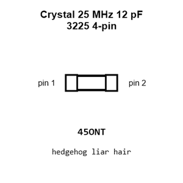

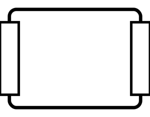

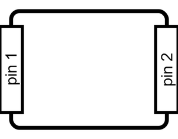

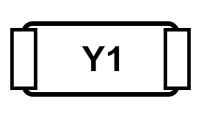

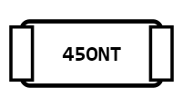

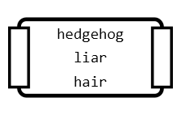

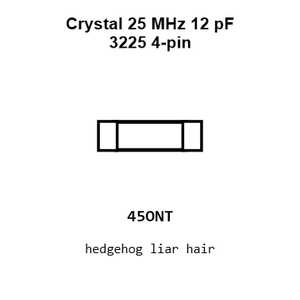

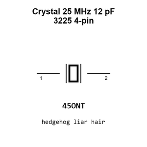

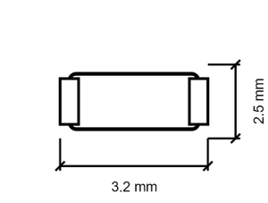

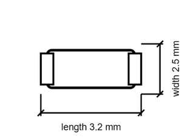

[View this part on GitHub](https://github.com/oomlout/oomp_electronic_version_5/tree/main/parts/electronic_crystal_3225_surface_mount_4_pin_25_mhz_12_pf_50_ohm_esr)

[Browse this category](../../navigation/electronic/crystal/3225/surface_mount/4_pin/25_mhz/12_pf/README.md)

---

This page is generated from the OOMP part definition by a Roboclick Jinja template. Edit the source taxonomy or template rather than this generated file.