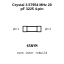
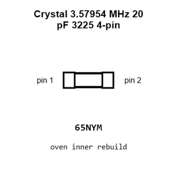
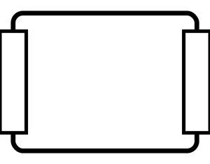
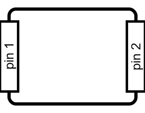
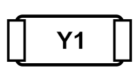
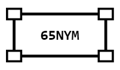
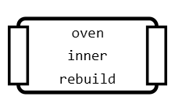
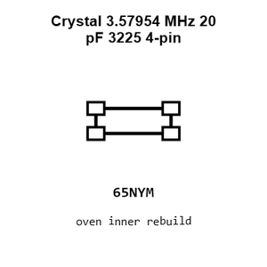
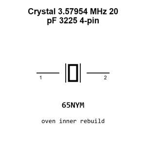
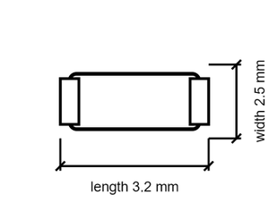

# Crystal 3.57954 MHz 20 pF 3225 4-pin

`electronic_crystal_3225_surface_mount_4_pin_3_579545_mhz_20_pf`

Crystal 3.57954 MHz 20 pF 3225 4-pin is an OOMP electronic crystal definition. It uses the 3225 package or form factor. Its nominal drawing size is 3.2 &#x00D7; 2.5 mm.

## At a glance

| Detail | Value |
| --- | --- |
| OOMP ID | `electronic_crystal_3225_surface_mount_4_pin_3_579545_mhz_20_pf` |
| Type | Crystal |
| Package / style | 3225 |
| Nominal size | 3.2 &#x00D7; 2.5 mm |

## Classification

| Level | Value |
| --- | --- |
| 1 | `electronic` |
| 2 | `crystal` |
| 3 | `3225` |
| 4 | `surface_mount` |
| 5 | `4_pin` |
| 6 | `3_579545_mhz` |
| 7 | `20_pf` |

## Nominal dimensions

| Measurement | Value |
| --- | ---: |
| Length | 3.2 mm |
| Width | 2.5 mm |

## Used in projects

| Project | Quantity | References | Explore |
| --- | ---: | --- | --- |
| [Project sparkfun/SparkFun_Qwiic_Current_Sensor_ADE7953 Qwiic Current Sensor ADE7953 current](https://github.com/sparkfun/SparkFun_Qwiic_Current_Sensor_ADE7953) | 1 | Y1 | [Board explorer](https://oomlout.github.io/oomp_electronic_version_5/parts/oomp_project_github_sparkfun_spark_fun_qwiic_current_sensor_ade7953_qwiic_current_sensor_ade7953_current/board_explorer.html) · [OOMP project](https://github.com/oomlout/oomp_electronic_version_5/tree/main/parts/oomp_project_github_sparkfun_spark_fun_qwiic_current_sensor_ade7953_qwiic_current_sensor_ade7953_current) |

## Files

[KiCad symbol, machine-solder and hand-solder footprints](data/kicad/README.md) · [Availability and source masters](data/kicad/manifest.yaml)

[View this part on GitHub](https://github.com/oomlout/oomp_electronic_version_5/tree/main/parts/electronic_crystal_3225_surface_mount_4_pin_3_579545_mhz_20_pf)

[Browse this category](../../navigation/electronic/crystal/3225/surface_mount/4_pin/3_579545_mhz/README.md)

---

This page is generated from the OOMP part definition by a Roboclick Jinja template. Edit the source taxonomy or template rather than this generated file.