# Crystal 8 MHz 20 pF HC_49S_SMD 2-pin

`electronic_crystal_hc_49s_smd_surface_mount_2_pin_8_mhz_20_pf_70_ohm_esr`

Crystal 8 MHz 20 pF HC_49S_SMD 2-pin is an OOMP electronic crystal definition. It uses the hc 49s smd package or form factor. Its nominal drawing size is 10.0 &#x00D7; 5.0 mm.

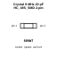

## At a glance

| Detail | Value |
| --- | --- |
| OOMP ID | `electronic_crystal_hc_49s_smd_surface_mount_2_pin_8_mhz_20_pf_70_ohm_esr` |
| Type | Crystal |
| Package / style | hc 49s smd |
| Nominal size | 10.0 &#x00D7; 5.0 mm |

## Classification

| Level | Value |
| --- | --- |
| 1 | `electronic` |
| 2 | `crystal` |
| 3 | `hc_49s_smd` |
| 4 | `surface_mount` |
| 5 | `2_pin` |
| 6 | `8_mhz` |
| 7 | `20_pf` |
| 8 | `70_ohm_esr` |

## Nominal dimensions

| Measurement | Value |
| --- | ---: |
| Length | 10.0 mm |
| Width | 5.0 mm |

## Identifiers

| Identifier | Value |
| --- | --- |
| Manufacturer part number | `X49SM8MSD2SC` |
| LCSC | [`C12674`](https://www.lcsc.com/product-detail/C12674.html) |
| JLCPCB | [`C12674`](https://jlcpcb.com/partdetail/YXC_CrystalOscillators-X49SM8MSD2SC/C12674) |

## Files

[KiCad symbol, machine-solder and hand-solder footprints](data/kicad/README.md) · [Availability and source masters](data/kicad/manifest.yaml)

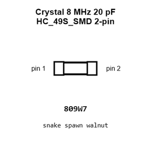

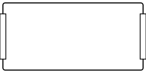

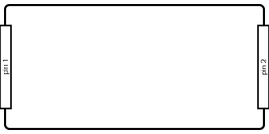

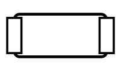

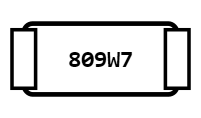

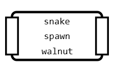

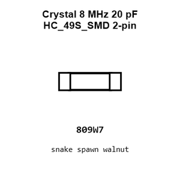

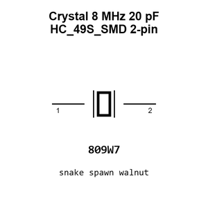

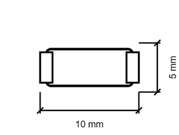

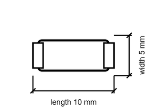

[View this part on GitHub](https://github.com/oomlout/oomp_electronic_version_5/tree/main/parts/electronic_crystal_hc_49s_smd_surface_mount_2_pin_8_mhz_20_pf_70_ohm_esr)

[Browse this category](../../navigation/electronic/crystal/hc_49s_smd/surface_mount/2_pin/8_mhz/20_pf/README.md)

---

This page is generated from the OOMP part definition by a Roboclick Jinja template. Edit the source taxonomy or template rather than this generated file.