# Diode KBL608 KBL

`electronic_diode_bridge_rectifier_kbl_mdd_microdiode_semiconductor_kbl608`

Diode KBL608 KBL is an OOMP electronic diode definition. It uses the kbl package or form factor. Its nominal drawing size is 28.6 &#x00D7; 7.3 mm. The definition includes 4 documented pins.

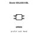

## At a glance

| Detail | Value |
| --- | --- |
| OOMP ID | `electronic_diode_bridge_rectifier_kbl_mdd_microdiode_semiconductor_kbl608` |
| Type | Diode |
| Package / style | kbl |
| Nominal size | 28.6 &#x00D7; 7.3 mm |
| Documented pins | 4 |

## Classification

| Level | Value |
| --- | --- |
| 1 | `electronic` |
| 2 | `diode` |
| 3 | `bridge_rectifier` |
| 4 | `kbl` |
| 14 | `mdd_microdiode_semiconductor` |
| 15 | `kbl608` |

## Nominal dimensions

| Measurement | Value |
| --- | ---: |
| Height | 4.0 mm |
| Length | 28.6 mm |
| Width | 7.3 mm |

## Identifiers

| Identifier | Value |
| --- | --- |
| Manufacturer part number | `KBL608` |
| LCSC | [`C3079`](https://www.lcsc.com/product-detail/C3079.html) |
| JLCPCB | [`C3079`](https://jlcpcb.com/partdetail/MDD_Microdiode_Semiconductor-KBL608/C3079) |

## Pins

| Pin | Name | Type |
| ---: | --- | --- |
| 1 | + | passive |
| 2 | ~ | passive |
| 3 | - | passive |
| 4 | ~ | passive |

## Datasheet

[View the datasheet](data/datasheet.pdf)

## Files

[KiCad symbol, machine-solder and hand-solder footprints](data/kicad/README.md) · [Availability and source masters](data/kicad/manifest.yaml)

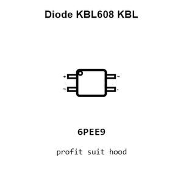

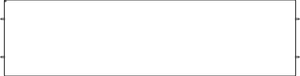

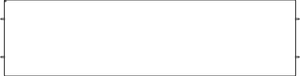

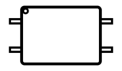

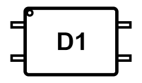

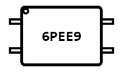

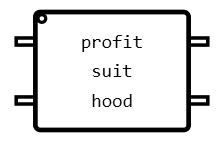

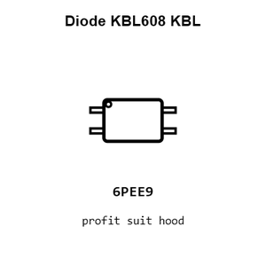

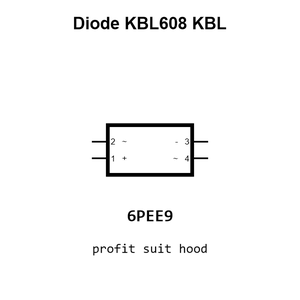

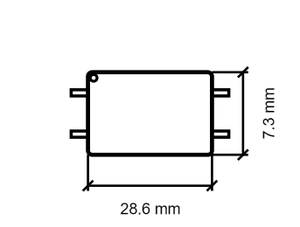

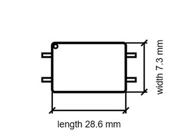

[View this part on GitHub](https://github.com/oomlout/oomp_electronic_version_5/tree/main/parts/electronic_diode_bridge_rectifier_kbl_mdd_microdiode_semiconductor_kbl608)

[Browse this category](../../navigation/electronic/diode/bridge_rectifier/kbl/mdd_microdiode_semiconductor/README.md)

---

This page is generated from the OOMP part definition by a Roboclick Jinja template. Edit the source taxonomy or template rather than this generated file.