# Diode DB4 DO-35

`electronic_diode_diac_do_35_stmicroelectronics_db4`

Diode DB4 DO-35 is an OOMP electronic diode definition. It uses the do 35 package or form factor. Its nominal drawing size is 3.0 &#x00D7; 1.8 mm. The definition includes 2 documented pins.

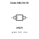

## At a glance

| Detail | Value |
| --- | --- |
| OOMP ID | `electronic_diode_diac_do_35_stmicroelectronics_db4` |
| Type | Diode |
| Package / style | do 35 |
| Nominal size | 3.0 &#x00D7; 1.8 mm |
| Documented pins | 2 |

## Classification

| Level | Value |
| --- | --- |
| 1 | `electronic` |
| 2 | `diode` |
| 3 | `diac` |
| 4 | `do_35` |
| 14 | `stmicroelectronics` |
| 15 | `db4` |

## Nominal dimensions

| Measurement | Value |
| --- | ---: |
| Height | 4.0 mm |
| Length | 3.0 mm |
| Width | 1.8 mm |

## Identifiers

| Identifier | Value |
| --- | --- |
| Manufacturer part number | `DB4` |
| LCSC | [`C2499`](https://www.lcsc.com/product-detail/C2499.html) |
| JLCPCB | [`C2499`](https://jlcpcb.com/partdetail/STMicroelectronics-DB4/C2499) |

## Pins

| Pin | Name | Type |
| ---: | --- | --- |
| 1 | MT1 | passive |
| 2 | MT2 | passive |

## Datasheet

[View the datasheet](data/datasheet.pdf)

## Files

[KiCad symbol, machine-solder and hand-solder footprints](data/kicad/README.md) · [Availability and source masters](data/kicad/manifest.yaml)

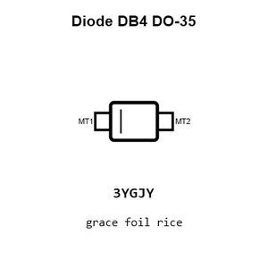

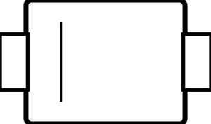

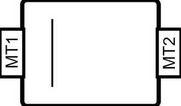

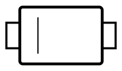

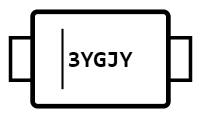

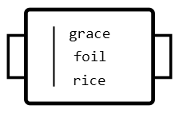

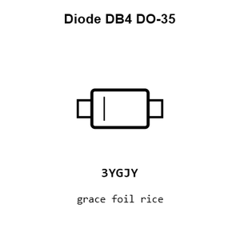

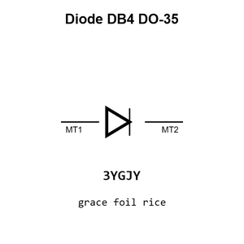

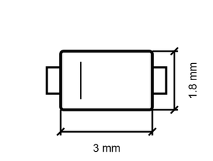

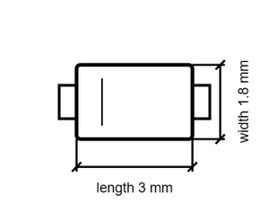

[View this part on GitHub](https://github.com/oomlout/oomp_electronic_version_5/tree/main/parts/electronic_diode_diac_do_35_stmicroelectronics_db4)

[Browse this category](../../navigation/electronic/diode/diac/do_35/stmicroelectronics/README.md)

---

This page is generated from the OOMP part definition by a Roboclick Jinja template. Edit the source taxonomy or template rather than this generated file.