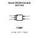
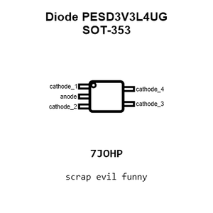
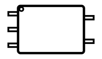
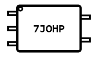
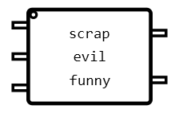
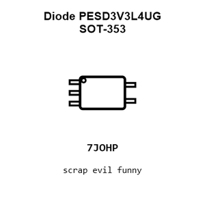
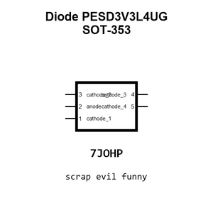

# Diode PESD3V3L4UG SOT-353

`electronic_diode_esd_array_sot_353_nexperia_pesd3v3l4ug`

Diode PESD3V3L4UG SOT-353 is an OOMP electronic diode definition. It uses the sot 353 package or form factor. Its nominal drawing size is 2.0 &#x00D7; 1.25 mm. The definition includes 5 documented pins.

## At a glance

| Detail | Value |
| --- | --- |
| OOMP ID | `electronic_diode_esd_array_sot_353_nexperia_pesd3v3l4ug` |
| Type | Diode |
| Package / style | sot 353 |
| Nominal size | 2.0 &#x00D7; 1.25 mm |
| Documented pins | 5 |

## Classification

| Level | Value |
| --- | --- |
| 1 | `electronic` |
| 2 | `diode` |
| 3 | `esd_array` |
| 4 | `sot_353` |
| 14 | `nexperia` |
| 15 | `pesd3v3l4ug` |

## Nominal dimensions

| Measurement | Value |
| --- | ---: |
| Length | 2.0 mm |
| Width | 1.25 mm |

## Identifiers

| Identifier | Value |
| --- | --- |
| Manufacturer part number | `PESD3V3L4UG` |
| LCSC | [`C70500`](https://www.lcsc.com/product-detail/C70500.html) |

## Pins

| Pin | Name | Type |
| ---: | --- | --- |
| 1 | cathode_1 | passive |
| 2 | anode | passive |
| 3 | cathode_2 | passive |
| 4 | cathode_3 | passive |
| 5 | cathode_4 | passive |

## Used in projects

| Project | Quantity | References | Explore |
| --- | ---: | --- | --- |
| [Project sparkfun/SparkFun_Qwiic_GNSS_SAM-M8Q Qwiic GNSS SAM-M8Q current](https://github.com/sparkfun/SparkFun_Qwiic_GNSS_SAM-M8Q) | 1 | D7 | [Board explorer](https://oomlout.github.io/oomp_electronic_version_5/parts/oomp_project_github_sparkfun_spark_fun_qwiic_gnss_sam_m8_q_qwiic_gnss_sam_m8q_current/board_explorer.html) · [OOMP project](https://github.com/oomlout/oomp_electronic_version_5/tree/main/parts/oomp_project_github_sparkfun_spark_fun_qwiic_gnss_sam_m8_q_qwiic_gnss_sam_m8q_current) |
| [Project sparkfun/SparkFun_Qwiic_GNSS_SAM-M8Q Qwiic GNSS SAM-M8Q v0.1](https://github.com/sparkfun/SparkFun_Qwiic_GNSS_SAM-M8Q) | 1 | D7 | [Board explorer](https://oomlout.github.io/oomp_electronic_version_5/parts/oomp_project_github_sparkfun_spark_fun_qwiic_gnss_sam_m8_q_qwiic_gnss_sam_m8q_v0_1/board_explorer.html) · [OOMP project](https://github.com/oomlout/oomp_electronic_version_5/tree/main/parts/oomp_project_github_sparkfun_spark_fun_qwiic_gnss_sam_m8_q_qwiic_gnss_sam_m8q_v0_1) |
| [Project sparkfun/SparkFun_u-blox_NEO-F10N u-blox NEO-F10N current](https://github.com/sparkfun/SparkFun_u-blox_NEO-F10N) | 2 | D2, D3 | [Board explorer](https://oomlout.github.io/oomp_electronic_version_5/parts/oomp_project_github_sparkfun_spark_fun_u_blox_neo_f10_n_ublox_neo_f10n_current/board_explorer.html) · [OOMP project](https://github.com/oomlout/oomp_electronic_version_5/tree/main/parts/oomp_project_github_sparkfun_spark_fun_u_blox_neo_f10_n_ublox_neo_f10n_current) |

## Files

[KiCad symbol, machine-solder and hand-solder footprints](data/kicad/README.md) · [Availability and source masters](data/kicad/manifest.yaml)

[View this part on GitHub](https://github.com/oomlout/oomp_electronic_version_5/tree/main/parts/electronic_diode_esd_array_sot_353_nexperia_pesd3v3l4ug)

[Browse this category](../../navigation/electronic/diode/esd_array/sot_353/nexperia/README.md)

---

This page is generated from the OOMP part definition by a Roboclick Jinja template. Edit the source taxonomy or template rather than this generated file.