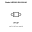
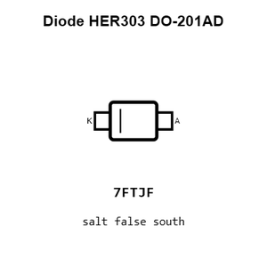
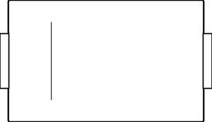
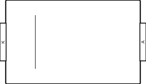
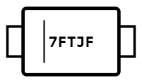
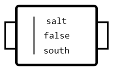
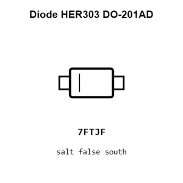
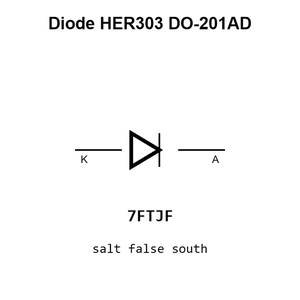
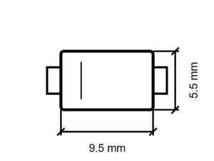
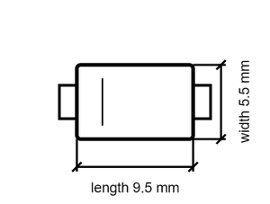

# Diode HER303 DO-201AD

`electronic_diode_fast_recovery_do_201ad_mdd_microdiode_semiconductor_her303`

Diode HER303 DO-201AD is an OOMP electronic diode definition. It uses the do 201ad package or form factor. Its nominal drawing size is 9.5 &#x00D7; 5.5 mm. The definition includes 2 documented pins.

## At a glance

| Detail | Value |
| --- | --- |
| OOMP ID | `electronic_diode_fast_recovery_do_201ad_mdd_microdiode_semiconductor_her303` |
| Type | Diode |
| Package / style | do 201ad |
| Nominal size | 9.5 &#x00D7; 5.5 mm |
| Documented pins | 2 |

## Classification

| Level | Value |
| --- | --- |
| 1 | `electronic` |
| 2 | `diode` |
| 3 | `fast_recovery` |
| 4 | `do_201ad` |
| 14 | `mdd_microdiode_semiconductor` |
| 15 | `her303` |

## Nominal dimensions

| Measurement | Value |
| --- | ---: |
| Height | 4.0 mm |
| Length | 9.5 mm |
| Width | 5.5 mm |

## Identifiers

| Identifier | Value |
| --- | --- |
| Manufacturer part number | `HER303` |
| LCSC | [`C3076`](https://www.lcsc.com/product-detail/C3076.html) |
| JLCPCB | [`C3076`](https://jlcpcb.com/partdetail/MDD_Microdiode_Semiconductor-HER303/C3076) |

## Pins

| Pin | Name | Type |
| ---: | --- | --- |
| 1 | K | passive |
| 2 | A | passive |

## Datasheet

[View the datasheet](data/datasheet.pdf)

## Files

[KiCad symbol, machine-solder and hand-solder footprints](data/kicad/README.md) · [Availability and source masters](data/kicad/manifest.yaml)

[View this part on GitHub](https://github.com/oomlout/oomp_electronic_version_5/tree/main/parts/electronic_diode_fast_recovery_do_201ad_mdd_microdiode_semiconductor_her303)

[Browse this category](../../navigation/electronic/diode/fast_recovery/do_201ad/mdd_microdiode_semiconductor/README.md)

---

This page is generated from the OOMP part definition by a Roboclick Jinja template. Edit the source taxonomy or template rather than this generated file.