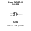
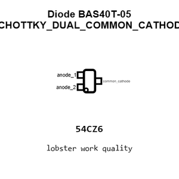
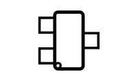
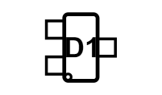
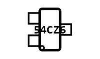
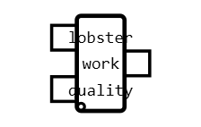
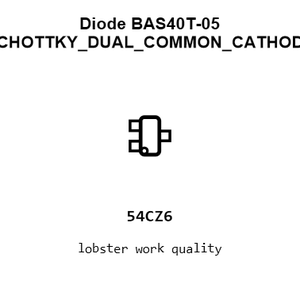
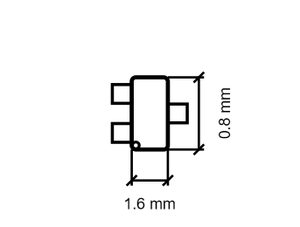
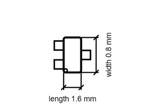

# Diode BAS40T-05 SOT-523

`electronic_diode_schottky_dual_common_cathode_sot_523_diodes_incorporated_bas40t_05`

Diode BAS40T-05 SOT-523 is an OOMP electronic diode definition. It uses the sot 523 package or form factor. Its nominal drawing size is 1.6 &#x00D7; 0.8 mm. The definition includes 3 documented pins.

## At a glance

| Detail | Value |
| --- | --- |
| OOMP ID | `electronic_diode_schottky_dual_common_cathode_sot_523_diodes_incorporated_bas40t_05` |
| Type | Diode |
| Package / style | sot 523 |
| Nominal size | 1.6 &#x00D7; 0.8 mm |
| Documented pins | 3 |

## Classification

| Level | Value |
| --- | --- |
| 1 | `electronic` |
| 2 | `diode` |
| 3 | `schottky_dual_common_cathode` |
| 4 | `sot_523` |
| 14 | `diodes_incorporated` |
| 15 | `bas40t_05` |

## Nominal dimensions

| Measurement | Value |
| --- | ---: |
| Length | 1.6 mm |
| Width | 0.8 mm |

## Identifiers

| Identifier | Value |
| --- | --- |
| Manufacturer part number | `BAS40T-05` |

## Pins

| Pin | Name | Type |
| ---: | --- | --- |
| 1 | anode_1 | passive |
| 2 | anode_2 | passive |
| 3 | common_cathode | passive |

## Files

[KiCad symbol, machine-solder and hand-solder footprints](data/kicad/README.md) · [Availability and source masters](data/kicad/manifest.yaml)

[View this part on GitHub](https://github.com/oomlout/oomp_electronic_version_5/tree/main/parts/electronic_diode_schottky_dual_common_cathode_sot_523_diodes_incorporated_bas40t_05)

[Browse this category](../../navigation/electronic/diode/schottky_dual_common_cathode/sot_523/diodes_incorporated/README.md)

---

This page is generated from the OOMP part definition by a Roboclick Jinja template. Edit the source taxonomy or template rather than this generated file.